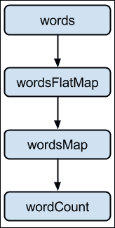
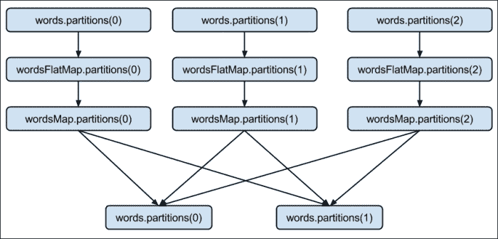

# 第 12 章：性能优化和性能调优

本章介绍使用 Spark 时的各种优化和性能调整最佳实践。

本章分为以下食谱：

*   优化内存
*   使用压缩来提高性能
*   使用序列化提高性能
*   优化垃圾收集
*   优化并行度级别
*   了解优化项目钨的未来

# 简介

在研究各种优化 Spark 的方法之前，最好先看看 Spark 的内部结构。 到目前为止，我们已经在更高的级别上研究了 Spark，重点是各个库提供的功能。

让我们从重新定义 RDD 开始。 在外部，RDD 是一个分布式的、不可变的对象集合。 在内部，它由以下五个部分组成：

*   分区集(`rdd.getPartitions`)
*   父 RDDS 的依赖项列表(`rdd.dependencies`)
*   函数来计算分区(给定其父级)。
*   分区程序(可选)(`rdd.partitioner`)
*   每个分区的首选位置(可选)(`rdd.preferredLocations`)

要重新计算 RDD，需要使用前三个参数，以防数据丢失。 当组合在一起时，它被称为，称为**血统**。 最后两个部分是优化。

一组分区是数据划分为节点的方式。 对于 HDFS，它表示`InputSplits`，它们基本上与块相同(除了当记录跨越块边界时；在这种情况下，它将略大于块)。

让我们回顾一下我们的`wordCount`示例来理解这五个部分。 以下是 RDD 图表在数据集级别视图中查找`wordCount`的方式：



基本上，流程是这样进行的：

1.  Load the `words` folder as an RDD:

    ```scala
    scala> val words = sc.textFile("hdfs://localhost:9000/user/hduser/words")

    ```

    以下是`words`RDD 的五个部分：

    <colgroup><col style="text-align: left"> <col style="text-align: left"></colgroup> 
    | **分区** | 每个 HDFS 输入一个分区拆分/数据块(`org.apache.spark.rdd.HadoopPartition`) |
    | **从属关系** | 毫不 / 绝不 |
    | **计算函数** | 读取数据块 |
    | **首选位置** | HDFS 数据块位置 |
    | **分区程序** | 毫不 / 绝不 |

2.  Tokenize the words from `words` RDD with each word on a separate line:

    ```scala
    scala> val wordsFlatMap = words.flatMap(_.split("\\W+"))

    ```

    以下是`wordsFlatMap`RDD 的五个部分：

    <colgroup><col style="text-align: left"> <col style="text-align: left"></colgroup> 
    | **分区** | 与父 RDD 相同，即`words`(`org.apache.spark.rdd.HadoopPartition`) |
    | **从属关系** | 与父 RDD 相同，即`words`(`org.apache.spark.OneToOneDependency`) |
    | **计算函数** | 计算父项并拆分每个元素并展平结果 |
    | **首选位置** | 询问家长 |
    | **分区程序** | 毫不 / 绝不 |

3.  Transform each word in `wordsFlatMap` RDD to (word,1) tuple:

    ```scala
    scala> val wordsMap = wordsFlatMap.map( w => (w,1))

    ```

    以下是`wordsMap`RDD 的五个部分：

    <colgroup><col style="text-align: left"> <col style="text-align: left"></colgroup> 
    | **分区** | 与父 RDD 相同，即 wordsFlatMap(org.apache.park.rdd.HadoopPartition) |
    | **从属关系** | 与父 RDD 相同，即 wordsFlatMap(org.apache.partk.OneToOneDependency) |
    | **计算函数** | 计算父项并将其映射到 PairRDD |
    | **首选位置** | 询问家长 |
    | **分区程序** | 毫不 / 绝不 |

4.  Reduce all the values for a given key and sum them up:

    ```scala
    scala> val wordCount = wordsMap.reduceByKey(_+_)

    ```

    以下是`wordCount`RDD 的五个部分：

    <colgroup><col style="text-align: left"> <col style="text-align: left"></colgroup> 
    | **分区** | 每个 Reduce 任务一个(`org.apache.spark.rdd.ShuffledRDDPartition`) |
    | **从属关系** | 置乱每个父项上的依赖项(`org.apache.spark.ShuffleDependency`) |
    | **计算函数** | 对混洗后的数据进行加法运算 |
    | **首选位置** | 毫不 / 绝不 |
    | **分区程序** | 哈希分区程序(`org.apache.spark.HashPartitioner`) |

下面是`wordCount`的 RDD 图查看分区级别视图的方式：



# 优化内存

Spark 是一个复杂的分布式计算框架，有许多活动部件。 各种集群资源(如内存、CPU 和网络带宽)可能在各个点上成为瓶颈。 由于 Spark 是内存计算框架，因此内存的影响最大。

另一个问题是，Spark 应用程序使用大量内存是很常见的，有时甚至超过 100 GB。 这种内存使用量在传统 Java 应用程序中并不常见。

在 Spark 中，有两个地方需要内存优化，那就是驱动程序和执行器级别。

您可以使用以下命令设置驱动程序内存：

*   Spark壳：

    ```scala
    $ spark-shell --drive-memory 4g

    ```

*   Spark提交：

    ```scala
    $ spark-submit --drive-memory 4g

    ```

您可以使用以下命令设置执行器内存：

*   Spark壳：

    ```scala
    $ spark-shell --executor-memory 4g

    ```

*   Spark提交：

    ```scala
    $ spark-submit --executor-memory 4g

    ```

要理解内存优化，最好了解一下内存管理在 Java 中是如何工作的。 在 Java 中，对象驻留在堆中。 堆是在 JVM 启动时创建的，它可以根据需要调整自己的大小(基于配置中分别分配的最小和最大大小，即`-Xms`和`-Xmx`)。

堆分为两个空间或世代：年轻空间和老年空间。 年轻空间保留用于分配新对象。 年轻空间由称为**伊甸园**和两个较小的幸存者空间组成。 当托儿所变满时，通过运行一个称为**年青收集**的特殊进程来收集垃圾，在该进程中，所有存活时间足够长的对象都被提升到旧空间。 当旧空间变满时，通过运行名为**旧收集**的进程来收集垃圾。


托儿所背后的逻辑是，大多数物品的寿命都很短。 年轻的集合旨在快速找到新分配的对象并将其移动到旧空间。

JVM 使用标记和清除算法进行垃圾收集。 标记和清除收集由两个阶段组成。

在标记阶段，所有具有活动引用的对象都被标记为活动的，其余的被推定为垃圾回收的候选对象。 在清理阶段，垃圾可回收候选对象占用的空间将添加到空闲列表中，即它们可以分配给新对象。

对标记和清扫进行了两个改进。 一种是**并发标记和清扫**(**CMS**)，另一种是并行标记和清扫。 CMS关注的是较低的延迟，而后者关注的是更高的吞吐量。 这两种策略都有性能权衡。 CMS 不执行压缩，而并行**垃圾收集器**(**GC**)仅执行全堆压缩，这会导致暂停时间。 根据经验，对于实时流，应该使用 CMS，否则使用并行 GC。

如果您希望同时拥有低延迟和高吞吐量，Java1.7 更新 4 之后的版本有另一个选项，称为**垃圾优先 GC**(**G1**)。 G1 是一个服务器风格的垃圾收集器，主要针对具有大内存的多核机器。 它计划作为 CMS 的长期替代品。 因此，要修改我们的经验法则，如果您使用的是 Java7 以上版本，只需使用 G1 即可。

G1 将堆划分为一组大小相等的区域，其中每一组都是一个连续的虚拟内存范围。 每个地区都被分配了像伊甸园、幸存者和老人这样的角色。 G1 执行并发全局标记阶段，以确定整个堆中对象的活动引用。 在标记阶段结束后，G1 知道哪些区域大部分是空的。 它首先在这些区域收集，这样就释放了更大的内存量。


G1 选择作为垃圾收集候选的区域使用疏散进行垃圾收集。 G1 将对象从堆的一个或多个区域复制到堆上的单个区域，它既压缩又释放了内存。 此疏散在多个内核上并行执行，以减少暂停时间并提高吞吐量。 因此，每个垃圾收集轮次都可以减少碎片，同时在用户定义的暂停时间内工作。

Java 中的内存优化有三个方面：

*   内存占用
*   访问内存中的对象的成本
*   垃圾收集成本

一般来说，Java 对象访问起来很快，但是比它们内部的实际数据消耗更多的空间。

# 使用压缩来提高性能

数据压缩涉及使用比原始表示更少的比特对信息进行编码。 压缩在大数据技术中扮演着重要角色。 它提高了数据的存储和传输效率。

当数据被压缩时，它会变得小，因此磁盘 I/O 和网络 I/O 都会变得更快。 它还节省了存储空间。 每一次优化都有成本，而压缩成本以增加 CPU 周期的形式来压缩和解压缩数据。

Hadoop 需要拆分数据以将其放入块中，而不管数据是否压缩。 只有少数压缩格式是可拆分的。

用于大数据加载的两种最流行的压缩格式是 LZO 和Snappy。 Snappy 是不可拆分的，而 LZO 是可拆分的。 另一方面，Snappy 是一种速度快得多的格式。

如果压缩格式像 LZO 一样是可拆分的，则首先将输入文件拆分成块，然后进行压缩。 由于压缩发生在块级别，因此解压缩可以在块级别进行，也可以在节点级别进行。

如果压缩格式不可拆分，则在文件级进行压缩，然后将其拆分成块。 在这种情况下，数据块必须先合并回文件，然后才能解压缩，因此不能在节点级别进行解压缩。

对于支持的压缩格式，Spark 会自动部署编解码器进行解压缩，不需要用户端采取任何行动。

# 使用序列化提高性能

串行化在分布式计算中起着重要作用。 有两个持久化(存储)级别，它们支持序列化 RDDS：

*   `MEMORY_ONLY_SER`：它将 RDDS 存储为序列化对象。 它将为每个分区创建一个字节数组
*   `MEMORY_AND_DISK_SER`：这类似于`MEMORY_ONLY_SER`，但它会将内存中无法容纳的分区溢出到磁盘

以下是添加适当持久性级别的步骤：

1.  启动 Spark Shell：

    ```scala
    $ spark-shell

    ```

2.  导入`StorageLevel`和与其关联的隐含：

    ```scala
    scala> import org.apache.spark.storage.StorageLevel._

    ```

3.  创建 RDD：

    ```scala
    scala> val words = sc.textFile("words")

    ```

4.  持久化 RDD：

    ```scala
    scala> words.persist(MEMORY_ONLY_SER)

    ```

虽然序列化大大减少了内存占用，但由于反序列化，它增加了额外的 CPU 周期。

默认情况下，Spark 使用 Java 的序列化。 因为 Java 序列化很慢，所以更好的方法是使用`Kryo`库。 `Kryo`比缺省值快得多，有时甚至紧凑 10 倍。

## How to Do It…

您可以通过在`SparkConf`中进行以下设置来使用`Kryo`：

1.  通过将`Kryo`设置为串行化程序

    ```scala
    $ spark-shell --conf spark.serializer=org.apache.spark.serializer.KryoSerializer

    ```

    来启动 Spark shell
2.  `Kryo`自动注册大多数核心 Scala 类，但如果您想注册自己的类，可以使用以下命令：

    ```scala
    scala> sc.getConf.registerKryoClasses(Array(classOf[com.infoobjects.CustomClass1],classOf[com.infoobjects.CustomClass2])

    ```

# 优化垃圾收集

如果您有很多短暂的 RDD，那么 JVM 垃圾收集可能是一个挑战。 JVM 需要遍历所有对象，以找到需要垃圾收集的对象。 垃圾收集的成本与 GC 需要通过的对象数量成正比。 因此，使用较少的对象和使用较少对象的数据结构(更简单的数据结构，如数组)会有所帮助。

串行化在这里也大放异彩，因为字节数组只需要一个对象就可以进行垃圾收集。

默认情况下，Spark 使用 60%的 Executor 内存来缓存 RDDS，其余 40%用于常规对象。 有时，您可能不需要 60%的 RDDS，并且可以降低这一限制，以便有更多空间用于对象创建(较少需要 GC)。

## How to Do It…

通过启动 Spark shell 并设置内存分数，您可以将分配给 RDD 缓存的内存设置为 40%：

```scala
$ spark-shell --conf spark.storage.memoryFraction=0.4

```

# 优化并行度水平

优化并行级别对于充分利用集群容量非常重要。 对于 HDFS，这意味着分区的数量与`InputSplits`的数量相同，而`InputSplits`的数量与块的数量基本相同。

在本指南中，我们将介绍优化分区数量的不同方法。

## How to Do It…

通过以下步骤在将文件加载到 RDD 时指定分区数：

1.  启动 Spark Shell：

    ```scala
    $ spark-shell

    ```

2.  使用自定义分区数作为第二个参数加载 RDD：

    ```scala
    scala> sc.textFile("hdfs://localhost:9000/user/hduser/words",10)

    ```

另一种方法是通过执行以下步骤更改默认并行度：

1.  使用新值默认并行度启动 Spark shell：

    ```scala
    $ spark-shell --conf spark.default.parallelism=10

    ```

2.  检查并行度的默认值：

    ```scala
    scala> sc.defaultParallelism

    ```

### 备注

您还可以使用名为`coalesce(numPartitions)`的 RDD 方法减少分区数，其中`numPartitions`是您想要的最终分区数。 如果您希望通过网络重新洗牌数据，可以调用名为`repartition(numPartitions)`的 RDD 方法，其中`numPartitions`是您希望的最终分区数。

# 了解优化项目钨的未来

钨项目从 Spark 版本 1.4 开始，是让 Spark 更接近裸机的举措。 该项目的目标是大幅提高Spark 应用程序的内存和 CPU 效率，并突破底层硬件的极限。

在分布式系统中，传统的观点一直是始终优化网络 I/O，因为它一直是最稀缺和最瓶颈的资源。 在过去的几年里，这一趋势发生了变化。 在过去的 5 年中，网络带宽已经从每秒 1 千兆位变为每秒 10 千兆位。

在类似的线路上，磁盘带宽从 50MB/s 增加到 500MB/s，SSD 的部署也越来越多。 另一方面，CPU 的时钟速度在 5 年前是~3 GHz，现在仍然是一样的。 这已经取代了网络，使 CPU 成为分布式处理的新瓶颈。

### 备注

另一个给 CPU 性能带来更多负载的趋势是新的压缩数据格式，如 Parquet。 正如我们在本章前面的配方中看到的那样，压缩和序列化都会导致更多的 CPU 周期。 这一趋势也推动了 CPU 优化以降低 CPU 周期成本的需求。

在类似的行上，让我们来看看内存占用情况。 在 Java 中，GC 执行内存管理。 GC 在取消程序员的内存管理并使其透明化方面做了令人惊叹的工作。 要做到这一点，Java 必须投入大量开销，这大大增加了内存占用。 例如，在 Java 中，一个简单的字符串“abcd”(理想情况下应该占用 4 个字节)占用 48 个字节。

如果我们取消 GC 并像 C 这样的低级编程语言那样手动管理内存，会怎么样？ Java 从 1.7 版本开始就提供了这样一种方式，它被称为`sun.misc.Unsafe`。 不安全本质上意味着您可以在不进行任何安全检查的情况下构建较长的内存区域。 这是钨计划的第一个特点。

## 利用应用程序语义进行手动内存管理

利用应用程序语义进行手动内存管理(如果您确实不知道自己在做什么，这可能是非常危险的)，是对 Spark 的好处。 我们使用数据模式(DataFrames)的知识来直接自己布局内存。 它不仅消除了 GC 开销，而且使您可以最大限度地减少内存占用。

第二点是在 CPU 缓存中存储数据，而不是在内存中存储数据。 每个人都知道 CPU 缓存很棒，因为从主内存获取数据需要三个周期，而缓存只需要一个周期。 这是钨计划的第二个特点。

## 使用算法和数据结构

算法和数据结构用于利用内存层次结构，并支持更多缓存感知计算。

CPU 缓存是存储 CPU 下一步需要的数据的小型内存池。 CPU 有两种类型的高速缓存：指令高速缓存和数据高速缓存。 数据缓存按 L1、L2 和 L3 的层次结构排列：

*   一级缓存是计算机中最快、最昂贵的缓存。 它存储最关键的数据，是 CPU 查找信息的第一位置。
*   二级缓存比一级缓存稍慢，但仍位于同一处理器芯片上。 这是 CPU 查找信息的第二个地方。
*   L3 缓存仍然较慢，但由所有内核共享，例如 DRAM(内存)。

这些可以在下图中看到：


第三点是 Java 不太擅长为表达式求值之类的事情生成字节码。 如果此代码生成是手动完成的，则效率会高得多。 代码生成是项目钨的第三个特性。

### 代码生成

这涉及到利用现代编译器和 CPU 直接对二进制数据进行高效操作。 项目钨目前还处于初级阶段，在 1.5 版中会有更广泛的支持。