# 为深度学习发展点燃Spark

在本章中，将涵盖以下配方:

*   下载 Ubuntu 桌面映像
*   在 macOS 上安装和配置带有 VMWare Fusion 的 Ubuntu
*   在 Windows 上用 Oracle VirtualBox 安装和配置 Ubuntu
*   为谷歌云平台安装和配置 Ubuntu 桌面
*   在 Ubuntu 桌面上安装和配置 Spark 和先决条件
*   将 Jupyter 笔记本与 Spark 集成
*   启动和配置Spark集群
*   停止Spark簇

# 介绍

深度学习是机器学习算法的重点研究，该算法将神经网络作为其主要学习方法。在过去的几年里，深度学习迅速发展起来。微软、谷歌、脸书、亚马逊、苹果、特斯拉和许多其他公司都在其应用程序、网站和产品中利用深度学习模型。与此同时，运行在大数据源之上的内存计算引擎 Spark 使以创纪录的速度轻松处理大量信息变得非常容易。事实上，Spark 现在已经成为数据工程师、机器学习工程师和数据科学家的领先大数据开发工具。

由于深度学习模型在有更多数据的情况下表现得更好，Spark 和深度学习之间的协同作用允许一个完美的婚姻。几乎与用于执行深度学习算法的代码一样重要的是能够实现最佳开发的工作环境。许多有才华的人渴望开发神经网络来帮助回答他们研究中的重要问题。不幸的是，开发深度学习模型的最大障碍之一是获得学习大数据所需的必要技术资源。本章的目的是为 Spark 上的深度学习创建一个理想的虚拟开发环境。

# 下载 Ubuntu 桌面映像

Spark 可以针对所有类型的操作系统进行设置，无论它们是驻留在内部还是云中。出于我们的目的，Spark 将安装在一个基于 Linux 的虚拟机上，以 Ubuntu 为操作系统。使用 Ubuntu 作为 go-to 虚拟机有几个优点，其中最重要的是成本。由于它们基于开源软件，Ubuntu 操作系统可以自由使用，不需要许可。成本始终是一个考虑因素，本出版物的主要目标之一是最大限度地减少在 Spark 框架上开始深度学习所需的财务足迹。

# 准备好

下载图像文件至少需要一些建议:

*   最低 2 千兆赫双核处理器
*   最小 2 GB 系统内存
*   至少 25 GB 的可用硬盘空间

# 怎么做...

按照食谱中的步骤下载 Ubuntu 桌面映像:

1.  要创建一个 Ubuntu Desktop 的虚拟机，需要先从官网下载文件:[https://www.ubuntu.com/download/desktop.](https://www.ubuntu.com/download/desktop)
2.  截至本文撰写之时，Ubuntu Desktop 16.04.3 是可供下载的最新版本。

3.  下载完成后，以`.iso`格式访问以下文件:

    `ubuntu-16.04.3-desktop-amd64.iso`

# 它是如何工作的...

虚拟环境通过隔离与物理或主机的关系来提供最佳的开发工作空间。开发人员可能将所有类型的机器用于其主机环境，例如运行 macOS 的 MacBook、运行 Windows 的 Microsoft Surface，甚至是带有 Microsoft Azure 或 AWS 的云上虚拟机；但是，为了确保执行的代码输出的一致性，将在 Ubuntu Desktop 内部署一个虚拟环境，该环境可以在各种各样的主机平台之间使用和共享。

# 还有更多...

桌面虚拟化软件有几种选择，具体取决于主机环境是在 Windows 还是 macOS 上。使用 macOS 时，有两种常见的虚拟化软件应用程序:

*   VMWare 融合
*   平行线

# 请参见

想了解更多关于 Ubuntu 桌面的信息，可以访问[https://www.ubuntu.com/desktop](https://www.ubuntu.com/desktop)。

# 在 macOS 上安装和配置带有 VMWare Fusion 的 Ubuntu

本节将重点介绍使用带有 **VMWare Fusion** 的 Ubuntu 操作系统构建虚拟机。

# 准备好

您的系统需要以前安装的 VMWare Fusion。如果您目前没有，您可以从以下网站下载试用版:

[https://www . VMware . com/products/fusion/fusion-evaluation . html](https://www.vmware.com/products/fusion/fusion-evaluation.html)

# 怎么做...

按照食谱中的步骤，在 macOS 上使用 VMWare Fusion 配置 Ubuntu:

1.  一旦 VMWare Fusion 启动并运行，单击左上角的 *+* 按钮开始配置过程并选择新建...，如下图所示:

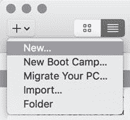

2.  做出选择后，选择从磁盘或映像安装选项，如下图所示:


3.  选择从 Ubuntu 桌面网站下载的操作系统`iso`文件，如下图所示:

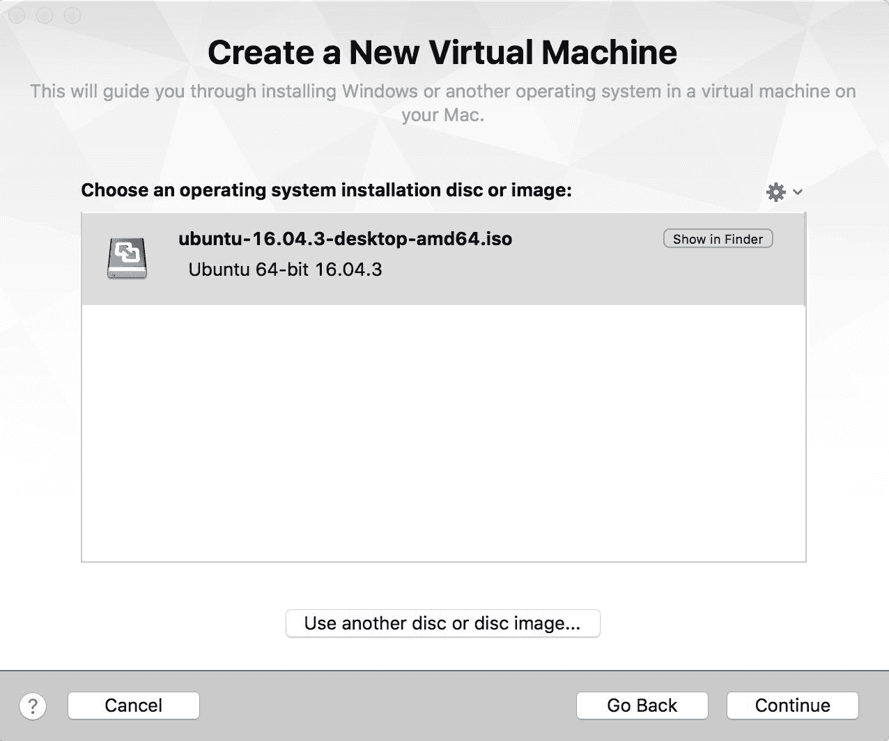

4.  下一步会问你要不要选择 Linux 轻松安装。建议这样做，并为 Ubuntu 环境合并一个显示名称/密码组合，如下图所示:

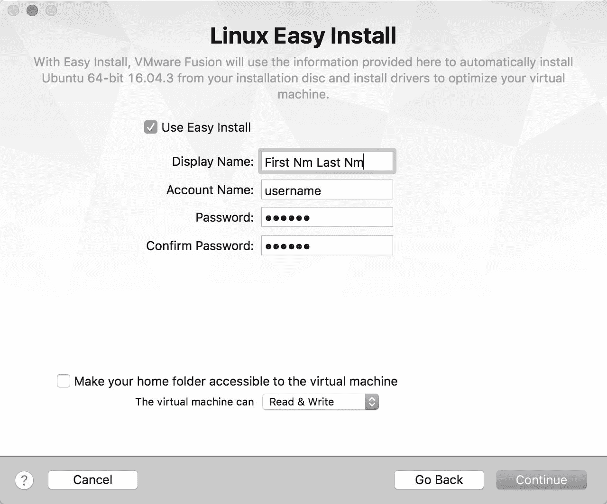

5.  配置过程几乎完成。将显示虚拟机摘要，其中包含自定义设置以增加内存和硬盘的选项，如下图所示:

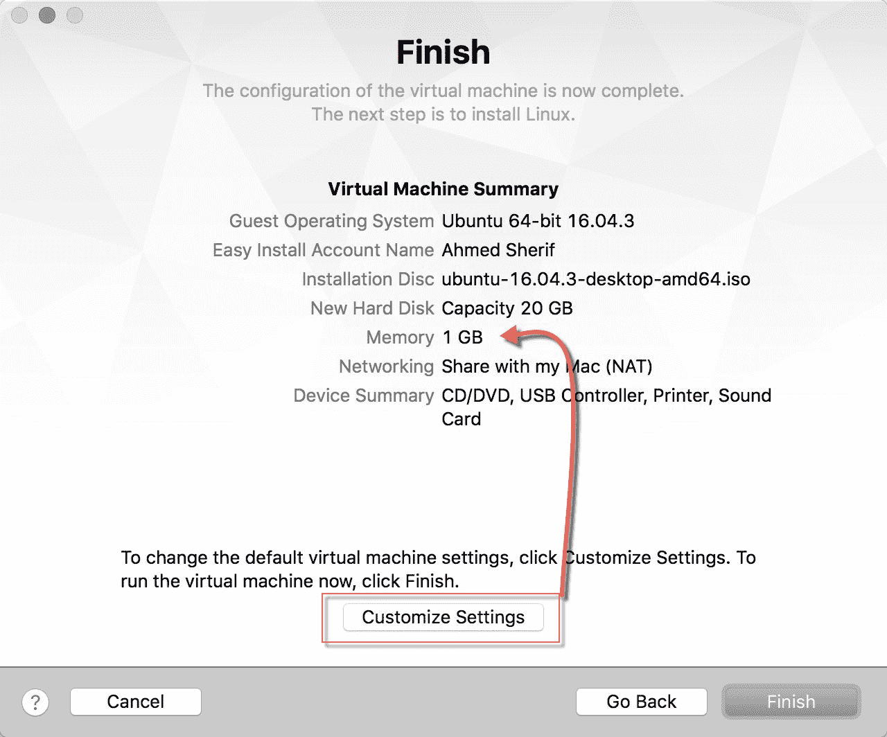

6.  20 到 40 GB 的硬盘空间对虚拟机来说已经足够了；但是，在后面的章节中执行 Spark 代码时，将内存提升到 2 GB 甚至 4 GB 将有助于提高虚拟机的性能。通过选择虚拟机设置下的处理器和内存来更新内存，并将内存增加到所需的数量，如下图所示:


# 它是如何工作的...

该设置允许手动配置在 VMWare Fusion 上成功启动和运行 Ubuntu 桌面所需的设置。内存和硬盘存储可以根据主机的需求和可用性增加或减少。

# 还有更多...

剩下的就是第一次启动虚拟机，这将启动系统在虚拟机上的安装过程。所有设置完成且用户登录后，Ubuntu 虚拟机应该可以进行开发，如下图所示:


# 请参见

除了 VMWare Fusion，还有另一款产品在 Mac 上提供了类似的功能。它被称为苹果的 Parallels Desktop。要了解有关 VMWare 和 Parallels 的更多信息，并决定哪个计划更适合您的发展，请访问以下网站:

*   [https://www.vmware.com/products/fusion.html](https://www.vmware.com/products/fusion.html)下载并安装用于 Mac 的 VMWare Fusion
*   [https://parallels.com](https://parallels.com)下载并安装苹果电脑的 Parallels Desktop

# 在 Windows 上用 Oracle VirtualBox 安装和配置 Ubuntu

与苹果操作系统不同，在视窗系统中有几种虚拟化系统的选择。这主要与 Windows 上的虚拟化非常普遍的事实有关，因为大多数开发人员都将 Windows 用作他们的主机环境，并且需要虚拟环境来进行测试，而不会影响任何依赖于 Windows 的依赖关系。

# 准备好

来自 Oracle 的 VirtualBox 是一款常见的虚拟化产品，可以免费使用。Oracle VirtualBox 提供了一个简单的过程，让一个 Ubuntu 桌面虚拟机在一个窗口环境上启动并运行。

# 怎么做...

按照本食谱中的步骤，在 Windows 上用 **VirtualBox** 配置 Ubuntu:

1.  启动甲骨文虚拟机虚拟箱管理器。接下来，通过选择“新建”图标并指定机器的名称、类型和版本来创建新的虚拟机，如下图所示:

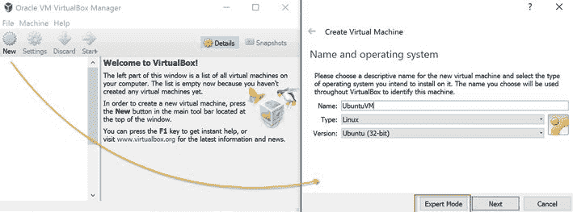

2.  选择专家模式，因为一些配置步骤将得到整合，如下图所示:

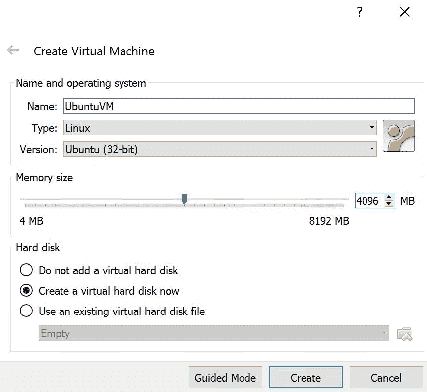

理想的内存大小应该至少设置为`2048` MB，或者最好设置为`4096` MB，这取决于主机上可用的资源。

3.  此外，将执行深度学习算法的 Ubuntu 虚拟机的最佳硬盘大小设置为至少 20 GB，如果不是更多的话，如下图所示:

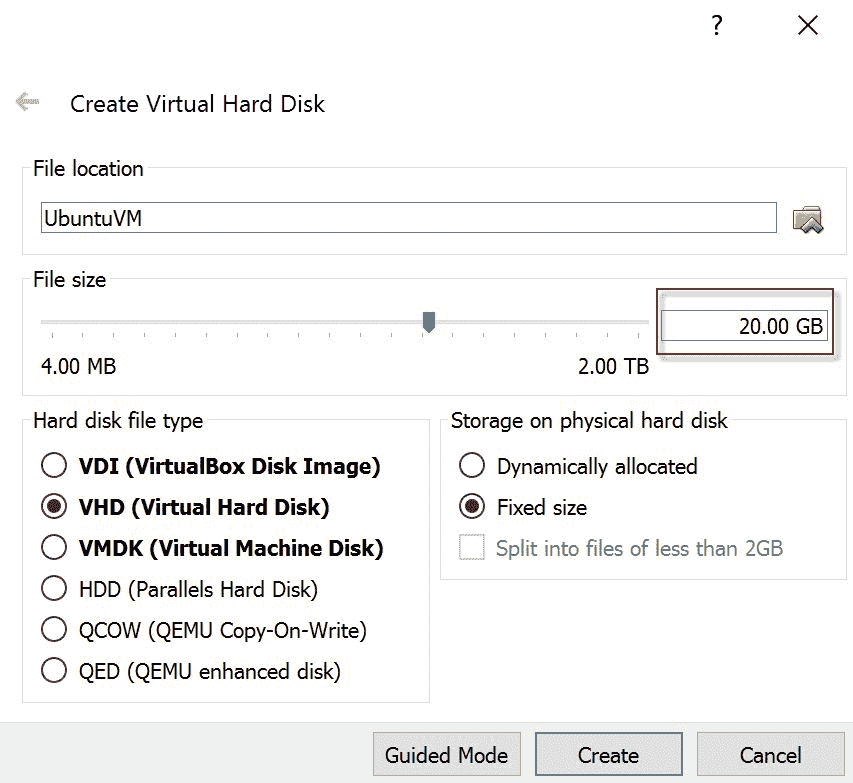

4.  将虚拟机管理器指向 Ubuntu `iso`文件下载到的启动磁盘位置，然后开始创建过程，如下图所示:


5.  为安装分配一些时间后，选择“开始”图标来完成虚拟机，并为开发做好准备，如下图所示:


# 它是如何工作的...

该设置允许手动配置必要的设置，以使 Ubuntu 桌面在甲骨文 VirtualBox 上成功启动和运行。与 VMWare Fusion 的情况一样，内存和硬盘存储可以根据主机的需求和可用性增加或减少。

# 还有更多...

请注意，有些运行微软视窗的机器默认情况下没有设置虚拟化，用户可能会收到一个初始错误，指示 VT-x 没有启用。这种情况可以逆转，并且在重启期间可以在 BIOS 中启用虚拟化。

# 请参见

要了解更多关于 Oracle VirtualBox 的信息并决定它是否适合，请访问以下网站并选择 Windows 主机开始下载过程:[https://www.virtualbox.org/wiki/Downloads](https://www.virtualbox.org/wiki/Downloads)。

# 为谷歌云平台安装和配置 Ubuntu 桌面

之前，我们看到了如何使用 VMWare Fusion 在本地设置 Ubuntu 桌面。在这一部分，我们将学习如何在**谷歌云平台**上做同样的事情。

# 准备好

唯一的要求是谷歌帐户用户名。首先，使用您的谷歌帐户登录您的谷歌云平台。谷歌提供 12 个月的免费订阅，300 美元存入你的账户。安装程序将询问您的银行详细信息；然而，谷歌不会在没有明确让你先知道的情况下向你收取任何费用。去核实一下你的银行账户，你就可以走了。

# 怎么做...

按照食谱中的步骤为谷歌云平台配置 Ubuntu 桌面:

1.  登录到您的谷歌云平台后，访问如下截图所示的仪表板:


Google Cloud Platform Dashboard

2.  首先，点击屏幕左上角的产品服务按钮。在计算下的下拉菜单中，单击虚拟机实例，如下图所示:

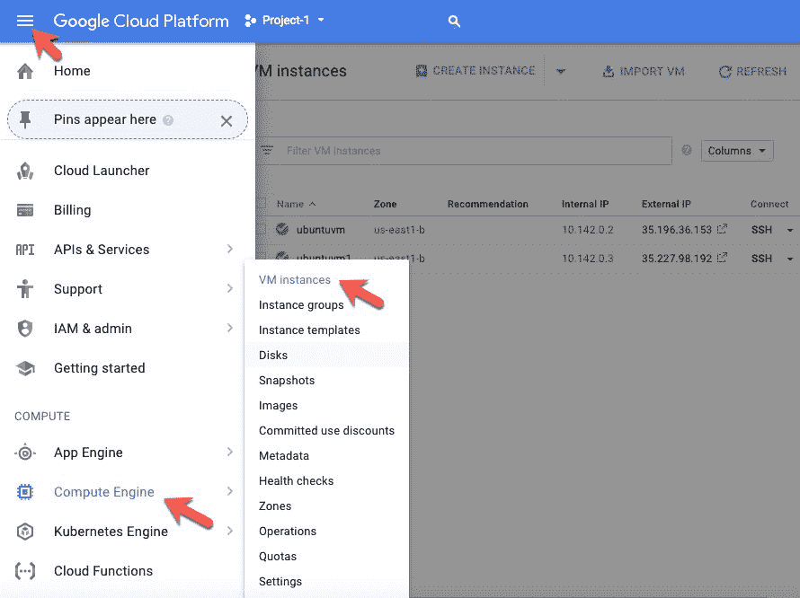

3.  创建一个新实例并命名它。在我们的案例中，我们将其命名为`ubuntuvm1`。谷歌云在启动一个实例时自动创建一个项目，该实例将在一个项目标识下启动。如果需要，可以重命名该项目。

4.  点击**创建实例**后，选择你所在的区域。
5.  选择启动盘下的 **Ubuntu 16.04LTS** ，因为这是将要安装在云端的操作系统。请注意，LTS 代表版本，将得到 Ubuntu 开发者的长期支持。
6.  接下来，在引导磁盘选项下，选择固态硬盘持久磁盘，并将大小增加到 50 GB，以便为实例增加一些存储空间，如下图所示:


7.  接下来，将访问范围设置为**允许完全访问所有云应用程序接口**。
8.  在防火墙下，请勾选**允许 HTTP 流量**和**允许 HTTPS 流量**，如下图截图所示:

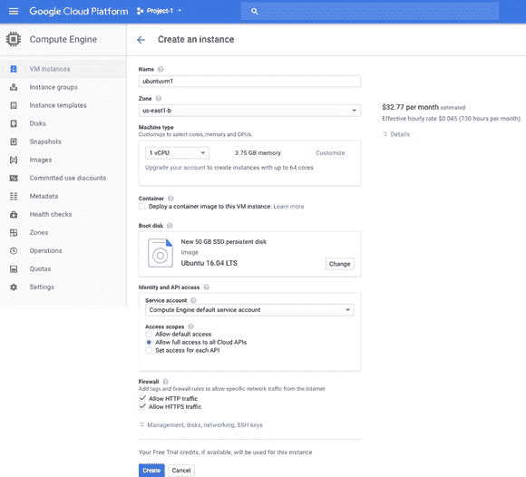

Selecting options Allow HTTP traffic and HTTPS Traffic

9.  如本节所示配置实例后，点击创建按钮创建实例。

After clicking on the Create button, you will notice that the instance gets created with a unique internal as well as external IP address. We will require this at a later stage. SSH refers to secure shell tunnel, which is basically an encrypted way of communicating in client-server architectures. Think of it as data going to and from your laptop, as well as going to and from Google's cloud servers, through an encrypted tunnel.

10.  单击新创建的实例。从下拉菜单中，点击**在浏览器窗口**中打开，如下图截图所示:


11.  您将看到谷歌在一个新窗口中打开了一个外壳/终端，如下图所示:


12.  打开外壳后，您应该会看到一个如下图所示的窗口:

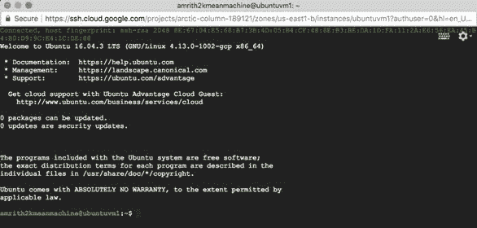

13.  在谷歌云外壳中键入以下命令:

```py
$ sudo apt-get update$ sudo apt-get upgrade$ sudo apt-get install gnome-shell$ sudo apt-get install ubuntu-gnome-desktop$ sudo apt-get install autocutsel$ sudo apt-get install gnome-core$ sudo apt-get install gnome-panel$ sudo apt-get install gnome-themes-standard
```

14.  当出现是否继续的提示时，输入`y`并选择回车，如下图截图所示:


15.  完成上述步骤后，键入以下命令设置`vncserver`并允许连接到本地外壳:

```py
$ sudo apt-get install tightvncserver$ touch ~/.Xresources
```

16.  接下来，通过键入以下命令启动服务器:

```py
$ tightvncserver
```

17.  这将提示您输入密码，该密码稍后将用于登录 Ubuntu 桌面虚拟机。该密码限制为八个字符，需要设置和验证，如下图截图所示:


18.  启动脚本由 shell 自动生成，如下图所示。该启动脚本可以通过复制粘贴其`PATH`的方式进行访问和编辑，方式如下:


19.  在我们的例子中，查看和编辑脚本的命令是:

```py
:~$ vim /home/amrith2kmeanmachine/.vnc/xstartup
```

这个`PATH`在每种情况下可能都不一样。确保你设置正确`PATH`。`vim`命令在苹果电脑的文本编辑器中打开脚本。

The local shell generated a startup script as well as a log file. The startup script needs to be opened and edited in a text editor, which will be discussed next.

20.  键入`vim`命令后，带有启动脚本的屏幕应该类似于下面的截图:

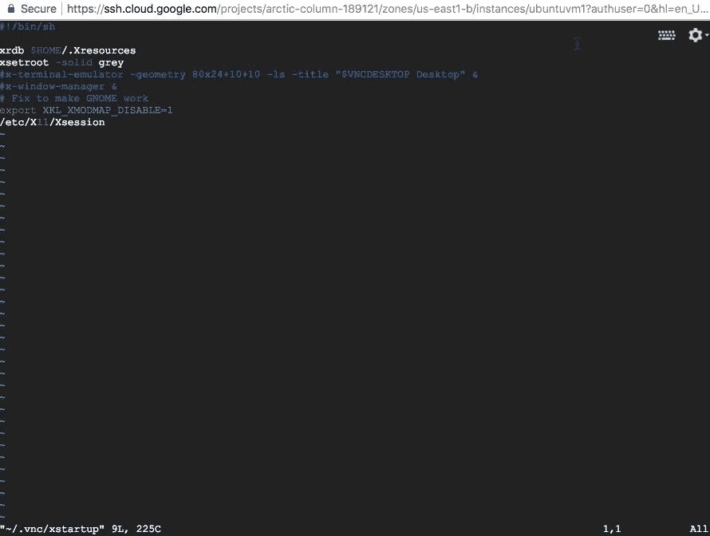

21.  键入`i`进入`INSERT`模式。接下来，删除启动脚本中的所有文本。然后它应该看起来像下面的截图:


22.  将以下代码复制并粘贴到启动脚本中:

```py
#!/bin/shautocutsel -forkxrdb $HOME/.Xresourcesxsetroot -solid greyexport XKL_XMODMAP_DISABLE=1export XDG_CURRENT_DESKTOP="GNOME-Flashback:Unity"export XDG_MENU_PREFIX="gnome-flashback-"unset DBUS_SESSION_BUS_ADDRESSgnome-session --session=gnome-flashback-metacity --disable-acceleration-check --debug &
```

23.  该脚本应该出现在编辑器中，如下图所示:


24.  按 Esc 退出`INSERT`模式，键入`:wq`写入并退出文件。
25.  配置好启动脚本后，在 Google shell 中键入以下命令来终止服务器并保存更改:

```py
$ vncserver -kill :1
```

26.  该命令应该会生成一个进程标识，如下图所示:


27.  通过键入以下命令再次启动服务器:

```py
$ vncserver -geometry 1024x640
```

接下来的一系列步骤将集中于保护从本地主机进入谷歌云实例的外壳隧道。在本地外壳/终端上键入任何内容之前，请确保安装了谷歌云。如果尚未安装，请按照位于以下网站的快速入门指南中的说明进行安装:

[https://cloud.google.com/sdk/docs/quickstart-mac-os-x](https://cloud.google.com/sdk/docs/quickstart-mac-os-x)

28.  安装谷歌云后，打开机器上的终端，输入以下命令连接到谷歌云计算实例:

```py
$ gcloud compute ssh \YOUR INSTANCE NAME HERE \--project YOUR PROJECT NAME HERE \--zone YOUR TIMEZONE HERE \--ssh-flag "-L 5901:localhost:5901"
```

29.  确保在前面的命令中正确指定了实例名称、项目标识和区域。按回车键后，本地外壳上的输出将更改为下面屏幕截图中显示的内容:


30.  一旦您看到实例名称后跟`":~$"`，这意味着本地主机/笔记本和谷歌云实例之间已经成功建立了连接。成功登录实例后，我们需要名为 **VNC 查看器**的软件来查看 Ubuntu 桌面并与之交互，该桌面现已在谷歌云计算引擎上成功设置。以下几个步骤将讨论如何实现这一点。

31.  可以使用以下链接下载 VNC 查看器:

[https://www.realvnc.com/en/connect/download/viewer/](https://www.realvnc.com/en/connect/download/viewer/)

32.  安装完成后，点击打开 VNC 查看器，在搜索栏中输入`localhost::5901`，如下图所示:

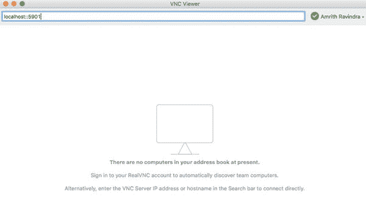

33.  接下来，当出现以下屏幕提示时，点击**继续**:


34.  这将提示您输入虚拟机的密码。第一次启动`tightvncserver`命令时输入之前设置的密码，如下图截图所示:


35.  你最终会被带到你在谷歌云计算上的 Ubuntu 虚拟机的桌面上。当在 VNC 浏览器上查看时，你的 Ubuntu 桌面屏幕现在必须看起来像下面的截图:


# 它是如何工作的...

您现在已经成功设置了 VNC 查看器，用于与 Ubuntu 虚拟机/桌面进行交互。只要谷歌云实例不在使用中，建议暂停或关闭该实例，这样就不会产生额外的成本。云方法最适合那些无法访问高内存和高存储的物理资源的开发人员。

# 还有更多...

虽然我们讨论了谷歌云作为 Spark 的云选项，但也有可能在以下云平台上利用 Spark:

*   Microsoft Azure
*   亚马逊网络服务

# 请参见

要了解更多关于谷歌云平台的信息并注册免费订阅，请访问以下网站:

[https://cloud.google.com/](https://cloud.google.com/)

# 在 Ubuntu 桌面上安装和配置 Spark 和先决条件

在 Spark 可以启动并运行之前，有一些必要的先决条件需要安装在新创建的 Ubuntu 桌面上。本节将重点介绍在 Ubuntu 桌面上安装和配置以下内容:

*   Java 8 或更高版本
*   蟒蛇
*   Spark

# 准备好

这一部分的唯一要求是拥有在 Ubuntu 桌面上安装应用程序的管理权限。

# 怎么做...

本节将介绍在 Ubuntu 桌面上安装 Python 3、Anaconda 和 Spark 的方法中的步骤:

1.  通过终端应用在 Ubuntu 上安装 Java，通过搜索 app，然后锁定到左侧的启动器就可以找到，如下图截图所示:


2.  通过在终端执行以下命令，在虚拟机上执行 Java 的初始测试:

```py
java -version
```

3.  在终端执行以下四个命令来安装 Java:

```py
sudo apt-get install software-properties-common $ sudo add-apt-repository ppa:webupd8team/java$ sudo apt-get update$ sudo apt-get install oracle-java8-installer
```

4.  接受甲骨文必要的许可协议后，在终端再次执行`java -version`，在虚拟机上进行 Java 二次测试。Java 的成功安装将在终端中显示以下结果:

```py
$ java -versionjava version "1.8.0_144"Java(TM) SE Runtime Environment (build 1.8.0_144-b01)Java HotSpot(TM) 64-Bit Server VM (build 25.144-b01, mixed mode)
```

5.  接下来，安装最新版本的 Anaconda。Ubuntu 桌面的当前版本预装了 Python。虽然 Python 预装 Ubuntu 很方便，但安装的版本是 Python 2.7，如以下输出所示:

```py
$ python --versionPython 2.7.12
```

6.  Anaconda 的当前版本是 v4.4，Python 3 的当前版本是 v3.6。下载后，使用以下命令访问`Downloads`文件夹，查看 Anaconda 安装文件:

```py
$ cd Downloads/~/Downloads$ lsAnaconda3-4.4.0-Linux-x86_64.sh
```

7.  进入`Downloads`文件夹后，通过执行以下命令启动 Anaconda 的安装:

```py
~/Downloads$ bash Anaconda3-4.4.0-Linux-x86_64.sh Welcome to Anaconda3 4.4.0 (by Continuum Analytics, Inc.)In order to continue the installation process, please review the license agreement.Please, press ENTER to continue
```

Please note that the version of Anaconda, as well as any other software installed, may differ as newer updates are released to the public. The version of Anaconda that we are using in this chapter and in this book can be downloaded from [https://repo.continuum.io/archive/Anaconda3-4.4.0-Linux-x86.sh](https://repo.continuum.io/archive/Anaconda3-4.4.0-Linux-x86.sh)

8.  Anaconda 安装完成后，重新启动终端应用程序，通过在终端执行`python --version`确认 Python 3 现在是默认的 Python 环境，通过 Anaconda:

```py
$ python --versionPython 3.6.1 :: Anaconda 4.4.0 (64-bit)
```

9.  Python 2 版本在 Linux 下仍然可用，但是在执行脚本时需要显式调用，如以下命令所示:

```py
~$ python2 --versionPython 2.7.12
```

10.  访问以下网站开始 Spark 下载和安装过程:

[https://spark.apache.org/downloads.html](https://spark.apache.org/downloads.html)

11.  选择下载链接。以下文件将被下载到 Ubuntu 中的`Downloads`文件夹:

`spark-2.2.0-bin-hadoop2.7.tgz`

12.  通过执行以下命令，在终端级别查看文件:

```py
$ cd Downloads/~/Downloads$ lsspark-2.2.0-bin-hadoop2.7.tgz
```

13.  通过执行以下命令提取`tgz`文件:

```py
~/Downloads$ tar -zxvf spark-2.2.0-bin-hadoop2.7.tgz
```

14.  使用`ls`再次查看下载目录，显示了`tgz`文件和提取的文件夹:

```py
~/Downloads$ lsspark-2.2.0-bin-hadoop2.7 spark-2.2.0-bin-hadoop2.7.tgz
```

15.  通过执行以下命令，将提取的文件夹从`Downloads`文件夹移动到`Home`文件夹:

```py
~/Downloads$ mv spark-2.2.0-bin-hadoop2.7 ~/~/Downloads$ lsspark-2.2.0-bin-hadoop2.7.tgz~/Downloads$ cd~$ lsanaconda3 Downloads Pictures TemplatesDesktop examples.desktop Public VideosDocuments Music spark-2.2.0-bin-hadoop2.7
```

16.  现在`spark-2.2.0-bin-hadoop2.7`文件夹已经移动到**首页**文件夹，选择左侧工具栏上的**文件**图标即可查看，如下图截图所示:

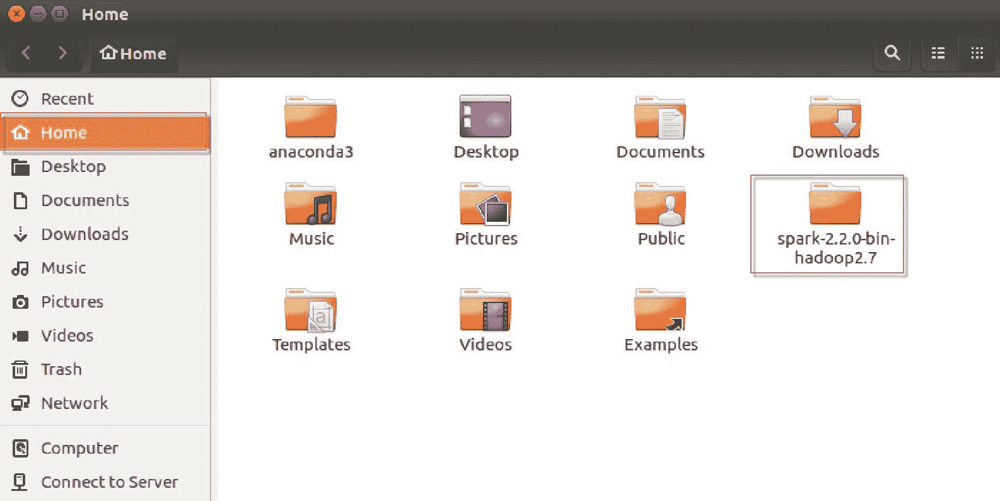

17.  现在安装了 Spark。通过在终端级别执行以下脚本，从终端启动Spark:

```py
~$ cd ~/spark-2.2.0-bin-hadoop2.7/~/spark-2.2.0-bin-hadoop2.7$ ./bin/pyspark
```

18.  执行最终测试，通过执行以下命令确保`SparkContext`在本地环境中驱动集群，从而确保 Spark 在终端启动并运行:

```py
>>> sc<SparkContext master=local[*] appName=PySparkShell>
```

# 它是如何工作的...

本节解释 Python、Anaconda 和 Spark 的安装过程背后的原因。

1.  Spark 在 **Java 虚拟机** ( **JVM** )上运行，Java **软件开发工具包** ( **SDK** )是 Spark 在 Ubuntu 虚拟机上运行的必备安装。

In order for Spark to run on a local machine or in a cluster, a minimum version of Java 6 is required for installation.

2.  Ubuntu 为 Java 推荐`sudo apt install`方法，因为它确保下载的包是最新的。
3.  请注意，如果当前没有安装 Java，终端中的输出将显示以下消息:

    ```py
    The program 'java' can be found in the following packages:* default-jre* gcj-5-jre-headless* openjdk-8-jre-headless* gcj-4.8-jre-headless* gcj-4.9-jre-headless* openjdk-9-jre-headlessTry: sudo apt install <selected package>
    ```

    4.  虽然 Python 2 很好，但它被认为是遗留的 Python。Python 2 在 2020 年面临生命终结日；因此，建议所有新的 Python 开发都使用 Python 3 来执行，本出版物中将会介绍这种情况。直到最近，Spark 仅在 Python 2 中可用。现在已经不是这样了。Spark 同时适用于 Python 2 和 3。安装 Python 3 以及许多依赖项和库的一种方便方法是通过 Anaconda。Anaconda 是 Python 的免费开源发行版，以及 R. Anaconda 管理 Python 中用于数据科学相关任务的许多最常见包的安装和维护。
    5.  在 Anaconda 的安装过程中，确认以下条件非常重要:

        *   蟒蛇安装在`/home/username/Anaconda3`位置
        *   蟒蛇安装人员将蟒蛇 3 的安装位置预先安排在`/home/username/.bashrc`中的`PATH`处
    6.  安装 Anaconda 后，下载 Spark。与 Python 不同，Spark 没有预装在 Ubuntu 上，因此需要下载和安装。
    7.  为了进行深度学习，将为 Spark 选择以下首选项:

        *   **Spark释放**:**2 . 2 . 0**(2017 年 7 月 11 日)
        *   **包类型**:为 Apache Hadoop 2.7 及更高版本预构建
        *   **下载类型**:直接下载
    8.  一旦成功安装了 Spark，在命令行执行 Spark 的输出应该类似于下面的截图所示:

    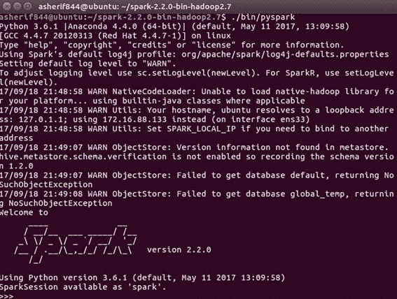

    9.  初始化 Spark 时需要注意的两个重要特性是它在`Python 3.6.1` | `Anaconda 4.4.0 (64-bit)` |框架下，并且 Spark 的 logo 是 2.2.0 版本。
    10.  恭喜你！Spark 已成功安装在本地 Ubuntu 虚拟机上。但是，并不是一切都是完整的。当 Spark 代码可以在 Jupyter 笔记本中执行时，Spark 开发是最好的，尤其是对于深度学习。谢天谢地，Jupyter 已经安装了本节前面执行的 Anaconda 发行版。

    # 还有更多...

    你可能会问，为什么我们不仅仅使用`pip install pyspark`来使用 Python 中的 Spark。Spark 的早期版本需要经历我们在本节中所做的安装过程。从 2.2.0 开始，Spark 的未来版本将开始允许通过`pip`方法直接安装。我们在本节中使用了完整的安装方法，以确保您能够安装并完全集成 Spark，以防您使用的是早期版本的 Spark。

    # 请参见

    要了解更多关于 Jupyter 笔记本及其与 Python 集成的信息，请访问以下网站:

    [http://jupyter.org](http://jupyter.org)

    要了解有关 Anaconda 的更多信息并下载 Linux 版本，请访问以下网站:

    [https://www.anaconda.com/download/](https://www.anaconda.com/download/)。

    # 将 Jupyter 笔记本与 Spark 集成

    第一次学习 Python 时，使用 Jupyter 笔记本作为**交互开发环境** ( **IDE** )是很有用的。这也是 Anaconda 如此强大的主要原因之一。它完全集成了 Python 和 Jupyter 笔记本之间的所有依赖关系。PySpark 和 Jupyter 笔记本也可以做到这一点。虽然 Spark 是用 Scala 编写的，但是 PySpark 允许在 Python 中进行代码翻译。

    # 准备好

    本部分的大部分工作只需要从终端访问`.bashrc`脚本。

    # 怎么做...

    默认情况下，PySpark 没有被配置为在 Jupyter 笔记本中工作，但是对`.bashrc`脚本稍加调整就可以解决这个问题。我们将在本节中介绍这些步骤:

    1.  通过执行以下命令访问`.bashrc`脚本:

    ```py
    $ nano .bashrc
    ```

    2.  一直滚动到脚本末尾应该会显示最后修改的命令，这应该是上一节前面安装时 Anaconda 设置的`PATH`。`PATH`应该如下图所示:

    ```py
    # added by Anaconda3 4.4.0 installerexport PATH="/home/asherif844/anaconda3/bin:$PATH"
    ```

    3.  在下面，Anaconda 安装程序添加的`PATH`可以包含一个自定义功能，帮助将 Spark 安装与来自 Anaconda3 的 Jupyter 笔记本安装进行通信。为了本章和其余章节的目的，我们将该功能命名为`sparknotebook`。`sparknotebook()`的配置应如下所示:

    ```py
    function sparknotebook(){export SPARK_HOME=/home/asherif844/spark-2.2.0-bin-hadoop2.7export PYSPARK_PYTHON=python3export PYSPARK_DRIVER_PYTHON=jupyterexport PYSPARK_DRIVER_PYTHON_OPTS="notebook"$SPARK_HOME/bin/pyspark}
    ```

    4.  更新后的`.bashrc`脚本保存后应该如下所示:

    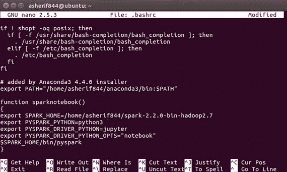

    5.  保存并退出`.bashrc`文件。建议通过执行以下命令并重启终端应用程序来传达`.bashrc`文件已经更新:

    ```py
    $ source .bashrc
    ```

    # 它是如何工作的...

    我们在这一部分的目标是将 Spark 直接集成到 Jupyter 笔记本中，这样我们就不会在终端进行开发，而是利用在笔记本中开发的优势。本节解释了Spark集成在 Jupyter 笔记本中是如何发生的。

    1.  我们将创建一个命令函数`sparknotebook`，我们可以从终端调用该函数，通过 Anaconda 安装中的 Jupyter 笔记本打开一个 Spark 会话。这需要在`.bashrc`文件中设置两个设置:
        1.  PySpark Python 可以设置为 python 3
        2.  python 的 pyspark 驱动程序将设置为 jupiter
    2.  现在可以通过执行以下命令从终端直接访问`sparknotebook`功能:

    ```py
    $ sparknotebook
    ```

    3.  然后，该功能应该通过默认的网络浏览器启动一个全新的 Jupyter 笔记本会话。点击右侧的新建按钮，选择笔记本下的 Python 3，可以在 Jupyter 笔记本中创建一个新的扩展为`.ipynb`的 Python 脚本:如下图所示:

    

    4.  同样，正如在终端级别为 Spark 所做的那样，将在笔记本中执行一个简单的脚本`sc`，以确认 Spark 已经启动并通过 Jupyter 运行:

    

    5.  理想情况下，版本、主文件和应用程序名称应该与在终端执行`sc`时的早期输出相同。如果是这种情况，那么 PySpark 已经成功安装并配置为与 Jupyter 笔记本一起工作。

    # 还有更多...

    需要注意的是，如果我们在没有指定`sparknotebook`的情况下通过终端调用 Jupyter 笔记本，我们的 Spark 会话将永远不会启动，并且我们在执行`SparkContext`脚本时会收到一个错误。

    我们可以通过在终端执行以下操作来访问传统的 Jupyter 笔记本:

    ```py
    jupyter-notebook
    ```

    一旦我们启动笔记本，我们可以尝试执行与之前相同的`sc.master`脚本，但这次我们将收到以下错误:

    

    # 请参见

    在线上有许多公司通过笔记本界面提供 Spark 的托管产品，其中已经为您管理了 Spark 与笔记本的安装和配置。这些是:

    *   霍顿作品([https://hortonworks.com/](https://hortonworks.com/))
    *   cloudera([https://www.cloudera.com/](https://www.cloudera.com/))
    *   MapR ( [https://mapr.com/](https://mapr.com/)
    *   数据条([https://databricks.com/](https://mapr.com/))

    # 启动和配置Spark集群

    对于大多数章节，我们首先要做的事情之一是初始化和配置我们的 Spark 集群。

    # 准备好

    初始化群集前导入以下内容。

    *   `from pyspark.sql import SparkSession`

    # 怎么做...

    本节将介绍初始化和配置 Spark 集群的步骤。

    1.  使用以下脚本导入`SparkSession`:

    ```py
    from pyspark.sql import SparkSession
    ```

    2.  使用以下脚本用名为`spark`的变量配置`SparkSession`:

    ```py
    spark = SparkSession.builder \.master("local[*]") \.appName("GenericAppName") \.config("spark.executor.memory", "6gb") \.getOrCreate()
    ```

    # 它是如何工作的...

    本节解释了`SparkSession`如何作为在 Spark 中开发的入口点。

    1.  从 Spark 2.0 开始，不再需要在 Spark 中创建`SparkConf`和`SparkContext`来开始开发。这些步骤不再需要，因为导入`SparkSession`将处理初始化集群。另外，需要注意的是`SparkSession`是`pyspark`的`sql`模块的一部分。
    2.  我们可以为我们的`SparkSession`分配属性:
        1.  `master`:分配 Spark 主 URL 在我们拥有最大可用内核数的`local`机器上运行。
        2.  `appName`:为应用程序指定一个名称
        3.  `config`:将`6gb`分配给`spark.executor.memory`
        4.  `getOrCreate`:确保一个`SparkSession`在不可用时被创建，并且在可用时检索一个现有的

    # 还有更多...

    出于开发目的，当我们在较小的数据集上构建应用程序时，我们可以只使用`master("local")`。如果我们要在生产环境中部署，我们需要指定`master("local[*]")`以确保我们使用最大可用内核并获得最佳性能。

    # 请参见

    要了解更多关于`SparkSession.builder`的信息，请访问以下网站:

    [https://spark . Apache . org/docs/2 . 2 . 0/API/Java/org/Apache/spark/SQL/SparkSession。Builder.html](https://spark.apache.org/docs/2.2.0/api/java/org/apache/spark/sql/SparkSession.Builder.html)

    # 停止Spark簇

    一旦我们完成了集群的开发，最好关闭它并保存资源。

    # 怎么做...

    本部分通过步骤来停止`SparkSession`。

    1.  执行以下脚本:

    `spark.stop()`

    2.  通过执行以下脚本确认会话已关闭:

    `sc.master`

    # 它是如何工作的...

    本节介绍如何确认Spark集群已关闭。

    1.  如果群集已关闭，当在笔记本中执行另一个 Spark 命令时，您将收到如下屏幕截图所示的错误消息:

    

    # 还有更多...

    在本地环境中工作时，关闭 Spark 集群可能不那么重要；然而，当 Spark 部署在云环境中时，您需要为计算能力付费，这将证明是昂贵的。