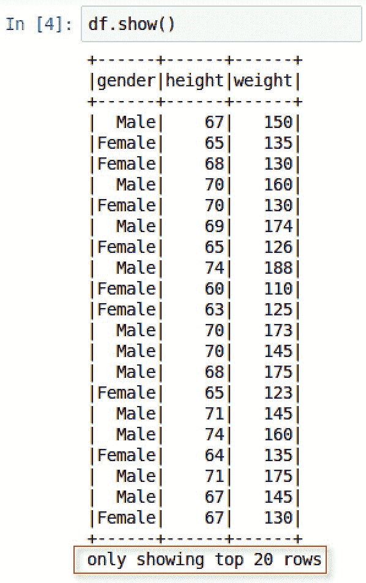
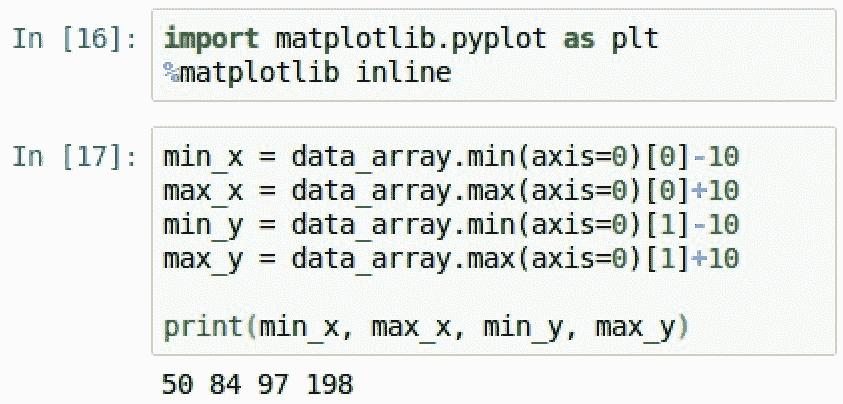
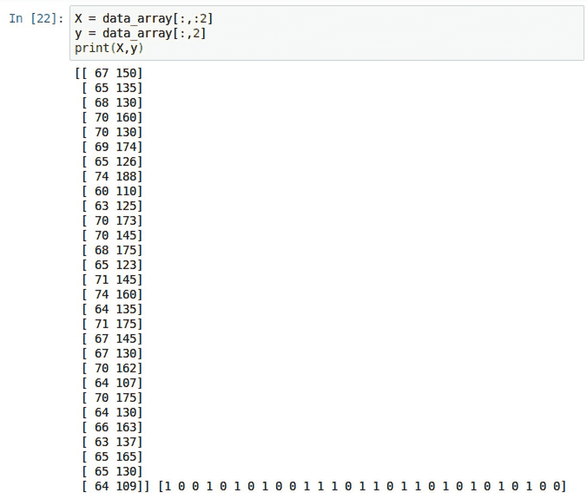
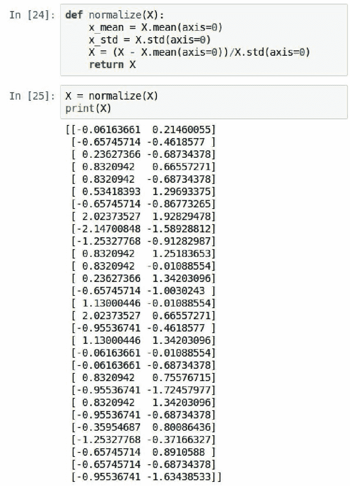
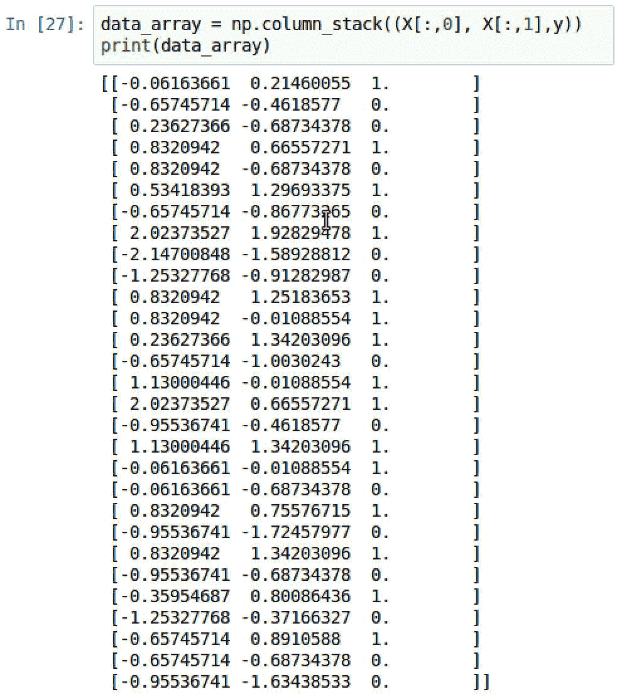
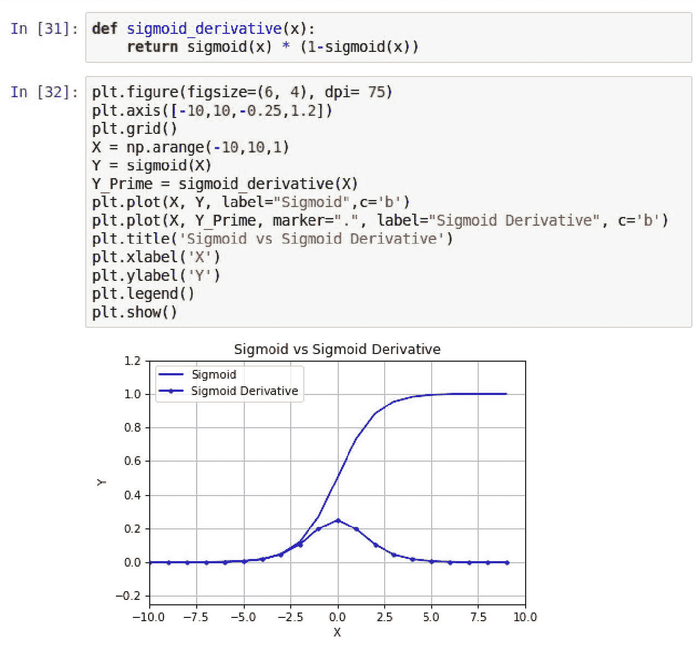
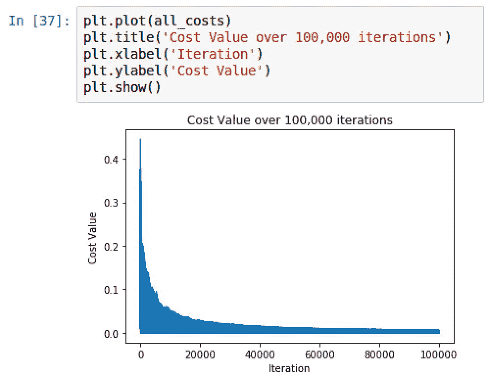
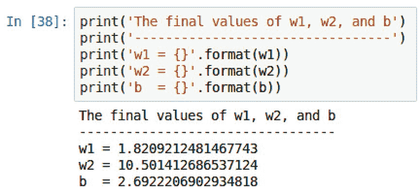

# 在Spark中创建神经网络

在本章中，将涵盖以下配方:

*   在 PySpark 中创建数据框
*   操作 PySpark 数据框中的列
*   将 PySpark 数据帧转换为数组
*   在散点图中可视化阵列
*   为神经网络的输入设置权重和偏差
*   标准化神经网络的输入数据
*   验证阵列以获得最佳神经网络性能
*   用 sigmoid 设置激活函数
*   创建 sigmoid 导数函数
*   计算神经网络中的成本函数
*   根据身高和体重预测性别
*   可视化预测分数

# 介绍

这本书的大部分内容将侧重于用 Python 中的库(如 TensorFlow 和 Keras)构建深度学习算法。虽然这些库有助于构建深度神经网络，而无需深入深度学习的微积分和线性代数，但本章将深入研究在 PySpark 中构建一个简单的神经网络，以根据身高和体重进行性别预测。了解神经网络基础的最好方法之一是从头开始构建模型，而不需要任何流行的深度学习库。一旦建立了神经网络框架的基础，理解和利用一些更流行的深度神经网络库将变得简单得多。

# 在 PySpark 中创建数据框

数据框架将作为构建深度学习模型时使用的所有数据的框架。类似于 Python 中的`pandas`库，PySpark 有自己的内置功能来创建数据框。

# 准备好

有几种方法可以在 Spark 中创建数据框。一种常见的方法是导入一个`.txt`、`.csv`或`.json`文件。另一种方法是手动将数据的字段和行输入到 PySpark 数据框中，虽然这个过程可能有点繁琐，但它很有帮助，尤其是在处理小型数据集时。为了根据身高和体重预测性别，本章将在 PySpark 中手动构建一个数据框。使用的数据集如下:


虽然在本章中将手动将数据集添加到 PySpark，但也可以从以下链接查看和下载数据集:

[https://github . com/asheri 844/apacheparkdeep cookbook/blob/master/ch02/data/heightsandeight . txt](https://github.com/asherif844/ApacheSparkDeepLearningCookbook/blob/master/CH02/data/HeightAndWeight.txt)

最后，我们将通过启动一个配置有 Jupyter 笔记本的 Spark 环境来开始本章和后续章节，该笔记本是在[第 1 章](01.html#OPEK0-3be7262ff9a54db3b2ea862fdce1797b)、*中创建的，使用以下终端命令为深度学习设置 Spark 环境:*:

```py
sparknotebook
```

# 怎么做...

使用 PySpark 时，必须先导入并初始化`SparkSession`，然后才能创建任何数据框:

1.  使用以下脚本导入一个`SparkSession`:

```py
from pyspark.sql import SparkSession
```

2.  配置一个`SparkSession`:

```py
spark = SparkSession.builder \.master("local") \.appName("Neural Network Model") \.config("spark.executor.memory", "6gb") \.getOrCreate()sc = spark.sparkContext
```

3.  在这种情况下，`SparkSession` `appName`被命名为`Neural Network Model`，`6gb`被分配给会话内存。

# 它是如何工作的...

本节介绍如何创建我们的 Spark 集群和配置我们的第一个数据帧。

1.  在 Spark 中，我们使用`.master()`来指定是在分布式集群上还是在本地运行作业。为了本章和其余章节的目的，我们将按照`.master('local')`的规定，使用一个工作线程在本地执行 Spark。这对于测试和开发来说很好，就像我们在本章中所做的那样；但是，如果我们将它部署到生产中，我们可能会遇到性能问题。在生产中，建议使用`.master('local[*]')`将 Spark 设置为在尽可能多的本地可用的工作节点上运行。如果我们的机器上有 3 个内核，并且我们想要设置我们的节点数来匹配它，那么我们将指定`.master('local[3]')`。

2.  首先通过插入每列的行值，然后使用以下脚本插入列标题名称来创建`dataframe`变量`df`:

```py
df = spark.createDataFrame([('Male', 67, 150), # insert column values('Female', 65, 135),('Female', 68, 130),('Male', 70, 160),('Female', 70, 130),('Male', 69, 174),('Female', 65, 126),('Male', 74, 188),('Female', 60, 110),('Female', 63, 125),('Male', 70, 173),('Male', 70, 145),('Male', 68, 175),('Female', 65, 123),('Male', 71, 145),('Male', 74, 160),('Female', 64, 135),('Male', 71, 175),('Male', 67, 145),('Female', 67, 130),('Male', 70, 162),('Female', 64, 107),('Male', 70, 175),('Female', 64, 130),('Male', 66, 163),('Female', 63, 137),('Male', 65, 165),('Female', 65, 130),('Female', 64, 109)], ['gender', 'height','weight']) # insert header values
```

3.  在 PySpark 中，`show()`函数提供了预览前 20 行的功能，如下面使用前面脚本时的截图所示:



# 还有更多...

如果没有明确说明，`.show()`功能默认为 20 行。如果我们只想显示数据帧的前 5 行，我们需要显式地声明它，如以下脚本所示:`df.show(5)`。

# 请参见

要了解有关 PySpark 中的 SparkSQL、数据框、函数和数据集的更多信息，请访问以下网站:

[https://spark . Apache . org/docs/latest/SQL-programming-guide . html](https://spark.apache.org/docs/latest/sql-programming-guide.html)

# 操作 PySpark 数据框中的列

数据框几乎完成；然而，有一个问题需要在构建神经网络之前解决。与其将性别值保留为字符串，不如将该值转换为数字整数以进行计算，随着本章的深入，这一点将变得更加明显。

# 准备好了

本节将要求导入以下内容:

*   `from pyspark.sql import functions`

# 怎么做...

本节介绍将字符串转换为数据框中的数值的步骤:

*   女性- > 0
*   男性- > 1

1.  转换数据框内的列值需要导入`functions`:

```py
from pyspark.sql import functions
```

2.  接下来，使用以下脚本将`gender`列修改为数值:

```py
df = df.withColumn('gender',functions.when(df['gender']=='Female',0).otherwise(1))
```

3.  最后，使用以下脚本对列进行重新排序，使`gender`成为数据框中的最后一列:

```py
df = df.select('height', 'weight', 'gender')
```

# 它是如何工作的...

本节说明如何应用数据框的操作。

1.  `functions from pyspark.sql`有几个有用的逻辑应用，可以用来对 Spark 数据框中的列应用 if-then 转换。在我们的例子中，我们将`Female`转换为 0，`Male`转换为 1。
2.  使用`.withColumn()`变换将转换为数值的函数应用于Spark数据帧。
3.  Spark 数据框的`.select()`功能类似于传统的 SQL，通过按请求的顺序和方式选择列来运行。
4.  数据框的最终预览将显示更新后的数据集，如下图所示:


# 还有更多...

除了数据框的`withColumn()`方法，还有`withColumnRenamed()`方法，用于重命名数据框中的列。

# 将 PySpark 数据帧转换为数组

为了形成神经网络的构建模块，必须将 PySpark 数据帧转换成数组。Python 有一个非常强大的库`numpy`，这使得使用数组变得简单。

# 准备好

随着`anaconda3` Python 包的安装，`numpy`库应该已经可用。但是，如果由于某种原因`numpy`库不可用，可以在终端使用以下命令进行安装:


`pip install`或`sudo pip install`将使用请求的库确认是否已经满足要求:

```py
import numpy as np
```

# 怎么做...

本节介绍将数据框转换为数组的步骤:

1.  使用以下脚本查看从 dataframe 收集的数据:

```py
df.select("height", "weight", "gender").collect()
```

2.  使用以下脚本将集合中的值存储到名为`data_array`的数组中:

```py
data_array =  np.array(df.select("height", "weight", "gender").collect())
```

3.  执行以下脚本来访问数组的第一行:

```py
data_array[0]
```

4.  同样，执行以下脚本来访问数组的最后一行:

```py
data_array[28]
```

# 它是如何工作的...

本节说明如何将数据帧转换为数组:

1.  我们的数据帧的输出可以使用`collect()`收集并查看，如下图所示:


2.  数据帧被转换成一个数组，该脚本的数组输出可以在下面的截图中看到:


3.  任何一组`height`、`weight`和`gender`值都可以通过引用数组的索引来访问。数组的形状为(29，3)，长度为 29 个元素，每个元素由三项组成。长度为 29 时，索引从`[0]`开始，到`[28]`结束。阵列形状的输出以及阵列的第一行和最后一行可以在下面的截图中看到:


4.  可以将数组的第一个和最后一个值与原始数据帧进行比较，以确认值和顺序没有因为转换而改变。

# 还有更多...

除了查看阵列中的数据点，检索阵列中每个要素的最小和最大点也很有用:

1.  要检索`height`、`weight`和`gender`的最小值和最大值，可以使用以下脚本:

```py
print(data_array.max(axis=0))print(data_array.min(axis=0))
```

2.  脚本的输出可以在下面的截图中看到:


最大`height`为`74`英寸，最小`height`为`60`英寸。最大重量为`188`磅，最小重量为`107`磅。性别的最小值和最大值并不相关，因为我们已经为它们指定了数值`0`和`1`。

# 请参见

要了解更多关于 numpy 的信息，请访问以下网站:

[www.numpy.org](http://www.numpy.org)

# 在散点图中可视化阵列

本章将开发的神经网络的目标是，如果`height`和`weight`已知，则预测个体的性别。理解`height`、`weight`和`gender`之间关系的一个强有力的方法是可视化输入神经网络的数据点。这可以通过流行的 Python 可视化库`matplotlib`来实现。

# 准备好

与`numpy`一样，`matplotlib`应该可以通过安装蟒蛇 3 Python 包获得。但是，如果由于某种原因`matplotlib`不可用，可以在终端使用以下命令进行安装:


`pip install`或`sudo pip install`将使用请求的库确认已经满足要求。

# 怎么做...

本节介绍通过散点图来可视化数组的步骤。

1.  导入`matplotlib`库，并使用以下脚本将库配置为可视化 Jupyter 笔记本内部的图:

```py
 import matplotlib.pyplot as plt%matplotlib inline
```

2.  接下来，使用来自`numpy`的`min()`和`max()`函数确定散点图的 *x* 和 y 轴的最小值和最大值，如以下脚本所示:

```py
min_x = data_array.min(axis=0)[0]-10max_x = data_array.max(axis=0)[0]+10min_y = data_array.min(axis=0)[1]-10max_y = data_array.max(axis=0)[1]+10
```

3.  执行以下脚本为每个`gender`绘制`height`和`weight`:

```py
# formatting the plot grid, scales, and figure sizeplt.figure(figsize=(9, 4), dpi= 75)plt.axis([min_x,max_x,min_y,max_y])plt.grid()for i in range(len(data_array)):value = data_array[i]# assign labels values to specific matrix elementsgender = value[2]height = value[0]weight = value[1]# filter data points by gendera = plt.scatter(height[gender==0],weight[gender==0], marker = 'x', c= 'b', label = 'Female')b = plt.scatter(height[gender==1],weight[gender==1], marker = 'o', c= 'b', label = 'Male')# plot values, title, legend, x and y axisplt.title('Weight vs Height by Gender')plt.xlabel('Height (in)')plt.ylabel('Weight (lbs)')plt.legend(handles=[a,b])
```

# 它是如何工作的...

本节说明如何将阵列绘制为散点图:

1.  `matplotlib`库被导入到 Jupyter 笔记本中，并且`matplotlib`库被配置为在 Jupyter 笔记本的单元格中在线绘制可视化效果
2.  x 轴和 y 轴的最小值和最大值决定了我们的图的大小，并给我们一个最佳的外观图。脚本的输出可以在下面的截图中看到:



3.  每个轴都添加了`10`点像素缓冲区，以确保所有数据点都被捕获而不会被切断。
4.  创建一个循环来迭代每一行值，并绘制`weight`与`height`的关系图。

5.  此外，不同的样式点被分配给`Female gender`、`x`和`Male gender`、`o`。

6.  按性别绘制体重与身高的脚本输出可以在下面的截图中看到:


# 还有更多...

散点图给出了数据的快速简单的直观解释。散点图的右上象限和左下象限之间有明显的分界线。140 磅以上的所有数据点表示一个`Male gender`，以下的所有数据点属于`Female gender`，如下图截图所示:


这个散点图将有助于确认在本章稍后创建神经网络时，随机选择身高和体重来预测性别的结果会是什么。

# 请参见

要了解更多关于`matplotlib`的信息，请访问以下网站:

[www.matplotlib.org](http://www.matplotlib.org/)

# 为神经网络的输入设置权重和偏差

PySpark 中的框架和数据现在已经完成。是时候开始构建神经网络了。不管神经网络有多复杂，开发都遵循类似的路径:

1.  输入数据
2.  添加权重和偏差
3.  将数据和权重的乘积相加

4.  应用激活功能
5.  评估输出，并将其与预期结果进行比较

本节将着重于设置权重，以创建输入到激活功能的输入。

# 准备好

粗略了解简单神经网络的构建模块有助于理解这一部分和本章的其余部分。每个神经网络都有输入和输出。在我们的例子中，输入是个体的身高和体重，输出是性别。为了得到输出，输入与值相乘(也称为权重:w1 和 w2)，然后在末尾加上一个偏差(b)。这个方程被称为求和函数 z，给出如下方程:

z = (input1) x (w1) + (input2) x (w2) + b

权重和偏差最初只是随机生成的值，可以通过`numpy`执行。权重将通过增加或减少它们对输出的影响来增加输入的权重。该偏差将起到稍微不同的作用，因为它将向上或向下移动总和(z)的基线，这取决于满足预测所需的条件。然后通过激活函数将 z 的每个值转换为 0 到 1 之间的预测值。激活功能是一个转换器，它给我们一个值，我们可以将其转换为二进制输出(男性/女性)。然后将预测输出与实际输出进行比较。最初，预测输出和实际输出之间的差异会很大，因为首次开始时权重是随机的。然而，使用称为梯度下降的技术，使用称为反向传播的过程来最小化实际和预测之间的差异。一旦我们确定实际值和预测值之间的差异可以忽略不计，我们就为神经网络存储 w1、w2 和 b 的值。

# 怎么做...

本节将逐步介绍如何设置神经网络的权重和偏差。

1.  使用以下脚本设置值生成器的随机性:

```py
np.random.seed(12345)
```

2.  使用以下脚本设置权重和偏差:

```py
w1 = np.random.randn()w2 = np.random.randn()b= np.random.randn()
```

# 它是如何工作的...

本节说明如何初始化权重和偏差，以便在本章的后面部分使用:

1.  使用`numpy`随机生成权重，并设置随机种子以确保每次生成相同的随机数
2.  权重将被分配一个通用变量`w1`和`w2`
3.  偏差也是使用`numpy`随机生成的，并且随机种子被设置为保持每次生成的随机数相同
4.  偏差将被分配一个通用变量`b`
5.  这些值被插入到求和函数`z`中，该函数填充一个初始分数，该分数将被输入到另一个函数，即激活函数中，这将在本章后面讨论
6.  目前，这三个变量都是完全随机的。`w1`、`w2`、`b`的输出可以在下面的截图中看到:


# 还有更多...

最终，目标是获得与实际输出相匹配的预测输出。对权重和值的乘积求和有助于实现该过程的一部分。因此，`0.5`和`0.5`的随机输入将具有以下求和输出:

```py
z = 0.5 * w1 + 0.5 * w2 + b 
```

或者它会有以下输出，带有我们当前权重的随机值，`w1`和`w2`:

```py
z = 0.5 * (-0.2047) + 0.5 * (0.47894) + (-0.51943) = -7.557
```

变量`z`被指定为权重与数据点的乘积和。目前，权重和偏差完全是随机的。然而，正如本节前面提到的，通过使用梯度下降的称为反向传播*、*的过程，权重将被调整，直到确定更理想的结果。梯度下降简单地说就是为我们的权重确定最佳值的过程，这将为我们提供误差最小的最佳预测输出。识别最优值的过程包括识别函数的局部最小值。梯度下降将在本章后面讨论。

# 请参见

要了解更多关于人工神经网络中权重和偏差的信息，请访问以下网站:

[https://en . Wikipedia . org/wiki/人工 _ 神经元](https://en.wikipedia.org/wiki/Artificial_neuron)

# 标准化神经网络的输入数据

当输入标准化时，神经网络的工作效率更高。与其他具有较低值的潜在输入相比，这将影响整体结果的特定输入的幅度降至最低。该部分将使当前个体的`height`和`weight`输入正常化。

# 准备好

输入值的标准化需要为最终计算获得这些值的平均值和标准偏差。

# 怎么做...

本节将介绍标准化身高和体重的步骤。

1.  使用以下脚本将数组分割成输入和输出:

```py
X = data_array[:,:2]y = data_array[:,2]
```

2.  可以使用以下脚本计算 29 名个体的平均值和标准偏差:

```py
x_mean = X.mean(axis=0)x_std = X.std(axis=0)
```

3.  使用以下脚本创建一个规范化函数来规范化`X`:

```py
 def normalize(X):x_mean = X.mean(axis=0)x_std = X.std(axis=0)X = (X - X.mean(axis=0))/X.std(axis=0)return X
```

# 它是如何工作的...

本节说明如何标准化身高和体重。

1.  `data_array`矩阵分为两个矩阵:
    1.  `X`由身高和体重组成
    2.  `y`由性别组成

2.  两个阵列的输出可以在下面的截图中看到:



3.  `X`组件是输入，并且是唯一将经历标准化过程的部分。 *y* 成分，或性别，暂时不予考虑。标准化过程包括提取所有 29 个个体的两个输入的平均值和标准偏差。身高和体重的平均值和标准差的输出可以在下面的截图中看到:


4.  高度的平均值为~67 英寸，高度的标准偏差为~3.4 英寸。重量的平均值为 145 磅，标准偏差为 22 磅。

5.  一旦它们被提取出来，输入就使用下面的等式进行归一化:`X_norm = (X - X_mean)/X_std`。

6.  使用 Python 函数`normalize()`对`X`数组进行规范化，现在将`X`数组分配给新生成的规范化集的值，如下图所示:



# 请参见

要了解更多有关统计数据标准化的信息，请访问以下网站:

[https://en . Wikipedia . org/wiki/Normalization _(统计)](https://en.wikipedia.org/wiki/Normalization_(statistics))

# 验证阵列以获得最佳神经网络性能

一点点验证对于确保我们的阵列在即将到来的神经网络中实现最佳性能是非常有用的。

# 准备好

使用`numpy.stack()`功能，这部分需要一点`numpy`魔法。

# 怎么做...

以下步骤将验证我们的数组是否已经规范化。

1.  执行以下步骤打印阵列输入的平均值和标准偏差:

```py
print('standard deviation')print(round(X[:,0].std(axis=0),0))print('mean')print(round(X[:,0].mean(axis=0),0))
```

2.  执行以下脚本，将身高、体重和性别组合成一个数组，`data_array`:

```py
data_array = np.column_stack((X[:,0], X[:,1],y))
```

# 它是如何工作的...

本节解释了如何验证和构建该阵列，以便将来在神经网络中进行最佳使用。

1.  高度的新`mean`应为 0，`standard deviation`应为 1。这可以在下面的截图中看到:


2.  这是对标准化数据集的确认，因为它包括平均值 0 和标准偏差 1。
3.  原始的`data_array`对于神经网络不再有用，因为它包含了原始的、非归一化的`height`、`weight`和`gender`的输入值。
4.  尽管如此，通过一点点`numpy`魔法，`data_array`可以被重组以包括正常化的`height`和`weight`，以及`gender`。这是通过`numpy.stack()`完成的。新数组`data_array`的输出可以在下面的截图中看到:



# 还有更多...

我们的阵列已经准备好了。我们的身高和体重输入被标准化，我们的性别输出被标记为 0 或 1。

# 请参见

要了解更多关于`numpy.stack()`的信息，请访问以下网站:

[https://docs . scipy . org/doc/numpy/reference/generated/numpy . stack . html](https://docs.scipy.org/doc/numpy/reference/generated/numpy.stack.html)

# 用 sigmoid 设置激活函数

神经网络中使用激活函数来帮助确定输出，无论是“是”还是“否”，是“真”还是“假”，或者在我们的情况下是“0”还是“1”(男性/女性)。在这一点上，输入已经标准化，并且已经用权重和偏差相加:`w1`、`w2`和`b`。然而，权重和偏差目前是完全随机的，并且没有被优化以产生与实际输出相匹配的预测输出。构建预测结果的缺失环节在于激活或`sigmoid`功能，如下图所示:


如果求和产生的数很小，它将产生 0 的激活。同样，如果求和产生的数字很大，它将产生 1 的激活。这个函数很有用，因为它将输出限制为二进制结果，这对分类非常有用。这些输出的结果将在本章的剩余部分讨论和澄清。

# 准备好

`sigmoid`函数类似于逻辑回归函数，因为它计算 0 和 1 之间的概率结果。此外，它还提供了一系列介于两者之间的东西。因此，可以将条件设置为关联任何大于 0.5 比 1 且小于 0.5 比 0 的值。

# 怎么做...

本节介绍使用样本数据创建和绘制 sigmoid 函数的步骤。

1.  使用 Python 函数创建`sigmoid`函数，如以下脚本所示:

```py
def sigmoid(input):return 1/(1+np.exp(-input))
```

2.  使用以下脚本为`sigmoid`曲线创建样本`x`值:

```py
X = np.arange(-10,10,1)
```

3.  此外，使用以下脚本为`sigmoid`曲线创建样本`y`值:

```py
Y = sigmoid(X)
```

4.  使用以下脚本绘制这些点的`x`和`y`值:

```py
plt.figure(figsize=(6, 4), dpi= 75)plt.axis([-10,10,-0.25,1.2])plt.grid()plt.plot(X,Y)plt.title('Sigmoid Function')plt.show()
```

# 它是如何工作的...

本节解释 sigmoid 函数背后的数学原理。

1.  `sigmoid`函数是用于分类的逻辑回归的专用版本。逻辑回归的计算用以下公式表示:


2.  逻辑回归函数的变量如下:
    *   *L* 代表函数的最大值
    *   *k* 代表曲线的陡度
    *   *x <sub class="calibre39">中点</sub>* 代表函数的中点值
3.  由于`sigmoid`函数的陡度值为 1，中点为 0，最大值为 1，因此它产生以下函数:


4.  我们可以绘制一个一般的 sigmoid 函数，其 x 值范围为-5 到 5，y 值范围为 0 到 1，如下图所示:


5.  我们用 Python 创建了自己的`sigmoid`函数，并用`-10`和`10`之间的样本数据绘制了它。我们的情节看起来与之前的一般 sigmoid 情节非常相似。我们`sigmoid`功能的输出可以在下面的截图中看到:


# 请参见

要了解更多关于`sigmoid`功能的起源，请访问以下网站:

[https://en.wikipedia.org/wiki/Sigmoid_function](https://en.wikipedia.org/wiki/Sigmoid_function)

# 创建 sigmoid 导数函数

sigmoid 函数是一个独特的函数，其中 sigmoid 函数的导数的值包括 sigmoid 函数的值。你可能会问这有什么大不了的。然而，由于已经计算了 sigmoid 函数，所以当在许多层上执行反向传播时，它允许更简单和更有效的处理。此外，在计算中使用 sigmoid 函数的导数来导出最佳`w1`、`w2`和`b`值，以导出最精确的预测输出。

# 准备好了

粗略了解微积分中的导数将有助于理解 sigmoid 导数函数。

# 怎么做...

本节介绍创建 sigmoid 导数函数的步骤。

1.  就像`sigmoid`函数一样，使用下面的脚本用 Python 创建`sigmoid`函数的导数:

```py
def sigmoid_derivative(x):return sigmoid(x) * (1-sigmoid(x))
```

2.  使用以下脚本将`sigmoid`函数的导数绘制在原始`sigmoid`函数旁边:

```py
plt.figure(figsize=(6, 4), dpi= 75)plt.axis([-10,10,-0.25,1.2])plt.grid()X = np.arange(-10,10,1)Y = sigmoid(X)Y_Prime = sigmoid_derivative(X)c=plt.plot(X, Y, label="Sigmoid",c='b')d=plt.plot(X, Y_Prime, marker=".", label="Sigmoid Derivative", c='b')plt.title('Sigmoid vs Sigmoid Derivative')plt.xlabel('X')plt.ylabel('Y')plt.legend()plt.show()
```

# 它是如何工作的...

本节解释了 sigmoid 函数导数背后的数学原理，以及用 Python 创建 sigmoid 函数导数的逻辑。

1.  神经网络需要`sigmoid`函数的导数来预测`gender`的精确输出。`sigmoid`函数的导数使用以下公式计算:


2.  然后，我们可以使用 Python 中的原始 sigmoid 函数`sigmoid()`，创建 sigmoid 函数的导数`sigmoid_derivate()`。我们可以并排绘制这两个函数，如下图所示:



3.  Sigmoid 导数跟踪原始 Sigmoid 函数的斜率。在图的早期，当 Sigmoid 的斜率完全水平时，Sigmoid 导数也是 0.0。当值接近 1 时，Sigmoid 也是如此，因为斜率几乎完全是水平的。Sigmoid 斜率的峰值位于 x 轴的中点。因此，这也是 Sigmoid 导数的峰值。

# 请参见

要深入了解衍生品，请访问以下网站:

[https://www . khanacademy . org/math/calculation-home/taking-derives-calc](https://www.khanacademy.org/math/calculus-home/taking-derivatives-calc)

# 计算神经网络中的成本函数

此时，是时候将本章前面强调的所有部分结合起来计算成本函数了，神经网络将使用该函数来确定预测结果与原始或实际结果的匹配程度，因为目前有 29 个单独的数据点可用。成本函数的目的是确定实际值和预测值之间的差异。然后，梯度下降用于增加或减少`w1`、`w2`和`b`的值，以减少成本函数的值，并最终实现我们的目标，即得出与实际值相匹配的预测值。

# 准备好

成本函数的公式如下:

cost(x)=(predicted-actual)<sup class="calibre40">2</sup>

如果成本函数看起来很熟悉，那是因为它实际上只是另一种最小化实际输出和预测之间的平方差的方法。神经网络中梯度下降或反向传播的目的是最小化成本函数，直到该值接近 0。此时，权重和偏差(`w1`、`w2`和`b`)将不再是`numpy`生成的随机无关紧要的值，而是对神经网络模型有贡献的实际重要权重。

# 怎么做...

本节介绍计算成本函数的步骤。

1.  设置学习速率值`0.1`以递增地改变权重和偏差，直到使用以下脚本选择最终输出:

```py
learningRate = 0.1
```

2.  使用以下脚本启动名为`allCosts`的 Python 列表。

```py
allCosts = []
```

3.  使用以下脚本创建一个`for`循环，该循环将迭代 100，000 个场景:


4.  使用以下脚本绘制在 100，000 次迭代中收集的成本值:

```py
plt.plot(all_costs)plt.title('Cost Value over 100,000 iterations')plt.xlabel('Iteration')plt.ylabel('Cost Value')plt.show()
```

5.  可以使用以下脚本查看权重和偏差的最终值:

```py
print('The final values of w1, w2, and b')print('---------------------------------')print('w1 = {}'.format(w1))print('w2 = {}'.format(w2))print('b = {}'.format(b))
```

# 它是如何工作的...

本节说明如何使用成本函数来生成权重和偏差。

1.  将执行`for`循环，对权重和偏差执行梯度下降以调整值，直到成本函数接近 0。
2.  该循环将对代价函数迭代 100，000 次。每次从 29 个个体中选择`height`和`weight`的随机值。
3.  从随机的`height`和`weight`中计算出一个求和值`z`，该输入用`sigmoid`函数计算出一个`predictedGender`分数。
4.  计算成本函数，并将其添加到跟踪 100，000 次迭代中所有成本函数的列表中。
5.  根据求和值(`z`)以及`cost`函数(`cost`)计算一系列偏导数。
6.  这些计算最终用于更新成本函数的权重和偏差，直到它们(`w1`、`w2`和`b`)在 100，000 次迭代中为成本函数返回接近 0 的值。
7.  最终，目标是成本函数的值随着迭代次数的增加而减少。在下面的截图中可以看到 100，000 次迭代的成本函数值的输出:



8.  在迭代过程中，成本值从约 0.45 下降到约 0.01。
9.  此外，我们可以查看产生最低成本函数值的`w1`、`w2`和`b`的最终输出，如下图所示:



# 还有更多...

测试权重和偏差的最终值的能力现在可以用来计算成本函数计算预测值的效果，以及它与实际分数的比较。

以下脚本将通过每个人创建一个循环，并根据权重(`w1`、`w2`)和偏差(`b`)计算预测的性别得分:

```py
for i in range(len(data_array)):random_individual = data_array[i]height = random_individual[0]weight = random_individual[1]z = height*w1 + weight*w2 + bpredictedGender=sigmoid(z)print("Individual #{} actual score: {} predicted score:                           {}".format(i+1,random_individual[2],predictedGender))
```

脚本的输出可以在下面的截图中看到:


所有 29 个实际分数在四舍五入后与预测分数大致匹配。虽然这有利于确认模型在训练数据上产生了匹配的结果，但最终，测试将确定模型是否能够对引入它的新个体做出准确的性别预测。

# 请参见

要了解更多关于使用梯度下降最小化成本函数或平方(差)误差函数的信息，请访问以下网站:

[https://en . Wikipedia . org/wiki/gradient _ descending](https://en.wikipedia.org/wiki/Gradient_descent)

# 根据身高和体重预测性别

预测模型只有在能够基于新信息进行预测的情况下才是有用的。简单的逻辑回归或线性回归，或更复杂的神经网络模型就是这种情况。

# 准备好

这就是乐趣开始的地方。本节的唯一要求是提取男性和女性个体的样本数据点，并使用他们的身高和体重值来测量上一节中创建的模型的准确性。

# 怎么做...

本节将介绍根据身高和体重预测性别的步骤。

1.  创建一个名为`input_normalize`的 Python 函数，输入`height`和`weight`的新值，并输出归一化的高度和重量，如以下脚本所示:

```py
def input_normalize(height, weight):inputHeight = (height - x_mean[0])/x_std[0]inputWeight = (weight - x_mean[1])/x_std[1]return inputHeight, inputWeight
```

2.  为`height`的`70`英寸值和`weight`的`180`磅值的函数分配一个名为`score`的变量，如以下脚本所示:

```py
score = input_normalize(70, 180)
```

3.  创建另一个 Python 函数，称为`predict_gender`，通过对`w1`、`w2`、`b`以及`sigmoid`函数求和，输出介于 0 和 1 之间的概率分数`gender_score`，以及性别描述，如下脚本所示:

```py
def predict_gender(raw_score):gender_summation = raw_score[0]*w1 + raw_score[1]*w2 + bgender_score = sigmoid(gender_summation)if gender_score <= 0.5:gender = 'Female'else:gender = 'Male'return gender, gender_score
```

# 它是如何工作的...

本节解释如何使用身高和体重的新输入来生成性别预测分数。

1.  创建一个函数来输入新的高度和重量值，并将实际值转换为标准化的高度和重量值，称为`inputHeight`和`inputWeight`
2.  变量`score`用于存储归一化值，另一个函数`predictGender`用于输入得分值，并基于上一节中创建的`w1`、`w2`和`b`的值输出性别得分和描述。这些值已经使用梯度下降进行了预调整，以调整这些值并最小化`cost`功能。
3.  将`score`值应用到`predict_gender`函数应该会显示性别描述和分数，如下图所示:


4.  似乎`height`中的`70`英寸和`weight`中的`180`磅的规格是男性的高预测值(99.999%)。
5.  对`height`中的`50`英寸和`weight`中的`150`磅的另一个测试可能会揭示不同的性别，如下图所示:


6.  类似地，该输入从`sigmoid`函数产生非常低的分数(0.0000000839)，表明这些特征与`Female`性别密切相关。

# 请参见

要了解有关测试、培训和验证数据集的更多信息，请访问以下网站:

[https://en . Wikipedia . org/wiki/Training，_test，_ and _ validation _ set](https://en.wikipedia.org/wiki/Training,_test,_and_validation_sets)

# 可视化预测分数

虽然我们可以基于具有特定身高和体重的个体来单独预测性别，但是可以使用每个数据点对整个数据集进行图形化和评分，以确定输出是对女性还是男性进行评分。

# 准备好

此部分不需要依赖项。

# 怎么做...

本节将介绍可视化图形中所有预测点的步骤。

1.  使用以下脚本计算图形的最小点和最大点:

```py
x_min = min(data_array[:,0])-0.1x_max = max(data_array[:,0])+0.1y_min = min(data_array[:,1])-0.1y_max = max(data_array[:,1])+0.1increment= 0.05print(x_min, x_max, y_min, y_max)
```

2.  以 0.05 个单位为增量生成 *x* 和 *y* 值，然后创建一个名为`xy_data`的数组，如以下脚本所示:

```py
x_data= np.arange(x_min, x_max, increment)y_data= np.arange(y_min, y_max, increment)xy_data = [[x_all, y_all] for x_all in x_data for y_all in y_data]
```

3.  最后，使用与本章前面类似的脚本来生成性别分数并填充图表，如以下脚本所示:

```py
for i in range(len(xy_data)):data = (xy_data[i])height = data[0]weight = data[1] z_new = height*w1 + weight*w2 + bpredictedGender_new=sigmoid(z_new)# print(height, weight, predictedGender_new)ax = plt.scatter(height[predictedGender_new<=0.5],weight[predictedGender_new<=0.5],     marker = 'o', c= 'r', label = 'Female')    bx = plt.scatter(height[predictedGender_new > 0.5],weight[predictedGender_new>0.5], marker = 'o', c= 'b', label = 'Male') # plot values, title, legend, x and y axisplt.title('Weight vs Height by Gender')plt.xlabel('Height (in)')plt.ylabel('Weight (lbs)')plt.legend(handles=[ax,bx])
```

# 它是如何工作的...

本节说明如何创建数据点以生成将要绘制的预测值。

1.  图形的最小值和最大值是基于数组值计算的。脚本的输出可以在下面的截图中看到:


2.  我们在 0.05 的增量范围内为最小和最大值内的每个数据点生成 x 和 y 值，然后将每个(x，y)点运行到预测分数中以绘制值。女性分数被指定为红色，男性分数被指定为蓝色，如下图所示:


3.  该图显示了取决于所选`height`和`weight`的性别分数之间的截止值。