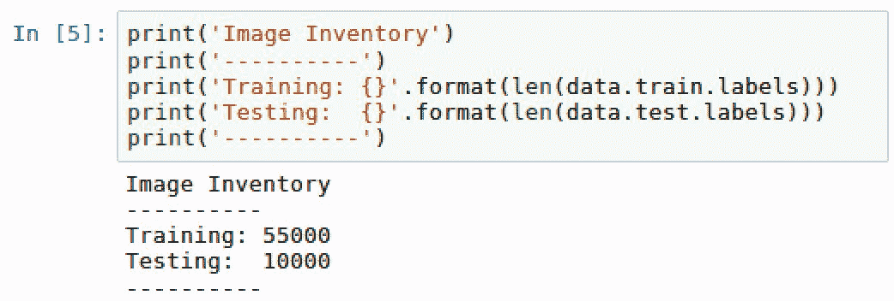
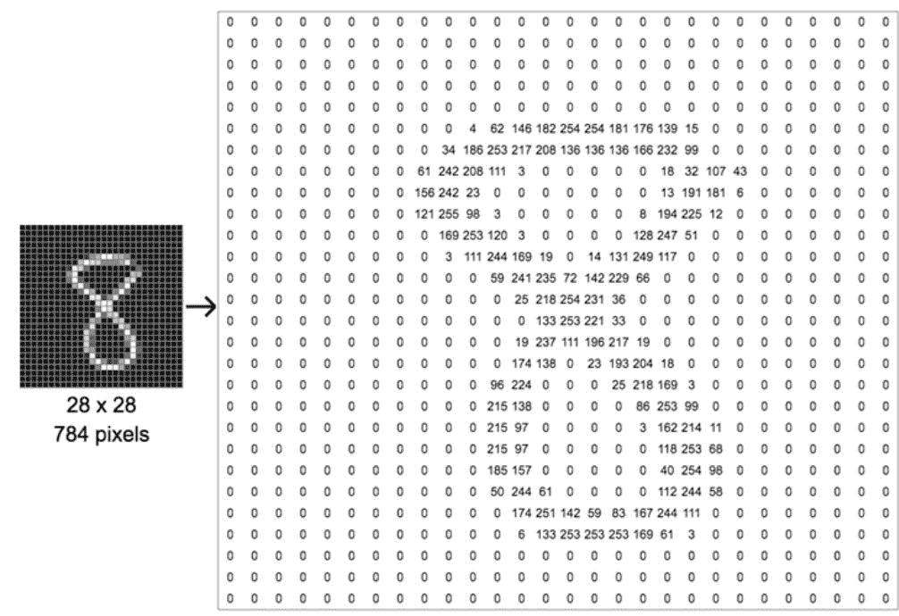
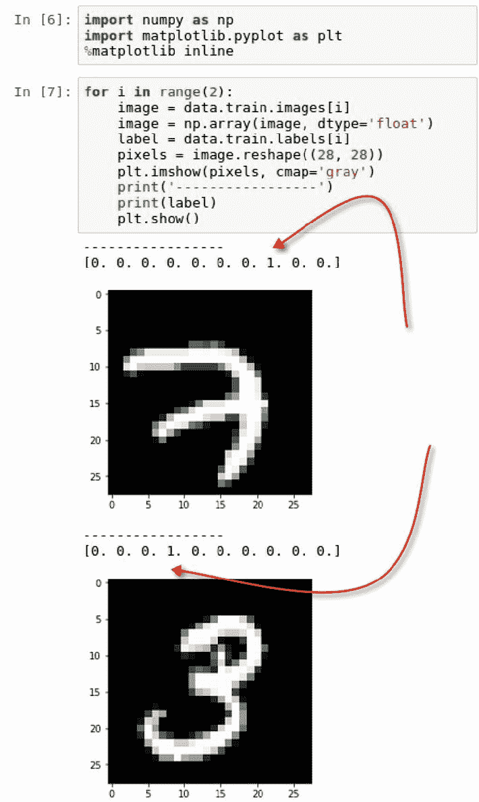
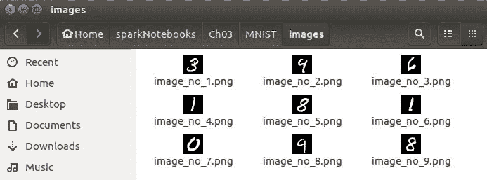

# 三、卷积神经网络的痛点

在本章中，将涵盖以下配方:

*   痛点 1:导入 MNIST 图像
*   痛点 2:可视化 MNIST 图像
*   痛点 3:将 MNIST 图像导出为文件
*   痛点 4:增强 MNIST 形象
*   痛点 5:利用训练图像的替代来源
*   痛点 6:优先考虑中枢神经系统的高级库

# 介绍

**卷积神经网络** ( **CNNs** )在过去几年里有所复苏。在图像识别方面，他们已经取得了巨大的成功。随着现代智能手机的出现，这一点变得非常重要，因为现在任何人都有能力拍摄大量的物体照片，并将其发布在社交媒体网站上。正是由于这种现象，卷积神经网络目前需求量很大。

有几个特点使美国有线电视新闻网表现最佳。它们需要以下特性:

*   大量的训练数据
*   视觉和空间数据
*   强调过滤(汇集)、激活和卷积，而不是传统神经网络中更明显的全连接层

虽然中枢神经系统已经获得了很大的普及，但主要由于它们的计算需求以及获得性能良好的模型所需的训练数据量，与它们一起工作存在一些限制。我们将重点关注能够应用于数据的技术，这些技术最终将有助于卷积神经网络的发展，同时解决这些局限性。在后面的章节中，我们将在开发图像分类模型时应用其中的一些技术。

# 痛点 1:导入 MNIST 图像

最常见的用于图像分类的数据集之一是`MNIST`数据集，它由数千个手写数字样本组成。根据扬·勒昆、科琳娜·科尔特斯和克里斯托弗 J.C 伯格斯的说法，经过修改的国家标准与技术研究所(T2)和 MNIST(T4)是有用的，原因如下:

It is a good database for people who want to try learning techniques and pattern recognition methods on real-world data while spending minimal efforts on preprocessing and formatting.

有几种方法可以将 MNIST 图像导入我们的 Jupyter 笔记本。我们将在本章中介绍以下两种方法:

1.  直接通过 TensorFlow 库
2.  手动通过 MNIST 网站

One thing to note is that we will be primarily using MNIST images as our example of how to improve performance within a convolutional neural network. All of these techniques that will be applied on MNIST images can be applied to any image that will be used to train a CNN.

# 准备好

唯一需要的就是安装`TensorFlow`。它可能不会预装 anaconda3 软件包；因此，一个简单的`pip`安装要么确认`TensorFlow`的可用性，要么在当前不可用的情况下安装它。`TensorFlow`可以在终端轻松安装，如下图截图所示:


# 怎么做...

`TensorFlow`库有一组方便的内置示例，可以直接使用。其中一个示例数据集是`MNIST`。本节将介绍访问这些图像的步骤。

1.  使用以下脚本将别名为`tf`的`TensorFlow`导入到库中:

```py
import tensorflow as tf
```

2.  使用以下脚本从库中下载并提取图像，并保存到本地文件夹:

```py
from tensorflow.examples.tutorials.mnist import input_datadata = input_data.read_data_sets('MNIST/', one_hot=True)
```

3.  使用以下脚本检索将用于评估图像分类准确性的训练和测试数据集的最终计数:

```py
print('Image Inventory')print('----------')print('Training: ' + str(len(data.train.labels)))print('Testing: '+ str(len(data.test.labels)))print('----------')
```

# 它是如何工作的...

本节解释用于访问 MNIST 数据集的过程:

1.  一旦我们收到`TensorFlow`库已正确安装的确认，它就会被导入笔记本。
2.  我们可以确认`TensorFlow`的版本，也可以将图像提取到我们本地的`MNIST/`文件夹中。提取过程在笔记本的输出中可见，如下图所示:


3.  这四个提取的文件命名如下:
    1.  `t10k-images-idx3-ubyte.gz`
    2.  `t10k-labels-idx1-ubyte.gz`
    3.  `train-images-idx3-ubyte.gz`
    4.  `train-labels-idx1-ubyte.gz`
4.  它们已经下载到`MNIST/`子文件夹，如下图所示:


5.  此外，这四个文件可以在我们的笔记本中查看，如下图所示:


6.  这四个文件是测试和训练图像以及附带的测试和训练标签，用于标识测试和训练数据集中的每个图像。此外，`one_hot = True`特征被明确定义。这表明标签的单热编码是活动的，这有助于建模中的特征选择，因为每个列值都是 0 或 1。
7.  该库的一个子类也被导入，它将 MNIST 的手写图像存储到指定的本地文件夹中。对于 55，000 个训练图像和 10，000 个测试图像，包含所有图像的文件夹大小应该约为 12 MB，如下图所示:



8.  这 10，000 幅图像将用于测试我们的模型的准确性，该模型将在 55，000 幅图像上进行训练。

# 还有更多...

偶尔，当试图通过`TensorFlow`直接访问 MNIST 数据集时，可能会出现错误或警告。正如之前在本节中看到的，我们在进口 MNIST 时收到了以下警告:

WARNING:tensorflow:From <ipython-input-3-ceaef6f48460>:2: read_data_sets (from tensorflow.contrib.learn.python.learn.datasets.mnist) is deprecated and will be removed in a future version.
Instructions for updating:
Please use alternatives such as official/mnist/dataset.py from tensorflow/models.

该数据集可能会在`TensorFlow`的未来版本中被弃用，因此不再可直接访问。有时候我们通过`TensorFlow`提取 MNIST 图像时，可能会遇到一个典型的 *HTTP 403 错误*。这可能是因为网站暂时不可用。无论是哪种情况，都不要担心，有一种手动方法可以使用以下链接下载四个`.gz`文件:

[http://yann . lecun . com/exdb/mnst/](http://yann.lecun.com/exdb/mnist/)

这些文件位于网站上，如下图所示:


下载文件并将它们保存到可访问的本地文件夹中，类似于对直接来自`TensorFlow`的文件所做的操作。

# 请参见

要了解更多关于`MNIST`手写数字数据库的信息，请访问以下网站:[http://yann.lecun.com/exdb/mnist/](http://yann.lecun.com/exdb/mnist/)。

要了解更多关于一热编码的信息，请访问以下网站:[https://hackernoon . com/什么是一热编码-为什么以及何时必须使用它-e3c6186d008f。](https://hackernoon.com/what-is-one-hot-encoding-why-and-when-do-you-have-to-use-it-e3c6186d008f)

# 痛点 2:可视化 MNIST 图像

在 Jupyter 笔记本中处理图形时，绘制图像通常是一个主要的痛点。显示训练数据集中的手写图像至关重要，尤其是在比较与手写图像相关联的标签的实际值时。

# 准备好

唯一将被导入以可视化手写图像的 Python 库是`numpy`和`matplotlib`。这两者应该已经可以通过 Anaconda 中的软件包获得。如果由于某种原因它们不可用，可以使用以下命令将它们都安装在终端上`pip`:

*   `pip install matplotlib`
*   `pip install numpy`

# 怎么做...

本节将介绍如何在 Jupyter 笔记本中可视化 MNIST 手写图像的步骤:

1.  导入以下库:`numpy`和`matplotlib`，并使用以下脚本配置`matplotlib`绘制`inline`:

```py
import numpy as npimport matplotlib.pyplot as plt%matplotlib inline
```

2.  使用以下脚本绘制前两个示例图像:

```py
for i in range(2):image = data.train.images[i]image = np.array(image, dtype='float')label = data.train.labels[i]pixels = image.reshape((28, 28))plt.imshow(pixels, cmap='gray')print('-----------------')print(label)plt.show()
```

# 它是如何工作的...

本节将介绍如何在 Jupyter 笔记本中查看 MNIST 手写图像的过程:

1.  Python 中会生成一个循环，从训练数据集中采样两幅图像。

2.  最初，图像只是存储在`numpy`数组中的一系列 0 到 1 之间的浮点格式的值。数组的值是一个名为`image`的标记图像。`image`数组随后被重新整形为一个 28×28 的矩阵，称为`pixels`，对于 0 值为黑色，对于不为 0 的颜色为灰色。该值越高，颜色的灰色阴影越浅。在下面的截图中可以看到数字 8 的一个例子:



3.  循环的输出为数字 7 和 3 及其标签生成了两个手写图像，如下图所示:



4.  除了要绘制的图像之外，训练数据集中的标签也会打印在图像上方。标签是长度为 10 的数组，只有所有 10 位数字的值为 0 或 1。对于数字 7，数组中的第 8 个元素值为 1，对于数字 3，数组中的第 4 个元素值为 1。所有其他值都是 0。

# 还有更多...

图像的数值可能不是很明显。虽然大多数人能够识别出第一个图像是 7，第二个图像是 3，但是从标签阵列中进行确认会有所帮助。

数组中有 10 个元素，每个元素按数字顺序引用标签 0 到 9 的值。由于第一个数组在第 8 个槽中有一个正值或 1，这表明图像的值是 7，就像数组第 8 个索引中的 7 一样。所有其他值都应为 0。此外，第二个图像在第四个点的值为 1，表示正值为 3。

# 请参见

Leun、Cortes 和 Burges 在以下陈述中讨论了图像像素化设置为 28 x 28 的原因:

[http://yann.lecun.com/exdb/mnist/.](http://yann.lecun.com/exdb/mnist/)

# 痛点 3:将 MNIST 图像导出为文件

我们经常需要直接在图像中工作，而不是作为一个数组向量。本节将指导我们将数组转换为`.png`图像。

# 准备好

将矢量导出到图像需要导入以下库:

*   `import image from matplotlib`

# 怎么做...

本节介绍将 MNIST 阵列示例转换为本地文件夹中的文件的步骤。

1.  使用以下脚本创建一个子文件夹，将我们的图像保存到`MNIST/`的主文件夹中:

```py
if not os.path.exists('MNIST/images'):os.makedirs('MNIimg/')os.chdir('MNIimg/')
```

2.  循环遍历 MNIST 数组的前 10 个样本，并使用以下脚本将其转换为`.png`文件:

```py
from matplotlib import imagefor i in range(1,10):png = data.train.images[i]png = np.array(png, dtype='float')pixels = png.reshape((28, 28))image.imsave('image_no_{}.png'.format(i), pixels, cmap = 'gray')
```

3.  执行以下脚本查看从`image_no_1.png`到`image_no_9.png`的图像列表:

```py
print(os.listdir())
```

# 它是如何工作的...

本节介绍如何将 MNIST 阵列转换为图像并保存到本地文件夹。

1.  我们创建了一个名为`MNIST/images`的子文件夹来帮助我们存储临时`.png`图像，并将它们与 MNIST 阵列和标签分开。

2.  我们再次循环通过`data.train`图像，获得九个可用于采样的阵列。然后图像以`.png`文件的形式保存到我们的本地目录，格式如下:`'image_no_{}.png'.format(i), pixels, cmap = 'gray'`
3.  这九个图像的输出可以在我们的本地目录中看到，如下图所示:


# 还有更多...

除了查看我们目录中的图像列表，我们还可以在 Linux 中查看我们目录中的图像，如下图所示:



# 请参见

要从`matplotlib`了解更多关于`image.imsave`的信息，请访问以下网站:

[https://matplot lib . org/API/_ as _ gen/matplot lib . pyplot . im save . html](https://matplotlib.org/api/_as_gen/matplotlib.pyplot.imsave.html)

# 痛点 4:增强 MNIST 形象

使用图像识别的一个主要缺点是一些可用的图像缺乏多样性。这可能导致卷积神经网络不能像我们希望的那样最佳地运行，并且由于训练数据缺乏多样性，返回的结果不太理想。有一些技术可以绕过这个缺点，我们将在本节中讨论其中的一个。

# 准备好

再一次，许多繁重的工作已经为我们完成了。我们将使用一个流行的 Python 包`augmentor`，它经常与机器学习和深度学习建模一起使用，以生成现有图像的附加版本，这些图像因变化而扭曲和增强。

首先必须使用以下脚本安装软件包:`pip install augmentor`

然后，我们应该确认软件包已经安装，如下面的截图所示:


然后，我们需要从 augmentor 导入管道类:

*   `from Augmentor import Pipeline`

# 怎么做...

这一部分将逐步增加我们九个样本图像的频率和增强。

1.  使用以下脚本初始化`augmentor`功能:

```py
from Augmentor import Pipelineaugmentor = Pipeline('/home/asherif844/sparkNotebooks/Ch03/MNIST/images')
```

2.  执行以下脚本，以便`augmentor`功能可以用以下规格来`rotate`我们的图像:

```py
augmentor.rotate(probability=0.9, max_left_rotation=25, max_right_rotation=25)
```

3.  执行以下脚本，使每个图像都通过两次迭代得到增强，每次迭代 10 次:

```py
for i in range(1,3):augmentor.sample(10)
```

# 它是如何工作的...

本节解释了如何使用我们的九个图像来创建扭曲的附加图像。

1.  我们需要为我们的图像变换创建一个`Pipeline`，并指定将要使用的图像的位置。这确保了以下几点:
    1.  图像的源位置
    2.  将被转换的图像数量
    3.  图像的目标位置
2.  我们可以看到，我们的目的地位置是用一个名为`/output/`的子文件夹创建的，如下图所示:


3.  `augmentor`功能被配置为以 90%的概率将每个图像向右旋转 25 度或向左旋转 25 度。基本上，概率配置决定了增加发生的频率。
4.  创建一个循环来遍历每个图像两次，并对每个图像应用两次变换；然而，由于我们确实为每个变换增加了一个概率，一些图像可能没有被变换，而其他图像可能被变换了两次以上。一旦转换完成，我们应该会收到一条消息表明这一点，如下面的截图所示:


5.  一旦我们完成了扩充，我们可以访问`/output/`子目录，看看每个数字是如何稍微改变的，如下面的截图所示:


6.  我们可以看到，数字 3、1、8、0 和 9 有几种变化，它们都有不同程度的旋转。我们现在已经将样本数据集增加了两倍，增加了更多的种类，而不必为了训练和测试而出去提取更多的图像。

# 还有更多...

我们只应用了`rotate`变换；但是，有几种变换和增强功能可应用于图像:

*   透视倾斜
*   弹性变形
*   剪羊毛
*   种植
*   反映

虽然当寻求增加训练数据集的频率和种类时，并非所有这些变换都是必要的，但是使用特征的某种组合并评估模型性能可能是有益的。

# 请参见

要了解更多关于`augmentor`的信息，请访问以下网站:

[https://aug mentor . readthedocs . io/en/master/](https://augmentor.readthedocs.io/en/master/)

# 痛点 5:利用训练图像的替代来源

有时没有足够的资源来执行卷积神经网络。从计算角度或数据收集角度来看，资源可能有限。在这种情况下，我们依靠其他来源来帮助我们对图像进行分类。

# 准备好

利用预先训练的模型作为在其他数据集上测试结果的来源的技术被称为迁移学习。这样做的好处是，分配给训练图像的大部分 CPU 资源都外包给了预先训练好的模型。最近，迁移学习已经成为深度学习的普遍延伸。

# 怎么做...

本节解释了迁移学习的过程是如何工作的。

1.  收集一系列你感兴趣分类的数据集或图像，就像你对传统机器学习或深度学习一样。
2.  将数据集分割成训练和测试分割，例如 75/25 或 80/20。
3.  确定一个预先训练好的模型，用于识别你想要分类的图像的模式和识别。
4.  构建一个深度学习管道，将训练数据连接到预先训练的模型，并开发识别测试数据所需的权重和参数。
5.  最后，根据测试数据评估模型性能。

# 它是如何工作的...

本节解释了将迁移学习应用于 MNIST 数据集时的过程。

1.  我们在迁移学习上肯定是走捷径的，因为我们要么资源有限，时间有限，要么两者都有，因为我们正在进行已经完成的前期工作，并希望它能帮助我们解决一些新的问题。
2.  由于我们正在处理一个图像分类问题，我们应该使用一个预先训练好的模型，该模型在过去曾经处理过普通图像的分类。有许多常见的方法，但有两种方法最为突出:
    1.  微软开发的 ResNet 模型。
    2.  谷歌开发的盗梦空间模型。
3.  这两种模型对图像分类都很有用，因为微软和谷歌都有广泛的图像，可以用来训练一个健壮的模型，该模型可以在更详细的层次上提取特征。
4.  直接在 Spark 中，可以构建深度学习管道，调用名为`DeepImageFeaturizer`的类，并将`InceptionV3`模型应用于从训练数据中收集的一组特征。然后使用某种类型的二进制或多分类评估器在测试数据上评估训练数据集。
5.  深度学习或机器学习中的管道只是工作流过程，用于通过应用模型从数据收集的初始环境到对收集的数据的最终评估或分类环境。

# 还有更多...

和所有事情一样，使用迁移学习也有利弊。正如我们在本节前面所讨论的，当您在资源有限的情况下对大型数据集执行自己的建模时，迁移学习是理想的。在预先训练的模型中，手头的源数据总是没有展现出许多它独有的特性，这导致了模型性能不佳。总是可以选择从一个预先训练好的模型切换到另一个模型，并评估模型性能。同样，迁移学习是一种快速失败的方法，当没有其他选择时可以采用。

# 请参见

要了解有关微软 ResNet 的更多信息，请访问以下网站:

[https://resnet.microsoft.com/](https://resnet.microsoft.com/)

要了解更多关于谷歌盗梦空间的信息，请访问以下网站:

[https://www.tensorflow.org/tutorials/image_recognition](https://www.tensorflow.org/tutorials/image_recognition)

要更具体地了解 InceptionV3，您可以阅读康奈尔大学题为<q class="calibre51">重新思考计算机视觉的初始架构</q>的论文:

[https://arxiv.org/abs/1512.00567](https://arxiv.org/abs/1512.00567)

# 痛点 6:优先考虑中枢神经系统的高级库

有许多库可用于执行卷积神经网络。其中一些被认为是低级的，例如 TensorFlow，其中许多配置和设置需要大量的编码。对于没有经验的开发人员来说，这可以被认为是一个主要的痛点。还有其他库，如 Keras，它们是建立在像 TensorFlow 这样的库之上的高级框架。这些库需要更少的代码来建立和运行卷积神经网络。通常，开始构建神经网络的开发人员会尝试用 TensorFlow 实现一个模型，并在这个过程中遇到几个问题。本节将建议首先用 Keras 构建一个卷积神经网络来预测来自 MNIST 数据集的手写图像。

# 准备好

在这一部分，我们将与 Keras 合作，训练一个识别来自 MNIST 的手写图像的模型。您可以通过在终端执行以下命令来安装 Keras:

```py
pip install keras
```

# 怎么做...

本节将介绍如何构建一个模型来识别来自 MNIST 的手写图像。

1.  使用以下脚本从以下变量创建基于 MNIST 数据集的测试和训练图像和标签:

```py
xtrain = data.train.imagesytrain = np.asarray(data.train.labels)xtest = data.test.images ytest = np.asarray(data.test.labels)
```

2.  使用以下脚本重塑测试和培训阵列:

```py
xtrain = xtrain.reshape( xtrain.shape[0],28,28,1)xtest = xtest.reshape(xtest.shape[0],28,28,1)ytest= ytest.reshape(ytest.shape[0],10)ytrain = ytrain.reshape(ytrain.shape[0],10)
```

3.  从`keras`导入以下内容，构建卷积神经网络模型:

```py
import kerasimport keras.backend as Kfrom keras.models import Sequentialfrom keras.layers import Dense, Flatten, Conv2D
```

4.  使用以下脚本设置图像顺序:

```py
K.set_image_dim_ordering('th')
```

5.  使用以下脚本初始化`Sequential` `model`:

```py
model = Sequential()
```

6.  使用以下脚本向`model`添加图层:

```py
model.add(Conv2D(32, kernel_size=(3, 3),activation='relu', input_shape=(1,28,28)))model.add(Flatten())model.add(Dense(128, activation='relu'))model.add(Dense(10, activation='sigmoid'))
```

7.  使用以下脚本编译`model`:

```py
model.compile(optimizer='adam',loss='binary_crossentropy', metrics=['accuracy'])
```

8.  使用以下脚本训练`model`:

```py
model.fit(xtrain,ytrain,batch_size=512,epochs=5,validation_data=(xtest, ytest))
```

9.  使用以下脚本测试`model`性能:

```py
stats = model.evaluate(xtest, ytest)print('The accuracy rate is {}%'.format(round(stats[1],3)*100))print('The loss rate is {}%'.format(round(stats[0],3)*100))
```

# 它是如何工作的...

本节解释如何在 Keras 上构建卷积神经网络来识别来自 MNIST 的手写图像。

1.  对于任何模型开发，我们需要识别我们的测试和训练数据集以及特征和标签。在我们的例子中，这非常简单，因为来自 TensorFlow 的 MNIST 数据已经被分解为特征的`data.train.images`和标签的`data.train.labels`。此外，我们希望将标签转换为数组，因此我们将`np.asarray()`用于`ytest`和`ytrain`。

2.  `xtrain`、`xtest`、`ytrain`和`ytest`的数组目前不适合用于 Keras 中的卷积神经网络。正如我们在本章前面所指出的，MNIST 图像的特征表示 28 x 28 像素的图像，标签指示从 0 到 9 的十个值中的一个。x 阵列将被重新整形为(，28，28，1)，y 阵列将被重新整形为(，10)。新阵列的`shape`可以在下面的截图中看到:


3.  如前所述，Keras 是一个高级库；因此，如果没有较低级库(如 TensorFlow)的帮助，它不会执行张量或卷积运算。为了配置这些操作，我们将`Keras`的`backend`设置为`K`，图像维度排序为`image_dim_ordering`，TensorFlow 的设置为`tf`。

`Theano`

`tf`

`th`

`Theano`

`TensorFlow`

4.  一旦我们导入必要的库来构建 CNN 模型，我们就可以开始构建模型的序列或层`Sequential()`。出于演示的目的，我们将尽可能简单地保持这个模型，只有 4 层，以证明我们仍然可以以最小的复杂性获得高精度。使用`.add()`方法添加每一层。
    1.  第一层被设置为构建二维(`Conv2D`)卷积层，这对于诸如 MNIST 数据的空间图像是常见的。既然是第一层，就要明确定义传入数据的`input_shape`。此外，我们还指定了一个`kernel_size`，用于设置卷积使用的窗口过滤器的高度和宽度。通常，对于 32 个过滤器，这是一个 3x3 窗口或 5x5 窗口。此外，我们必须为此层设置一个激活函数，校正后的线性单元`relu`是提高效率的好选择，尤其是在神经网络的早期。
    2.  接下来，第二层展平第一层输入以检索分类，我们可以使用该分类来确定图像是否是可能的 10 位数之一。
    3.  第三，我们通过另一个`relu`激活功能将第二层的输出传递到一个`dense`层，该层有 128 个隐藏层。密集连接层内的功能包括`input_shape`和`kernel_size`以及为 128 个隐藏层中的每一个创建输出的偏置。
    4.  最后一层是输出，它将决定 MNIST 图像的预测值。我们添加另一个带有 T1 函数的 T0 层来输出我们的 MNIST 图像可能出现的 10 种可能场景的概率。Sigmoid 函数对于二进制或多类分类结果很有用。
5.  下一步是使用`optimizer`的`adam`和`metrics`的`accuracy`来编译模型。`adam`优化器在美国有线电视新闻网模型中很常见，就像我们在处理 10 种可能结果的多分类场景时使用`categorical_crossentropy`作为损失函数一样。

6.  我们使用一组`512`图像在`5`运行或`epochs`上一次训练模型。每个时期的损失和准确性被捕获，可以在下面的截图中看到:


7.  我们通过评估测试数据集上的训练模型来计算准确性和损失率，如下图所示:


8.  我们的模型似乎表现良好，准确率为 98.6%，损失率为 5%。
9.  我们在 Keras 中使用五行代码构建了一个简单的卷积神经网络，用于实际的模型设计。Keras 是一个在很少的时间和代码内启动和运行模型的好方法。一旦你准备好进行更复杂的模型开发和控制，在 TensorFlow 中构建一个卷积神经网络可能会更有意义。

# 还有更多...

除了检索模型的准确性，我们还可以通过执行以下脚本在 CNN 建模过程的每一层中生成形状:

```py
model.summary()
```

`model.summary()`的输出可以在下面的截图中看到:


我们看到第一层(无，24，24，32)的输出形状通过在第二层中乘以 24×24×32 而被展平成(无，18432)的形状。此外，我们看到我们的第三层和第四层具有我们使用密集层功能分配给它们的形状

# 请参见

要了解更多关于 Keras 中 2D 卷积层开发的信息，请访问以下网站:

[https://keras.io/layers/convolutional/#conv2d](https://keras.io/layers/convolutional/#conv2d)

要了解如何使用 MNIST 图像在 TensorFlow 中构建卷积神经网络，请访问以下网站:

[https://www . tensorflow . org/versions/r 1.4/get _ start/mnist/pros](https://www.tensorflow.org/versions/r1.4/get_started/mnist/pros)