# 五、使用 SparkML 预测消防队呼叫

在本章中，将涵盖以下配方:

*   下载旧金山消防局呼叫数据集
*   确定逻辑回归模型的目标变量
*   为逻辑回归模型准备特征变量
*   应用逻辑回归模型
*   评价逻辑回归模型的准确性

# 介绍

分类模型是预测明确分类结果的一种流行方法。我们一直使用分类模型的输出。每当我们去剧院看电影时，我们都有兴趣知道这部电影是否被认为是正确的？数据科学界最流行的分类模型之一是逻辑回归。逻辑回归模型产生由 sigmoid 函数激活的响应。sigmoid 函数使用模型的输入，并产生一个介于 0 和 1 之间的输出。该输出通常以概率分数的形式出现。许多深度学习模型也用于分类目的。通常会发现逻辑回归模型与深度学习模型一起执行，以帮助建立衡量深度学习模型的基线。sigmoid 激活函数是许多激活函数之一，也用于深度学习中的深度神经网络，以产生概率输出。我们将利用 Spark 中内置的机器学习库来构建逻辑回归模型，该模型将预测打给旧金山消防局的来电是否实际上与火灾有关，而不是与另一个事件有关。

# 下载旧金山消防局呼叫数据集

旧金山市在收集整个地区消防部门的服务电话方面做得很好。正如他们网站上所述，每条记录都包括呼叫号码、事故号码、地址、设备标识符、呼叫类型和处置。包含旧金山消防局呼叫数据的官方网站可通过以下链接找到:

[https://data . sfgov . org/Public-Safety/Fire-Department-Calls-Service/nuek-vu H3](https://data.sfgov.org/Public-Safety/Fire-Department-Calls-for-Service/nuek-vuh3)

关于数据集的列数和行数有一些一般信息，如下面的截图所示:


当前数据集于 2018 年 3 月 26 日更新，约有 4.61 M 行 34 列。

# 准备好

数据集在`.csv`文件中可用，可以本地下载到您的机器上，然后可以导入到 Spark 中。

# 怎么做...

本节将介绍下载`.csv`文件并将其导入我们的 Jupyter 笔记本的步骤。

1.  通过选择导出，然后选择 CSV，从网站下载数据集，如下图所示:


2.  如果还没有，命名下载的数据集`Fire_Department_Calls_for_Service.csv`

3.  将数据集保存到任何本地目录，尽管理想情况下应该保存到包含本章将使用的 Spark 笔记本的同一个文件夹中，如下图所示:

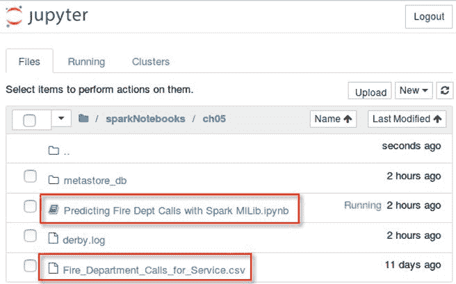

4.  一旦数据集保存到与笔记本相同的目录中，执行以下`pyspark`脚本将数据集导入 Spark 并创建名为`df`的数据框:

```py
from pyspark.sql import SparkSessionspark = SparkSession.builder \.master("local") \.appName("Predicting Fire Dept Calls") \.config("spark.executor.memory", "6gb") \.getOrCreate()df = spark.read.format('com.databricks.spark.csv')\.options(header='true', inferschema='true')\.load('Fire_Department_Calls_for_Service.csv')df.show(2)
```

# 它是如何工作的...

数据集保存在存放 Jupyter 笔记本的同一目录中，以便于导入到 Spark 会话中。

1.  通过从`pyspark.sql`导入`SparkSession`来初始化本地`pyspark`会话。
2.  通过在 CSV 文件中读取选项`header = 'true'`和`inferschema = 'true'`，创建数据框`df`。
3.  最后，运行一个脚本来显示通过 dataframe 导入到 Spark 中的数据以确认数据已经通过总是很理想的。脚本的结果显示了来自旧金山消防部门呼叫的前两行数据集，可以在下面的截图中看到:

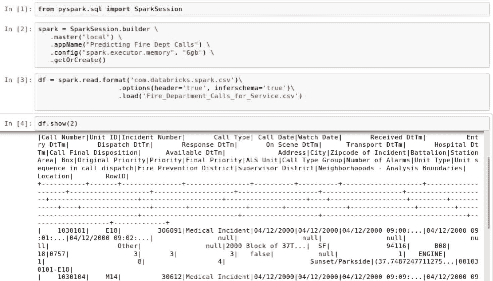

Please note that as we read the file into spark, we are using `.load()` to pull the `.csv` file into the Jupyter notebook. This is fine for our purposes as we are using a local cluster, but would not work if we were leveraging a cluster from Hadoop.

# 还有更多...

数据集附带一个数据字典，定义了 34 列中每一列的标题。可通过以下链接从同一网站访问该数据字典:

[https://data . sfgov . org/API/view/nuek-vu H3/files/ddb7f 3a 9-0160-4f 07-bb1e-2af 744909294？下载=真&文件名= FIR-0002 _ DataDictionary _ fire-calls-for-service . xlsx](https://data.sfgov.org/api/views/nuek-vuh3/files/ddb7f3a9-0160-4f07-bb1e-2af744909294?download=true&filename=FIR-0002_DataDictionary_fire-calls-for-service.xlsx)

# 请参见

旧金山政府网站允许数据的在线可视化，这可以用来做一些快速的数据分析。通过选择可视化下拉菜单，可以在网站上访问可视化应用，如下图所示:

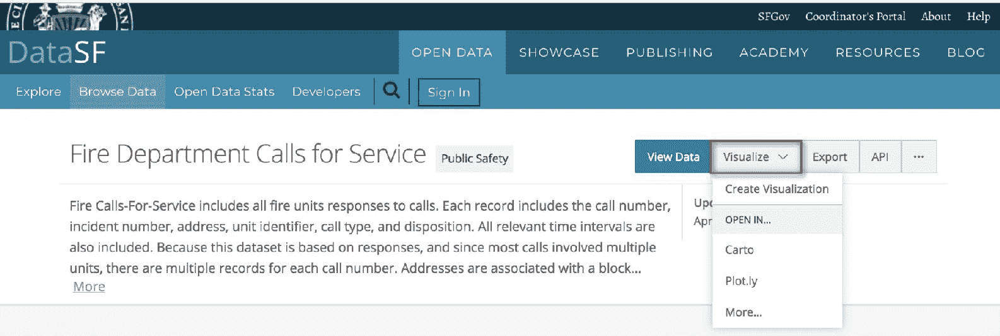

# 确定逻辑回归模型的目标变量

逻辑回归模型作为一种分类算法，旨在预测二元结果。在本节中，我们将指定数据集中的最佳列，以预测给操作员的来电是与火灾还是非火灾事件相关。

# 准备好

我们将可视化本节中的许多数据点，这将需要以下内容:

1.  通过在命令行执行`pip install matplotlib`确保`matplotlib`已安装。
2.  运行`import matplotlib.pyplot as plt`以及通过运行`%matplotlib inline`确保在单元格内查看图形。

此外，`pyspark.sql`内会有一些需要`importing functions as F`的功能操作。

# 怎么做...

这一部分将展示来自旧金山消防局的可视化数据。

1.  执行以下脚本，粗略识别`Call Type Group`列中的唯一值:

```py
df.select('Call Type Group').distinct().show()
```

2.  有五个主要类别:
    1.  `Alarm`。
    2.  `Potentially Life-threatening`。
    3.  `Non Life-threatening`。
    4.  `Fire`。
    5.  `null`。
3.  不幸的是，其中一个类别是`null`值。获取每个唯一值的行数以确定数据集中有多少空值将会很有用。执行以下脚本为列`Call Type Group`生成每个唯一值的行数:

```py
df.groupBy('Call Type Group').count().show()
```

4.  不幸的是，有超过 280 万行数据没有关联`Call Type Group`。这是 4.6 M 可用行的 60%以上。执行以下脚本查看条形图中空值的不平衡:

```py
df2 = df.groupBy('Call Type Group').count()graphDF = df2.toPandas()graphDF = graphDF.sort_values('count', ascending=False)import matplotlib.pyplot as plt%matplotlib inlinegraphDF.plot(x='Call Type Group', y = 'count', kind='bar')plt.title('Call Type Group by Count')plt.show()
```

5.  可能需要选择另一个指标来确定目标变量。相反，我们可以分析`Call Type`来识别与火灾相关的呼叫与所有其他呼叫。执行以下脚本来分析`Call Type`:

```py
df.groupBy('Call Type').count().orderBy('count', ascending=False).show(100)
```

6.  似乎没有任何`null`值，就像`Call Type Group`一样。`Call Type`有 32 个独特的类别；因此，它将被用作火灾事件的目标变量。执行以下脚本标记包含`Call Type`中`Fire`的列:

```py
from pyspark.sql import functions as FfireIndicator = df.select(df["Call Type"],F.when(df["Call Type"].like("%Fire%"),1)\.otherwise(0).alias('Fire Indicator'))fireIndicator.show()
```

7.  执行以下脚本检索`Fire Indicator`的不同计数:

```py
fireIndicator.groupBy('Fire Indicator').count().show()
```

8.  执行以下脚本将`Fire Indicator`列添加到原始数据框`df`:

```py
df = df.withColumn("fireIndicator",\ F.when(df["Call Type"].like("%Fire%"),1).otherwise(0))
```

9.  最后，将`fireIndicator`列添加到数据框`df`中，并通过执行以下脚本进行确认:

```py
df.printSchema()
```

# 它是如何工作的...

建立一个成功的逻辑回归模型的关键步骤之一是建立一个二元目标变量，用作预测结果。本节将介绍选择目标变量背后的逻辑:

1.  潜在目标列的数据分析通过识别`Call Type Group`的唯一列值来执行。我们可以查看`Call Type Group`列的唯一值，如下图所示:


2.  目标是确定`Call Type Group`列中是否有任何缺失值，以及如何处理这些缺失值。有时，可以直接删除列中缺少的值，有时也可以操作它们来填充值。

3.  下面的屏幕截图显示了有多少空值:

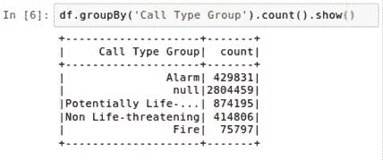

4.  此外，我们还可以绘制出存在多少`null`值，以更好地直观了解值的丰富程度，如下图所示:

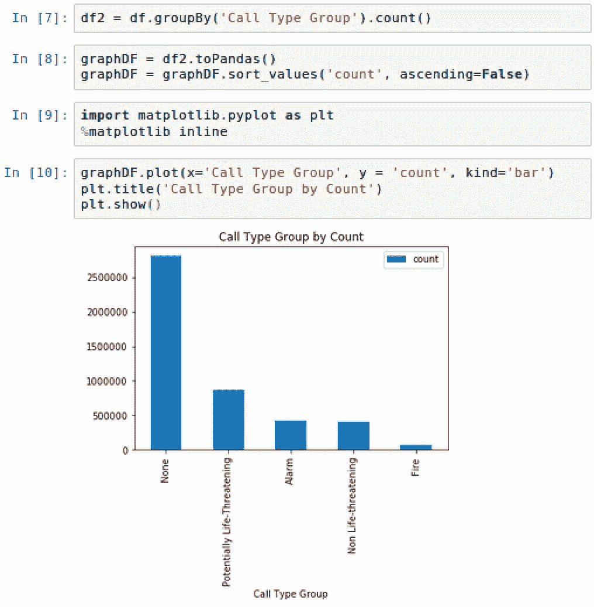

5.  由于`Call Type Group`中有超过 2.8 M 的行丢失，如`df.groupBy`脚本和条形图所示，删除所有这些值是没有意义的，因为这超过了数据集总行数的 60%。因此，需要选择另一列作为目标指标。
6.  分析`Call Type`列时，我们发现在 32 个唯一的可能值中没有任何空行。这使得`Call Type`成为逻辑回归模型目标变量的更好候选。以下是`Call Type`专栏的截图:


7.  由于逻辑回归在有二进制结果时效果最佳，因此使用`df`数据框中的`withColumn()`操作符创建一个新列，以获取一个指示符(0 或 1)，表明呼叫是与火灾相关的事件还是与非火灾相关的事件。新栏目叫做`fireIndicator`，可以在下面的截图中看到:

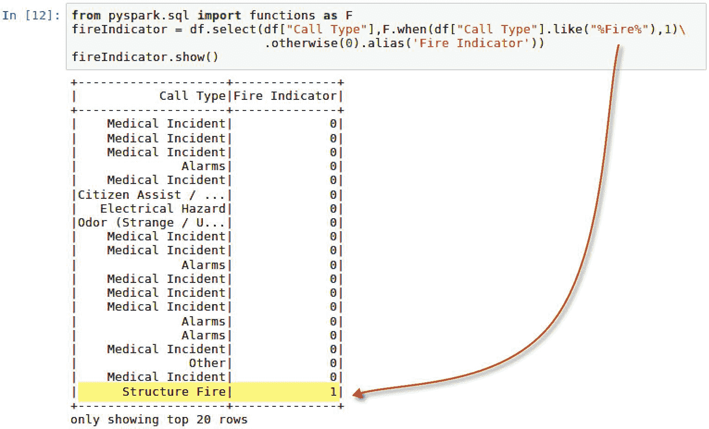

8.  我们可以通过做一个`groupBy().count()`来识别火灾呼叫与其他呼叫相比有多普遍，如下图所示:


9.  最佳做法是通过执行新修改的数据帧的`printSchema()`脚本来确认新列已附加到现有数据帧。新模式的输出可以在下面的截图中看到:


# 还有更多...

在本节中，有几个使用`pyspark.sql`模块完成的列操作。`withColumn()`运算符通过添加新列或修改同名的现有列来返回新数据帧或修改现有数据帧。这不要与`withColumnRenamed()`运算符混淆，后者也返回一个新的数据框，但是通过将一个现有列的名称修改为一个新列。最后，我们需要执行一些逻辑操作，将与`Fire`相关联的值转换为 0，而不将`Fire`转换为 1。这需要使用`pyspark.sql.functions`模块并结合`where`功能，作为 SQL 中使用的案例语句的等价物。该函数使用以下语法创建了一个 case 语句公式:

```py
CASE WHEN Call Type LIKE %Fire% THEN 1 ELSE 0 END
```

两列`Call Type`和`fireIndicator`的新数据集的结果如下所示:

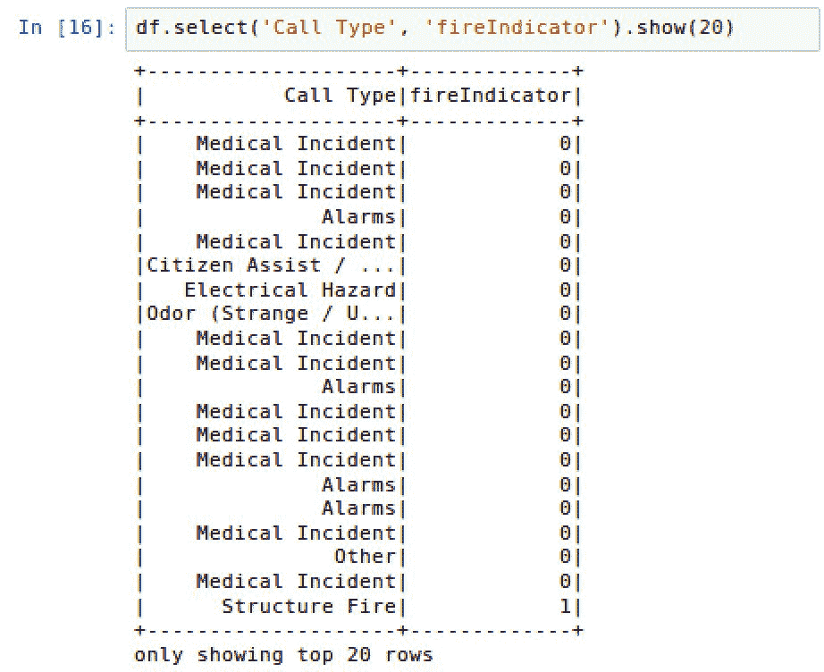

# 请参见

要了解更多有关 Spark 中可用的`pyspark.sql`模块的信息，请访问以下网站:

[http://spark . Apache . org/docs/2 . 2 . 0/API/python/pyspark . SQL . html](http://spark.apache.org/docs/2.2.0/api/python/pyspark.sql.html)

# 为逻辑回归模型准备特征变量

在前一部分中，我们确定了目标变量，该变量将在我们的逻辑回归模型中用作火警电话的预测因子。本节将着重于确定所有最有助于模型确定目标的特性。这就是所谓的**特征选择**。

# 准备好

本节将要求从`pyspark.ml.feature`导入`StringIndexer`。为了确保正确的特征选择，我们需要将字符串列映射到索引列。这将有助于为分类变量生成不同的数值，从而为机器学习模型吸收用于预测目标结果的独立变量提供计算便利。

# 怎么做...

本节将介绍为我们的模型准备特征变量的步骤。

1.  通过仅选择独立于任何火灾指示器的字段，执行以下脚本来更新数据框`df`:

```py
df = df.select('fireIndicator', 'Zipcode of Incident','Battalion','Station Area','Box', 'Number of Alarms','Unit sequence in call dispatch','Neighborhooods - Analysis Boundaries','Fire Prevention District','Supervisor District')df.show(5)
```

2.  下一步是识别数据帧中的任何空值，如果它们存在，就将其删除。执行以下脚本来识别具有任何空值的行计数:

```py
print('Total Rows')df.count()print('Rows without Null values')df.dropna().count()print('Row with Null Values')df.count()-df.dropna().count()
```

3.  有 16，551 行缺少值。执行以下脚本更新数据框，以删除所有具有空值的行:

```py
df = df.dropna()
```

4.  执行以下脚本检索`fireIndicator`的更新目标计数:

```py
df.groupBy('fireIndicator').count().orderBy('count', ascending = False).show()
```

5.  从`pyspark.ml.feature`导入`StringIndexer`类，为特征的每个分类变量分配数值，如以下脚本所示:

```py
from pyspark.ml.feature import StringIndexer
```

6.  使用以下脚本为将在模型中使用的所有特征变量创建 Python 列表:

```py
column_names = df.columns[1:]
```

7.  执行以下脚本来指定输出列格式`outputcol`，这将是来自输入列`inputcol`的特征列表中的`stringIndexed`:

```py
categoricalColumns = column_namesindexers = []for categoricalCol in categoricalColumns:stringIndexer = StringIndexer(inputCol=categoricalCol, outputCol=categoricalCol+"_Index")indexers += [stringIndexer]
```

8.  执行以下脚本创建一个`model`，用于`fit`输入列，并将新定义的输出列生成到现有的数据框`df`:

```py
models = []for model in indexers:indexer_model = model.fit(df)models+=[indexer_model]for i in models:df = i.transform(df)
```

9.  执行以下脚本，定义将用于模型的数据框`df`中特征的最终选择:

```py
df = df.select('fireIndicator','Zipcode of Incident_Index','Battalion_Index','Station Area_Index','Box_Index','Number of Alarms_Index','Unit sequence in call dispatch_Index','Neighborhooods - Analysis Boundaries_Index','Fire Prevention District_Index','Supervisor District_Index')
```

# 它是如何工作的...

本节将解释为我们的模型准备特征变量的步骤背后的逻辑。

1.  只有数据框中真正独立于火灾迹象的指标才会被选择用于预测结果的逻辑回归模型。这样做的原因是为了消除数据集中可能已经揭示预测结果的任何潜在偏差。这最大限度地减少了人类与最终结果的互动。更新后的数据帧的输出可以在下面的截图中看到:

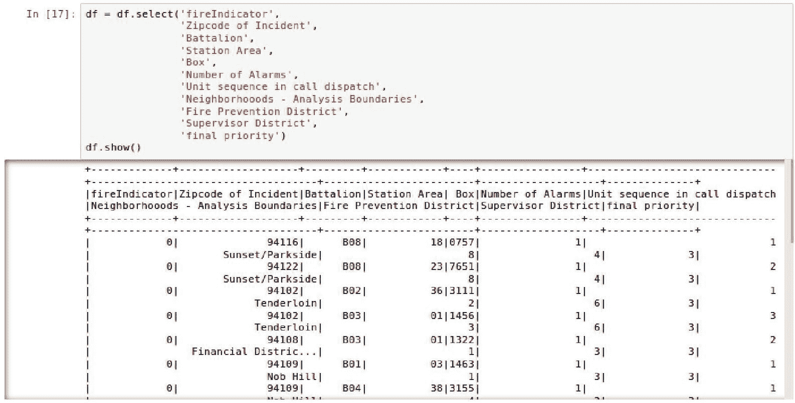

Please note that the column `Neighborhooods - Analysis of Boundaries` is originally misspelled from the data we extract. We will continue to use the misspelling for the rest of the chapter for continuity purposes. However, the column name can be renamed using the `withColumnRenamed()` function in Spark.

2.  列的最终选择如下:
    *   `fireIndicator`
    *   `Zipcode of Incident`
    *   `Battalion`
    *   `Station Area`
    *   `Box`
    *   `Number of Alarms`
    *   `Unit sequence in call dispatch`
    *   `Neighborhooods - Analysis Boundaries`
    *   `Fire Prevention District`
    *   `Supervisor District`
3.  选择这些列是为了避免我们建模中的数据泄漏。数据泄漏在建模中很常见，并可能导致无效的预测模型，因为它可能包含我们试图预测的结果直接导致的特征。理想情况下，我们希望包含真正独立于结果的特性。有几个列看起来是有漏洞的，因此从我们的数据框和模型中删除了。
4.  识别并删除所有缺失或空值的行，以便在不夸大或低估关键特性的情况下从模型中获得最佳性能。可以计算缺少值的行的清单，显示为 16，551，如以下脚本所示:


5.  我们可以查看与火灾相关的呼叫频率与非火灾相关的呼叫频率，如下图所示:


6.  `StringIndexer`被导入以帮助将几个分类或字符串特征转换为数值，以便于在逻辑回归模型中计算。要素的输入需要采用向量或数组格式，这是数值的理想选择。将在模型中使用的所有功能的列表可以在下面的截图中看到:

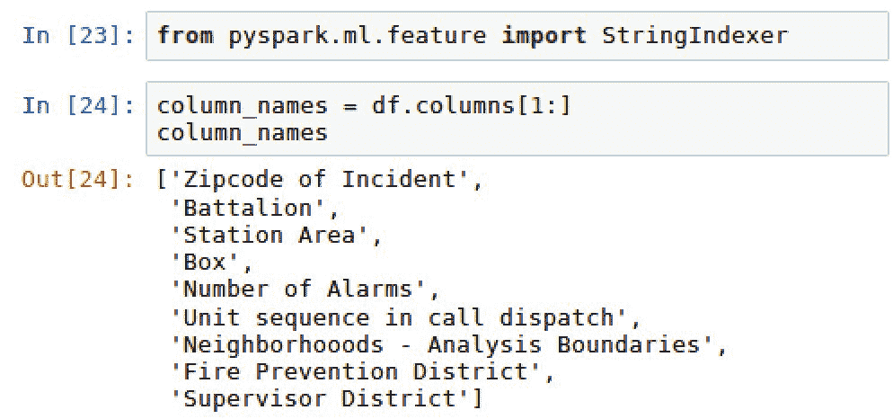

7.  为每个分类变量构建索引器，指定将在模型中使用的输入(`inputCol`)和输出(`outputCol`)列。数据框中的每一列都经过调整或转换，以使用更新的索引重建新的输出，范围从 0 到该特定列的唯一计数的最大值。新的一栏在最后加上了`_Index`。创建更新后的列时，原始列在 dataframe 中仍然可用，如下图所示:

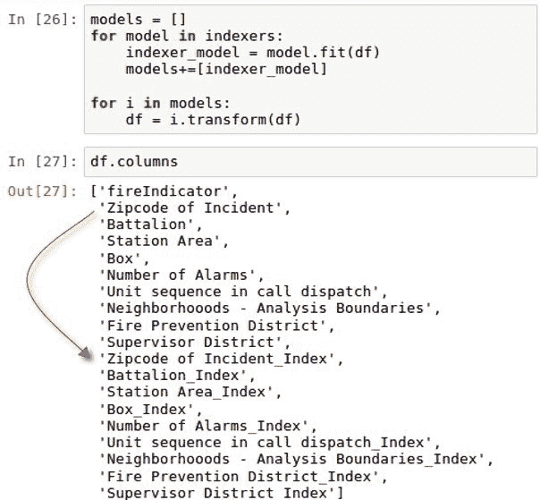

8.  我们可以查看一个新创建的列，并将其与原始列进行比较，以了解字符串是如何转换为数字类别的。以下截图显示了`Neighborhooods - Analysis Boundaries`与`Neighborhooods - Analysis Boundaries_Index`的对比情况:


9.  然后，数据框被修剪为仅包含数值，并移除转换后的原始分类变量。从建模的角度来看，非数值不再起作用，而是从数据框中删除。
10.  新列将被打印出来，以确认 dataframe 的每个值类型是双精度还是整数，如下图所示:


# 还有更多...

最后看一下新修改的数据帧，将只显示数值，如下图所示:


# 请参见

要了解更多关于`StringIndexer`的信息，请访问以下网站:[https://spark . Apache . org/docs/2 . 2 . 0/ml-features . html # stringindexer](https://spark.apache.org/docs/2.2.0/ml-features.html#stringindexer)。

# 应用逻辑回归模型

该阶段现在设置为将模型应用于数据框。

# 准备好了

本节将重点介绍一种非常常见的分类模型**逻辑回归**，它将涉及从 Spark 导入以下内容:

```py
from pyspark.ml.feature import VectorAssemblerfrom pyspark.ml.evaluation import BinaryClassificationEvaluatorfrom pyspark.ml.classification import LogisticRegression
```

# 怎么做...

本节将介绍应用我们的模型和评估结果的步骤。

1.  执行以下脚本，将数据框中的所有特征变量集中到一个名为`features`的列表中:

```py
features = df.columns[1:]
```

2.  执行以下操作导入`VectorAssembler`并通过分配`inputCols`和`outputCol`配置将分配给特征向量的字段:

```py
from pyspark.ml.feature import VectorAssemblerfeature_vectors = VectorAssembler(inputCols = features,outputCol = "features")
```

3.  执行以下脚本，使用`transform`功能将`VectorAssembler`应用于数据帧:

```py
df = feature_vectors.transform(df)
```

4.  修改数据框，删除除`fireIndicator`和`features`之外的所有列，如以下脚本所示:

```py
df = df.drop( 'Zipcode of Incident_Index','Battalion_Index','Station Area_Index','Box_Index','Number of Alarms_Index','Unit sequence in call dispatch_Index','Neighborhooods - Analysis Boundaries_Index','Fire Prevention District_Index','Supervisor District_Index')
```

5.  修改数据框，将`fireIndicator`重命名为`label`，如以下脚本所示:

```py
df = df.withColumnRenamed('fireIndicator', 'label')
```

6.  按照 75:25 的比例将整个数据帧`df`分割成训练集和测试集，随机种子集为`12345`，如以下脚本所示:

```py
(trainDF, testDF) = df.randomSplit([0.75, 0.25], seed = 12345)
```

7.  从`pyspark.ml.classification`导入`LogisticRegression`库，并配置为从数据框中合并`label`和`features`，然后适合训练数据集`trainDF`，如以下脚本所示:

```py
from pyspark.ml.classification import LogisticRegressionlogreg = LogisticRegression(labelCol="label", featuresCol="features", maxIter=10)LogisticRegressionModel = logreg.fit(trainDF)
```

8.  转换测试数据框`testDF`，以应用逻辑回归模型。带有预测分数的新数据框称为`df_predicted`，如以下脚本所示:

```py
df_predicted = LogisticRegressionModel.transform(testDF)
```

# 它是如何工作的...

本节解释了应用我们的模型和评估结果的步骤背后的逻辑。

1.  当所有的特征被组合在一个向量中用于训练目的时，分类模型工作得最好。因此，我们开始向量化过程，将所有要素收集到一个名为`features`的列表中。由于我们的标签是数据框的第一列，因此我们将其排除，并将其之后的每一列作为特征列或特征变量拉入。
2.  矢量化过程继续进行，将所有来自`features`列表的变量转换成一个单独的矢量输出到一个名为`features`的列中。这个过程需要从`pyspark.ml.feature`进口`VectorAssembler`。
3.  应用`VectorAssembler`通过创建一个新添加的名为`features`的列来转换数据框，如下图所示:


4.  此时，我们在模型中唯一需要使用的列是标签列`fireIndicator`和`features`列。所有其他列都可以从数据框中删除，因为建模不再需要它们。
5.  另外，为了帮助建立逻辑回归模型，我们将把名为`fireIndicator`的列改为`label`。`df.show()`脚本的输出可以在下面的截图中看到，带有新重命名的列:

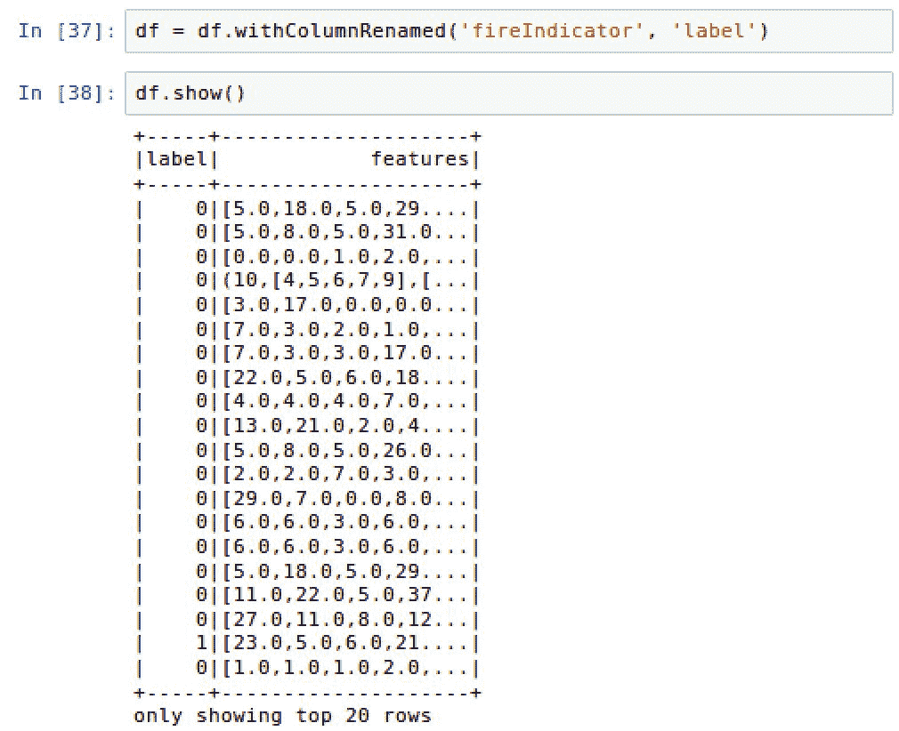

6.  为了最小化模型的过度拟合，数据帧将被分割成测试和训练数据集，以在训练数据集`trainDF`上拟合模型，并在测试数据集`testDF`上测试它。`12345`的随机种子被设置为每次执行单元时保持随机性一致。我们可以确定数据拆分的行数，如下图所示:


7.  然后从`pyspark.ml.classification`导入逻辑回归模型`LogisticRegression`，并配置为从与特征和标签相关联的数据框中输入适当的列名。此外，逻辑回归模型被分配给一个名为`logreg`的变量，该变量适合于训练我们的数据集`trainDF`。
8.  一旦逻辑回归模型被评分，新的数据框架`predicted_df`基于测试数据框架`testDF`的变换被创建。该模型基于评分为`predicted_df`创建了三个额外的列。另外三列是`rawPrediction`、`probability`和`prediction`，如下图所示:


9.  最后，可以对`df_predicted`中的新列进行概要分析，如下图所示:


# 还有更多...

需要记住的一件重要事情是，我们的概率阈值在数据帧中被设置为 50%，因为它最初可能会被认为是反直觉的。概率为 0.500 及以上的任何呼叫的预测值为 0.0，概率小于 0.500 的任何呼叫的预测值为 1.0。这是在管道开发过程中设置的，只要我们知道阈值是什么以及预测是如何分配的，我们就处于良好的状态。

# 请参见

要了解更多关于`VectorAssembler`的信息，请访问以下网站:

[https://spark . Apache . org/docs/latest/ml-features . html # vectorassembler](https://spark.apache.org/docs/latest/ml-features.html#vectorassembler)

# 评价逻辑回归模型的准确性

我们现在准备评估预测呼叫是否被正确归类为火灾事件的性能。

# 准备好

我们将执行模型分析，需要导入以下内容:

*   `from sklearn import metrics`

# 怎么做...

本节介绍评估模型性能的步骤。

1.  使用`.crosstab()`函数创建混淆矩阵，如以下脚本所示:

```py
df_predicted.crosstab('label', 'prediction').show()
```

2.  使用以下脚本从`sklearn`导入`metrics`以帮助测量精度:

```py
from sklearn import metrics
```

3.  使用以下脚本为数据框中的`actual`和`predicted`列创建两个变量，用于测量精度:

```py
actual = df_predicted.select('label').toPandas()predicted = df_predicted.select('prediction').toPandas()
```

4.  使用以下脚本计算准确性预测得分:

```py
metrics.accuracy_score(actual, predicted)
```

# 它是如何工作的...

本节说明如何评估模型性能。

1.  为了计算我们模型的准确性，能够确定我们的预测有多准确是很重要的。通常，最好使用混淆矩阵交叉表来显示正确和不正确的预测分数。我们使用`df_predicted`数据框外的`crosstab()`函数创建一个混淆矩阵，向我们显示标签为 0 时，我们有 964，980 个真负预测，标签为 1 时，我们有 48，034 个真正预测，如下图所示:


2.  从本节前面我们知道`testDF`数据框总共有 1，145，589 行；因此，我们可以使用以下公式计算模型的精度: *(TP + TN) / Total* 。准确率将达到 88.4%。
3.  需要注意的是，并非所有的假分数都是一样的。例如，从消防安全的角度来看，将呼叫归类为与火灾无关并最终使其与火灾相关比反之更有害。这被称为假阴性。有一个度量标准解释了一个**假阴性** ( **FN** )，被称为**召回**。
4.  虽然我们可以手动计算精度，如上一步所示，但自动计算精度是理想的。这可以通过导入`sklearn.metrics`轻松完成，这是一个常用于评分和模型评估的模块。
5.  `sklearn.metrics`取两个参数，标签的实际结果和逻辑回归模型的预测值。因此，创建了两个变量`actual`和`predicted`，并使用`accuracy_score()`函数计算准确度分数，如下图所示:


6.  准确率和我们手工计算的一样，88.4%。

# 还有更多...

我们现在知道，我们的模型能够以 88.4%的准确率准确预测来电是否与火灾有关。起初，这听起来像是一个强有力的预测；然而，将此与基线得分进行比较总是很重要的，在基线得分中，每个呼叫都被预测为非开火呼叫。预测的数据帧`df_predicted`具有以下标签`1`和`0`的细分，如以下截图所示:


我们可以在同一个数据帧上运行一些统计数据，以使用`df_predicted.describe('label').show()`脚本获得标记值`1`出现的平均值。该脚本的输出可以在下面的截图中看到:


基础模型的预测值为`1`，预测率为 14.94%，换句话说，基础模型的预测率为 *100 - 14.94* ，对于值 0，预测率为 85.06%。因此，由于 85.06%小于 88.4%的模型预测率，因此该模型比关于呼叫是否与火灾相关的盲目猜测提供了改进。

# 请参见

要了解有关精度与精确度的更多信息，请访问以下网站:

[https://www.mathsisfun.com/accuracy-precision.html](https://www.mathsisfun.com/accuracy-precision.html)