# 基于 XGBoost 的房地产价值预测

就定价而言，房地产市场是竞争最激烈的市场之一。这往往会因多种因素而有很大差异，如位置、房产年限、面积等。因此，为了做出更好的投资决策，准确预测房地产(尤其是住房市场中的房地产)的价格已经成为现代的挑战。这一章将准确地论述这一点。

完成本章后，您将能够:

*   下载金县房屋销售数据集
*   执行探索性分析和可视化
*   绘制价格和其他特征之间的相关性
*   预测房价

# 下载国王郡房屋销售数据集

没有数据集，我们无法建立模型。我们将在这一部分下载我们的数据。

# 准备好

kaggle([https://www.kaggle.com/](https://www.kaggle.com/))是一个预测建模和分析竞赛的平台，在这个平台上，统计学家和数据挖掘者竞争产生预测和描述公司和用户上传的数据集的最佳模型。金县房屋销售数据集包含 1900 年至 2015 年间纽约金县售出的 21，613 套房屋的记录。数据集还包含 21 个不同的变量，如每个房子的位置、邮政编码、卧室数量、居住空间面积等。

# 怎么做...

1.  数据集可从以下网站访问:[https://www.kaggle.com/harlfoxem/housesalesprediction](https://www.kaggle.com/harlfoxem/housesalesprediction)。数据集来自金县的公共记录，可免费下载并用于任何分析。
2.  到达网站后，您可以点击下载按钮，如下图所示:


King County House Sales Dataset

3.  一个名为`kc_house_data.csv`的文件出现在压缩的下载文件`housesalesprediction.zip`中。
4.  将名为`kc_house_data.csv`的文件保存在当前工作目录中，因为这将是我们的数据集。这将被载入 IPython 笔记本进行分析和预测。

# 它是如何工作的...

1.  使用以下代码安装本章所需的库:

```py
import numpy as npimport pandas as pdimport matplotlib.pyplot as pltimport seaborn as snsimport mpl_toolkitsfrom sklearn import preprocessingfrom sklearn.preprocessing import LabelEncoder, OneHotEncoderfrom sklearn.feature_selection import RFEfrom sklearn import linear_modelfrom sklearn.cross_validation import train_test_split %matplotlib inline
```

2.  前面的步骤应该会产生一个输出，如下图所示:


3.  最好检查当前的工作目录，并将其设置为存储数据集的目录。这显示在下面的截图中:

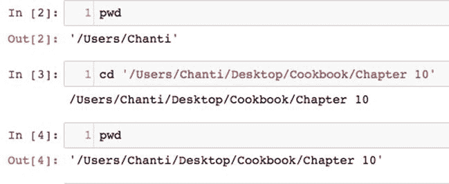

在我们的例子中，名为`Chapter 10`的文件夹被设置为当前工作目录。

4.  使用`read_csv()`功能将文件中的数据读入名为`dataframe`的熊猫数据帧，并使用`list(dataframe)`命令列出特性/标题，如下图所示:


您可能已经注意到，数据集包含 21 个不同的变量，如 id、日期、价格、卧室、浴室等。

# 还有更多...

本章中使用的库及其功能如下:

*   `Numpy`，用于以数组的形式争论数据，以及以数组的形式存储名字列表
*   `Pandas`，用于所有数据角力，以数据帧的形式管理数据
*   `Seaborn`，这是探索性分析和绘图所需的可视化库
*   `MPL_Toolkits`，包含`Matplotlib`所需的多个函数和依赖项
*   `Scikit Learn`库的功能，这是本章要求的主要科学和统计库
*   我们还需要一些其他的库，比如`XGBoost`，但是那些将在构建模型时根据需要导入

# 请参见

有关不同库的更多文档可通过访问以下链接找到:

*   [http://scikit-learn.org/stable/modules/preprocessing.html](http://scikit-learn.org/stable/modules/preprocessing.html)
*   [http://sci kit-learn . org/stable/modules/generated/sklearn . feature _ selection。RFE.html](http://scikit-learn.org/stable/modules/generated/sklearn.feature_selection.RFE.html)
*   [https://seaborn.pydata.org/](https://seaborn.pydata.org/)
*   [https://matplotlib . org/mpl _ toolkits/index . html](https://matplotlib.org/mpl_toolkits/index.html)

# 执行探索性分析和可视化

在目标是预测一个变量(如`price`)的情况下，它有助于可视化数据，并弄清楚因变量是如何受到其他变量影响的。探索性分析给出了很多通过查看数据不容易获得的见解。本章的这一部分将描述如何可视化大数据并从中获取见解。

# 准备好

*   可以使用产生输出的`dataframe.head()`功能打印`dataframe`的头部，如下图所示:


*   同样，可以使用`dataframe.tail()`功能打印`dataframe`的尾部，产生一个输出，如下图截图所示:


*   `dataframe.describe()`函数用于获取各列下的最大值、最小值、平均值等一些基本统计量。下面的截图说明了这一点:


dataframe.describe() function output

*   如您所见，数据集有 21，613 条 1900 年至 2015 年间售出房屋的记录。
*   仔细看一下统计数据，我们发现大多数售出的房子平均有三间卧室。我们还可以看到，一栋房子的最小卧室数为 0，最大的房子有 33 间卧室，居住面积为 13540 平方英尺。

# 怎么做...

1.  让我们绘制整个数据集中卧室的数量，以了解三居室房屋与两居室或一居室房屋的对比情况。这是使用以下代码完成的:

```py
dataframe['bedrooms'].value_counts().plot(kind='bar') plt.title('No. of bedrooms')plt.xlabel('Bedrooms')plt.ylabel('Count')sns.despine
```

2.  我们还可以使用以下命令绘制相同数据的饼图:

```py
 dataframe['bedrooms'].value_counts().plot(kind='pie')plt.title('No. of bedrooms')
```

3.  接下来，让我们试着看看在金县销售最频繁的房子的楼层数。这可以通过使用以下命令绘制条形图来完成:

```py
dataframe['floors'].value_counts().plot(kind='bar') plt.title('Number of floors')plt.xlabel('No. of floors')plt.ylabel('Count')sns.despine
```

4.  接下来，我们需要了解哪些位置的房屋销售量最高。我们可以通过使用数据集中的`latitude`和`longitude`变量来做到这一点，如下面的代码所示:

```py
plt.figure(figsize=(20,20))sns.jointplot(x=dataframe.lat.values, y=dataframe.long.values, size=9)plt.xlabel('Longitude', fontsize=10)plt.ylabel('Latitude', fontsize=10)plt.show()sns.despine()
```

5.  让我们通过执行以下命令来看看不同卧室数量的房子的价格比较:

```py
 plt.figure(figsize=(20,20))sns.jointplot(x=dataframe.lat.values, y=dataframe.long.values, size=9)plt.xlabel('Longitude', fontsize=10)plt.ylabel('Latitude', fontsize=10)plt.show()sns.despine()
```

6.  使用以下命令可以获得房屋价格与卧室数量的关系图:

```py
plt.figure(figsize=(20,20))sns.jointplot(x=dataframe.lat.values, y=dataframe.long.values, size=9)plt.xlabel('Longitude', fontsize=10)plt.ylabel('Latitude', fontsize=10)plt.show()sns.despine()
```

7.  同样，让我们看看价格与所有售出房屋的居住面积相比如何。这可以通过使用以下命令来完成:

```py
plt.figure(figsize=(8,8))plt.scatter(dataframe.price, dataframe.sqft_living)plt.xlabel('Price')plt.ylabel('Square feet')plt.show()
```

8.  出售房屋的情况也给了我们一些重要的信息。让我们把这个和价格对比一下，以便更好地了解总体趋势。这是使用以下命令完成的:

```py
plt.figure(figsize=(5,5))plt.bar(dataframe.condition, dataframe.price)plt.xlabel('Condition')plt.ylabel('Price')plt.show()
```

9.  通过使用以下命令，我们可以看到哪些邮政编码在金县的房屋销售最多:

```py
plt.figure(figsize=(8,8))plt.scatter(dataframe.zipcode, dataframe.price)plt.xlabel('Zipcode')plt.ylabel('Price')plt.show()
```

10.  最后，使用以下命令绘制每栋房屋的等级与价格的关系图，根据每栋房屋的等级计算房屋销售趋势:

```py
plt.figure(figsize=(10,10))plt.scatter(dataframe.grade, dataframe.price)plt.xlabel('Grade')plt.ylabel('Price')plt.show()
```

# 它是如何工作的...

1.  卧室计数图必须给出一个输出，如下图所示:

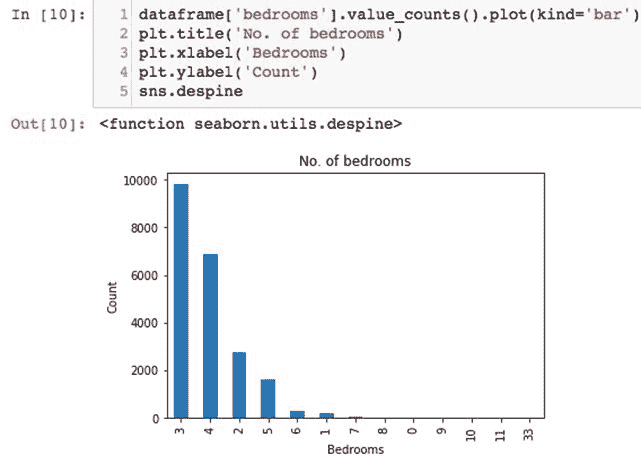

2.  很明显，三居室的房子卖得最多，其次是四居室的房子，然后是两居室的房子，然后是令人惊讶的五居室和六居室的房子。

3.  卧室数量的饼图给出了如下截图所示的输出:


4.  你会注意到，三居室的房子约占金县所有出售房屋的 50%。看起来大约 25%是四卧室的房子，剩下的 25%是由两个、五个、六个卧室的房子组成的，以此类推。

5.  在运行按楼层数分类的大多数房屋的脚本时，我们注意到以下输出:

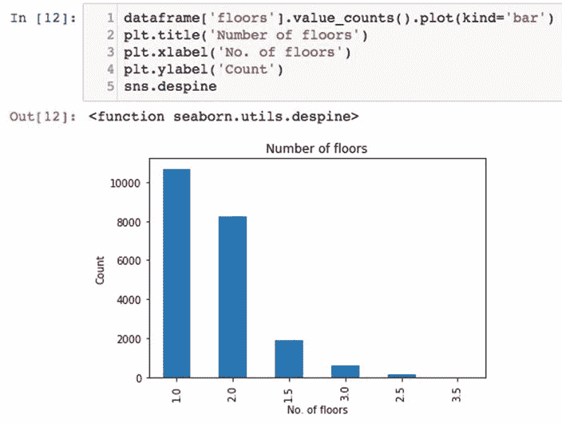

6.  很明显，单层房子卖得最多，其次是两层房子。两层以上的房子数量很少，这可能表明了家庭规模和生活在金县的居民的收入。
7.  在检查不同地点出售的房屋密度时，我们获得了一个输出，如下截图所示。很明显，与其他地区相比，一些地区的房屋销售密度更高:


8.  从上图观察到的趋势，很容易注意到在纬度-122.2 和-122.4 之间有更多的房子出售。同样，在经度 47.5 和 47.8 之间出售的房屋密度比其他经度更高。与其他社区相比，这可能是一个更安全、生活更好的社区的标志。

9.  在绘制房屋价格与房屋中卧室数量的关系图时，我们意识到房屋中卧室数量的趋势与六间卧室的价格成正比，然后成反比，如下图所示:


10.  将每栋房子的居住面积与价格进行对比，我们可以看到随着房子面积的增加，房价会有上涨的趋势。最贵的房子似乎有 12000 平方英尺的居住面积，如下图截图所示:


# 还有更多...

1.  在绘制房屋状况与价格的关系图时，我们再次注意到，随着条件评级的提高，价格会出现预期的上涨趋势，如下图所示。有趣的是，与四居室相比，五居室价格的平均价格更低，这可能是因为这样一栋大房子的买家较少:


2.  房子的邮政编码与价格的关系图显示了不同邮政编码的房子的价格趋势。您可能已经注意到，与其他地区相比，某些邮政编码(如 98100 到 98125 之间的邮政编码)的房屋销售密度更高，而邮政编码(如 98040)的房屋价格高于平均价格，这可能表明附近更富裕，如下图所示:


3.  房子的等级与价格的关系图显示，价格随着等级的增加而持续增加。这两者之间似乎存在明显的线性关系，如以下截图的输出所示:


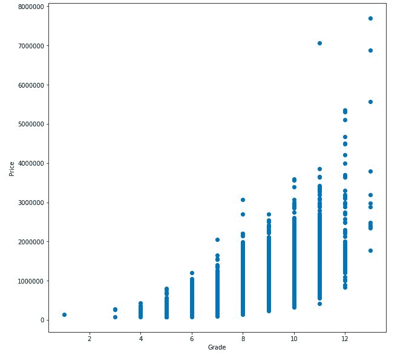

# 请参见

以下链接很好地解释了为什么在对数据运行任何模型之前数据可视化如此重要:

*   [https://www . slide share . net/central _ Digital/数据可视化的重要性](https://www.slideshare.net/Centerline_Digital/the-importance-of-data-visualization)
*   [https://data-visualization . CIO review . com/cxo insight/什么是数据可视化-以及为什么重要-nid-11806-cid-163.html](https://data-visualization.cioreview.com/cxoinsight/what-is-data-visualization-and-why-is-it-important-nid-11806-cid-163.html)
*   [https://www . tech change . org/2015/05/19/data-visualization-analysis-international-development/](https://www.techchange.org/2015/05/19/data-visualization-analysis-international-development/)

# 绘制价格和其他特征之间的相关性

现在，初步的探索性分析已经完成，我们对不同的变量如何影响每栋房子的价格有了更好的了解。然而，在预测价格时，我们不知道每个变量的重要性。因为我们有 21 个变量，所以很难通过将所有变量合并到一个模型中来构建模型。因此，如果某些变量的重要性低于其他变量，则可能需要将其丢弃或忽略。

# 准备好

统计中使用相关系数来衡量两个变量之间的关系有多强。特别是，皮尔逊相关系数是执行线性回归时最常用的系数。相关系数通常取-1 到+1 之间的值:

*   相关系数为 1 意味着一个变量的每一个正增长，另一个变量就会有一个固定比例的正增长。例如，鞋的尺寸与脚的长度(几乎)完全相关。
*   相关系数为-1 意味着一个变量每增加一个正值，另一个变量就会减少一个固定比例的负值。例如，油箱中的气体量与加速度或齿轮机构(与四档相比，在一档行驶更长时间会消耗更多的气体)呈(几乎)完美的相关关系。
*   零意味着每增加一次，就没有正的或负的增加。这两者只是没有关系。

# 怎么做...

1.  首先，使用以下命令从数据集中删除`id`和`date`要素。我们不会在我们的预测中使用它们，因为标识变量都是唯一的，在我们的分析中没有值，而日期需要不同的函数来正确处理它们。这是留给读者做的练习:

```py
 x_df = dataframe.drop(['id','date',], axis = 1)x_df
```

2.  使用以下命令将因变量(在本例中为房价)复制到新的`dataframe`中:

```py
 y = dataframe[['price']].copy()y_df = pd.DataFrame(y)y_df
```

3.  可以使用以下脚本手动找到价格和其他变量之间的相关性:

```py
 print('Price Vs Bedrooms: %s' % x_df['price'].corr(x_df['bedrooms']))print('Price Vs Bathrooms: %s' % x_df['price'].corr(x_df['bathrooms']))print('Price Vs Living Area: %s' % x_df['price'].corr(x_df['sqft_living']))print('Price Vs Plot Area: %s' % x_df['price'].corr(x_df['sqft_lot']))print('Price Vs No. of floors: %s' % x_df['price'].corr(x_df['floors']))print('Price Vs Waterfront property: %s' % x_df['price'].corr(x_df['waterfront']))print('Price Vs View: %s' % x_df['price'].corr(x_df['view']))print('Price Vs Grade: %s' % x_df['price'].corr(x_df['grade']))print('Price Vs Condition: %s' % x_df['price'].corr(x_df['condition']))print('Price Vs Sqft Above: %s' % x_df['price'].corr(x_df['sqft_above']))print('Price Vs Basement Area: %s' % x_df['price'].corr(x_df['sqft_basement']))print('Price Vs Year Built: %s' % x_df['price'].corr(x_df['yr_built']))print('Price Vs Year Renovated: %s' % x_df['price'].corr(x_df['yr_renovated']))print('Price Vs Zipcode: %s' % x_df['price'].corr(x_df['zipcode']))print('Price Vs Latitude: %s' % x_df['price'].corr(x_df['lat']))print('Price Vs Longitude: %s' % x_df['price'].corr(x_df['long']))
```

4.  除了上述方法之外，在`dataframe`中找到一个变量和所有其他变量(或列)之间的相关性的更简单的方法是通过以下方式仅使用一行来完成:`x_df.corr().iloc[:,-19]`
5.  可以使用`seaborn`库和以下脚本绘制相关变量:

```py
 sns.pairplot(data=x_df,x_vars=['price'],y_vars=['bedrooms', 'bathrooms', 'sqft_living','sqft_lot', 'floors', 'waterfront','view','grade','condition','sqft_above','sqft_basement','yr_built','yr_renovated','zipcode','lat','long'],size = 5)
```

# 它是如何工作的...

1.  删除`id`和`date`变量后，新的`dataframe`，命名为`x_df`，包含 19 个变量或列，如下截图所示。就本书而言，仅打印出前十个条目:


First 10 entries of output

2.  在创建一个只有因变量(价格)的新`dataframe`时，您将看到如下输出。这个新的`dataframe`被命名为`y_df`。同样，出于说明目的，仅打印价格列的前十个条目:

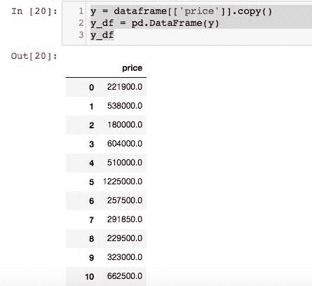

3.  价格和其他变量之间的相关性如下图所示:


4.  你可能已经注意到`sqft_living`变量与价格的相关性最高，相关系数为 0.702035。次高相关变量是`grade`，相关系数为 0.667434，其次是`sqft_above`，相关系数为 0.605567。`Zipcode`是与价格相关性最小的变量，相关系数为-0.053202。

# 还有更多...

*   使用简化代码找到的相关系数给出了完全相同的值，但也给出了价格与其自身的相关性，如预期的那样，其值为 1.0000。下面的截图说明了这一点:

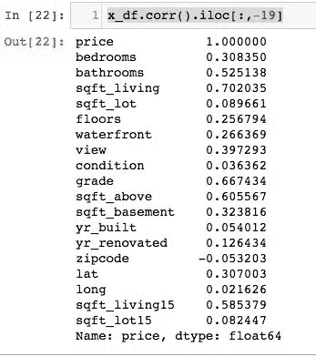

*   使用`seaborn`库绘制的相关系数显示在下面的截图中。请注意，每个图的价格都在 x 轴上:


Plotting of coefficients of correlation


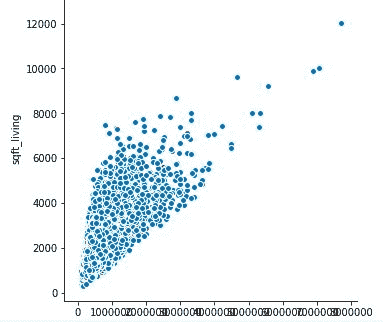 

 


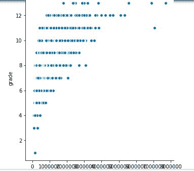


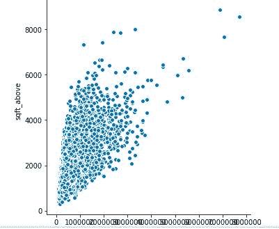

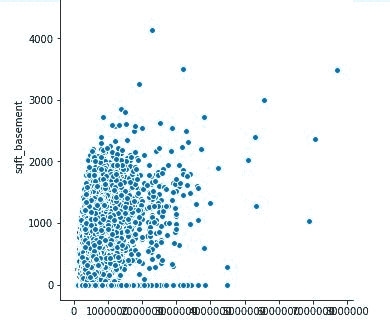 

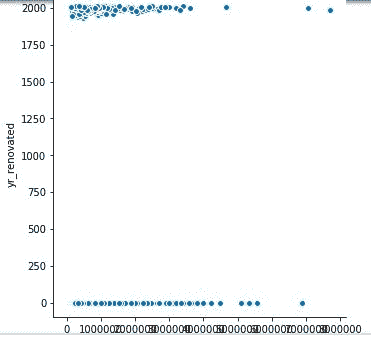 

 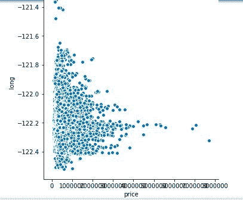

# 请参见

以下链接很好地解释了皮尔逊相关系数以及如何手动计算:
[https://en . Wikipedia . org/wiki/Pearson _ correlation _ coefficient](https://en.wikipedia.org/wiki/Pearson_correlation_coefficient)
[http://www . statistics showto . com/概率统计/相关系数-公式/](http://www.statisticshowto.com/probability-and-statistics/correlation-coefficient-formula/)

# 预测房价

本节将讨论使用当前`dataframe`中的所有特征构建一个简单的线性模型来预测房价。然后，我们将对模型进行评估，并尝试在本节的后半部分使用更复杂的模型来提高精度。

# 准备好

访问以下链接，了解线性回归的工作原理以及如何使用 Scikit Learn 库中的线性回归模型:
[https://en.wikipedia.org/wiki/Linear_regression](https://en.wikipedia.org/wiki/Linear_regression)

[http://www.stat.yale.edu/Courses/1997-98/101/linreg.htm](http://www.stat.yale.edu/Courses/1997-98/101/linreg.htm)

[https://newonlinecourses.science.psu.edu/stat501/node/251/](https://newonlinecourses.science.psu.edu/stat501/node/251/)

[http://sci kit-learn . org/stable/modules/generated/sklearn . linear _ model。LinearRegression.html](http://scikit-learn.org/stable/modules/generated/sklearn.linear_model.LinearRegression.html)

[http://scikit-learn.org/stable/modules/linear_model.html](http://scikit-learn.org/stable/modules/linear_model.html)

# 怎么做...

1.  从`x_df`数据框中删除`Price`列，并使用以下脚本将其保存到名为`x_df2`的新`dataframe`中:

```py
 x_df2 = x_df.drop(['price'], axis = 1)
```

2.  使用以下脚本声明一个名为`reg`的变量，并将其等同于 Scikit Learn 库中的`LinearRegression()`函数:

```py
 reg=linear_model.LinearRegression()
```

3.  使用以下脚本将数据集分割成测试和训练:

```py
 x_train,x_test,y_train,y_test = train_test_split(x_df2,y_df,test_size=0.4,random_state=4)
```

4.  使用以下脚本将模型应用于训练集:

```py
 reg.fit(x_train,y_train)
```

5.  使用`reg.coef_`命令打印通过对训练集和测试集应用线性回归生成的系数。
6.  使用以下脚本查看模型生成的预测列:

```py
 predictions=reg.predict(x_test)predictions
```

7.  使用以下命令打印模型的精度:

```py
 reg.score(x_test,y_test)
```

# 它是如何工作的...

1.  将回归模型拟合到训练集后的输出必须如下图所示:


2.  `reg.coeff_`命令生成 18 个系数，数据集中每个变量一个，如下图截图所示:


3.  与具有负值的特征/变量的系数相比，具有最大正值的特征/变量的系数对价格预测具有更高的重要性。这是回归系数的主要重要性。
4.  在打印预测时，您必须看到一个从 1 到 21，612 的值数组输出，数据集中每行一个值，如下图所示:


5.  最后，在打印模型的准确度时，我们获得了 70.37%的准确度，这对于线性模型来说是不错的。下面的截图说明了这一点:


# 还有更多...

线性模型在它的第一次尝试中做得很好，但是如果我们想要我们的模型更精确，我们将不得不使用具有一些非线性的更复杂的模型，以便很好地适合所有的数据点。XGBoost 是我们将在本节中使用的模型，以便尝试并提高通过线性回归获得的精度。这是通过以下方式完成的:

1.  使用`import xgboost`命令导入`XGBoost`库。
2.  如果这产生一个错误，你将不得不通过终端进行库的 pip 安装。这可以通过打开一个新的终端窗口并发出以下命令来完成:

```py
/usr/bin/ruby -e "$(curl -fsSL https://raw.githubusercontent.com/Homebrew/install/master/install)"
```

3.  在这个阶段，您必须看到一个类似于下面截图中所示的输出:


4.  在此阶段，系统会提示您输入密码。安装自制程序后，您将看到如下截图所示的输出:


5.  接下来，使用以下命令安装 Python:`brew install python`
6.  使用`brew doctor`命令检查您的安装，并遵循家酿的建议。
7.  一旦`Homebrew`安装完毕，使用以下命令对 XGBoost 进行 pip 安装:`pip install xgboost`
8.  一旦它完成安装，您应该能够将 XGBoost 导入到 IPython 环境中。

一旦 XGBoost 成功导入到 Jupyter 环境中，您将能够使用库中的函数来声明和存储模型。这可以通过以下步骤完成:

9.  使用以下命令声明名为`new_model`的变量来存储模型并声明其所有超参数:

```py
new_model = xgboost.XGBRegressor(n_estimators=750, learning_rate=0.09,         gamma=0, subsample=0.65, colsample_bytree=1, max_depth=7)
```

10.  前面命令的输出必须类似于下面截图中的输出:


11.  使用以下命令将数据拆分为测试集和训练集，并使新模型适合拆分的数据:

```py
 from sklearn.model_selection import train_test_splittraindf, testdf = train_test_split(x_train, test_size = 0.2)new_model.fit(x_train,y_train)
```

12.  此时，您将看到如下截图所示的输出:


13.  最后，使用新拟合的模型预测房价，并使用以下命令评估新模型:

```py
 from sklearn.metrics import explained_variance_scorepredictions = new_model.predict(x_test)print(explained_variance_score(predictions,y_test))
```

14.  在执行上述命令时，您必须看到如下截图所示的输出:


15.  请注意，新模型的准确率现在是 87.79 %，大约是 88%。这被认为是最佳的。
16.  在这种情况下，`number of estimators`设置为 750。在 100 到 1000 次试验后，确定了 750 次估计给出了最佳精度。`learning rate`设置为 0.09。`Subsample rate`设定为 65%。`Max_depth`设置为 7。`max_depth`对模型的准确性似乎没有太大的影响。然而，在使用较慢的学习速率时，准确性确实有所提高。通过对各种超参数进行实验，我们能够进一步将准确率提高到 89%。
17.  未来的步骤包括对卧室、浴室、地板、邮政编码等变量进行热编码，并在模型拟合之前对所有变量进行标准化。尝试调整超参数，如学习率、XGBoost 模型中的估计量数量、子采样率等，看看它们如何影响模型精度。这是留给读者的练习。
18.  此外，您可能希望尝试使用交叉验证和 XGBoost，以便找出模型中的最佳树数，这将进一步提高准确性。
19.  另一个可以做的练习是使用不同大小的测试和训练数据集，并在训练过程中加入`date`变量。在我们的例子中，我们将其分成 80%的训练数据和 20%的测试数据。尝试将测试集增加到 40%，看看模型精度如何变化。

# 请参见

请访问以下链接，了解如何调整 xboost 模型中的超参数，以及如何使用 xboost 实现交叉验证:

[https://xgboost.readthedocs.io/en/latest/python/index.html](https://xgboost.readthedocs.io/en/latest/python/index.html)

[http://xgboost.readthedocs.io/en/latest/get_started/](http://xgboost.readthedocs.io/en/latest/get_started/)

[https://www.kaggle.com/cast42/xg-cv](https://www.kaggle.com/cast42/xg-cv)