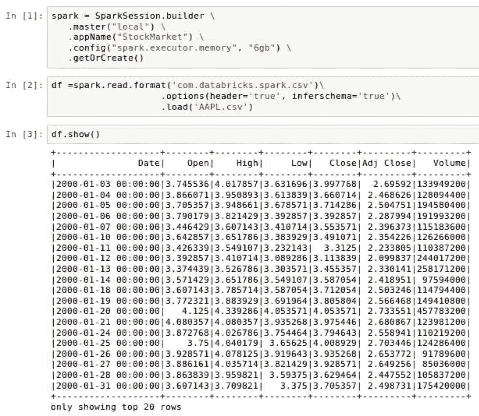
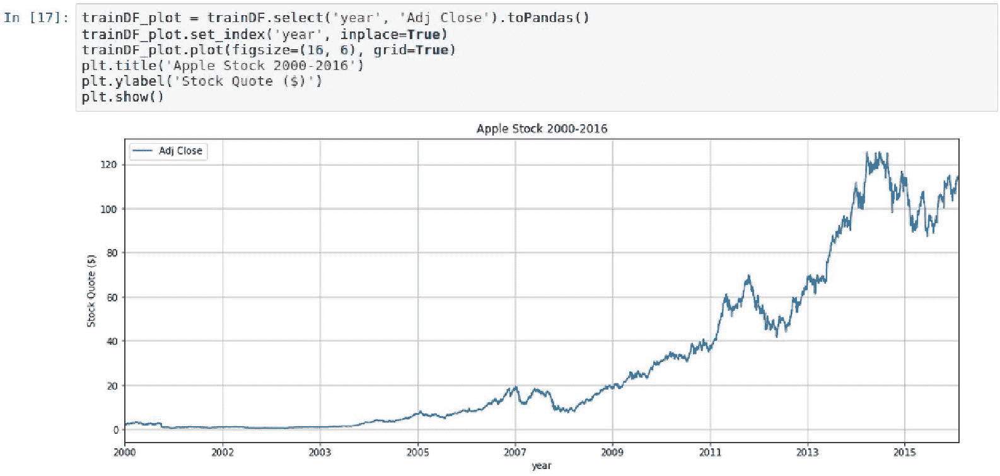
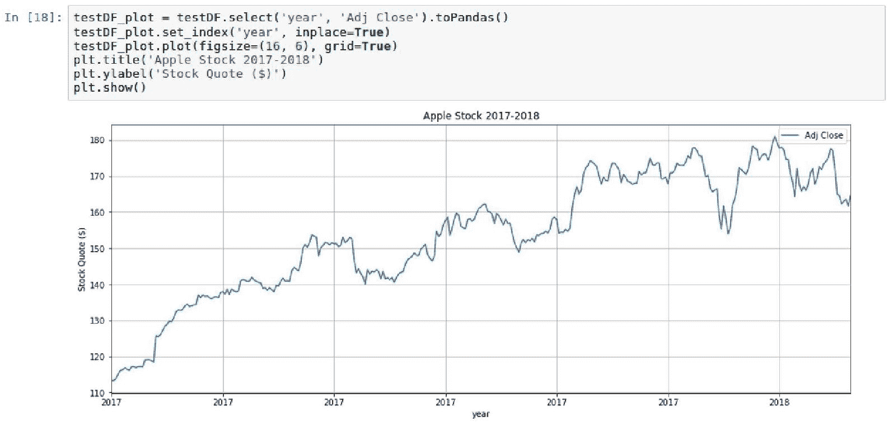
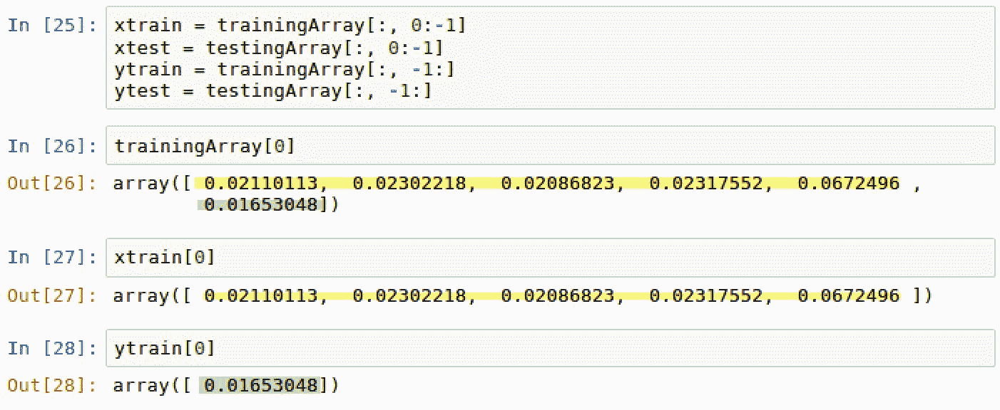
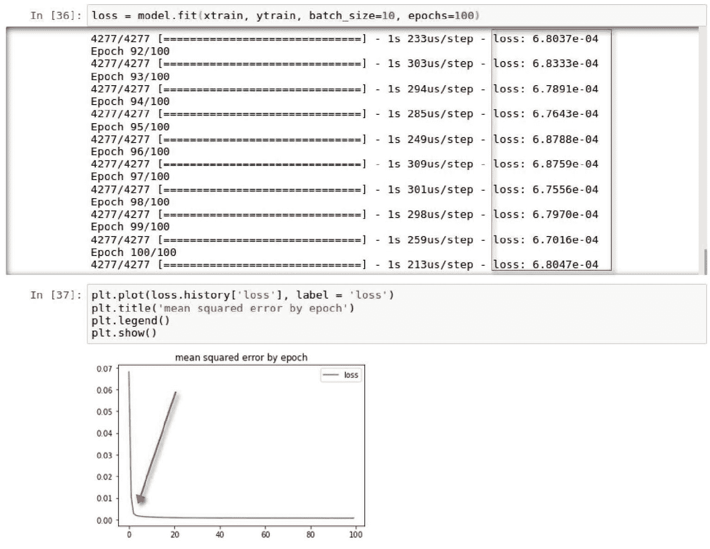

# 九、使用 LSTM 预测苹果股票市场成本

股市预测已经持续了很多年，它已经催生了一个预言师的整个行业。这不应该令人惊讶，因为如果预测正确，它可以带来可观的利润。了解何时是买入或卖出股票的好时机，是在华尔街占据上风的关键。这一章将着重于创建一个深度学习模型，利用 LSTM 在喀拉斯预测 AAPL 股市报价。

本章将介绍以下配方:

*   为苹果下载股市数据
*   为苹果探索和可视化股票市场数据
*   为模型性能准备库存数据
*   建立 LSTM 模型
*   评估 LSTM 模式

# 为苹果下载股市数据

有很多资源可以下载苹果的股市数据。为了我们的目的，我们将使用雅虎！财经网站。

# 准备好

这一部分需要初始化一个Spark簇，用于本章的所有配方。使用`sparknotebook`可以在终端初始化一个 Spark 笔记本，如下图截图所示:


可以使用以下脚本在 Jupyter 笔记本中初始化`SparkSession`:

```py
spark = SparkSession.builder \.master("local") \.appName("StockMarket") \.config("spark.executor.memory", "6gb") \.getOrCreate()
```

# 怎么做...

下一节将介绍下载苹果历史股票市场数据的步骤。

1.  访问以下网站跟踪苹果每日历史调整收盘价，其股票代码为 AAPL:[https://finance.yahoo.com/quote/AAPL/history](https://finance.yahoo.com/quote/AAPL/history)
2.  将以下参数设置并应用于“历史数据”选项卡:
    1.  时间段:2000 年 01 月 01 日-2018 年 04 月 30 日。
    2.  显示:历史价格。
    3.  频率:每天。

3.  点击下载数据链接，将指定参数的数据集下载到`.csv`文件，如下图所示:


4.  下载文件`AAPL.csv`，然后使用以下脚本将相同的数据集上传到 Spark 数据帧:

```py
df =spark.read.format('com.databricks.spark.csv')\.options(header='true', inferschema='true')\.load('AAPL.csv')
```

# 它是如何工作的...

以下部分解释了如何将股市数据整合到 Jupyter 笔记本中。

1.  雅虎！金融是上市公司股票市场报价的一个很好的来源。AAPL 苹果公司的股票报价在纳斯达克交易，历史报价可以被捕获用于模型开发和分析。雅虎！Finance 为您提供了在每日、每周或每月快照上获取股票报价的选项。
2.  本章的目的是预测每天的库存水平，因为这将在我们的训练模型中引入最多的数据。我们可以将数据追溯到 2000 年 1 月 1 日，一直追溯到 2018 年 4 月 30 日。

3.  一旦我们的参数被设置为下载，我们就会从 Yahoo！能够以最少的问题轻松转换为 Spark 数据框架的财务。
4.  数据框将允许我们每天查看股票的日期、开盘价、最高价、最低价、收盘价、调整收盘价和成交量。数据框中的列跟踪当天交易的股票的开盘价和收盘价以及最高价和最低价。白天交易的股票数量也被记录下来。通过执行`df.show()`，可以显示Spark数据帧`df`的输出，如下图所示:



# 还有更多...

Python 有股票市场应用编程接口，允许您自动连接和撤回苹果等上市公司的股票市场报价。您需要输入参数并检索可以存储在数据框中的数据。然而，截至 2018 年 4 月，*雅虎！财务* API 不再运行，因此不是本章提取数据的可靠解决方案。

# 请参见

`Pandas_datareader`是一个非常强大的库，用于从雅虎等网站提取数据！金融。了解更多关于图书馆以及它如何连接回雅虎！财务一旦恢复在线，请访问以下网站:

[https://github . com/pydata/panda data reader](https://github.com/pydata/pandas-datareader)

# 为苹果探索和可视化股票市场数据

在对数据进行任何建模和预测之前，首先探索和可视化手头的任何隐藏宝石的数据是很重要的。

# 准备好

在本节中，我们将对数据框架进行转换和可视化。这将需要在 Python 中导入以下库:

*   `pyspark.sql.functions`
*   `matplotlib`

# 怎么做...

下一节将介绍探索和可视化股票市场数据的步骤。

1.  使用以下脚本通过删除时间戳来转换数据帧中的`Date`列:

```py
import pyspark.sql.functions as fdf = df.withColumn('date', f.to_date('Date'))
```

2.  创建一个 for-cycle，向数据框中添加另外三列。该循环将`date`字段分解为`year`、`month`和`day`，如以下脚本所示:

```py
date_breakdown = ['year', 'month', 'day']for i in enumerate(date_breakdown):index = i[0]name = i[1]df = df.withColumn(name, f.split('date', '-')[index])
```

3.  使用以下脚本将Spark数据帧的子集保存到名为`df_plot`的`pandas`数据帧中:`df_plot = df.select('year', 'Adj Close').toPandas()`。
4.  使用以下脚本绘制并可视化笔记本内部的`pandas`数据框`df_plot`:

```py
from matplotlib import pyplot as plt%matplotlib inlinedf_plot.set_index('year', inplace=True)df_plot.plot(figsize=(16, 6), grid=True)plt.title('Apple stock')plt.ylabel('Stock Quote ($)')plt.show()
```

5.  使用以下脚本计算我们的 Spark 数据帧的行数和列数:`df.toPandas().shape`。

6.  执行以下脚本来确定数据框中的空值:`df.dropna().count()`。
7.  执行以下脚本回拉统计`Open`、`High`、`Low`、`Close`、`Adj Close`:

```py
df.select('Open', 'High', 'Low', 'Close', 'Adj Close').describe().show()
```

# 它是如何工作的...

下一节解释了从探索性数据分析中使用的技术和获得的见解。

1.  dataframe 中的日期列更像是日期时间列，时间值都以 00:00:00 结尾。这对于我们在建模过程中需要的东西来说是不必要的，因此可以从数据集中删除。幸运的是，PySpark 有一个`to_date`功能，可以很容易地做到这一点。数据框`df`使用`withColumn()`函数进行转换，现在只显示日期列，没有时间戳，如下图所示:


2.  出于分析目的，我们希望从`date`列中提取`day`、`month`和`year`。我们可以通过枚举自定义列表`date_breakdown`来实现这一点，通过`-`分割日期，然后使用`withColumn()`功能为年、月和日添加新列。带有新添加列的更新数据框可以在下面的屏幕截图中看到:


One important takeaway is that `PySpark` also has a SQL function for dates that can extract the day, month, or year from a date timestamp. For example, if we were to add a month column to our dataframe, we would use the following script: `df.withColumn("month",f.month("date")).show()`. This is to highlight the fact that there are multiple ways to transform data within Spark.

3.  Spark数据帧在可视化特征方面比`pandas`数据帧更受限制。因此，我们将从 Spark 数据框`df`中抽取两列，并将其转换为`pandas`数据框，用于绘制折线图或时间序列图。y 轴是调整后的股票收盘价，x 轴是日期的年份。

4.  熊猫数据框 df_plot 一旦设置了一些格式特征，如网格可见性、图的图形大小以及标题和轴的标签，就可以使用 matplotlib 进行绘制了。此外，我们明确声明数据框的索引需要指向年份列。否则，默认索引将出现在 x 轴上，而不是年份上。最后的时间序列图可以在下面的截图中看到:


5.  在过去的 18 年里，苹果经历了广泛的增长。虽然几年来出现了一些下跌，但总体趋势是稳步上升，去年的股票报价在 150 美元至 175 美元之间徘徊。
6.  到目前为止，我们已经对数据框进行了一些更改，因此获得行和列总数的库存计数非常重要，因为这将影响数据集的分解方式，以便在本章后面进行测试和培训。从下面的截图中可以看出，我们总共有 10 列和 4，610 行:


7.  执行`df.dropna().count()`时，我们可以看到行数仍然是 4，610，与上一步的行数相同，说明没有任何一行有空值。
8.  最后，我们可以很好地了解模型中将使用的每一列的行数、平均值、标准差、最小值和最大值。这有助于识别数据中是否存在异常。需要注意的一点是，将在模型中使用的五个字段中的每一个都有一个高于平均值的标准偏差，这表明数据更加分散，而不是围绕平均值聚集。打开、高、低、关闭和调整关闭的统计数据可以在下面的截图中看到:


# 还有更多...

虽然 Spark 中的数据框不具备`pandas`数据框中的原生可视化功能，但有些公司管理 Spark 的企业解决方案，允许通过笔记本实现高级可视化功能，而无需使用`matplotlib`等库。Databricks 就是提供这一功能的公司之一。

以下是一个可视化示例，使用了 Databricks 笔记本中提供的内置功能:


# 请参见

要了解更多关于数据库的信息，请访问以下网站:[https://databricks.com/](https://databricks.com/)。

要了解更多关于 Databricks 笔记本中可视化的信息，请访问以下网站:[https://docs . Databricks . com/用户指南/可视化/index.html](https://docs.databricks.com/user-guide/visualizations/index.html) 。

要了解有关通过 Microsoft Azure 订阅访问 Databricks 的更多信息，请访问以下网站:

[https://azure.microsoft.com/en-us/services/databricks/](https://azure.microsoft.com/en-us/services/databricks/)

# 为模型性能准备库存数据

我们几乎准备好为苹果的股票价值表现构建一个预测算法。剩下的任务是以确保最佳预测结果的方式准备数据。

# 准备好

在本节中，我们将对数据框架进行转换和可视化。这将需要在 Python 中导入以下库:

*   `numpy`
*   `MinMaxScaler()`

# 怎么做...

本节将介绍为我们的模型准备股票市场数据的步骤。

1.  执行以下脚本，按`Adj Close`计数对年份列进行分组:

```py
df.groupBy(['year']).agg({'Adj Close':'count'})\.withColumnRenamed('count(Adj Close)', 'Row Count')\.orderBy(["year"],ascending=False)\.show()
```

2.  执行以下脚本创建两个新的数据帧，用于培训和测试目的:

```py
trainDF = df[df.year < 2017]testDF = df[df.year > 2016]
```

3.  使用以下脚本将两个新数据帧转换为`pandas`数据帧，以通过`toPandas()`获得行数和列数:

```py
trainDF.toPandas().shapetestDF.toPandas().shape
```

4.  正如我们之前对`df`所做的那样，我们使用以下脚本可视化`trainDF`和`testDF`:

```py
trainDF_plot = trainDF.select('year', 'Adj Close').toPandas()trainDF_plot.set_index('year', inplace=True)trainDF_plot.plot(figsize=(16, 6), grid=True)plt.title('Apple Stock 2000-2016')plt.ylabel('Stock Quote ($)')plt.show()testDF_plot = testDF.select('year', 'Adj Close').toPandas()testDF_plot.set_index('year', inplace=True)testDF_plot.plot(figsize=(16, 6), grid=True)plt.title('Apple Stock 2017-2018')plt.ylabel('Stock Quote ($)')plt.show()
```

5.  我们使用以下脚本，基于数据帧创建两个新数组`trainArray`和`testArray`，日期列除外:

```py
import numpy as nptrainArray = np.array(trainDF.select('Open', 'High', 'Low',                     'Close','Volume', 'Adj Close' ).collect())testArray = np.array(testDF.select('Open', 'High', 'Low', 'Close','Volume',     'Adj Close' ).collect())
```

6.  为了在 0 和 1 之间缩放数组，从`sklearn`导入`MinMaxScaler`，并使用以下脚本创建函数调用`MinMaxScale`:

```py
from sklearn.preprocessing import MinMaxScalerminMaxScale = MinMaxScaler()
```

7.  `MinMaxScaler`随后被放在`trainArray`上，并用于创建两个新的数组，使用以下脚本对其进行缩放以适合:

```py
minMaxScale.fit(trainArray)testingArray = minMaxScale.transform(testArray)trainingArray = minMaxScale.transform(trainArray)
```

8.  使用以下脚本将`testingArray`和`trainingArray`分割成要素、`x`和标签、`y`:

```py
xtrain = trainingArray[:, 0:-1]xtest = testingArray[:, 0:-1]ytrain = trainingArray[:, -1:]ytest = testingArray[:, -1:]
```

9.  执行以下脚本检索所有四个阵列形状的最终清单:

```py
print('xtrain shape = {}'.format(xtrain.shape))print('xtest shape = {}'.format(xtest.shape))print('ytrain shape = {}'.format(ytrain.shape))print('ytest shape = {}'.format(ytest.shape))
```

10.  执行以下脚本绘制报价`open`、`high`、`low`和`close`的训练数组:

```py
plt.figure(figsize=(16,6))plt.plot(xtrain[:,0],color='red', label='open')plt.plot(xtrain[:,1],color='blue', label='high')plt.plot(xtrain[:,2],color='green', label='low')plt.plot(xtrain[:,3],color='purple', label='close')plt.legend(loc = 'upper left')plt.title('Open, High, Low, and Close by Day')plt.xlabel('Days')plt.ylabel('Scaled Quotes')plt.show()
```

11.  此外，我们使用以下脚本绘制`volume`的训练数组:

```py
plt.figure(figsize=(16,6))plt.plot(xtrain[:,4],color='black', label='volume')plt.legend(loc = 'upper right')plt.title('Volume by Day')plt.xlabel('Days')plt.ylabel('Scaled Volume')plt.show()
```

# 它是如何工作的...

本节解释模型中使用的数据所需的转换。

1.  构建模型的第一步是将数据拆分为训练和测试数据集，用于模型评估。我们的目标是使用从 2000 年到 2016 年的所有股票报价来预测 2017-2018 年的股票趋势。我们从前面的部分知道，我们总共有 4610 天的股票报价，但我们不知道每年到底有多少下跌。我们可以使用数据框中的`groupBy()`函数来获得每年股票报价的唯一计数，如下图所示:


2.  2016 年和 2017 年的合并数据约占总数据的 7%，这对测试数据集来说有点小。然而，对于这个模型来说，它应该是足够的。其余 93%的数据集将在 2000 年至 2016 年期间用于培训目的。因此，使用过滤器创建两个数据框，以确定是包括还是排除 2016 年之前或之后的行。
3.  我们现在可以看到，测试数据集`testDF`包含 333 行，而训练数据集`trainDF`包含 4，277 行。当两者结合时，我们从原始数据帧`df`中得出的总行数为 4，610。最后我们看到`testDF`仅由 2017 年和 2018 年的数据组成，2017 年为 251 行，2018 年为 82 行，共计 333 行，如下图截图所示:


`pandas`

`pandas`

`pandas`

`pandas`

4.  一旦使用`toPandas()`转换了数据子集，就可以使用`matplotlib`可视化测试和训练数据帧，以利用`pandas`的内置绘图功能。并排可视化数据框展示了当用于调整闭合的 y 轴未按比例缩放时，图形看起来是如何相似的。现实中我们可以看到`trainDF_plot`开始接近 0，但是`testDF_plot`开始接近 110，如下两张截图所示:





5.  我们的股票价值，就目前的情况来看，不适合深度学习建模，因为没有标准化或规范化的基线。使用神经网络时，最好将值保持在 0 和 1 之间，以匹配用于激活的 sigmoid 或阶跃函数中的结果。为了实现这一点，我们必须首先将`pyspark`数据帧`trainDF`和`testDF`转换为`numpy`数组，它们是`trainArray`和`testArray`。由于这些现在是数组而不是数据帧，我们将不使用日期列，因为神经网络只对数值感兴趣。每个中的第一个值可以在下面的截图中看到:


6.  有许多方法可以将数组值缩放到 0 到 1 之间的范围。它涉及使用以下公式:`scaled array value = (array value - min array value) / (max array value - min array value)`。幸运的是，我们不需要在数组上手动进行这种计算。我们可以利用`sklearn`的`MinMaxScaler()`功能来缩小两个阵列。

7.  `MinMaxScaler()`函数适用于训练数组`trainArray`，然后应用于创建两个全新的数组`trainingArray`和`testingArray`，它们被缩放为 0 到 1 之间的值。每个阵列的第一行可以在下面的截图中看到:


8.  为了测试和训练的目的，我们现在准备通过将数组分割成 x 和 y 来设置标签和特征变量。数组中的前五个元素是特征或 x 值，最后一个元素是标签或 y 值。这些特征由“打开”、“高”、“低”、“关闭”和“音量”的值组成。标签由可调闭合组成。`trainingArray`第一行的突破可以在下面的截图中看到:



9.  最后看一下我们将在模型中使用的四个数组的形状，可以确认我们有 4，227 个矩阵行的训练数据、333 个矩阵行的测试数据、5 个元素用于特征(`x`)和 1 个元素用于标签(`y`)，如下图所示:


10.  训练数组`xtrain`的开仓、平仓、平仓和平仓的值可以使用新调整的 0 到 1 之间的刻度来绘制，如下图所示:


11.  此外，还可以用 0 到 1 之间的缩放体积分数绘制至体积，如下图所示:


# 还有更多...

虽然我们确实使用了来自`sklearn`的`MinMaxScaler`，但同样重要的是要了解还有一个`MinMaxScaler`功能可以直接通过`pyspark.ml.feature`获得。它以完全相同的方式工作，将每个特征重新缩放到 0 到 1 之间的值。如果我们在本章中通过 PySpark 原生使用机器学习库来进行预测，我们会使用`pyspark.ml.feature`中的`MinMaxScaler`。

# 请参见

要从`sklearn`了解更多关于`MinMaxScaler`的信息，请访问以下网站:

[http://sci kit-learn . org/stable/modules/generated/sklearn . premignition . minmaxscaler . html .](http://scikit-learn.org/stable/modules/generated/sklearn.preprocessing.MinMaxScaler.html)

要从`pyspark`了解更多关于`MinMaxScaler`的信息，请访问以下网站:

[https://spark . Apache . org/docs/2 . 2 . 0/ml-features . html # minmax scaler。](https://spark.apache.org/docs/2.2.0/ml-features.html#minmaxscaler)

# 建立 LSTM 模型

数据现在的格式与 LSTM 建模的 Keras 模型开发兼容。因此，我们将在本节中设置和配置深度学习模型，用于预测苹果在 2017 年和 2018 年的股票报价。

# 准备好

在本节中，我们将对模型进行模型管理和超参数调整。这将需要在 Python 中导入以下库:

```py
from keras import modelsfrom keras import layers
```

# 怎么做...

本节将介绍设置和调整 LSTM 模型的步骤。

1.  使用以下脚本从`keras`导入以下库:

```py
from keras import models, layers
```

2.  使用以下脚本构建`Sequential`模型:

```py
model = models.Sequential()model.add(layers.LSTM(1, input_shape=(1,5)))model.add(layers.Dense(1))model.compile(loss='mean_squared_error', optimizer='adam')
```

3.  使用以下脚本将测试和训练数据集转换为三维数组:

```py
xtrain = xtrain.reshape((xtrain.shape[0], 1, xtrain.shape[1]))xtest = xtest.reshape((xtest.shape[0], 1, xtest.shape[1]))
```

4.  使用名为`loss`的变量用以下脚本拟合`model`:

```py
loss = model.fit(xtrain, ytrain, batch_size=10, epochs=100)
```

5.  使用以下脚本创建新阵列`predicted`:

```py
predicted = model.predict(xtest)
```

6.  使用以下脚本将`predicted`和`ytest`阵列组合成一个统一的阵列，`combined_array`:

```py
combined_array = np.concatenate((ytest, predicted), axis = 1)
```

# 它是如何工作的...

本节解释了如何配置 LSTM 神经网络模型，以便在我们的数据集上进行训练。

1.  用于构建 LSTM 模型的`keras`的大部分功能将来自`models`和`layers`。
2.  已经建立的`LSTM`模型将使用`Sequential`类来定义，该类可以很好地处理依赖于序列的时间序列。在我们的训练数据集中，LSTM 模型对一个因变量和五个自变量有一个`input_shape = (1,5)`。只有一个`Dense`层将用于定义神经网络，因为我们希望保持模型简单。在 keras 中编译模型时需要一个损失函数，由于我们是在循环神经网络上执行的，因此`mean_squared_error`计算最适合确定预测值与实际值的接近程度。最后，在编译模型以调整神经网络中的权重时，还定义了优化器。`adam`给出了很好的结果，特别是当与循环神经网络一起使用时。

3.  我们目前的数组`xtrain`和`xtest`目前是二维数组；但是，要将其纳入 LSTM 模型，需要使用`reshape()`将其转换为三维阵列，如下图所示:


4.  LSTM 型号符合`xtrain`和`ytrain`，批量设置为 10 个，100 个时代。批量大小是定义一起训练的对象数量的设置。在设置批次大小方面，我们可以根据自己的喜好选择低或高，请记住批次数量越少，需要的内存就越多。此外，历元是模型遍历整个数据集的频率的度量。最终，这些参数可以根据时间和内存分配进行调整。

捕获并可视化每个时期的均方误差损失。在第五或第六个纪元之后，我们可以看到损耗逐渐减少，如下图所示:



5.  现在，我们可以基于应用于`xtest`的拟合模型创建一个新的数组`predicted`，然后将其与`ytest`组合起来，为了精确起见，将它们并排进行比较。

# 请参见

要了解更多关于 keras 内参数调整模型的信息，请访问以下网站:[https://keras.io/models/model/](https://keras.io/models/model/)

# 评估模型

现在是关键时刻:我们将看看我们的模型是否能够对 2017 年和 2018 年的 AAPL 股票给出一个很好的预测。

# 准备好

我们将使用均方误差进行模型评估。因此，我们需要导入以下库:

```py
import sklearn.metrics as metrics
```

# 怎么做...

本节将通过可视化和计算苹果在 2017 年和 2018 年的预测股票报价和实际股票报价。

1.  使用以下脚本绘制`Actual`和`Predicted`股票的并排比较图，以比较趋势:

```py
plt.figure(figsize=(16,6))plt.plot(combined_array[:,0],color='red', label='actual')plt.plot(combined_array[:,1],color='blue', label='predicted')plt.legend(loc = 'lower right')plt.title('2017 Actual vs. Predicted APPL Stock')plt.xlabel('Days')plt.ylabel('Scaled Quotes')plt.show()
```

2.  使用以下脚本计算实际`ytest`库存与`predicted`库存之间的均方误差:

```py
import sklearn.metrics as metricsnp.sqrt(metrics.mean_squared_error(ytest,predicted))
```

# 它是如何工作的...

本节解释了 LSTM 模型的评估结果。

1.  从图形角度来看，我们可以看到我们的预测与 2017-2018 年的实际股票报价非常接近，如下图截图所示:


2.  我们的模型显示，2017 年和 2018 年的预测值与实际值相比更接近。总的来说，虽然我们的预测分数和实际分数看起来非常接近，但最好进行均方误差计算，以了解两者之间的偏差有多大。如我们所见，我们的均方误差为 0.05841 或大约 5.8%:


# 请参见

要了解更多关于如何在 sklearn 中计算均方误差的信息，请访问以下网站:

[http://sci kit-learn . org/stable/modules/generated/sklearn . metrics . mean _ squared _ error . html](http://scikit-learn.org/stable/modules/generated/sklearn.metrics.mean_squared_error.html)。