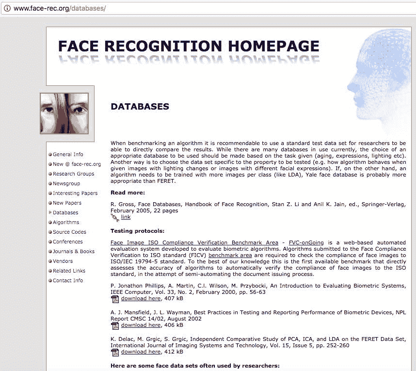
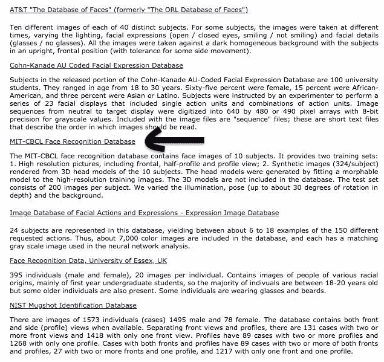
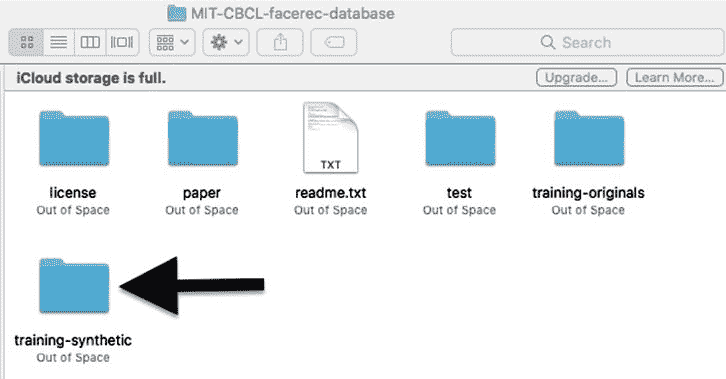
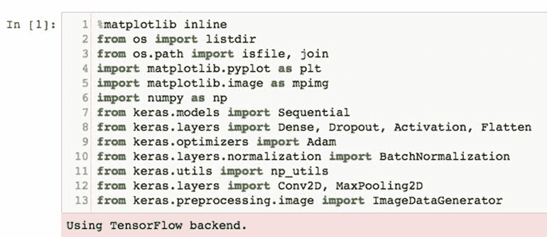
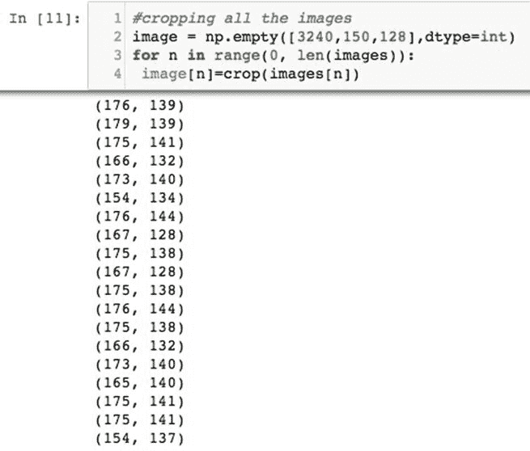
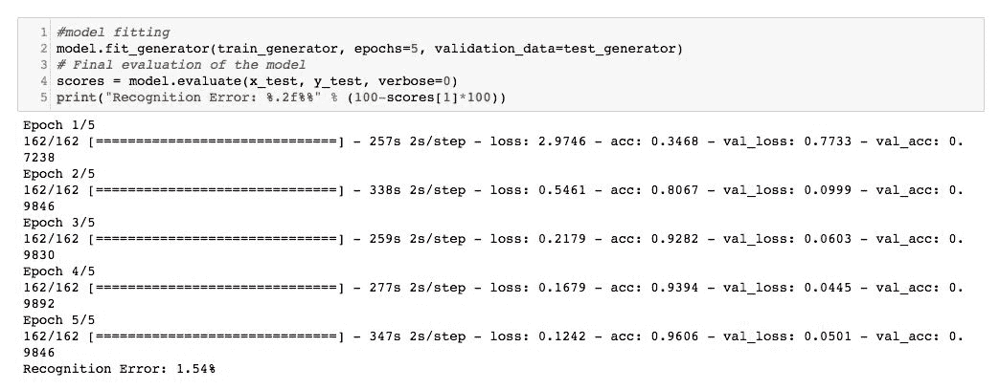
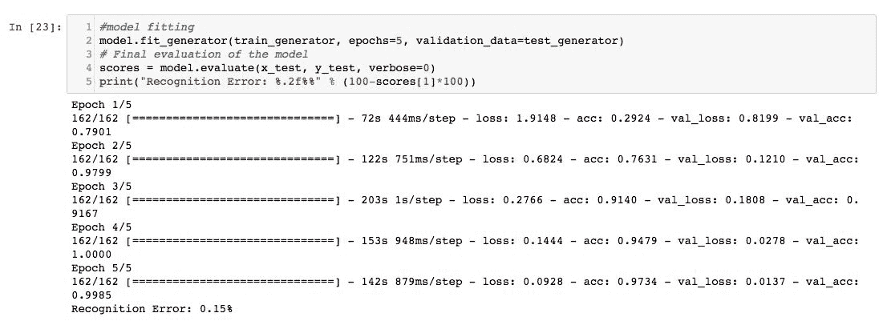

# 基于深度卷积网络的人脸识别

在本章中，我们将介绍以下食谱:

*   将麻省理工学院-CBCL 数据集下载并加载到内存中
*   绘制和可视化目录中的图像
*   预处理图像
*   模型构建、培训和分析

# 介绍

在当今世界，维护信息安全的需求变得越来越重要，也越来越困难。有多种方法可以加强这种安全性(密码、指纹 id、个人识别码等)。然而，在易用性、准确性和低侵入性方面，人脸识别算法一直做得很好。随着高速计算的可用性和深度卷积网络的发展，进一步提高这些算法的鲁棒性成为可能。它们已经变得如此先进，以至于现在被用作许多电子设备(例如，苹果手机)甚至银行应用的主要安全功能。本章的目标是开发一种用于安全系统的鲁棒的、姿态不变的人脸识别算法。为了本章的目的，我们将使用公开可用的 10 个不同受试者的面部图像`MIT-CBCL`数据集。

# 将麻省理工学院-CBCL 数据集下载并加载到内存中

在本食谱中，我们将了解如何下载麻省理工学院-CBCL 数据集并将其加载到内存中。

预计到 2025 年，生物识别产业的价值将达到 150 亿美元，这将是前所未有的增长。用于生物认证的生理特征的一些例子包括指纹、脱氧核糖核酸、面部、视网膜或耳朵特征以及声音。虽然 DNA 认证和指纹等技术相当先进，但人脸识别也带来了自己的优势。

深度学习模型的最新发展带来的易用性和鲁棒性是人脸识别算法如此受欢迎的一些驱动因素。

# 准备好了

该配方需要考虑以下要点:

*   `MIT-CBCL`数据集由 3240 幅图像组成(每个对象 324 幅图像)。在我们的模型中，我们将安排增加数据，以提高模型的稳健性。我们将采用诸如移动对象、旋转、缩放和剪切对象等技术来获得这些增强的数据。
*   我们将使用 20%的数据集，通过从数据集中随机选择这些图像来测试我们的模型(648 幅图像)。同样，我们随机选择数据集中 80%的图像，并将其用作我们的训练数据集(2，592 幅图像)。
*   最大的挑战是将图像裁剪成完全相同的大小，以便将它们输入神经网络。
*   众所周知，当所有输入图像大小相同时，设计网络要容易得多。然而，由于这些图像中的一些对象具有侧面轮廓或旋转/倾斜轮廓，我们必须调整我们的网络以拍摄不同尺寸的输入图像。

# 怎么做...

步骤如下。

1.  通过访问人脸识别主页下载`MIT-CBCL`数据集，该主页包含多个用于人脸识别实验的数据库。该链接以及主页截图如下:[http://www.face-rec.org/databases/](http://www.face-rec.org/databases/):



2.  向下导航到名为麻省理工学院-CBCL 人脸识别数据库的链接，并点击它，如下图所示:



3.  点击后，它将带您进入许可页面，在该页面上，您需要接受许可协议并进入下载页面。进入下载页面后，点击`download now`。这将下载一个大约 116 兆字节的压缩文件。继续将内容提取到工作目录中。

# 它是如何工作的...

功能如下:

1.  许可协议要求在任何项目中使用数据库都要有适当的引用。这个数据库是由麻省理工学院的研究团队开发的。
2.  特此表彰麻省理工学院和生物与计算学习中心提供面部图像数据库。许可证还要求提及题为*基于组件的三维可变形模型人脸识别的论文，第一届视频人脸处理 IEEE 研讨会，*华盛顿特区，2004，B. Weyrauch，J. Huang，B. Heisele 和 V. Blanz。
3.  以下屏幕截图描述了许可协议以及下载数据集的链接:


Face Recognition Database Homepage

4.  一旦数据集被下载和提取，你会看到一个名为麻省理工学院-CBCL-facerec-database 的文件夹。

5.  就本章而言，我们将只使用 **`training-synthetic`** 文件夹中的图像，该文件夹包含所有 3，240 张图像，如下图所示:



# 还有更多...

在本章中，您将要求 Python 导入以下库:

*   `os`
*   `matplotlib`
*   `numpy`
*   `keras`
*   `TensorFlow`

本章的下一节将讨论在构建神经网络模型并将其加载到其中之前，导入必要的库并对图像进行预处理。

# 请参见

有关本章中使用的软件包的完整信息，请访问以下链接:

*   [https://matplotlib.org/](https://matplotlib.org/)
*   [https://docs.python.org/2/library/os.html](https://docs.python.org/2/library/os.html)
*   [https://www.tensorflow.org/get_started/](https://www.tensorflow.org/get_started/)
*   [https://keras.io/layers/about-keras-layers/](https://keras.io/layers/about-keras-layers/)
*   [https://docs.scipy.org/doc/numpy-1.9.1/reference/](https://docs.scipy.org/doc/numpy-1.9.1/reference/)

# 绘制和可视化目录中的图像

本节将描述如何在下载的图像被预处理并输入神经网络进行训练之前阅读和可视化它们。这是本章中的一个重要步骤，因为需要对图像进行可视化，以便更好地理解图像大小，这样就可以对它们进行精确裁剪，从而省略背景，仅保留必要的面部特征。

# 准备好

开始之前，完成导入必要库和函数的初始设置，并设置工作目录的路径。

# 怎么做...

步骤如下:

1.  使用以下代码行下载必要的库。输出结果必须是一行写着`Using TensorFlow backend`，如下图所示:

```py
%matplotlib inlinefrom os import listdirfrom os.path import isfile, joinimport matplotlib.pyplot as pltimport matplotlib.image as mpimgimport numpy as npfrom keras.models import Sequentialfrom keras.layers import Dense, Dropout, Activation, Flatten, Conv2Dfrom keras.optimizers import Adamfrom keras.layers.normalization import BatchNormalizationfrom keras.utils import np_utilsfrom keras.layers import MaxPooling2Dfrom keras.preprocessing.image import ImageDataGenerator
```

库的导入如下所示:



2.  打印并设置当前工作目录，如下图所示。在我们的例子中，桌面被设置为工作目录:


3.  使用下面屏幕截图中显示的命令直接从文件夹中读取所有图像:


4.  使用`plt.imshow (images[])`命令从数据集中打印一些随机图像，如下图截图所示，以便更好地了解图像中的人脸轮廓。这也将给出图像大小的概念，这将在稍后阶段需要:


5.  此处显示的是第一张图像中不同测试对象的图像。


# 它是如何工作的...

功能如下:

1.  `mypath`变量设置读取所有文件的路径。在这一步中指定`training-synthetic`文件夹，因为只有该文件夹中的文件将用于本章。
2.  `onlyfiles`变量用于通过循环遍历文件夹中包含的所有文件来计数路径在上一步中提供的文件夹下的所有文件。这将是下一步读取和存储图像所必需的。
3.  `images`变量用于创建一个大小为 3，240 的空数组，以便存储所有 200 x 200 像素的图像。
4.  接下来，通过在 for 循环中使用`onlyfiles`变量作为参数循环遍历所有文件，文件夹中包含的每个图像都被读取，并使用`matplotlib.image`函数存储到先前定义的`images`数组中。
5.  最后，在通过指定图像的不同索引来打印随机选择的图像时，您会注意到每个图像都是 200 x 200 像素的阵列，并且每个对象可能面向前方，或者在任一侧旋转 0 到 15 度。

# 还有更多...

以下几点值得注意:

*   这个数据库的一个有趣的特性是，每个文件名的第四位数字描述了哪个主题在相应的图像中。
*   图像的名称是唯一的，因为第四个数字代表相应图像中的个人。图像名称的两个例子是`0001_-4_0_0_60_45_1.pgm`和`0006_-24_0_0_0_75_15_1.pgm`。人们很容易理解第四个数字分别代表第二个和第七个个体。
*   我们需要存储这些信息，以便以后在进行预测时使用。这将有助于神经网络在训练过程中了解它正在学习的受试者的面部特征。
*   每个图像的文件名都可以读入一个数组，十个主题中的每一个都可以通过使用以下代码行来分隔:

```py
y =np.empty([3240,1],dtype=int)for x in range(0, len(onlyfiles)):if onlyfiles[x][3]=='0': y[x]=0elif onlyfiles[x][3]=='1': y[x]=1elif onlyfiles[x][3]=='2': y[x]=2elif onlyfiles[x][3]=='3': y[x]=3elif onlyfiles[x][3]=='4': y[x]=4elif onlyfiles[x][3]=='5': y[x]=5elif onlyfiles[x][3]=='6': y[x]=6elif onlyfiles[x][3]=='7': y[x]=7elif onlyfiles[x][3]=='8': y[x]=8elif onlyfiles[x][3]=='9': y[x]=9
```

*   前面的代码将初始化一个大小为 3，240 的空一维`numpy`数组(在`training-synthetic`文件夹中的图像数量)，并通过循环整个文件集将相关主题存储在不同的数组中。
*   `if`语句基本上是检查每个文件名下的第四个数字是什么，并将该数字存储在初始化的`numpy`数组中。
*   iPython 笔记本中的输出如下面的截图所示:


# 请参见

下面的博客描述了一种在 Python 中裁剪图像的方法，可用于图像预处理，这将在下面的部分中要求:

*   [https://www . blog . python library . org/2017/10/03/如何用 python 裁剪照片/](https://www.blog.pythonlibrary.org/2017/10/03/how-to-crop-a-photo-with-python/)

通过访问以下链接，可以找到关于 Adam 优化器及其用例的更多信息:

*   [https://www . tensorlow . org/API _ docs/python/TF/train/adamoptimizer](https://www.tensorflow.org/api_docs/python/tf/train/AdamOptimizer)
*   [https://arxiv.org/abs/1412.6980](https://arxiv.org/abs/1412.6980)
*   [https://www . coursera . org/讲座/deep-神经网络/Adam-优化-算法-w9VCZ](https://www.coursera.org/lecture/deep-neural-network/adam-optimization-algorithm-w9VCZ)

# 预处理图像

在前一节中，您可能已经注意到，所有的图像都不是面部轮廓的前视图，也有轻微旋转的侧面轮廓。您可能还注意到每张图像中有一些不必要的背景区域需要省略。本节将介绍如何对图像进行预处理和处理，以便为输入网络进行培训做好准备。

# 准备好

请考虑以下几点:

*   设计了许多算法来裁剪图像的重要部分；比如 SIFT、LBP、哈尔-级联滤波器等等。
*   然而，我们将用一个非常简单的 naïve 代码来处理这个问题，从图像中裁剪面部部分。这是这种算法的新颖之处之一。
*   我们发现不必要的背景部分的像素强度是 28。
*   请记住，每个图像都是 200 x 200 像素的三通道矩阵。这意味着每幅图像包含三个矩阵或张量，由红、绿和蓝像素组成，强度范围从 0 到 255。
*   因此，我们将丢弃图像中仅包含 28s 像素强度的任何行或列。
*   我们还将确保所有图像在裁剪动作后具有相同的像素大小，以实现卷积神经网络的最高并行性。

# 怎么做...

步骤如下:

1.  定义`crop()`函数裁剪图像，只获取重要部分，如下面几行代码所示:

```py
 #function for cropping images to obtain only the significant partdef crop(img):a=28*np.ones(len(img)) b=np.where((img== a).all(axis=1)) img=np.delete(img,(b),0) plt.imshow(img)img=img.transpose()d=28*np.ones(len(img[0]))e=np.where((img== d).all(axis=1))img=np.delete(img,e,0) img=img.transpose()print(img.shape) super_threshold_indices = img < 29 img[super_threshold_indices] = 0plt.imshow (img)return img[0:150, 0:128]
```

2.  使用以下代码行循环遍历文件夹中的每个图像，并使用前面定义的函数对其进行裁剪:

```py
#cropping all the imagesimage = np.empty([3240,150,128],dtype=int)for n in range(0, len(images)):image[n]=crop(images[n])
```

3.  接下来，随机选择一个图像并打印出来，检查它是否已经从 200 x 200 大小的图像裁剪成不同的大小。在我们的案例中，我们选择了图像 23。这可以使用下面几行代码来完成:

```py
 print (image[22])print (image[22].shape)
```

4.  接下来，使用文件夹中图像的`80%`作为训练集，剩余的`20%` 作为测试集，将数据分割成测试和训练集。这可以通过以下命令来完成:

```py
# Split data into 80/20 split for testing and trainingtest_ind=np.random.choice(range(3240), 648, replace=False) train_ind=np.delete(range(0,len(onlyfiles)),test_ind)
```

5.  数据完成分割后，使用以下命令分离训练图像和测试图像:

```py
 # slicing the training and test images y1_train=y[train_ind]x_test=image[test_ind]y1_test=y[test_ind]
```

6.  接下来，将所有裁剪后的图像重新整形为 128 x 150 的大小，因为这是要输入神经网络的大小。这可以使用以下命令来完成:

```py
#reshaping the input imagesx_train = x_train.reshape(x_train.shape[0], 128, 150, 1)x_test = x_test.reshape(x_test.shape[0], 128, 150, 1)
```

7.  一旦数据完成整形，将其转换为`float32`类型，这将使其在归一化时更容易在下一步处理。从 int 到 float32 的转换可以使用以下命令完成:

```py
 #converting data to float32x_train = x_train.astype('float32')x_test = x_test.astype('float32')
```

8.  在将数据整形并转换为 float32 类型后，必须对其进行规范化，以便将所有值调整到相似的比例。这是防止数据冗余的重要一步。使用以下命令执行规范化:

```py
 #normalizing datax_train/=255x_test/=255#10 digits represent the 10 classesnumber_of_persons = 10
```

9.  最后一步是将重塑的归一化图像转换成向量，因为这是神经网络理解的唯一输入形式。使用以下命令将图像转换为矢量:

```py
 #convert data to vectorsy_train = np_utils.to_categorical(y1_train, number_of_persons)y_test = np_utils.to_categorical(y1_test, number_of_persons)
```

# 它是如何工作的...

功能如下:

1.  `crop()`功能执行以下任务:
    1.  将强度为 28 的所有像素乘以 1 的 numpy 数组，并存储在变量`a`中。
    2.  检查整个列仅包含 28 个像素强度的所有情况，并存储在变量`b`中。
    3.  删除整列像素强度为 28 的所有列(或 *Y* 轴)。
    4.  绘制结果图像。

在执行过程中，在 Jupyter 笔记本上看到的`crop()`函数的输出如下图所示:


2.  接下来，通过循环遍历每个文件，定义的`crop()`函数应用于包含在`training-synthetic`文件夹中的所有文件。这将导致如下截图所示的输出:



输出继续如下:


Notice that only the relevant facial features are preserved and the resulting shapes of all the cropped images are less than 200 x 200, which was the initial size.

3.  On printing the image and shape of any random image, you will notice that every image is now resized to a 150 x 128-pixel array, and you will see the following output:

    

4.  Splitting the images into test and train sets as well as segregating them into variables named `x_train`, `y1_train`, `x_test`, and `y1_test` will result in the output shown in the following screenshot:

    

5.  分离数据的操作如下:


6.  Reshaping the training and test images and converting the data type to float32 will result in the output seen in the following screenshot:

    

# 还有更多...

请考虑以下几点:

*   一旦图像完成预处理，在输入网络之前，它们仍然需要被归一化并转换成向量(在这种情况下是张量)。
*   在最简单的情况下，标准化意味着通常在平均之前，将在不同尺度上测量的值调整到一个概念上的共同尺度。归一化数据总是一个好主意，以防止梯度爆炸或消失，就像在梯度下降期间消失和爆炸梯度问题中看到的那样。规范化还确保没有数据冗余。
*   Normalization of the data is done by dividing each pixel in each image by `255` since the pixel values range between 0 and `255`. This will result in the output shown in the following screenshot:

    

*   接下来，使用`numpy_utils`中的`to_categorical()`函数将图像转换为十个不同类别的输入向量，如下图所示:

    

# 请参见

额外资源如下:

*   有关数据规范化的更多信息，请查看以下链接:[https://www . quora . com/什么是机器学习中的规范化](https://www.quora.com/What-is-normalization-in-machine-learning)
*   有关过度拟合以及为何将数据拆分为测试集和训练集的信息，请访问以下链接:[https://towards data science . com/train-test-split-and-cross-validation-in-python-80 b 61 beca 4b 6](https://towardsdatascience.com/train-test-split-and-cross-validation-in-python-80b61beca4b6)
*   有关编码变量及其重要性的更多信息，请访问以下链接:[http://pbpython.com/categorical-encoding.html](http://pbpython.com/categorical-encoding.html)

# 模型构建、培训和分析

我们将使用`keras`库中的标准序列模型来构建 CNN。该网络将由三个卷积层、两个最大池层和四个全连接层组成。输入层和后续的隐藏层有 16 个神经元，而最大池层包含的池大小为(2，2)。四个完全连接的层由两个致密层、一个平坦层和一个脱落层组成。辍学率 0.25 被用来减少过拟合问题。该算法的另一个新颖之处是使用数据扩充来对抗过拟合现象。数据增强是通过旋转、移动、剪切和缩放图像到不同的程度来适应模型。

在输入层和隐藏层中使用`relu`函数作为激活函数，而在输出层中使用`softmax`分类器基于预测输出对测试图像进行分类。

# 准备好

将要构建的网络可以可视化，如下图所示:


# 怎么做...

步骤如下:

1.  使用以下命令在 Keras 框架中使用`Sequential()`函数定义模型:

```py
model = Sequential()model.add(Conv2D(16, (3, 3), input_shape=(128,150,1)))  model.add(Activation('relu')) model.add(Conv2D(16, (3, 3))) model.add(Activation('relu'))model.add(MaxPooling2D(pool_size=(2,2))) model.add(Conv2D(16,(3, 3))) model.add(Activation('relu'))model.add(MaxPooling2D(pool_size=(2,2))) model.add(Flatten()) model.add(Dense(512))model.add(Activation('relu'))model.add(Dropout(0.25)) model.add(Dense(10))model.add(Activation('softmax')) 
```

2.  打印模型的摘要，以便更好地理解模型是如何构建的，并确保它是按照前面的规范构建的。这可以通过使用`model.summary()`命令来完成。
3.  接下来，使用以下命令编译模型:

```py
model.compile(loss='categorical_crossentropy', optimizer=Adam(), metrics=        ['accuracy'])
```

4.  为了防止过度拟合并进一步提高模型精度，请实施某种形式的数据增强。在这一步中，图像将被剪切、在水平轴和垂直轴上移动、放大和旋转。模型学习和识别这些异常的能力将决定模型的健壮性。使用以下命令扩充数据:

```py
# data augmentation to minimize overfittinggen = ImageDataGenerator(rotation_range=8, width_shift_range=0.08, shear_range=0.3,height_shift_range=0.08,zoom_range=0.08)test_gen = ImageDataGenerator()train_generator = gen.flow(x_train, y_train, batch_size=16) test_generator = test_gen.flow(x_test, y_test, batch_size=16)
```

5.  最后，使用以下命令拟合和评估数据扩充后的模型:

```py
model.fit_generator(train_generator, epochs=5, validation_data=test_generator)scores = model.evaluate(x_test, y_test, verbose=0)print("Recognition Error: %.2f%%" % (100-scores[1]*100))
```

# 它是如何工作的...

功能如下:

1.  通过使用顺序函数，定义了一个九层卷积神经网络，每层执行以下功能:
    1.  第一层是具有 16 个神经元的卷积层，并且对输入张量/矩阵执行卷积。特征地图的大小被定义为 3×3 矩阵。需要为第一层指定输入形状，因为神经网络需要知道预期的输入类型。由于所有图像都被裁剪为 128 x 150 像素的大小，这也将是为网络的第一层定义的输入形状。该层使用的激活功能是一个**整流线性单元** ( **relu** )。
    2.  网络的第二层(第一隐藏层)是另一个卷积层，也有 16 个神经元。再次，一个`relu`将被用作该层的激活函数。
    3.  网络的第三层(第二隐藏层)是池大小为 2 x 2 的最大池层。该层的功能是通过在前两层中执行卷积并利用所有学习的特征减小矩阵的大小来提取所有学习的有效特征。卷积只不过是特征图和输入矩阵(在我们的例子中是图像)之间的矩阵乘法。形成卷积过程的结果值由网络存储在矩阵中。这些存储值的最大值将定义输入图像中的某个特征。这些最大值将由最大池层保留，它将忽略不相关的功能。
    4.  网络的第四层(第三隐藏层)是另一个卷积层，其特征图也是 3×3。该层使用的激活功能也将是`relu`功能。
    5.  网络的第五层(第四隐藏层)是池大小为 2 x 2 的最大池层。
    6.  网络的第六层(第五隐藏层)是一个展平层，它将把包含所有学习到的特征(以数字的形式存储)的矩阵转换成单行，而不是多维矩阵。

2.  定义模型后的输出必须类似于下面截图中的输出:


3.  On printing the `model.summary()` function, you must see an output like the one in the following screenshot:

    

4.  该模型是使用分类交叉熵编译的，分类交叉熵是一种在将信息从一层传递到后续层时测量和计算网络损耗的函数。该模型将利用来自 Keras 框架的`Adam()`优化器函数，该函数将基本上指示网络在学习特征时如何优化权重和偏差。`model.compile()`功能的输出必须如下图所示:


5.  由于神经网络非常密集，并且总图像数量仅为 3，240，我们设计了一种方法来防止过度拟合。这是通过执行数据增强从训练集中生成更多的图像来实现的。在该步骤中，通过`ImageDataGenerator()`功能生成图像。该功能获取训练和测试集，并通过以下方式增强图像:
    *   旋转它们
    *   剪羊毛
    *   移动宽度，这基本上是加宽图像
    *   在水平轴上移动图像
    *   在垂直轴上移动图像

前面函数的输出必须如下图所示:


6.  最后，将模型与数据进行拟合，并在 5 个时期的训练后进行评估。我们获得的输出如下图所示:



7.  如您所见，我们获得了 98.46%的准确率，这导致了 1.54%的错误率。这很好，但是卷积网络已经进步了很多，我们可以通过调整一些超参数或使用更深的网络来提高这个错误率。

# 还有更多...

使用具有 12 个层(一个额外的卷积和一个额外的最大池层)的更深的 CNN 导致准确率提高到 99.07%，如下截图所示:


在模型构建过程中，每两层后使用数据规范化，我们能够进一步将准确率提高到 99.85%，如下图所示:



您可能会获得不同的结果，但请随意运行几次训练步骤。以下是您可以采取的一些步骤，以便将来对网络进行实验，从而更好地了解它:

*   尝试更好地调整超参数，实现更高的辍学率，看看网络如何响应。
*   当我们尝试使用不同的激活函数或更小(密度更小)的网络时，准确性大大降低。
*   此外，更改要素地图和最大池图层的大小，并查看这如何影响训练时间和模型精度。
*   尝试在密度较低的 CNN 中包含更多的神经元，并对其进行调整以提高准确性。这也可能导致更快的网络，用更少的时间训练。
*   使用更多的训练数据。探索其他在线存储库，并找到更大的数据库来训练网络。当训练数据的大小增加时，卷积神经网络通常表现得更好。

# 请参见

以下发表的论文是获得对卷积神经网络更好理解的良好资源。为了更好地理解卷积神经网络的各种应用，它们可以用作进一步的阅读材料:

*   [http://papers . nips . cc/paper/4824-imagenet-用深度卷积神经网络分类](http://papers.nips.cc/paper/4824-imagenet-classification-with-deep-convolutional-neural-networks)
*   [https://arxiv.org/abs/1408.5882](https://arxiv.org/abs/1408.5882)
*   [https://www . cv-foundation . org/open access/content _ cvpr _ 2014/papers/Karpathy _ 大型 _ Video _ Classification _ 2014 _ CVPR _ paper . pdf](https://www.cv-foundation.org/openaccess/content_cvpr_2014/papers/Karpathy_Large-scale_Video_Classification_2014_CVPR_paper.pdf)
*   [http://www . cs . CMU . edu/~比丘/课程/深度学习/fall . 2016/pdf/Simard . pdf](http://www.cs.cmu.edu/~bhiksha/courses/deeplearning/Fall.2016/pdfs/Simard.pdf)
*   [https://dl . ACM . org/citation . cfm？id=2807412](https://dl.acm.org/citation.cfm?id=2807412)
*   [https://ieeexplore.ieee.org/abstract/document/6165309/](https://ieeexplore.ieee.org/abstract/document/6165309/)
*   [http://open access . the VF . com/content _ cvpr _ 2014/papers/Oquab _ Learning _ and _ transfer _ 2014 _ CVPR _ paper . pdf](http://openaccess.thecvf.com/content_cvpr_2014/papers/Oquab_Learning_and_Transferring_2014_CVPR_paper.pdf)
*   [http://www . aaai . org/OCS/index . PHP/ij Cai/ij Cai 11/paper/download/3098/3425](http://www.aaai.org/ocs/index.php/IJCAI/IJCAI11/paper/download/3098/3425)
*   [https://ieeexplore.ieee.org/abstract/document/6288864/](https://ieeexplore.ieee.org/abstract/document/6288864/)