# 用 Keras 创建电影推荐引擎

本章将介绍以下配方:

*   下载电影数据集
*   操作和合并电影数据集
*   探索电影数据集
*   为深度学习管道准备数据集
*   用 Keras 应用深度学习管道
*   评估推荐引擎的准确性

# 介绍

2006 年，一家小 DVD 租赁公司着手将他们的推荐引擎提高 10%。那家公司就是网飞，网飞奖价值 100 万美元。这场比赛吸引了来自世界上一些最大的科技公司的许多工程师和科学家。获胜参与者的推荐引擎是通过机器学习构建的。在流媒体数据和向客户推荐他们下一步应该看的节目方面，网飞现在是领先的科技巨头之一。

不管你在做什么，这些天收视率无处不在。如果你正在寻找一个建议去一家新的餐馆吃饭，在网上订购一些服装，在你当地的剧院看一部新电影，或者在电视上或网上看一部新的连续剧，很可能有一个网站或移动应用程序会给你一些类型的评级，以及对你想要购买的产品或服务的反馈。正是因为这种反馈的迅速增加，推荐算法在过去几年变得更加受欢迎。本章将重点介绍如何使用深度学习库 Keras 为用户构建电影推荐引擎。

# 下载电影数据集

有一个伟大的研究实验室中心始于 1992 年，位于明尼苏达州明尼阿波利斯市，名为 **GroupLens** ，其专注于推荐引擎，并在几年内优雅地从 MovieLens 网站收集了数百万行数据。我们将使用它的数据集作为我们训练推荐引擎模型的数据源。

# 准备好

电影镜头数据集由集团镜头在以下网站上保存和维护:

[https://grouplens.org/datasets/movielens/](https://grouplens.org/datasets/movielens/)。

需要注意的是，我们将使用的数据集将直接来自他们的网站，而不是来自第三方中介或存储库。此外，还有两个不同的数据集可供我们查询:

*   推荐用于新研究
*   建议用于教育和发展

使用此数据集的目的纯粹是为了教育目的，因此我们将从网站的教育和发展部分下载数据。对于我们的模型，教育数据仍然包含大量行，因为它包含 100，000 个评级，如下图所示:


此外，该数据集还收集了 1995 年 1 月 9 日至 2015 年 3 月 31 日期间收集的 600 多名匿名用户的信息。数据集上次更新是在 2017 年 10 月。

F Maxwell Harper and Joseph A Konstan, 2015\. *The MovieLens Datasets: History and Context*. ACM **Transactions on Interactive Intelligent Systems** (**TiiS**) 5, 4, Article 19 (December 2015), 19 pages. DOI: [http://dx.doi.org/10.1145/2827872](http://dx.doi.org/10.1145/2827872)

# 怎么做...

本节将介绍如何下载和解压缩电影数据集:

1.  下载较小的 MovieLens 数据集的研究版，可在以下网站公开下载:[https://grouplens.org/datasets/movielens/latest/](https://grouplens.org/datasets/movielens/latest/)。

2.  将名为`ml-latest-small.zip`的`ZIP`文件下载到我们的一个本地文件夹中，如下图所示:

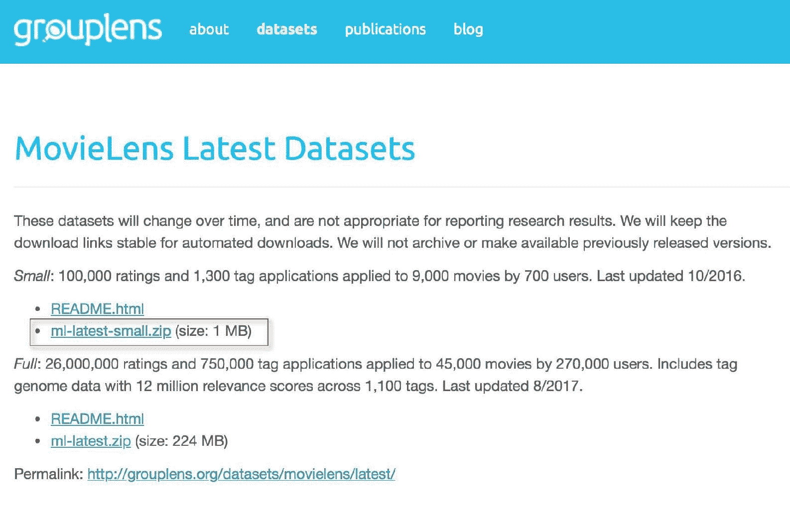

3.  `ml-latest-small.zip`下载解压时，需要提取以下四个文件:
    1.  `links.csv`
    2.  `movies.csv`
    3.  `ratings.csv`
    4.  ``tags.csv``
4.  执行以下脚本开始我们的`SparkSession`:

```py
spark = SparkSession.builder \.master("local") \.appName("RecommendationEngine") \.config("spark.executor.memory", "6gb") \.getOrCreate()
```

5.  通过执行以下脚本，确认以下六个文件可供访问:

```py
import osos.listdir('ml-latest-small/')
```

6.  使用以下脚本将每个数据集加载到 Spark 数据框中:

```py
movies = spark.read.format('com.databricks.spark.csv')\.options(header='true', inferschema='true')\.load('ml-latest-small/movies.csv')tags = spark.read.format('com.databricks.spark.csv')\.options(header='true', inferschema='true')\.load('ml-latest-small/tags.csv')links = spark.read.format('com.databricks.spark.csv')\.options(header='true', inferschema='true')\.load('ml-latest-small/links.csv')ratings = spark.read.format('com.databricks.spark.csv')\.options(header='true', inferschema='true')\.load('ml-latest-small/ratings.csv')
```

7.  通过执行以下脚本来确认每个数据集的行数:

```py
print('The number of rows in movies dataset is {}'.format(movies.toPandas().shape[0]))print('The number of rows in ratings dataset is {}'.format(ratings.toPandas().shape[0]))print('The number of rows in tags dataset is {}'.format(tags.toPandas().shape[0]))print('The number of rows in links dataset is {}'.format(links.toPandas().shape[0]))
```

# 它是如何工作的...

本节将重点解释 MovieLens 100K 数据集中每个可用数据集中的字段。看看这些步骤:

1.  数据集都可以在压缩文件`ml-latest-small.zip`中获得，其中`ratings.csv`数据集将作为我们数据的伪事实表，因为它对每部被评分的电影都有交易。数据集`ratings`有四个列名，如下图所示:


2.  数据集显示了每个用户标识在其时间过程中选择的评级，从最早的评级到最新的评级。评级的范围可以从 0.5 星到 5.0 星不等，如下图`userId = 1`所示:


3.  `tags`数据集包含一个标签列，其中包含用户在特定时间戳描述特定电影 Id 时使用的特定单词或短语。从下面的截图可以看出，userId 15 在她的一部电影中并不是特别喜欢桑德拉·布吕克:


4.  `movies`数据集主要是一个有收视率的电影类型的查找表。一部电影有 19 种独特的风格；但是，需要注意的是，一部电影可以同时隶属于多个流派，如下图所示:

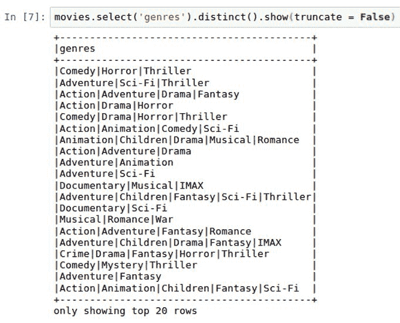

5.  最终的数据集是`links`数据集，它也起到查找表的作用。它将电影频道的电影与热门电影数据库网站上相同电影的可用数据联系起来，如[http://www.imdb.com](http://www.imdb.com)，以及[https://www.themoviedb.org](https://www.themoviedb.org)。到 IMDB 的链接位于名为 imdbId 的列下，到 MovieDB 的链接位于名为 tmdbId 的列下，如下图所示:

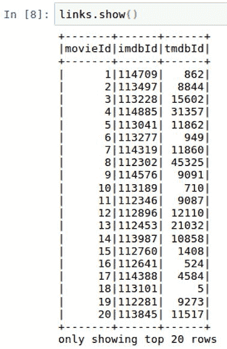

6.  在我们结束之前，确认我们真正体验到了所有数据集的预期行数总是一个好主意。这有助于确保我们在将文件上传到笔记本时不会遇到任何问题。我们应该会看到大约 10 万行的评级数据集，如下面的截图所示:


# 还有更多...

虽然我们不会在本章中使用 2000 万行数据集版本的 MovieLens，但您可以选择将其用于此推荐引擎。您仍将拥有相同的四个数据集，但数据要多得多，尤其是`ratings`数据集。如果您选择采用这种方法，可以从以下网站下载完整的压缩数据集:

[http://files.grouplens.org/datasets/movielens/ml-latest.zip](http://files.grouplens.org/datasets/movielens/ml-latest.zip)

# 请参见

要了解本章中使用的电影数据集背后的元数据的更多信息，请访问以下网站:

[http://files . group lens . org/datasets/movielens/ml-latest-small-readme . html](http://files.grouplens.org/datasets/movielens/ml-latest-small-README.html)

要了解本章中使用的电影数据集的历史和上下文的更多信息，请访问以下网站:

[https://www . slide share . net/maxharp 3r/the-movielens-datasets-history-and-context](https://www.slideshare.net/maxharp3r/the-movielens-datasets-history-and-context)

要了解更多关于*网飞奖*的信息，请访问以下网站:

[https://www.netflixprize.com/](https://www.netflixprize.com/)

# 操作和合并电影数据集

我们目前使用四个独立的数据集，但最终我们希望将其简化为一个数据集。本章将重点介绍如何将我们的数据集配对成一个数据集。

# 准备好

本节不需要任何 PySpark 库的导入，但是 SQL 连接的背景将会派上用场，因为我们将探索连接数据帧的多种方法。

# 怎么做...

本节将介绍在 PySpark 中连接数据帧的以下步骤:

1.  执行以下脚本，通过在名称末尾添加一个`_1`来重命名`ratings`中的所有字段名:

```py
for i in ratings.columns:ratings = ratings.withColumnRenamed(i, i+'_1') 
```

2.  执行以下脚本将`inner join`数据集转换为`ratings`数据集，创建一个名为`temp1`的新表:

```py
temp1 = ratings.join(movies, ratings.movieId_1 == movies.movieId, how = 'inner')
```

3.  执行以下脚本将`temp1`数据集内部连接到`links`数据集，创建一个名为`temp2`的新表:

```py
temp2 = temp1.join(links, temp1.movieId_1 == links.movieId, how = 'inner')
```

4.  通过使用以下脚本向左连接`temp2`和`tags`，创建最终的组合数据集`mainDF`:

```py
mainDF = temp2.join(tags, (temp2.userId_1 == tags.userId) & (temp2.movieId_1 == tags.movieId), how = 'left')
```

5.  通过执行以下脚本，只选择最终`mainDF`数据集所需的列:

```py
mainDF = mainDF.select('userId_1','movieId_1','rating_1','title', 'genres', 'imdbId','tmdbId', 'timestamp_1').distinct()
```

# 它是如何工作的...

本节将介绍我们将表连接在一起的设计过程，以及将保留哪些最终列:

1.  如前一节所述，评级数据框将作为我们的事实表，因为它包含了每个用户在一段时间内的所有主要评级交易。ratings 中的列将在与其他三个表的每个后续连接中使用，为了保持列的唯一性，我们将在每个列名的末尾附加一个 _1，如下图所示:


2.  我们现在可以将这三个查找表加入到评级表中。评级的前两个联接是内部联接，因为 temp1 和 temp2 的行数仍然是 100，004 行。标签评级的第三个连接需要是外部连接，以避免丢弃行。此外，连接需要应用于电影 Id 和用户 Id，因为在任何给定时间，标签对于特定用户和特定电影都是唯一的。三个表 temp1、temp2 和 mainDF 的行数可以在下面的屏幕截图中看到:

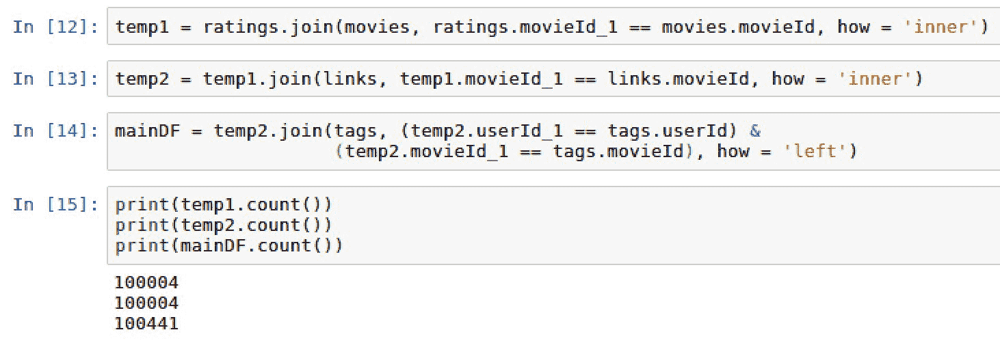

Often times when working with joins between datasets, we encounter three types of joins: inner, left, and right. An inner join will only produce a result set when both join keys are available from dataset 1 and dataset 2\. A left join will produce all of the rows from dataset 1 and only the rows with matching keys from dataset 2\. A right join will produce all of the rows from dataset 2 and only the rows from the matching keys from dataset 1\. Later on in this section, we will explore SQL joins within Spark.

3.  有趣的是，我们新创建的数据集 mainDF 有 100，441 行，而不是评级原始数据集中的 100，004 行，还有 temp1 和 temp2。有 437 个等级有一个以上的相关标签。此外，我们可以看到大多数 ratings_1 都有一个空标记值，如下图所示:


4.  我们已经积累了不再需要的额外的重复栏。共有 14 列，如下图所示:


5.  此外，我们已经确定 tags 字段相对无用，因为它有超过 99k 个空值。因此，我们将使用 dataframe 上的`select()`函数，只拉入我们将用于推荐引擎的八列。然后，我们可以确认最终的新数据帧 mainDF 具有正确的行数 100，004，如下图所示:

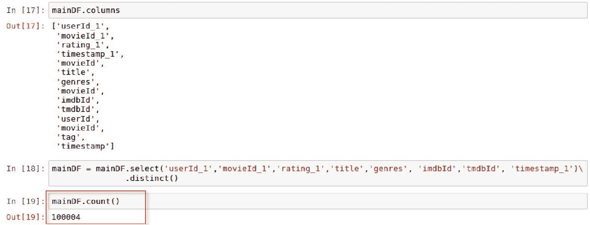

# 还有更多...

虽然我们确实使用 PySpark 在 Spark 数据框中使用函数进行了连接，但我们也可以通过将数据框注册为临时表，然后使用`sqlContext.sql()`连接它们来完成连接:

1.  首先，我们将使用`creatorReplaceTempView()`将每个数据集注册为临时视图，如以下脚本所示:

```py
movies.createOrReplaceTempView('movies_')links.createOrReplaceTempView('links_')ratings.createOrReplaceTempView('ratings_')
```

2.  接下来，我们将使用`sqlContext.sql()`函数编写我们的 SQL 脚本，就像我们使用任何其他关系数据库一样，如以下脚本所示:

```py
mainDF_SQL = \sqlContext.sql("""selectr.userId_1,r.movieId_1,r.rating_1,m.title,m.genres,l.imdbId,l.tmdbId,r.timestamp_1from ratings_ rinner join movies_ m on r.movieId_1 = m.movieIdinner join links_ l on r.movieId_1 = l.movieId""")
```

3.  最后，我们可以分析新的数据帧 mainDF_SQL，并观察到它看起来与我们的其他数据帧 mainDF 相同，同时还保持了完全相同的行数，如下面的截图所示:


# 请参见

要了解有关 Spark 中 SQL 编程的更多信息，请访问以下网站:

[https://spark . Apache . org/docs/latest/SQL-programming-guide . html](https://spark.apache.org/docs/latest/sql-programming-guide.html)

# 探索电影数据集

在进行任何建模之前，熟悉源数据集并执行一些探索性数据分析非常重要。

# 准备好

我们将导入以下库，以帮助可视化和探索 MovieLens 数据集:`matplotlib`。

# 怎么做...

本节将逐步分析电影在线数据库中的电影分级:

1.  通过执行以下脚本检索`rating_1`列上的一些汇总统计信息:

```py
mainDF.describe('rating_1').show
```

2.  通过执行以下脚本构建评分分布直方图:

```py
import matplotlib.pyplot as plt%matplotlib inlinemainDF.select('rating_1').toPandas().hist(figsize=(16, 6), grid=True)plt.title('Histogram of Ratings')plt.show()
```

3.  执行以下脚本查看电子表格数据框中直方图的值:

```py
mainDF.groupBy(['rating_1']).agg({'rating_1':'count'})\.withColumnRenamed('count(rating_1)', 'Row Count').orderBy(["Row Count"],ascending=False)\.show()
```

4.  通过执行以下脚本，可以将用户选择的评级的唯一计数存储为数据框`userId_frequency`:

```py
userId_frequency = mainDF.groupBy(['userId_1']).agg({'rating_1':'count'})\.withColumnRenamed('count(rating_1)', '# of Reviews').orderBy(["# of             Reviews"],ascending=False)
```

5.  使用以下脚本绘制`userID_frequency`的直方图:

```py
userId_frequency.select('# of Reviews').toPandas().hist(figsize=(16, 6), grid=True)plt.title('Histogram of User Ratings')plt.show()
```

# 它是如何工作的...

本节将讨论如何在电影在线数据库中分配评分和用户活动。看看这些步骤:

1.  我们可以看到，用户制作的电影平均评分约为 3.5，如下面的截图所示:

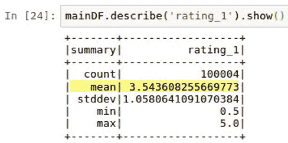

2.  尽管平均评分为 3.54，但我们可以看到直方图显示中位评分为 4，这表明用户评分严重倾向于更高的评分，如下图所示:

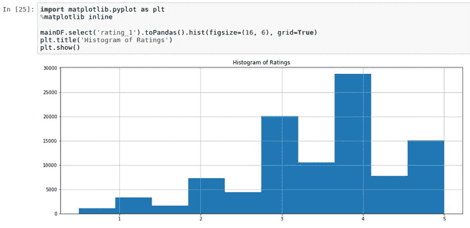

3.  再看看柱状图后面的数据，用户选择 4.0 的频率最高，其次是 3.0，然后是 5.0。此外，有趣的是，用户更有可能给出 0.0 级别而不是 0.5 级别的评分，如下图所示:


4.  我们可以看看用户选择收视率的分布情况，可以看到一些用户对于自己看过的电影非常积极的表达自己的意见。匿名用户 547 发布了 2391 个评级，如下图所示:


5.  但是，当我们查看进行评级选择的用户分布时，我们确实看到，虽然有些情况下用户自己进行了一千多次选择，但绝大多数用户进行的选择不到 250 次，如下图所示:


6.  直方图的分布是，前面的截图是长尾格式，这表明大多数事件都远离直方图的中心。这表明绝大多数评级是由少数用户定义的。

# 还有更多...

`pyspark`数据框有一些与`pandas`数据框相似的特性，可以对特定的列进行一些汇总统计。

在`pandas`中，我们使用以下脚本执行汇总统计:`dataframe['column'].describe()`。

在`pyspark`中，我们使用以下脚本执行汇总统计:`dataframe.describe('column').show()`。

# 请参见

要了解更多关于 PySpark 中`describe()`功能的信息，请访问以下网站:

# 为深度学习管道准备数据集

我们现在准备好准备我们的数据集，将其输入到我们将在 Keras 构建的深度学习模型中。

# 准备好

为`Keras`准备数据集时，我们会将以下库导入笔记本:

*   `import pyspark.sql.functions as F`
*   `import numpy as np`
*   `from pyspark.ml.feature import StringIndexer`
*   `import keras.utils`

# 怎么做...

本节将介绍为深度学习管道准备数据集的以下步骤:

1.  执行以下脚本来清除列名:

```py
mainDF = mainDF.withColumnRenamed('userId_1', 'userid')mainDF = mainDF.withColumnRenamed('movieId_1', 'movieid')mainDF = mainDF.withColumnRenamed('rating_1', 'rating')mainDF = mainDF.withColumnRenamed('timestamp_1', 'timestamp')mainDF = mainDF.withColumnRenamed('imdbId', 'imdbid')mainDF = mainDF.withColumnRenamed('tmdbId', 'tmdbid')
```

2.  `rating`列目前分为 0.5 个增量。使用以下脚本将评级调整为整数:

```py
import pyspark.sql.functions as FmainDF = mainDF.withColumn("rating", F.round(mainDF["rating"], 0))
```

3.  根据`genres`标签的频率，将`genres`列从字符串转换为名称为`genreCount`的索引，如以下脚本所示:

```py
from pyspark.ml.feature import StringIndexerstring_indexer = StringIndexer(inputCol="genres", outputCol="genreCount")mainDF = string_indexer.fit(mainDF).transform(mainDF)
```

4.  使用以下脚本配对我们的数据帧:

```py
mainDF = mainDF.select('rating', 'userid', 'movieid', 'imdbid', 'tmdbid', 'timestamp', 'genreCount')
```

5.  使用以下脚本将`mainDF`分割成用于模型训练目的的训练和测试集:

```py
trainDF, testDF = mainDF.randomSplit([0.8, 0.2], seed=1234)
```

6.  使用以下脚本将我们的两个 Spark 数据帧`trainDF`和`testDF`转换为四个`numpy`数组，以便在我们的深度学习模型中使用:

```py
import numpy as npxtrain_array = np.array(trainDF.select('userid','movieid', 'genreCount').collect())xtest_array = np.array(testDF.select('userid','movieid', 'genreCount').collect())ytrain_array = np.array(trainDF.select('rating').collect())ytest_array = np.array(testDF.select('rating').collect()
```

7.  使用以下脚本将`ytrain_array`和`ytest_array`转换为单热编码标签`ytrain_OHE`和`ytest_OHE`:

```py
import keras.utils as uytrain_OHE = u.to_categorical(ytrain_array)ytest_OHE = u.to_categorical(ytest_array)
```

# 它是如何工作的...

本节说明我们如何为深度学习管道准备数据集:

1.  为了便于在深度学习管道中使用，最好在管道接收数据之前清理列名和列的顺序。重命名列标题后，我们可以查看更新的列，如以下脚本所示:


2.  对`ratings`列执行一点操作，将 0.5 增量的值向上舍入到次高整数。这将有助于我们在 Keras 中进行多类分类，将`ratings`分成六类，而不是 11 类。

3.  要将电影类型消费到深度学习模型中，我们需要将`genres`的字符串值转换为数字标签。最频繁的流派类型的值为 0，下一个最频繁的类型的值会增加。在下面的截图中，我们可以看到《善意的狩猎》有两个流派与之相关联(戏剧|浪漫)，这是第四个最频繁的 genrecharge，值为 3.0:

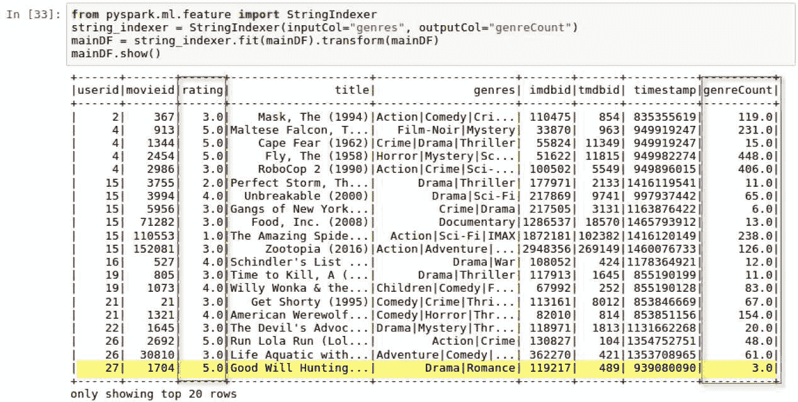

4.  深度模型不再需要“流派”列，因为它将被“重新计数”列取代，如下图所示:

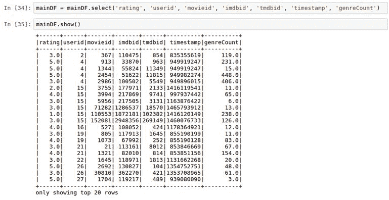

5.  我们的主要数据框架 mainDF 被分成训练 DF 和测试 DF，用于建模、培训和评估目的，使用 80/20 分割。所有三个数据帧的行数可以在下面的截图中看到:


6.  数据被传递到一个 Keras 深度学习模型中，使用矩阵代替数据帧。因此，我们的训练和测试数据帧被转换成 numpy 数组并拆分成 *x* 和 *y* 。为`xtrain_array`和`xtest_array`选择的特征是用户标识、电影 id 和重新计数。这些是我们将用于确定用户潜在评级的唯一功能。我们放弃`imdbid`和`tmdbid`，因为它们与`movieid`直接相关，因此不会提供任何附加价值。`timestamp`将被移除，以过滤掉与投票频率相关的任何偏差。最后，`ytest_array`和`ytrain_array`将包含评级的标签值。所有四个阵列的`shape`可以在下面的截图中看到:

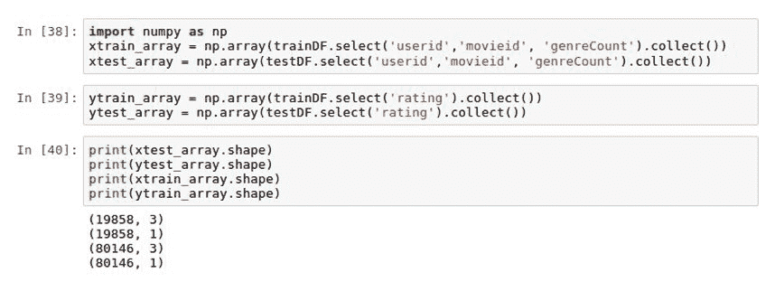

# 还有更多...

虽然`ytrain_array`和`ytest_array`都是矩阵格式的标签，但它们并不是深度学习的理想编码。由于这在技术上是我们正在构建的一个分类模型，我们需要对我们的标签进行编码，以便模型能够理解它们。这意味着我们对 0 到 5 的评分应该根据其值元素编码为 0 或 1 值。因此，如果评级获得最高值 5，则应将其编码为[0，0，0，0，0，1]。第一个位置为 0 保留，第六个位置为 1 保留，表示值为 5。我们可以使用`keras.utils`进行这种转换，并将我们的分类变量转换为单热编码变量。在此过程中，我们的训练标签的形状从(80146，1)转换为(80146，6)，如下图所示:

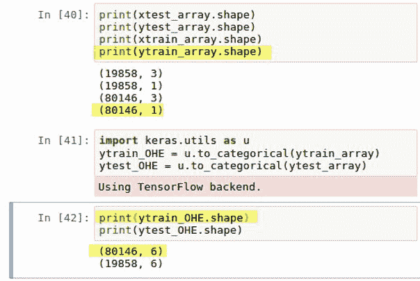

# 请参见

要了解更多关于`keras.utils`的信息，请访问以下网站:[https://keras.io/utils/](https://keras.io/utils/)

# 用 Keras 应用深度学习模型

此时，我们准备将 Keras 应用到我们的数据中。

# 准备好

我们将使用以下来自 Keras 的内容:

*   `from keras.models import Sequential`
*   `from keras.layers import Dense, Activation`

# 怎么做...

本节通过在我们的数据集上使用 Keras，介绍了应用深度学习模型的以下步骤:

1.  使用以下脚本，导入以下库以从`keras`构建`Sequential`模型:

```py
from keras.models import Sequentialfrom keras.layers import Dense, Activation
```

2.  使用以下脚本从`keras`配置`Sequential`模型:

```py
model = Sequential()model.add(Dense(32, activation='relu', input_dim=xtrain_array.shape[1]))model.add(Dense(10, activation='relu'))model.add(Dense(ytrain_OHE.shape[1], activation='softmax'))model.compile(optimizer='adam', loss='categorical_crossentropy', metrics=['accuracy'])
```

3.  我们使用以下脚本`fit`训练模型并将结果存储到名为`accuracy_history`的变量中:

```py
accuracy_history = model.fit(xtrain_array, ytrain_OHE, epochs=20, batch_size=32)
```

# 它是如何工作的...

本节解释了应用于数据集的 Keras 模型的配置，以根据所选要素预测评级。

1.  在 Keras 中，`Sequential`模型只是层的线性组合，如下所示:`Dense`用于定义深度神经网络中完全连接的层的层类型。最后，`Activation`用于将来自特征的输入转换成可用作预测的输出。神经网络中可以使用多种类型的激活函数；然而，对于这一章，我们将使用`relu`和`softmax`。

2.  `Sequential`模型配置为包括三个`Dense`层:
    1.  第一层将`input_dim`设置为`xtrain_array`的特征数量。`shape`功能使用`xtrain_array.shape[1]`将数值拉至 3。此外，第一层被设置为在神经网络的第一层具有`32`神经元。最后，使用`relu`激活功能激活三个输入参数。只有第一层需要输入维度的明确定义。这在随后的层中不是必需的，因为它们将能够从前一层推断维度的数量。
    2.  `Sequential`模型中的第二层在神经网络中具有`10`神经元以及设置为`relu`的激活函数。校正的线性单元在神经网络过程的早期使用，因为它们在训练过程中是有效的。这是因为公式很简单，因为任何小于 0 的值都会被抛出，而其他激活函数则不是这样。
    3.  `Sequential`模型的第三层也是最后一层需要六个输出，基于评级从 0 到 5 的每个可能场景。这需要将输出设置为`ytrain_OHE.shape[1]`的值。输出使用`softmax`函数生成，这通常是神经网络末端的情况，因为它对分类非常有用。此时，我们希望对 0 到 5 之间的值进行分类。
    4.  一旦指定了图层，我们必须`compile`模型。
    5.  我们使用`adam`优化模型，T0 代表**自适应矩估计**。优化器对于配置模型用来调整和更新神经网络权重的梯度下降的学习速率非常有用。`adam`是一个流行的优化器，因为据说它结合了其他常见优化器的一些最佳特性。
    6.  我们的损失函数被设置为`categorical_crossentroy`，这在预测多类分类时经常使用。损失函数在模型被训练时评估模型的性能。
3.  我们使用训练特征`xtrain_array`和训练标签`ytrain_OHE`训练模型。该模型被训练超过 20 个时期，每次将批量设置为 32。每个时期的`accuracy`和`loss`的模型输出被捕获在一个名为`accuracy_history`的变量中，可以在下面的截图中看到:

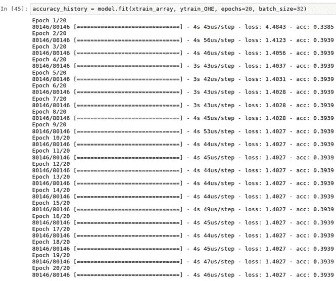

# 还有更多...

虽然我们可以打印出每个时期的损失和准确性分数，但最好将 20 个时期中每个时期的两个输出都可视化。我们可以使用以下脚本来绘制两者:

```py
plt.plot(accuracy_history.history['acc'])plt.title('Accuracy vs. Epoch')plt.xlabel('Epoch')plt.ylabel('Accuracy')plt.show()plt.plot(accuracy_history.history['loss'])plt.title('Loss vs. Epoch')plt.xlabel('Epoch')plt.ylabel('Loss')plt.show()
```

脚本的输出可以在下面的截图中看到:


似乎在第二个时期之后，模型中的损失和精度都稳定了。

# 请参见

要了解更多关于从`keras`开始使用`Sequential`车型的信息，请访问以下网站:[https://keras.io/getting-started/sequential-model-guide/](https://keras.io/getting-started/sequential-model-guide/)。

# 评估推荐引擎的准确性

我们现在可以计算我们建立在 Keras 上的深度学习模型的准确率。

# 准备好

评估`Sequential`模型的准确性需要使用 Keras 中的`model.evaluate()`函数。

# 怎么做...

我们可以通过执行以下脚本来简单地计算准确度分数`accuracy_rate`:

```py
score = model.evaluate(xtest_array, ytest_OHE, batch_size=128)accuracy_rate = score[1]*100print('accuracy is {}%'.format(round(accuracy_rate,2)))
```

# 它是如何工作的...

我们的模型性能是基于用我们的测试标签`ytest_OHE`评估我们的测试特性`xtest_array`。我们可以使用`model.evaluate()`并将`batch_size`设置为`128`元素进行评估。我们可以看到，我们的准确率在 39%左右，如下图所示:


这意味着我们能够以接近 39%的准确率确定用户在 0 到 5 之间的评分。

# 请参见

要了解有关 Keras 指标模型性能的更多信息，请访问以下网站:

[https://keras.io/metrics/](https://keras.io/metrics/)