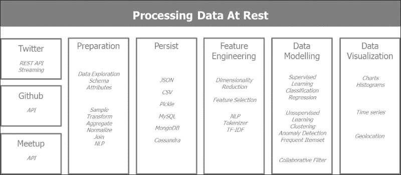
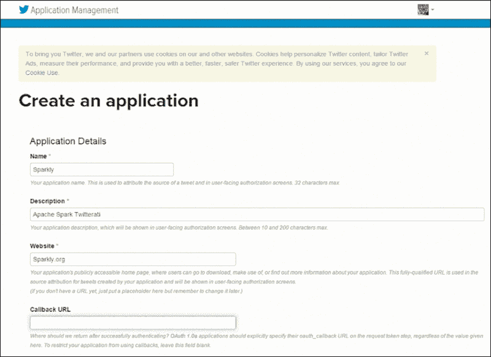
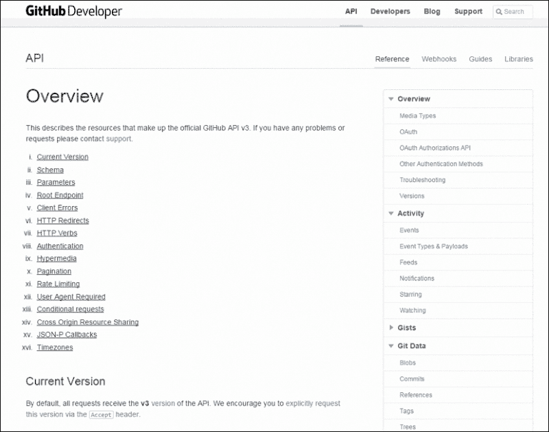
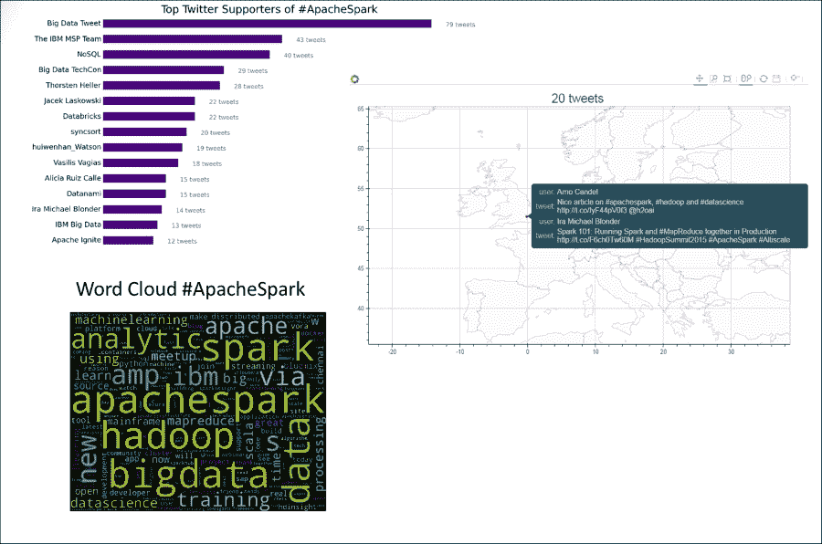

# 二、使用 Spark 构建批量和流式应用

这本书的目的是通过构建一款分析 Spark 社区在社交网络上的互动的应用，向您介绍 PySpark 和 PyData 库。 我们将从 GitHub 收集有关 Apache Spark 的信息，查看 Twitter 上的相关 tweet，并使用**Meetup**在更广泛的开源软件社区中感受一下围绕 Spark 的热议。

在本章中，我们将概述各种数据和信息来源。 我们将对它们的结构有一个了解。 我们将概述数据处理流水线，从采集到批处理和流处理。

在本节中，我们将介绍以下几点：

*   勾勒出从采集到批处理和流处理的数据处理管道，有效地描绘了我们计划构建的应用的架构。
*   了解各种数据源(GitHub、Twitter 和 Meetup)、它们的数据结构(JSON、结构化信息、非结构化文本、地理位置、时间序列数据等)及其复杂性。 我们还将讨论连接到三种不同 API 的工具，以便您可以构建自己的数据混搭。 这本书将在接下来的几章中重点讨论 Twitter。

# 构建数据密集型应用

我们在上一章中定义了数据密集型应用框架架构蓝图。 让我们把整本书中我们要用到的各种软件组件放回上下文中，放在我们的原始框架中。 下面是数据密集型体系结构框架中映射的各种软件组件的图示：


Spark 是一个非常高效的分布式计算框架。 为了充分利用它的力量，我们需要相应地构建我们的解决方案。 出于性能原因，整体解决方案还需要了解其在 CPU、存储和网络方面的使用情况。

这些需求驱动着我们解决方案的架构：

*   **延迟**：此架构结合了慢速和快速处理。 以批处理模式对历史数据进行慢速处理。 这也称为静态数据。 此阶段构建预计算模型和数据模式，一旦实时连续数据输入系统，快速处理臂将使用这些模型和数据模式。 数据的快速处理或流数据的实时分析指的是运动中的数据。 静态数据本质上是以批处理模式处理数据，延迟较长。 动态数据指的是实时接收的数据的流计算。
*   **可伸缩性**：SPARK 通过其分布式内存计算框架在本质上是线性可伸缩的。 与 Spark 交互的数据库和数据存储也需要能够随着数据量的增长线性扩展。
*   **容错**：当由于硬件、软件或网络原因发生故障时，体系结构应具有足够的弹性并始终提供可用性。
*   **灵活性**：根据用例，在此架构中放置的数据管道可以非常快速地进行调整和更新。

Spark 是独一无二的，因为它允许在同一统一平台上进行批处理和流分析。

我们将考虑两个数据处理管道：

*   第一个任务是处理静态数据，并专注于构建用于数据批处理分析的管道
*   第二个目标是动态数据，目标是实时接收数据，并基于预计算模型和数据模式提供洞察力

## 处理静态数据

让我们理解静态数据或批处理管道。 这条管道的目标是从 Twitter、GitHub 和 Meetup 获取各种数据集；为机器学习引擎 Spark MLlib 准备数据；并导出将用于批量或实时洞察力生成的基础模型。

下图说明了数据管道，以便能够处理静态数据：



## 动态处理数据

动态处理数据引入了新的复杂性水平，因为我们引入了新的故障可能性。 如果我们想要扩展，我们需要考虑引入分布式消息队列系统，如 Kafka。 我们将在下一章专门介绍流分析。

下图描述了用于处理动态数据的数据管道：


## 交互式浏览数据

构建数据密集型应用不像将数据库暴露在 Web 界面上那么简单。 在设置静态数据和运动处理数据的过程中，我们将利用 Spark 的交互分析数据的能力，优化机器学习和流式活动所需的数据丰富性和质量。 在这里，我们将经历一个数据收集、提炼和调查的迭代周期，以获得我们的应用感兴趣的数据集。

# 连接到社交网络

让我们深入研究数据密集型应用架构集成层的第一步。 我们将专注于收集数据，确保其完整性，并为 Spark 下一阶段的批量和流式数据处理做准备。 此阶段在五个流程步骤中描述：*连接*、*校正*、*收集*、*合成*和*消耗*。 这些是数据探索的迭代步骤，将使我们熟悉数据，并帮助我们改进数据结构以进行进一步处理。

下图描述了消耗的数据采集和细化的迭代过程：


我们将连接到感兴趣的社交网络：Twitter、GitHub 和 Meetup。 我们将讨论访问**API**(缩写为**Application Programming Interface**)的模式，以及如何在遵守社交网络施加的速率限制的同时创建与那些服务的 REST 式连接。 **REST**(**表示状态转移**的缩写)是 Internet 上最广泛采用的架构风格，以支持可伸缩的 Web 服务。 它依赖于主要以**JSON**(**JavaScript Object Notation**的缩写)交换消息。 RESTful API 和 Web 服务实现了四个最流行的动词`GET`、`PUT`、`POST`和`DELETE`。 `GET`用于从给定的`URI`检索元素或集合。 `PUT`使用新集合更新集合。 `POST`允许创建新条目，而`DELETE`删除集合。

## 获取 Twitter 数据

Twitter 允许注册用户通过一个名为 OAuth 的授权协议访问其搜索和流传输 tweet 服务，该协议允许 API 应用安全地代表用户行动。 为了创建连接，第一步是使用 twitter 在[https://apps.twitter.com/app/new](https://apps.twitter.com/app/new)创建一个应用。



创建应用后，Twitter 将发出四个代码，允许其进入 Twitter 软管：

```py
CONSUMER_KEY = 'GetYourKey@Twitter'
CONSUMER_SECRET = ' GetYourKey@Twitter'
OAUTH_TOKEN = ' GetYourToken@Twitter'
OAUTH_TOKEN_SECRET = ' GetYourToken@Twitter'
```

如果您希望体验一下所提供的各种 RESTful 查询，您可以在开发控制台[https://dev.twitter.com/rest/tools/console](https://dev.twitter.com/rest/tools/console)上探索 TwitterAPI：


我们将使用以下代码在 Twitter 上建立编程连接，这将激活我们的 OAuth 访问，并允许我们在速率限制下访问 Twitter API。 在流模式下，限制是 GET 请求。

## 获取 GitHub 数据

GitHub 使用与 Twitter 类似的身份验证流程。 在[https://developer.github.com/v3/](https://developer.github.com/v3/)向 giHub 正式注册后，前往开发人员网站并检索您的凭据：



## 正在获取 Meetup 数据

Meetup 可以使用开发者资源中颁发给 Meetup.com 成员的令牌来访问。 Meetup API 访问所需的令牌或 OAUTH 凭证可在其开发者网站[https://secure.meetup.com/meetup_api](https://secure.meetup.com/meetup_api)上获得：


# 分析数据

让我们先体验一下从每个社交网络中提取的数据，并了解每个来源的数据结构。

## 发现推文的解剖学

在这一节中，我们将与 Twitter API 建立连接。 Twitter 提供了两种连接模式：rest API，允许我们搜索给定搜索词或标签的历史 tweet；以及 Streaming API，它在适当的速率限制下提供实时 tweet。

为了更好地理解如何使用 Twitter API，我们将经历以下步骤：

1.  安装 Twitter Python 库。
2.  通过 OAuth 以编程方式建立连接，这是 Twitter 所需的身份验证。
3.  在中搜索查询*Apache Spark*的最近 tweet，并浏览获得的结果。
4.  确定感兴趣的关键属性并从 JSON 输出检索信息。

让我们一步一步来了解一下：

1.  安装 Python Twitter 库。 为了安装它，您需要从命令行编写`pip install twitter`：

    ```py
    $ pip install twitter

    ```

2.  创建 Python Twitter API 类及其用于身份验证、搜索和解析结果的基本方法。 `self.auth`从 Twitter 获取凭据。 然后，它创建一个注册的 API 作为`self.api`。 我们实现了两个方法：第一个方法使用给定的查询搜索 Twitter，第二个方法解析输出以检索相关信息，如 tweet ID、tweet 文本和 tweet 作者。 代码如下：

    ```py
    import twitter
    import urlparse
    from pprint import pprint as pp

    class TwitterAPI(object):
        """
        TwitterAPI class allows the Connection to Twitter via OAuth
        once you have registered with Twitter and receive the 
        necessary credentiials 
        """

    # initialize and get the twitter credentials
         def __init__(self): 
            consumer_key = 'Provide your credentials'
            consumer_secret = 'Provide your credentials'
            access_token = 'Provide your credentials'
            access_secret = 'Provide your credentials'

            self.consumer_key = consumer_key
            self.consumer_secret = consumer_secret
            self.access_token = access_token
            self.access_secret = access_secret

    #
    # authenticate credentials with Twitter using OAuth
            self.auth = twitter.oauth.OAuth(access_token, access_secret, consumer_key, consumer_secret)
        # creates registered Twitter API
            self.api = twitter.Twitter(auth=self.auth)
    #
    # search Twitter with query q (i.e. "ApacheSpark") and max. result
        def searchTwitter(self, q, max_res=10,**kwargs):
            search_results = self.api.search.tweets(q=q, count=10, **kwargs)
            statuses = search_results['statuses']
            max_results = min(1000, max_res)

            for _ in range(10): 
                try:
                    next_results = search_results['search_metadata']['next_results']
                except KeyError as e: 
                    break

                next_results = urlparse.parse_qsl(next_results[1:])
                kwargs = dict(next_results)
                search_results = self.api.search.tweets(**kwargs)
                statuses += search_results['statuses']

                if len(statuses) > max_results: 
                    break
            return statuses
    #
    # parse tweets as it is collected to extract id, creation 
    # date, user id, tweet text
        def parseTweets(self, statuses):
            return [ (status['id'], 
                      status['created_at'], 
                      status['user']['id'],
                      status['user']['name'], 
                      status['text'], url['expanded_url']) 
                            for status in statuses 
                                for url in status['entities']['urls'] ]
    ```

3.  使用所需的身份验证实例化类：

    ```py
    t= TwitterAPI()
    ```

4.  对查询词*Apache Spark*运行搜索：

    ```py
    q="ApacheSpark"
    tsearch = t.searchTwitter(q)
    ```

5.  分析 JSON 输出：

    ```py
    pp(tsearch[1])

    {u'contributors': None,
     u'coordinates': None,
     u'created_at': u'Sat Apr 25 14:50:57 +0000 2015',
     u'entities': {u'hashtags': [{u'indices': [74, 86], u'text': u'sparksummit'}],
                   u'media': [{u'display_url': u'pic.twitter.com/WKUMRXxIWZ',
                               u'expanded_url': u'http://twitter.com/bigdata/status/591976255831969792/photo/1',
                               u'id': 591976255156715520,
                               u'id_str': u'591976255156715520',
                               u'indices': [143, 144],
                               u'media_url': 
    ...(snip)... 
     u'text': u'RT @bigdata: Enjoyed catching up with @ApacheSpark users &amp; leaders at #sparksummit NYC: video clips are out http://t.co/qrqpP6cG9s http://t\u2026',
     u'truncated': False,
     u'user': {u'contributors_enabled': False,
               u'created_at': u'Sat Apr 04 14:44:31 +0000 2015',
               u'default_profile': True,
               u'default_profile_image': True,
               u'description': u'',
               u'entities': {u'description': {u'urls': []}},
               u'favourites_count': 0,
               u'follow_request_sent': False,
               u'followers_count': 586,
               u'following': False,
               u'friends_count': 2,
               u'geo_enabled': False,
               u'id': 3139047660,
               u'id_str': u'3139047660',
               u'is_translation_enabled': False,
               u'is_translator': False,
               u'lang': u'zh-cn',
               u'listed_count': 749,
               u'location': u'',
               u'name': u'Mega Data Mama',
               u'notifications': False,
               u'profile_background_color': u'C0DEED',
               u'profile_background_image_url': u'http://abs.twimg.cimg/themes/theme1/bg.png',
               u'profile_background_image_url_https': u'https://abs.twimg.cimg/themes/theme1/bg.png',
               ...(snip)... 
               u'screen_name': u'MegaDataMama',
               u'statuses_count': 26673,
               u'time_zone': None,
               u'url': None,
               u'utc_offset': None,
               u'verified': False}}
    ```

6.  解析 Twitter 输出以检索感兴趣的关键信息：

    ```py
    tparsed = t.parseTweets(tsearch)
    pp(tparsed)

    [(591980327784046592,
      u'Sat Apr 25 15:01:23 +0000 2015',
      63407360,
      u'Jos\xe9 Carlos Baquero',
      u'Big Data systems are making a difference in the fight against cancer. #BigData #ApacheSpark http://t.co/pnOLmsKdL9',
      u'http://tmblr.co/ZqTggs1jHytN0'),
     (591977704464875520,
      u'Sat Apr 25 14:50:57 +0000 2015',
      3139047660,
      u'Mega Data Mama',
      u'RT @bigdata: Enjoyed catching up with @ApacheSpark users &amp; leaders at #sparksummit NYC: video clips are out http://t.co/qrqpP6cG9s http://t\u2026',
      u'http://goo.gl/eF5xwK'),
     (591977172589539328,
      u'Sat Apr 25 14:48:51 +0000 2015',
      2997608763,
      u'Emma Clark',
      u'RT @bigdata: Enjoyed catching up with @ApacheSpark users &amp; leaders at #sparksummit NYC: video clips are out http://t.co/qrqpP6cG9s http://t\u2026',
      u'http://goo.gl/eF5xwK'),
     ... (snip)...  
     (591879098349268992,
      u'Sat Apr 25 08:19:08 +0000 2015',
      331263208,
      u'Mario Molina',
      u'#ApacheSpark speeds up big data decision-making http://t.co/8hdEXreNfN',
      u'http://www.computerweekly.com/feature/Apache-Spark-speeds-up-big-data-decision-making')]
    ```

# 探索 GitHub 世界

为了更好地理解如何使用 GitHub API，我们将经历以下步骤：

1.  安装 GitHub Python 库。
2.  使用我们在开发者网站注册时提供的 Token 即可访问该接口。
3.  检索有关托管 Spark 存储库的 Apache Foundation 的一些关键事实。

让我们一步一步地来了解一下这个过程：

1.  安装 Python PyGithub 库。 为了安装它，您需要从命令行`pip install PyGithub`：

    ```py
    pip install PyGithub
    ```

2.  以编程方式创建客户端以实例化 GitHub API：

    ```py
    from github import Github

    # Get your own access token

    ACCESS_TOKEN = 'Get_Your_Own_Access_Token'

    # We are focusing our attention to User = apache and Repo = spark

    USER = 'apache'
    REPO = 'spark'

    g = Github(ACCESS_TOKEN, per_page=100)
    user = g.get_user(USER)
    repo = user.get_repo(REPO)
    ```

3.  从 Apache 用户检索关键事实。 GitHub 中有 640 个活动的 Apache 存储库：

    ```py
    repos_apache = [repo.name for repo in g.get_user('apache').get_repos()]
    len(repos_apache)
    640
    ```

4.  从 Spark 存储库检索关键事实，Spark Repo 中使用的编程语言如下所示：

    ```py
    pp(repo.get_languages())

    {u'C': 1493,
     u'CSS': 4472,
     u'Groff': 5379,
     u'Java': 1054894,
     u'JavaScript': 21569,
     u'Makefile': 7771,
     u'Python': 1091048,
     u'R': 339201,
     u'Scala': 10249122,
     u'Shell': 172244}
    ```

5.  检索广泛的 Spark GitHub 存储库网络的几个关键参与者。 在撰写本文时，Apache Spark 存储库中有 3738 名观星者。 这个网络非常庞大。 第一位观星者是*Matei Zaharia*，他是 Spark 项目的联合创始人，当时他正在伯克利攻读博士学位。

    ```py
    stargazers = [ s for s in repo.get_stargazers() ]
    print "Number of stargazers", len(stargazers)
    Number of stargazers 3738

    [stargazers[i].login for i in range (0,20)]
    [u'mateiz',
     u'beyang',
     u'abo',
     u'CodingCat',
     u'andy327',
     u'CrazyJvm',
     u'jyotiska',
     u'BaiGang',
     u'sundstei',
     u'dianacarroll',
     u'ybotco',
     u'xelax',
     u'prabeesh',
     u'invkrh',
     u'bedla',
     u'nadesai',
     u'pcpratts',
     u'narkisr',
     u'Honghe',
     u'Jacke']
    ```

## 通过 Meetup 了解社区

为了更好地了解如何使用 Meetup API，我们将经历以下步骤：

1.  创建一个 Python 程序以使用身份验证令牌调用 Meetup API。
2.  检索 MeetUp 组(如*London Data Science*)的过去事件信息。
3.  检索 Meetup 成员的配置文件，以便分析他们参与类似 Meetup 组的情况。

让我们一步一步地来了解一下这个过程：

1.  由于没有可靠的 Meetup API Python 库，我们将以编程方式创建一个客户端来实例化 Meetup API：

    ```py
    import json
    import mimeparse
    import requests
    import urllib
    from pprint import pprint as pp

    MEETUP_API_HOST = 'https://api.meetup.com'
    EVENTS_URL = MEETUP_API_HOST + '/2/events.json'
    MEMBERS_URL = MEETUP_API_HOST + '/2/members.json'
    GROUPS_URL = MEETUP_API_HOST + '/2/groups.json'
    RSVPS_URL = MEETUP_API_HOST + '/2/rsvps.json'
    PHOTOS_URL = MEETUP_API_HOST + '/2/photos.json'
    GROUP_URLNAME = 'London-Machine-Learning-Meetup'
    # GROUP_URLNAME = 'London-Machine-Learning-Meetup' # 'Data-Science-London'

    class Mee
    tupAPI(object):
        """
        Retrieves information about meetup.com
        """
        def __init__(self, api_key, num_past_events=10, http_timeout=1,
                     http_retries=2):
            """
            Create a new instance of MeetupAPI
            """
            self._api_key = api_key
            self._http_timeout = http_timeout
            self._http_retries = http_retries
            self._num_past_events = num_past_events

        def get_past_events(self):
            """
            Get past meetup events for a given meetup group
            """
            params = {'key': self._api_key,
                      'group_urlname': GROUP_URLNAME,
                      'status': 'past',
                      'desc': 'true'}
            if self._num_past_events:
                params['page'] = str(self._num_past_events)

            query = urllib.urlencode(params)
            url = '{0}?{1}'.format(EVENTS_URL, query)
            response = requests.get(url, timeout=self._http_timeout)
            data = response.json()['results']
            return data

        def get_members(self):
            """
            Get meetup members for a given meetup group
            """
            params = {'key': self._api_key,
                      'group_urlname': GROUP_URLNAME,
                      'offset': '0',
                      'format': 'json',
                      'page': '100',
                      'order': 'name'}
            query = urllib.urlencode(params)
            url = '{0}?{1}'.format(MEMBERS_URL, query)
            response = requests.get(url, timeout=self._http_timeout)
            data = response.json()['results']
            return data

        def get_groups_by_member(self, member_id='38680722'):
            """
            Get meetup groups for a given meetup member
            """
            params = {'key': self._api_key,
                      'member_id': member_id,
                      'offset': '0',
                      'format': 'json',
                      'page': '100',
                      'order': 'id'}
            query = urllib.urlencode(params)
            url = '{0}?{1}'.format(GROUPS_URL, query)
            response = requests.get(url, timeout=self._http_timeout)
            data = response.json()['results']
            return data
    ```

2.  然后，我们将从给定的 Meetup 组中检索过去的事件：

    ```py
    m = MeetupAPI(api_key='Get_Your_Own_Key')
    last_meetups = m.get_past_events()
    pp(last_meetups[5])

    {u'created': 1401809093000,
     u'description': u"<p>We are hosting a joint meetup between Spark London and Machine Learning London. Given the excitement in the machine learning community around Spark at the moment a joint meetup is in order!</p> <p>Michael Armbrust from the Apache Spark core team will be flying over from the States to give us a talk in person.\xa0Thanks to our sponsors, Cloudera, MapR and Databricks for helping make this happen.</p> <p>The first part of the talk will be about MLlib, the machine learning library for Spark,\xa0and the second part, on\xa0Spark SQL.</p> <p>Don't sign up if you have already signed up on the Spark London page though!</p> <p>\n\n\nAbstract for part one:</p> <p>In this talk, we\u2019ll introduce Spark and show how to use it to build fast, end-to-end machine learning workflows. Using Spark\u2019s high-level API, we can process raw data with familiar libraries in Java, Scala or Python (e.g. NumPy) to extract the features for machine learning. Then, using MLlib, its built-in machine learning library, we can run scalable versions of popular algorithms. We\u2019ll also cover upcoming development work including new built-in algorithms and R bindings.</p> <p>\n\n\n\nAbstract for part two:\xa0</p> <p>In this talk, we'll examine Spark SQL, a new Alpha component that is part of the Apache Spark 1.0 release. Spark SQL lets developers natively query data stored in both existing RDDs and external sources such as Apache Hive. A key feature of Spark SQL is the ability to blur the lines between relational tables and RDDs, making it easy for developers to intermix SQL commands that query external data with complex analytics. In addition to Spark SQL, we'll explore the Catalyst optimizer framework, which allows Spark SQL to automatically rewrite query plans to execute more efficiently.</p>",
     u'event_url': u'http://www.meetup.com/London-Machine-Learning-Meetup/events/186883262/',
     u'group': {u'created': 1322826414000,
                u'group_lat': 51.52000045776367,
                u'group_lon': -0.18000000715255737,
                u'id': 2894492,
                u'join_mode': u'open',
                u'name': u'London Machine Learning Meetup',
                u'urlname': u'London-Machine-Learning-Meetup',
                u'who': u'Machine Learning Enthusiasts'},
     u'headcount': 0,
     u'id': u'186883262',
     u'maybe_rsvp_count': 0,
     u'name': u'Joint Spark London and Machine Learning Meetup',
     u'rating': {u'average': 4.800000190734863, u'count': 5},
     u'rsvp_limit': 70,
     u'status': u'past',
     u'time': 1403200800000,
     u'updated': 1403450844000,
     u'utc_offset': 3600000,
     u'venue': {u'address_1': u'12 Errol St, London',
                u'city': u'EC1Y 8LX',
                u'country': u'gb',
                u'id': 19504802,
                u'lat': 51.522533,
                u'lon': -0.090934,
                u'name': u'Royal Statistical Society',
                u'repinned': False},
     u'visibility': u'public',
     u'waitlist_count': 84,
     u'yes_rsvp_count': 70}
    ```

3.  获取有关 Meetup 成员的信息：

    ```py
    members = m.get_members()

    {u'city': u'London',
      u'country': u'gb',
      u'hometown': u'London',
      u'id': 11337881,
      u'joined': 1421418896000,
      u'lat': 51.53,
      u'link': u'http://www.meetup.com/members/11337881',
      u'lon': -0.09,
      u'name': u'Abhishek Shivkumar',
      u'other_services': {u'twitter': {u'identifier': u'@abhisemweb'}},
      u'photo': {u'highres_link': u'http://photos3.meetupstatic.com/photos/member/9/6/f/3/highres_10898643.jpeg',
                 u'photo_id': 10898643,
                 u'photo_link': u'http://photos3.meetupstatic.com/photos/member/9/6/f/3/member_10898643.jpeg',
                 u'thumb_link': u'http://photos3.meetupstatic.com/photos/member/9/6/f/3/thumb_10898643.jpeg'},
      u'self': {u'common': {}},
      u'state': u'17',
      u'status': u'active',
      u'topics': [{u'id': 1372, u'name': u'Semantic Web', u'urlkey': u'semweb'},
                  {u'id': 1512, u'name': u'XML', u'urlkey': u'xml'},
                  {u'id': 49585,
                   u'name': u'Semantic Social Networks',
                   u'urlkey': u'semantic-social-networks'},
                  {u'id': 24553,
                   u'name': u'Natural Language Processing',
    ...(snip)...
                   u'name': u'Android Development',
                   u'urlkey': u'android-developers'}],
      u'visited': 1429281599000}
    ```

# 预览我们的应用

我们面临的挑战是理解从这些社交网络中检索到的数据，找到关键的关系，并从中获得洞察力。 以下是一些令人感兴趣的要素：

*   可视化最具影响力的人：发现社区中最具影响力的人：
    *   在*Apache Spark*上有大量 Twitter 用户
    *   GitHub 中的提交者
    *   领先的 Meetup 演示文稿
*   了解网络：GitHub 提交者、观察者和观星者的网络图
*   确定热门位置：为 Spark 定位最活跃的位置

以下屏幕截图提供了我们应用的预览：



# 摘要

在本章中，我们展示了应用的总体架构。 我们解释了处理数据的两个主要范例：批处理(也称为静态数据)和流分析(称为运动数据)。 我们开始与三个感兴趣的社交网络建立连接：Twitter、GitHub 和 Meetup。 我们对数据进行了采样，并提供了我们目标构建的预览。 本书的其余部分将重点介绍 Twitter 数据集。 我们在这里提供了访问三个社交网络的工具和 API，因此您可以在稍后阶段创建自己的数据 mashup。 我们现在准备调查收集到的数据，这将是下一章的主题。

在下一章中，我们将更深入地研究数据分析，为我们的目的提取感兴趣的关键属性，并管理用于批处理和流处理的信息存储。