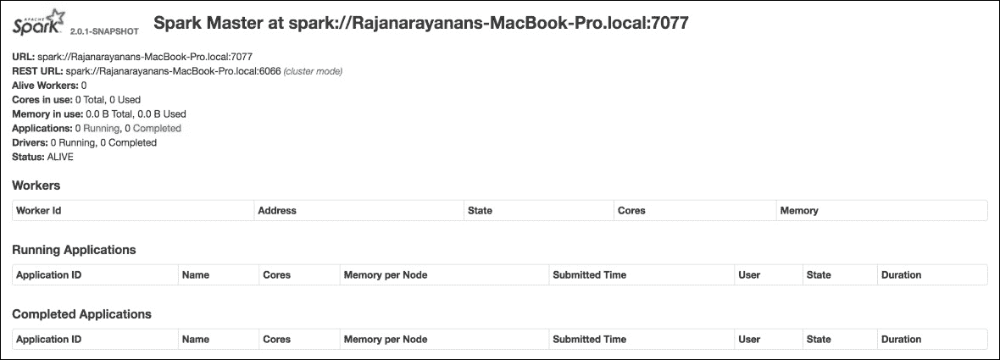
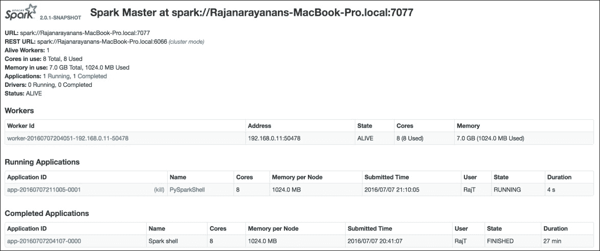
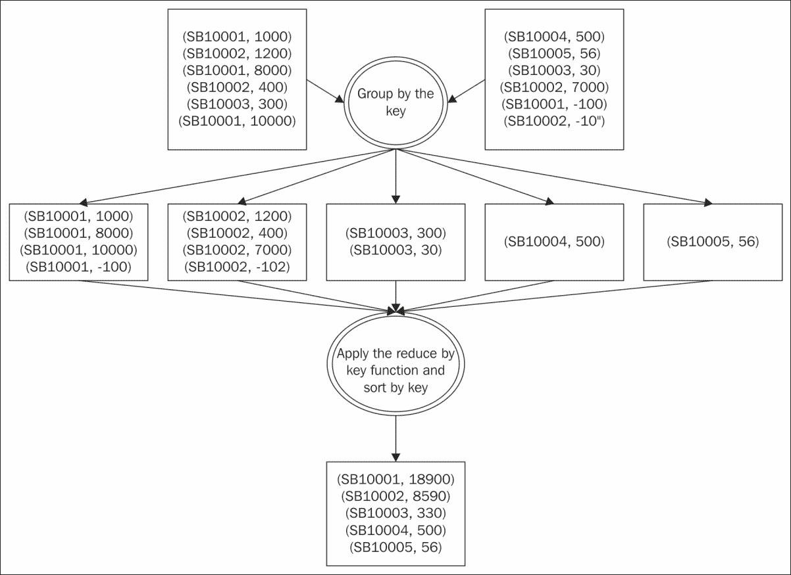

# 第二章。Spark编程模型

**提取**、**转换**、**加载** ( **ETL** )工具随着组织中数据的增长而激增。需要将数据从一个源移动到一个或多个目的地，在到达目的地之前对其进行动态处理，这些都是当时的要求。大多数时候，这些 ETL 工具只支持少数几种类型的数据，只有少数几种类型的数据源和目的地，并且对扩展是封闭的，以允许它们支持新的数据类型和新的数据源和目的地。由于对工具的这些严格限制，有时甚至一步转换过程也必须在多个步骤中完成。这些复杂的方法要求在人力和其他计算资源方面有不必要的浪费。商业 ETL 供应商的主要论点始终保持不变，一种尺寸并不适合所有人。所以使用*我们的*工具套件，而不是市面上的单点产品。由于大量需要处理数据，许多组织陷入了供应商锁定。几乎所有在 2005 年之前引入的工具都没有利用计算机多核架构的真正力量，如果它们支持在商品硬件上运行它们的工具的话。因此，使用这些工具完成简单但大量的数据处理工作需要几个小时，有时甚至几天。

Spark 在市场上一炮而红，因为它能够处理大量的数据类型以及越来越多的数据源和数据目的地。Spark 提供的最重要和最基本的数据抽象是**弹性分布式数据集** ( **RDD** )。如前一章所述，Spark 支持在节点集群上进行分布式处理。当有一群节点时，很有可能当数据处理正在进行时，一些节点会死亡。当这样的失败发生时，框架应该能够走出这样的失败。Spark 就是为此而设计的，这也是 RDD“T4”弹性“T5”部分的意义所在。如果有大量的数据需要处理，并且集群中有可用的节点，那么该框架应该能够将大数据集分割成更小的块，并将它们分布在集群中的多个节点上并行处理。Spark 有能力做到这一点，这就是 RDD 的*配送*部分的意义。换句话说，Spark 是从头开始设计的，它的基本数据集抽象能够被确定性地分割成更小的块，并分布到集群中的多个节点进行并行处理，同时优雅地处理节点中的故障。

我们将在本章中讨论以下主题:

*   使用 Spark 进行函数式编程
*   Spark RDD
*   数据转换和操作
*   Spark监测
*   Spark 编程基础
*   从文件创建 RDDs
*   Spark库

# 用 Spark 进行功能编程

运行时对象的突变，以及由于程序逻辑产生的副作用而无法从程序或函数中获得一致的结果，使得许多应用非常复杂。如果编程语言中的函数开始表现得完全像数学函数，函数的输出只依赖于输入，这就给应用带来了很大的可预测性。计算机编程范式非常强调构建这些函数和基于这些函数的其他元素的过程，并以使用任何其他数据类型的方式使用这些函数，这种范式通常被称为函数编程范式。在基于 JVM 的编程语言中，Scala 是最重要的语言之一，它具有非常强大的函数式编程能力，而且不会丢失任何面向对象的功能。Spark 主要用 Scala 编写。正因为如此，Spark 从 Scala 中吸收了许多非常好的概念。

# 了解星火 RDD

Spark 从 Scala 获得的最重要的特性是能够使用函数作为 Spark 转换和 Spark 动作的参数。通常，Spark 中的 RDD 就像 Scala 中的一个集合对象。正因为如此，Scala 集合的一些数据转换方法名称在 Spark RDD 中被用来做同样的事情。这是一种非常简洁的方法，那些对 Scala 有专业知识的人会发现用 RDD 编程非常容易。我们将在下面的章节中看到一些重要的特性。

## Spark RDD 是不可改变的

有一些强有力的规则作为创建 RDD 的基础。一旦一个 RDD 被有意无意地创造出来，它就不能被改变。这为 RDD 的建设提供了另一个视角。因此，当处理 RDD 某个部分的节点死亡时，驱动程序可以重新创建这些部分，并将处理这些部分的任务分配给另一个节点，最终成功完成数据处理作业。

由于 RDD 是不可变的，将一个大的拆分成较小的，将它们分配给不同的工作节点进行处理，并最终编译结果以产生最终结果，可以安全地完成，而不用担心底层数据被更改。

## Spark RDD 是可分配的

如果 Spark 在集群模式下运行，其中有多个工作节点可用于执行任务，则所有这些节点都将具有不同的执行上下文。各个任务分布在不同的 JVM 上运行。一个大 RDD 的所有这些活动被分成更小的块，分发到工作节点进行处理，最后将结果组装回来，对用户来说是完全隐藏的。

Spark 有自己的机制，用于从数据处理过程中出现的系统故障和其他形式的错误中恢复，因此这种数据抽象具有很高的弹性。

## Spark RDD 活在记忆中

Spark 确实尽可能地将所有 rdd 保存在内存中。只有在极少数情况下，即 Spark 内存不足或数据增长超出容量时，才会将其写入磁盘。对 RDD 的大部分处理发生在内存中，这就是为什么 Spark 能够以闪电般的速度处理数据的原因。

## Spark RDD 是强类型

可以使用任何支持的数据类型创建 Spark RDD。这些数据类型可以是 Scala/Java 支持的内部数据类型，也可以是自定义创建的数据类型，例如您自己的类。这个设计决策带来的最大优势是没有运行时错误。如果它将因为数据类型问题而中断，它将在编译时中断。

下表捕获包含零售银行账户数据元组的 RDD 结构。它属于 RDD 类型[(字符串，字符串，字符串，双精度)]:

<colgroup><col> <col> <col> <col></colgroup> 
| 

**账**账

 | 

**名**

 | 

**姓氏**

 | 

**账户余额**

 |
| --- | --- | --- | --- |
| SB001 | 约翰 | 马太福音 | Two hundred and fifty |
| SB002 | 屈赛 | 砖石工 | Four hundred and fifty |
| SB003 | 保罗 | 汤姆逊 | Five hundred and sixty |
| SB004 | 萨曼塔 | 格里沙姆 | Six hundred and fifty |
| SB005 | 约翰 | 树丛 | One thousand |

假设这个 RDD 正在经历一个过程，计算 N1、N2 和 N3 这三个节点集群中所有这些帐户的总量；它可以被拆分和分发，用于并行化数据处理。下表包含分发到节点 N1 进行处理的 RDD[(字符串、字符串、字符串、双精度)]的元素:

<colgroup><col> <col> <col> <col></colgroup> 
| 

**账**账

 | 

**名**

 | 

**姓氏**

 | 

**账户余额**

 |
| --- | --- | --- | --- |
| SB001 | 约翰 | 马太福音 | Two hundred and fifty |
| SB002 | 屈赛 | 砖石工 | Four hundred and fifty |

下表包含分发到节点 N2 进行处理的 RDD[(字符串、字符串、字符串、双精度)]的元素:

<colgroup><col> <col> <col> <col></colgroup> 
| 

**账**账

 | 

**名**

 | 

**姓氏**

 | 

**账户余额**

 |
| --- | --- | --- | --- |
| SB003 | 保罗 | 汤姆逊 | Five hundred and sixty |
| SB004 | 萨曼塔 | 格里沙姆 | Six hundred and fifty |
| SB005 | 约翰 | 树丛 | One thousand |

在节点 N1，求和过程发生，结果返回给Spark驱动程序。类似地，在节点 N2，求和过程发生，结果返回到 Spark 驱动程序，并计算最终结果。

Spark 有非常确定的规则，将一个大 RDD 分割成更小的块，分发给不同的节点，因此，即使节点 N1 发生了什么事，Spark 也知道如何准确地重新创建在节点 N1 丢失的块，并通过向节点 N3 发送相同的有效载荷来继续数据处理操作。

图 1 抓住了这个过程的本质:


图 1

### 类型

Spark 在其驱动程序内存和集群节点上的执行器内存中进行大量处理。Spark 有各种可以配置和微调的参数，以便在处理开始前提供所需的资源。

# 【RDDs 的数据转换和动作

Spark 使用 RDDs 进行数据处理。从文本文件和 NoSQL 数据存储等相关数据源中读取数据以形成关系数据库。在这样的 RDD 上，执行各种数据转换，最后收集结果。准确地说，Spark伴随着Spark转换和作用于 rdd 的Spark动作。让我们以下面的 RDD 为例，获取零售银行交易的列表，该列表属于 RDD 类型[(字符串、字符串、双精度)]:

<colgroup><col> <col> <col></colgroup> 
| 

**账**账

 | 

除外

 | 

**中转点**

 |
| --- | --- | --- |
| SB001 | TR001 | Two hundred and fifty |
| SB002 | TR004 | Four hundred and fifty |
| SB003 | TR010 | One hundred and twenty |
| SB001 | TR012 | -120.00 |
| SB001 | TR015 | -10.00 |
| SB003 | TR020 | One hundred |

以`(AccountNo,TranNo,TranAmount)`的形式计算来自 RDD 的交易的账户级汇总:

1.  首先，它必须转换为键值对`(AccountNo,TranAmount)`的形式，其中`AccountNo` 是键，但会有多个元素具有相同的键。
2.  在此键上，对`TranAmount`进行求和操作，得到另一个 RDD 形式(账号，总金额)，其中每个账号只有一个元素，总金额是给定账号所有转账金额的总和。
3.  现在对`AccountNo`上的键值对进行排序，并存储输出。

在所描述的整个过程中，除了输出的存储，所有都是 Spark 转换。输出的存储是一个**Spark动作**。Spark 根据需要做所有这些操作。应用Spark变换时，Spark不起作用。当链中的第一个Spark动作被调用时，真正的行为发生了。然后它勤奋地按顺序应用前面所有的Spark转换，然后执行第一个遇到的Spark动作。这是基于一个叫做**懒惰评价**的概念。

### 注

在声明和使用变量的编程语言上下文中， *Lazy Evaluation* 表示变量只有在程序中第一次使用时才被求值。

除了将输出存储到磁盘的操作之外，还有许多其他可能的 Spark 操作，包括但不限于以下列表中给出的一些操作:

*   将结果 RDD 中的所有内容收集到驻留在驱动程序中的数组中
*   计算 RDD 的元素数量
*   计算 RDD 元素中每个键的元素数量
*   以 RDD 为例
*   从常用于前 N 名报告的 RDD 中提取给定数量的元素
*   从 RDD 提取元素样本
*   迭代 RDD 的所有元素

在这个例子中，许多转换是在动态创建的各种关系数据库上完成的，直到过程完成。换句话说，每当在 RDD 上进行改造时，就会产生一个新的 RDD。这是因为 rdd 本质上是不可变的。这些在每次转换结束时创建的关系数据库可以保存下来供将来参考，否则它们最终会超出范围。

总而言之，创建一个或多个关系数据库并在其上应用转换和操作的过程是一种非常常见的使用模式，在 Spark 应用中随处可见。

### 注

前面的数据转换示例中引用的表包含 RDD[(字符串、字符串、双精度)]类型的 RDD 中的值。在这个 RDD 中，有多个元素，每个元素都是一个元组类型(字符串，字符串，双精度)。在程序员和用户群体中，为了便于参考和表达想法，术语`record`被用来指代 RDD 的一个元素，这是非常常见的。在Spark RDD 没有记录、行和列的概念。换句话说，术语`record` 被错误地用作 RDD 元素的同义词，它可能是复杂的数据类型，如元组或非标量数据类型。在本书中，这种做法是高度克制使用正确的术语。

在 Spark 中，有大量的 Spark 转换可用。这些函数非常强大，因为它们大多将函数作为输入参数来进行转换。换句话说，这些转换基于用户定义和提供的功能作用于 RDD。借助 Spark 的统一编程模型，这变得更加强大。无论选择的编程语言是 Scala、Java、Python 还是 R，Spark 转换和 Spark 动作的使用方式都是相似的。这让组织可以选择他们选择的编程语言。

在 Spark 中，尽管 Spark 动作的数量有限，但它们确实很强大，如果有需要，用户可以编写自己的 Spark 动作。市场上有许多 Spark 连接器程序，主要用于从各种数据存储中读取和写入数据。这些连接器程序由用户社区或数据存储供应商自己设计和开发，以便与 Spark 连接。除了可用的Spark动作之外，他们还可以定义自己的动作来补充现有的Spark动作集。例如，Spark卡珊德拉连接器用于从Spark连接到卡珊德拉。这有一个动作`saveToCassandra`。

# 用Spark监测

前一章讲述了使用 Spark 开发和运行数据处理应用所需的安装和开发工具设置的细节。在大多数现实世界的应用中，Spark 应用可能会变得非常复杂，因为它有一个非常庞大的 Spark 转换和 Spark 动作的**有向无环图** ( **DAG** )。Spark 附带了非常强大的监控工具，用于监控在给定 Spark 生态系统中运行的作业。监控不会自动启动。

### 类型

请注意，这是运行 Spark 应用的完全可选的步骤。如果启用，它将非常好地洞察 Spark 应用的运行方式。在生产环境中，必须使用谨慎性来实现这一点，因为它会影响应用的响应时间。

首先，需要进行一些配置更改。应该打开事件记录机制。为此，请采取以下步骤:

```scala
$ cd $SPARK_HOME 
$ cd conf 
$ cp spark-defaults.conf.template spark-defaults.conf

```

完成上述步骤后，编辑新创建的`spark-defaults.conf`文件，使其具有以下属性:

```scala
spark.eventLog.enabled           true 
spark.eventLog.dir               <give a log directory location> 

```

### 类型

完成上述步骤后，请确保文件系统中存在以前使用的日志目录。

除了前面的配置文件更改之外，该配置文件中还有许多属性可以更改，以微调 Spark 运行时。其中最常用的是 Spark 驱动内存。如果应用正在处理大量的数据，最好定制这个属性`spark.driver.memory`使其具有更高的值。然后运行以下命令来启动Spark主控器:

```scala
$ cd $SPARK_HOME 
$ ./sbin/start-master.sh

```

完成上述步骤后，进入`http://localhost:8080/`，确保 Spark web **用户界面** ( **UI** )正在启动。这里的假设是在`8080`端口没有运行其他应用。如果出于某种原因，需要在不同的端口上运行该应用，可以在启动 web 用户界面时在脚本中使用命令行选项`--webui-port <PORT>` 。

网络用户界面应该类似于图 2 所示:



图 2

上图中需要注意的最重要的信息是完全限定的 Spark 主 URL(不是 REST URL)。它将一次又一次地用于本书将要讨论的许多实践练习。网址可以随系统和域名系统设置而变化。还要注意的是，在本书中，对于所有的实践练习，都使用了 Spark 独立部署，这是最容易在单台计算机上开始的部署。

### 类型

现在给出这些 Spark 应用监控步骤是为了让读者熟悉 Spark 提供的工具集。熟悉这些工具的人或者对应用行为非常有信心的人不需要这些工具的帮助。但是为了理解概念、调试和过程的可视化，这些工具确实提供了巨大的帮助。

从图 2 给出的 Spark web UI 中，可以注意到没有工作节点可用于执行任何任务，也没有正在运行的应用。以下步骤捕获启动工作节点的指令。注意启动工作节点时如何使用Spark主网址:

```scala
$ cd $SPARK_HOME 
$ ./sbin/start-slave.sh spark://Rajanarayanans-MacBook-Pro.local:7077

```

工作节点启动后，在 Spark web UI 中，会显示新启动的工作节点。`$SPARK_HOME/conf/slaves.template`模板捕获默认的工作节点，这些节点将通过调用前面的命令来启动。

### 注

如果需要额外的工作节点，复制`slaves.template`文件将其命名为从节点，并在其中捕获条目。当Spark外壳、pyspark 或 sparkR 启动时，可以向其发出使用给定Spark主控器的指令。当需要在远程 Spark 集群上或针对给定的 Spark 主节点运行 Spark 应用或语句时，这非常有用。如果没有给出任何信息，Spark 应用将以本地模式运行。

```scala
$ cd $SPARK_HOME 
$ ./bin/spark-shell --master spark://Rajanarayanans-MacBook-Pro.local:7077 

```

一旦工作节点成功启动，Spark web 用户界面将类似于图 3 所示。此后，如果一个应用使用前面的Spark主网址运行，甚至该应用的详细信息也会显示在Spark网络用户界面中。本章将详细介绍这些应用。使用以下脚本停止工作进程和主进程:

```scala
$ cd $SPARK_HOME 
$ ./sbin/stop-all.sh

```


图 3

# 用 Spark 编程的基础

Spark 编程围绕 RDDs 展开。在任何 Spark 应用中，要处理的输入数据被用来创建适当的 RDD。首先，从创建 RDD 的最基本方法开始，这是从列表开始的。用于这种`hello world`应用的输入数据是零售银行交易的小集合。为了解释核心概念，只挑选了一些非常基本的数据项。交易记录包含账号和交易金额。

### 类型

在这些用例和书中所有即将出现的用例中，如果使用术语记录，那将在业务或用例上下文中。

这里为阐明Spark转换和Spark动作而选择的用例如下:

1.  交易记录以逗号分隔值的形式出现。
2.  只从列表中过滤掉好的交易记录。账号应以`SB`开头，交易金额应大于零。
3.  查找所有交易金额大于 1000 的高价值交易记录。
4.  找到所有账号不好的交易记录。
5.  查找交易金额小于等于零的所有交易记录。
6.  找到所有不良交易记录的合并列表。
7.  找出所有交易金额的总和。
8.  找出所有交易金额的最大值。
9.  找出所有交易金额的最小值。
10.  找到所有好的账号。

对于将要开发的任何应用，在整本书中都将遵循的方法是从合适语言的 Spark REPL 开始的。为 Spark 启动 Scala REPL，并确保它启动时没有任何错误，并且看到提示。对于这个应用，我们将启用监控来学习如何做到这一点，并在开发过程中使用它。除了显式地分别启动 Spark 主节点和从节点之外，Spark 还附带了一个脚本，可以使用单个脚本一起启动这两个节点。然后，用Spark主网址激活斯卡拉 REPL:

```scala
$ cd $SPARK_HOME 
$ ./sbin/start-all.sh 
$ ./bin/spark-shell --master spark://Rajanarayanans-MacBook-Pro.local:7077 

```

在 Scala REPL 提示符下，尝试以下语句。语句的输出以粗体显示。注意`scala>` 是斯卡拉 REPL 提示:

```scala
scala> val acTransList = Array("SB10001,1000", "SB10002,1200", "SB10003,8000", "SB10004,400", "SB10005,300", "SB10006,10000", "SB10007,500", "SB10008,56", "SB10009,30","SB10010,7000", "CR10001,7000", "SB10002,-10") 
acTransList: Array[String] = Array(SB10001,1000, SB10002,1200, SB10003,8000, SB10004,400, SB10005,300, SB10006,10000, SB10007,500, SB10008,56, SB10009,30, SB10010,7000, CR10001,7000, SB10002,-10) 
scala> val acTransRDD = sc.parallelize(acTransList) 
acTransRDD: org.apache.spark.rdd.RDD[String] = ParallelCollectionRDD[0] at parallelize at <console>:23 
scala> val goodTransRecords = acTransRDD.filter(_.split(",")(1).toDouble > 0).filter(_.split(",")(0).startsWith("SB")) 
goodTransRecords: org.apache.spark.rdd.RDD[String] = MapPartitionsRDD[2] at filter at <console>:25 
scala> val highValueTransRecords = goodTransRecords.filter(_.split(",")(1).toDouble > 1000) 
highValueTransRecords: org.apache.spark.rdd.RDD[String] = MapPartitionsRDD[3] at filter at <console>:27 
scala> val badAmountLambda = (trans: String) => trans.split(",")(1).toDouble <= 0 
badAmountLambda: String => Boolean = <function1> 
scala> val badAcNoLambda = (trans: String) => trans.split(",")(0).startsWith("SB") == false 
badAcNoLambda: String => Boolean = <function1> 
scala> val badAmountRecords = acTransRDD.filter(badAmountLambda) 
badAmountRecords: org.apache.spark.rdd.RDD[String] = MapPartitionsRDD[4] at filter at <console>:27 
scala> val badAccountRecords = acTransRDD.filter(badAcNoLambda) 
badAccountRecords: org.apache.spark.rdd.RDD[String] = MapPartitionsRDD[5] at filter at <console>:27 
scala> val badTransRecords  = badAmountRecords.union(badAccountRecords) 
badTransRecords: org.apache.spark.rdd.RDD[String] = UnionRDD[6] at union at <console>:33

```

除了第一个 RDD 创造和两个函数值定义之外，所有前面的陈述都属于一个类别。它们都是Spark变换。下面是一步一步的细节，记录了到目前为止所做的工作:

*   值`acTransList`是包含逗号分隔的交易记录的数组。
*   值`acTransRDD`是从数组中创建的 RDD，其中`sc`是Spark上下文或Spark驱动程序，而 RDD 是以并行方式创建的，因此 RDD 元素可以形成分布式数据集。换句话说，向 Spark 驱动程序发出指令，从给定的值集合中形成并行集合或 RDD。
*   值`goodTransRecords`是过滤条件后从`acTransRDD`创建的 RDD，交易金额为> 0，账号以`SB`开头。
*   值`highValueTransRecords`是从`goodTransRecords`过滤条件后创建的 RDD，交易金额为> 1000。
*   接下来的两个语句将函数定义存储在 Scala 值中，以便以后参考。
*   值`badAmountRecords`和`badAccountRecords`是从`acTransRDD`创建的 rdd，分别用于过滤包含错误交易金额和无效账号的不良记录。
*   值`badTransRecords`包含两个`badAmountRecords`和`badAccountRecords` RDDs 元素的并集。

到目前为止，这个应用的Spark网络用户界面在这一点上不会显示任何东西，因为只执行了Spark转换。真正的活动只有在第一个Spark动作执行后才会开始。

以下语句是已经执行的语句的延续:

```scala
scala> acTransRDD.collect() 
res0: Array[String] = Array(SB10001,1000, SB10002,1200, SB10003,8000, SB10004,400, SB10005,300, SB10006,10000, SB10007,500, SB10008,56, SB10009,30, SB10010,7000, CR10001,7000, SB10002,-10) 
scala> goodTransRecords.collect() 
res1: Array[String] = Array(SB10001,1000, SB10002,1200, SB10003,8000, SB10004,400, SB10005,300, SB10006,10000, SB10007,500, SB10008,56, SB10009,30, SB10010,7000) 
scala> highValueTransRecords.collect() 
res2: Array[String] = Array(SB10002,1200, SB10003,8000, SB10006,10000, SB10010,7000) 
scala> badAccountRecords.collect() 
res3: Array[String] = Array(CR10001,7000) 
scala> badAmountRecords.collect() 
res4: Array[String] = Array(SB10002,-10) 
scala> badTransRecords.collect() 
res5: Array[String] = Array(SB10002,-10, CR10001,7000) 

```

前面所有的语句都做了一件事，那就是在前面定义的 RDDs*上执行一个 Spark 动作。只有在这些关系数据库上调用 Spark 操作时，才会对这些关系数据库进行所有评估。以下语句对 RDDs 进行了一些计算:*

```scala
scala> val sumAmount = goodTransRecords.map(trans => trans.split(",")(1).toDouble).reduce(_ + _) 
sumAmount: Double = 28486.0 
scala> val maxAmount = goodTransRecords.map(trans => trans.split(",")(1).toDouble).reduce((a, b) => if (a > b) a else b) 
maxAmount: Double = 10000.0 
scala> val minAmount = goodTransRecords.map(trans => trans.split(",")(1).toDouble).reduce((a, b) => if (a < b) a else b) 
minAmount: Double = 30.0

```

上述数字计算了良好记录中所有交易金额的总和、最大值和最小值。在前面的所有转换中，事务记录一次处理一个。从这些记录中，提取并处理账号和交易金额。这样做是因为用例需求就是这样。现在，每个交易记录中以逗号分隔的值被拆分，而不考虑它是账号还是交易金额。最终的 RDD 将包含所有这些混合的集合。除此之外，如果拿起以`SB`开头的元素，就会产生好的账号。下面的语句将做到这一点:

```scala
scala> val combineAllElements = acTransRDD.flatMap(trans => trans.split(",")) 
combineAllElements: org.apache.spark.rdd.RDD[String] = MapPartitionsRDD[10] at flatMap at <console>:25 
scala> val allGoodAccountNos = combineAllElements.filter(_.startsWith("SB")) 
allGoodAccountNos: org.apache.spark.rdd.RDD[String] = MapPartitionsRDD[11] at filter at <console>:27 
scala> combineAllElements.collect() 
res10: Array[String] = Array(SB10001, 1000, SB10002, 1200, SB10003, 8000, SB10004, 400, SB10005, 300, SB10006, 10000, SB10007, 500, SB10008, 56, SB10009, 30, SB10010, 7000, CR10001, 7000, SB10002, -10) 
scala> allGoodAccountNos.distinct().collect() 
res14: Array[String] = Array(SB10006, SB10010, SB10007, SB10008, SB10009, SB10001, SB10002, SB10003, SB10004, SB10005)

```

现在，如果打开 Spark web UI，与图 3 中看到的不同，可以注意到一个区别。由于已经完成了一些 Spark 操作，将会显示一个应用条目。由于 Spark 的 Scala REPL 仍在运行，因此它会显示在仍在运行的应用列表中。下图 4 捕捉到了这一点:


图 4

通过单击应用标识进行导航，查看与正在运行的应用相关的所有指标，包括 DAG 可视化等。

这些陈述涵盖了所有讨论过的用例，值得仔细研究一下到目前为止涵盖的 Spark 转换。这些是一些基本但非常重要的转换，将在大多数应用中反复使用:

<colgroup><col> <col></colgroup> 
| 

**Spark变换**

 | 

**它做什么**

 |
| --- | --- |
| `filter(fn)` | **遍历 RDD 的所有元素，应用传递的函数，并获取元素上的函数所计算的返回 true 的元素。** |
| `map(fn)` | 遍历 RDD 的所有元素，应用传递的函数，并获取函数返回的输出。 |
| `flatMap(fn)` | 遍历 RDD 的所有元素，应用传递的函数，并获取函数返回的输出。与 Spark 变换`map(fn)`相比，这里的最大区别在于函数作用于单个元素，并返回元素的平面集合。例如，它获取一条银行交易记录，并将其拆分为多个字段，从而从单个元素中收集信息。 |
| `union(other)` | 把这个 RDD 和另一个 RDD 的所有元素结合起来。 |

同样值得一提的是，到目前为止，我们已经完成了Spark行动。这些是一些基本的，但更多的行动将在适当的时候涉及。

<colgroup><col> <col></colgroup> 
| 

**Spark动作**

 | 

**它做什么**

 |
| --- | --- |
| `collect()` | **将 RDD 中的所有元素收集到 Spark 驱动程序的一个数组中。** |
| `reduce(fn)` | 将函数 fn 应用于 RDD 的所有元素，并根据函数的定义计算最终结果。它应该是一个接受两个参数并返回一个参数的函数，这个函数也是可交换的和关联的。 |
| `foreach(fn)` | 将函数 fn 应用于 RDD 的所有元素。这主要是用于副作用。Spark变换`map(fn)`将该函数应用于 RDD 的所有元素，并返回另一个 RDD。但是`foreach(fn)`Spark转型并没有回归 RDD。例如，`foreach(println)`将从 RDD 提取每个元素，并将其打印到控制台上。尽管它没有在这里介绍的用例中使用，但值得一提。 |

Spark 学习过程的下一步是尝试 Python REPL 中的语句，覆盖完全相同的用例。两种语言中的变量定义保持尽可能相似，以便于思想的同化。与 Scala 方式相比，它们在这里的使用方式可能略有不同；从概念上讲，它独立于选择的语言。

为 Spark 启动 Python REPL，并确保它启动时没有任何错误，并且看到提示。在使用 Scala 代码时，已经启用了监控。现在用Spark主网址激活 Python REPL:

```scala
$ cd $SPARK_HOME 
$ ./bin/pyspark --master spark://Rajanarayanans-MacBook-Pro.local:7077 

```

在 Python REPL 提示符下，尝试以下语句。语句的输出以粗体显示。注意`>>>` 是 Python REPL 提示:

```scala
>>> from decimal import Decimal 
>>> acTransList = ["SB10001,1000", "SB10002,1200", "SB10003,8000", "SB10004,400", "SB10005,300", "SB10006,10000", "SB10007,500", "SB10008,56", "SB10009,30","SB10010,7000", "CR10001,7000", "SB10002,-10"] 
>>> acTransRDD = sc.parallelize(acTransList) 
>>> goodTransRecords = acTransRDD.filter(lambda trans: Decimal(trans.split(",")[1]) > 0).filter(lambda trans: (trans.split(",")[0]).startswith('SB') == True) 
>>> highValueTransRecords = goodTransRecords.filter(lambda trans: Decimal(trans.split(",")[1]) > 1000) 
>>> badAmountLambda = lambda trans: Decimal(trans.split(",")[1]) <= 0 
>>> badAcNoLambda = lambda trans: (trans.split(",")[0]).startswith('SB') == False 
>>> badAmountRecords = acTransRDD.filter(badAmountLambda) 
>>> badAccountRecords = acTransRDD.filter(badAcNoLambda) 
>>> badTransRecords  = badAmountRecords.union(badAccountRecords) 
>>> acTransRDD.collect() 
['SB10001,1000', 'SB10002,1200', 'SB10003,8000', 'SB10004,400', 'SB10005,300', 'SB10006,10000', 'SB10007,500', 'SB10008,56', 'SB10009,30', 'SB10010,7000', 'CR10001,7000', 'SB10002,-10'] 
>>> goodTransRecords.collect() 
['SB10001,1000', 'SB10002,1200', 'SB10003,8000', 'SB10004,400', 'SB10005,300', 'SB10006,10000', 'SB10007,500', 'SB10008,56', 'SB10009,30', 'SB10010,7000'] 
>>> highValueTransRecords.collect() 
['SB10002,1200', 'SB10003,8000', 'SB10006,10000', 'SB10010,7000'] 
>>> badAccountRecords.collect() 
['CR10001,7000'] 
>>> badAmountRecords.collect() 
['SB10002,-10'] 
>>> badTransRecords.collect() 
['SB10002,-10', 'CR10001,7000'] 
>>> sumAmounts = goodTransRecords.map(lambda trans: Decimal(trans.split(",")[1])).reduce(lambda a,b : a+b) 
>>> sumAmounts 
Decimal('28486') 
>>> maxAmount = goodTransRecords.map(lambda trans: Decimal(trans.split(",")[1])).reduce(lambda a,b : a if a > b else b) 
>>> maxAmount 
Decimal('10000') 
>>> minAmount = goodTransRecords.map(lambda trans: Decimal(trans.split(",")[1])).reduce(lambda a,b : a if a < b else b) 
>>> minAmount 
Decimal('30') 
>>> combineAllElements = acTransRDD.flatMap(lambda trans: trans.split(",")) 
>>> combineAllElements.collect() 
['SB10001', '1000', 'SB10002', '1200', 'SB10003', '8000', 'SB10004', '400', 'SB10005', '300', 'SB10006', '10000', 'SB10007', '500', 'SB10008', '56', 'SB10009', '30', 'SB10010', '7000', 'CR10001', '7000', 'SB10002', '-10'] 
>>> allGoodAccountNos = combineAllElements.filter(lambda trans: trans.startswith('SB') == True) 
>>> allGoodAccountNos.distinct().collect() 
['SB10005', 'SB10006', 'SB10008', 'SB10002', 'SB10003', 'SB10009', 'SB10010', 'SB10004', 'SB10001', 'SB10007']

```

如果比较 Scala 和 Python 的代码集，Spark 的统一编程模型的真正威力是非常明显的。Spark转换和Spark动作在两种语言实现中都是相同的。由于编程语言语法的不同，函数传递到这些函数的方式也不同。

在为 Spark 运行 Python REPL 之前，Scala REPL 是关闭的，这是故意的。那么 Spark 网络用户界面应该类似于图 5 所示。自从斯卡拉 REPL 关闭后，它就被列入了完整的应用列表。由于 Python REPL 仍然是开放的，所以它被列在运行应用列表下。请注意 Spark 网络用户界面中 Spark 的 Scala REPL 和 Python REPL 的应用名。这些是标准名称。当自定义应用从文件运行时，有多种方法可以在为应用定义 Spark 上下文对象的同时分配自定义名称，以便于监控应用和记录日志。这些细节将在本章后面介绍。

花时间使用 Spark web UI 是一个好主意，熟悉正在捕获的所有指标，以及 DAG 可视化是如何在 UI 中给出的。在调试复杂的 Spark 应用时，它会有很大帮助。



图 5

## MapReduce

从第一天起，Spark 就被放置为 Hadoop MapReduce 程序的替代品。一般来说，如果数据处理作业可以分成多个任务，并且可以并行执行，并且最终结果可以在从所有这些分布式部分收集结果后计算出来，那么数据处理作业就是以 MapReduce 风格完成的。与 Hadoop MapReduce 不同，即使活动的 DAG 超过了两个阶段，如地图和减少，Spark 也可以做到这一点。Spark 旨在做到这一点，这也是 Spark 强调的最大价值主张之一。

本节将继续讨论相同的零售银行应用，并挑选一些最适合 MapReduce 数据处理的用例。

这里为阐明 MapReduce 类型的数据处理而选择的用例如下所示:

1.  零售银行业务交易记录带有以逗号分隔的字符串形式的账号和交易金额。
2.  将交易配对为具有键/值对，例如(`AccNo`、`TranAmount`)。
3.  查找所有交易的帐户级别汇总，以获得帐户余额。

在 Scala REPL 提示符下，尝试以下语句:

```scala
scala> val acTransList = Array("SB10001,1000", "SB10002,1200", "SB10001,8000", "SB10002,400", "SB10003,300", "SB10001,10000", "SB10004,500", "SB10005,56", "SB10003,30","SB10002,7000", "SB10001,-100", "SB10002,-10") 
acTransList: Array[String] = Array(SB10001,1000, SB10002,1200, SB10001,8000, SB10002,400, SB10003,300, SB10001,10000, SB10004,500, SB10005,56, SB10003,30, SB10002,7000, SB10001,-100, SB10002,-10) 
scala> val acTransRDD = sc.parallelize(acTransList) 
acTransRDD: org.apache.spark.rdd.RDD[String] = ParallelCollectionRDD[0] at parallelize at <console>:23 
scala> val acKeyVal = acTransRDD.map(trans => (trans.split(",")(0), trans.split(",")(1).toDouble)) 
acKeyVal: org.apache.spark.rdd.RDD[(String, Double)] = MapPartitionsRDD[1] at map at <console>:25 
scala> val accSummary = acKeyVal.reduceByKey(_ + _).sortByKey() 
accSummary: org.apache.spark.rdd.RDD[(String, Double)] = ShuffledRDD[5] at sortByKey at <console>:27 
scala> accSummary.collect() 
res0: Array[(String, Double)] = Array((SB10001,18900.0), (SB10002,8590.0), (SB10003,330.0), (SB10004,500.0), (SB10005,56.0)) 

```

下面是一步一步的细节，记录了到目前为止所做的工作:

1.  值`acTransList`是包含逗号分隔的交易记录的数组。
2.  值`acTransRDD`是从数组中创建的 RDD，其中 sc 是 Spark 上下文或 Spark 驱动程序，而 RDD 是以并行方式创建的，因此 RDD 元素可以形成分布式数据集。
3.  将`acTransRDD`转换为`acKeyVal`以获得形式(K，V)的键值对，其中账号被选为键。在 RDD 的这组元素中，将有多个元素具有相同的键。
4.  在下一步中，键值对按键分组，并且传递了一个缩减函数，该函数将交易金额相加，以形成键值对，该键值对包含 RDD 特定键的一个元素和同一键的所有金额的总和。然后在生成最终结果之前，对键上的元素进行排序。
5.  将元素收集到驱动程序级别的数组中。

假设 RDD `acKeyVal`被分成两部分，并被分配到一个集群进行处理，图 6 捕捉到了处理的本质:



图 6

下表捕获了此用例中引入的Spark操作:

<colgroup><col> <col></colgroup> 
| 

**Spark动作**

 | 

**它做什么？**

 |
| --- | --- |
| `reduceByKey(fn,[noOfTasks])` | **将函数 fn 应用到形式(K，V)的 RDD 上，并被简化为移除重复的键，并将作为参数传递的函数应用到键级别的值上。** |
| `sortByKey([ascending], [numTasks])` | 如果 RDD 是按其关键 K 的形式(K，V)，则对 RDD 元素进行排序 |

`reduceByKey`行动值得特别一提。在图 6 中，按键对元素进行分组是一个众所周知的操作。但是在下一步中，对于同一个键，作为参数传递给的函数接受两个参数并返回一个。要做到这一点并不是很直观，在遍历每个键的(K，V)对的值时，您可能会想知道这两个输入是从哪里来的。该行为从 Scala 收集方法`reduceLeft`中获取概念。下图 7，用键 **SB10001** 的值做`reduceByKey(_ + _)`运算，试图解释这个概念。这只是为了说明这个例子，实际的 Spark 实现可能会有所不同:


图 7

在图 7 的右侧，展示了 Scala 收集方法的`reduceLeft` 操作。这是一种尝试，旨在深入了解`reduceLeft`功能的两个参数的来源。事实上，Spark RDD 上使用的许多转换都是从 Scala 收集方法改编而来的。

在 Python REPL 提示符下，尝试以下语句:

```scala
>>> from decimal import Decimal 
>>> acTransList = ["SB10001,1000", "SB10002,1200", "SB10001,8000", "SB10002,400", "SB10003,300", "SB10001,10000", "SB10004,500", "SB10005,56", "SB10003,30","SB10002,7000", "SB10001,-100", "SB10002,-10"] 
>>> acTransRDD = sc.parallelize(acTransList) 
>>> acKeyVal = acTransRDD.map(lambda trans: (trans.split(",")[0],Decimal(trans.split(",")[1]))) 
>>> accSummary = acKeyVal.reduceByKey(lambda a,b : a+b).sortByKey() 
>>> accSummary.collect() 
[('SB10001', Decimal('18900')), ('SB10002', Decimal('8590')), ('SB10003', Decimal('330')), ('SB10004', Decimal('500')), ('SB10005', Decimal('56'))] 

```

`reduceByKey` 取一个输入参数，是一个函数。与此类似，还有另一种转换，它以稍微不同的方式执行基于键的操作。是`groupByKey()`。这将收集给定键的所有值，并形成所有单个元素的值列表。

如果需要用相同的值元素作为每个键的集合进行多级处理，这是合适的转换。换句话说，如果有许多(K，V)对，这个转换为每个键返回(K，Iterable <v>)。</v>

### 类型

开发人员唯一需要认识到的是确保这种(K，V)对的数量不是很大，这样操作就不会产生性能问题。没有硬性的规则来找出这一点，而是取决于用例。

在前面的所有代码片段中，为了从逗号分隔的交易记录中提取账号或任何其他字段，在`map()`转换中多次使用了 split( `,`)。这是为了演示在`map()`中使用数组元素，或者任何其他转换或方法。提取事务记录字段的更好方法是将它们转换为包含所需字段的元组，然后使用元组中的字段在下面的一些代码片段中使用它们。这样就不需要对每个字段抽取重复调用 split ( `,`)。

## 连接

在**关系数据库管理系统** ( **关系数据库管理系统**)世界中，基于一个键连接多个表行是一种非常常见的做法。说到 NoSQL 数据存储，连接多个表成了一个真正的问题，因为许多 NoSQL 数据存储不支持表连接。在 NoSQL 世界，冗余是允许的。无论一种技术是否支持表连接，业务用例总是要求基于键的数据集连接。因此，在许多用例中，必须以批处理模式完成连接。

Spark 提供了基于一个键连接多个 RDD 的转换。这支持许多用例。如今，许多 NoSQL 数据存储都有连接器来与 Spark 对话。当使用这样的数据存储时，很容易从多个表中构造数据的 RDDs，从 Spark 中进行连接，并以批处理模式甚至接近实时的模式将结果存储回数据存储中。Spark变换可用于左外连接和右外连接，以及完全外连接。

下面给出了使用一个键来说明多个数据集连接的用例。

第一个数据集包含一个零售银行主记录摘要，其中包含一个帐号、名字和姓氏。第二个数据集包含带有账号的零售银行账户余额和余额。这两个数据集的关键是账号。将两个数据集连接起来，创建一个包含账号、全名和余额的数据集。

在 Scala REPL 提示符下，尝试以下语句:

```scala
scala> val acMasterList = Array("SB10001,Roger,Federer", "SB10002,Pete,Sampras", "SB10003,Rafael,Nadal", "SB10004,Boris,Becker", "SB10005,Ivan,Lendl") 
acMasterList: Array[String] = Array(SB10001,Roger,Federer, SB10002,Pete,Sampras, SB10003,Rafel,Nadal, SB10004,Boris,Becker, SB10005,Ivan,Lendl) 
scala> val acBalList = Array("SB10001,50000", "SB10002,12000", "SB10003,3000", "SB10004,8500", "SB10005,5000") 
acBalList: Array[String] = Array(SB10001,50000, SB10002,12000, SB10003,3000, SB10004,8500, SB10005,5000) 
scala> val acMasterRDD = sc.parallelize(acMasterList) 
acMasterRDD: org.apache.spark.rdd.RDD[String] = ParallelCollectionRDD[0] at parallelize at <console>:23 
scala> val acBalRDD = sc.parallelize(acBalList) 
acBalRDD: org.apache.spark.rdd.RDD[String] = ParallelCollectionRDD[1] at parallelize at <console>:23 
scala> val acMasterTuples = acMasterRDD.map(master => master.split(",")).map(masterList => (masterList(0), masterList(1) + " " + masterList(2))) 
acMasterTuples: org.apache.spark.rdd.RDD[(String, String)] = MapPartitionsRDD[3] at map at <console>:25 
scala> val acBalTuples = acBalRDD.map(trans => trans.split(",")).map(transList => (transList(0), transList(1))) 
acBalTuples: org.apache.spark.rdd.RDD[(String, String)] = MapPartitionsRDD[5] at map at <console>:25 
scala> val acJoinTuples = acMasterTuples.join(acBalTuples).sortByKey().map{case (accno, (name, amount)) => (accno, name,amount)} 
acJoinTuples: org.apache.spark.rdd.RDD[(String, String, String)] = MapPartitionsRDD[12] at map at <console>:33 
scala> acJoinTuples.collect() 
res0: Array[(String, String, String)] = Array((SB10001,Roger Federer,50000), (SB10002,Pete Sampras,12000), (SB10003,Rafael Nadal,3000), (SB10004,Boris Becker,8500), (SB10005,Ivan Lendl,5000)) 

```

除了 Spark 转换连接之外，以前给出的所有语句现在一定都很熟悉了。与此转换类似，`leftOuterJoin`、`rightOuterJoin`和`fullOuterJoin`也有相同的使用模式:

<colgroup><col> <col></colgroup> 
| 

**Spark变换**

 | 

**它做什么**

 |
| --- | --- |
| `join(other, [numTasks])` | **将这个 RDD 和另一个 RDD 连接起来，元素基于键连接在一起。假设原始 RDD 是(K，V1)形式，第二个 RDD 是(K，V2)形式，那么连接操作将产生(K，(V1，V2))形式的元组，每个键的所有对。** |

在 Python REPL 提示符下，尝试以下语句:

```scala
>>> acMasterList = ["SB10001,Roger,Federer", "SB10002,Pete,Sampras", "SB10003,Rafael,Nadal", "SB10004,Boris,Becker", "SB10005,Ivan,Lendl"] 
>>> acBalList = ["SB10001,50000", "SB10002,12000", "SB10003,3000", "SB10004,8500", "SB10005,5000"] 
>>> acMasterRDD = sc.parallelize(acMasterList) 
>>> acBalRDD = sc.parallelize(acBalList) 
>>> acMasterTuples = acMasterRDD.map(lambda master: master.split(",")).map(lambda masterList: (masterList[0], masterList[1] + " " + masterList[2])) 
>>> acBalTuples = acBalRDD.map(lambda trans: trans.split(",")).map(lambda transList: (transList[0], transList[1])) 
>>> acJoinTuples = acMasterTuples.join(acBalTuples).sortByKey().map(lambda tran: (tran[0], tran[1][0],tran[1][1])) 
>>> acJoinTuples.collect() 
[('SB10001', 'Roger Federer', '50000'), ('SB10002', 'Pete Sampras', '12000'), ('SB10003', 'Rafael Nadal', '3000'), ('SB10004', 'Boris Becker', '8500'), ('SB10005', 'Ivan Lendl', '5000')] 

```

## 更多动作

到目前为止，焦点主要集中在 Spark 转换上。Spark动作也很重要。要深入了解一些更重要的 Spark 操作，请使用以下用例，从前面部分的用例中停止的地方继续:

*   从包含账号、姓名和账户余额的列表中，选择账户余额最高的一个
*   从包含账号、姓名和账户余额的列表中，获得账户余额最高的前三名
*   计算帐户级别的余额交易记录数
*   统计余额交易记录的总数
*   打印所有账户的名称和账户余额
*   计算账户余额的总和

### 类型

迭代集合中的元素，对每个元素做一些数学计算，并在最后使用结果，这是一个非常常见的要求。RDD 被划分并分布在工作节点上。如果在迭代 RDD 元素时使用任何普通变量来存储累积结果，它可能不会产生正确的结果。在这种情况下，不要使用常规变量，而是使用 Spark 提供的累加器。

在 Scala REPL 提示符下，尝试以下语句:

```scala
scala> val acNameAndBalance = acJoinTuples.map{case (accno, name,amount) => (name,amount)} 
acNameAndBalance: org.apache.spark.rdd.RDD[(String, String)] = MapPartitionsRDD[46] at map at <console>:35 
scala> val acTuplesByAmount = acBalTuples.map{case (accno, amount) => (amount.toDouble, accno)}.sortByKey(false) 
acTuplesByAmount: org.apache.spark.rdd.RDD[(Double, String)] = ShuffledRDD[50] at sortByKey at <console>:27 
scala> acTuplesByAmount.first() 
res19: (Double, String) = (50000.0,SB10001) 
scala> acTuplesByAmount.take(3) 
res20: Array[(Double, String)] = Array((50000.0,SB10001), (12000.0,SB10002), (8500.0,SB10004)) 
scala> acBalTuples.countByKey() 
res21: scala.collection.Map[String,Long] = Map(SB10001 -> 1, SB10005 -> 1, SB10004 -> 1, SB10002 -> 1, SB10003 -> 1) 
scala> acBalTuples.count() 
res22: Long = 5 
scala> acNameAndBalance.foreach(println) 
(Boris Becker,8500) 
(Rafel Nadal,3000) 
(Roger Federer,50000) 
(Pete Sampras,12000) 
(Ivan Lendl,5000) 
scala> val balanceTotal = sc.accumulator(0.0, "Account Balance Total") 
balanceTotal: org.apache.spark.Accumulator[Double] = 0.0 
scala> acBalTuples.map{case (accno, amount) => amount.toDouble}.foreach(bal => balanceTotal += bal) 
scala> balanceTotal.value 
res8: Double = 78500.0) 

```

下表捕获了此用例中引入的Spark操作:

<colgroup><col> <col></colgroup> 
| 

**Spark动作**

 | 

**它做什么**

 |
| --- | --- |
| `first()` | **返回 RDD 中的第一个元素。** |
| `take(n)` | 从 RDD 返回第一个`n`元素的数组。 |
| `countByKey()` | 返回键的元素计数。如果 RDD 包含(K，V)对，这将返回`(K, numOfValues)`的字典。 |
| `count()` | 返回 RDD 元素的数量。 |
| `foreach(fn)` | 将函数 fn 应用于 RDD 中的每个元素。在前面的使用案例中，Spark储能器与`foreach(fn)`一起使用。 |

在 Python REPL 提示符下，尝试以下语句:

```scala
>>> acNameAndBalance = acJoinTuples.map(lambda tran: (tran[1],tran[2])) 
>>> acTuplesByAmount = acBalTuples.map(lambda tran: (Decimal(tran[1]), tran[0])).sortByKey(False) 
>>> acTuplesByAmount.first() 
(Decimal('50000'), 'SB10001') 
>>> acTuplesByAmount.take(3) 
[(Decimal('50000'), 'SB10001'), (Decimal('12000'), 'SB10002'), (Decimal('8500'), 'SB10004')] 
>>> acBalTuples.countByKey() 
defaultdict(<class 'int'>, {'SB10005': 1, 'SB10002': 1, 'SB10003': 1, 'SB10004': 1, 'SB10001': 1}) 
>>> acBalTuples.count() 
5 
>>> acNameAndBalance.foreach(print) 
('Pete Sampras', '12000') 
('Roger Federer', '50000') 
('Rafael Nadal', '3000') 
('Boris Becker', '8500') 
('Ivan Lendl', '5000') 
>>> balanceTotal = sc.accumulator(0.0) 
>>> balanceTotal.value0.0>>> acBalTuples.foreach(lambda bals: balanceTotal.add(float(bals[1]))) 
>>> balanceTotal.value 
78500.0

```

# 从文件创建关系数据库

到目前为止，讨论的焦点是 RDD 功能和 RDDs 编程。在前面的所有用例中，RDD 创建都是从集合对象中完成的。但是在真实的用例中，数据将来自存储在本地文件系统和 HDFS 的文件。通常，数据来自 NoSQL 的数据存储，如卡珊德拉。可以通过从这些数据源中读取内容来创建关系数据库。一旦创建了 RDD，那么所有的操作都是统一的，如前面的用例中所给出的。来自文件系统的数据文件可以是固定宽度、逗号分隔或任何其他格式。但是，用于读取这种数据文件的常见模式是逐行读取数据，并拆分行以进行必要的数据项分离。在数据来自其他来源的情况下，将使用适当的 Spark 连接器程序和读取数据的适当 API。

许多第三方库可以从各种类型的文本文件中读取内容。例如，GitHub 提供的 Spark CSV 库对于从 CSV 文件创建 rdd 非常有用。

下表捕获了从各种来源(如本地文件系统、HDFS 等)读取文本文件的方式。如前所述，文本文件的处理符合用例要求:

<colgroup><col> <col> <col></colgroup> 
| 

**文件位置**

 | 

**RDD 创作**

 | 

**它做什么**

 |
| --- | --- | --- |
| 本地文件系统 | `val textFile = sc.textFile("README.md")` | **通过从调用Spark外壳的目录中读取名为** `README.md` **的文件的内容来创建 RDD。这里，RDD 是 RDD[字符串]类型，元素是文件中的行。** |
| HDFS | `val textFile = sc.textFile ("hdfs://<location in HDFS>")` | 通过读取 HDFS 网址中指定文件的内容创建 RDD |

从本地文件系统读取文件时，最重要的一点是该文件应该在 Spark 工作节点的所有节点中都可用。除了上表中给出的这两个文件位置之外，可以使用任何支持的文件系统 URI。

就像从不同文件系统的文件中读取内容一样，也可以使用`saveAsTextFile`(路径)Spark 动作将 RDD 写入文件。

### 类型

这里讨论的所有 Spark 应用用例都是在合适的语言 Spark 的 REPL 上运行的。编写应用时，它们将被写入正确的源代码文件。在 Scala 和 Java 的情况下，应用代码文件必须以适当的库依赖关系编译、打包和运行，并且通常使用 maven 或 sbt 构建。在本书的最后一章中，当使用 Spark 设计数据处理应用时，将详细介绍这一点。

# 了解Spark库堆栈

Spark 附带了一个核心数据处理引擎和一堆在核心引擎之上工作的库。理解在核心框架之上堆叠库的概念非常重要。

所有这些利用核心框架提供的服务的库都支持核心框架提供的数据抽象，等等。在 Spark 上市之前，有很多独立的开源产品在做这里讨论的库堆栈现在正在做的事情。这些单点产品最大的缺点是它们的互操作性。它们不能很好地堆叠在一起。它们用不同的编程语言实现。这些产品所支持的编程语言，以及这些产品所公开的 API 缺乏一致性，对于用两个或更多这样的产品完成一个应用来说确实是一个挑战。这就是在 Spark 之上工作的库栈的相关性。它们都使用相同的编程模型一起工作。这有助于组织在没有供应商锁定的情况下标准化数据处理工具集。

Spark 附带了以下特定于领域的库堆栈，图 8 从开发人员的角度给出了整个生态系统的全面视图:

*   **Spark SQL**
*   **Spark流**
*   **spar mllib**
*   **Spark图**


图 8

在任何组织中，结构化数据仍然被广泛使用。结构化数据最普遍的数据访问机制是 SQL。Spark SQL 提供了在称为数据框架应用编程接口的结构化数据抽象之上编写类似 SQL 的查询的能力。DataFrame 和 SQL 非常好，支持来自各种来源的数据，如 Hive、Avro、Parquet、JSON 等。一旦数据被加载到 Spark 上下文中，它们就可以像来自同一个源一样进行操作。换句话说，如果需要，可以使用类似 SQL 的查询来连接来自不同来源的数据，例如 Hive 和 JSON。Spark SQL 和 DataFrame API 给开发人员带来的另一大优势是易于使用，并且不需要知道函数式编程方法，这是使用 RDDs 进行编程的一个要求。

### 类型

使用Spark SQL 和数据框架应用编程接口，可以从各种数据源中读取数据，并进行处理，就像它们都来自一个统一的源一样。Spark 转换和 Spark 动作支持统一的编程接口。因此，数据源统一、应用编程接口统一以及使用多种编程语言编写数据处理应用的能力有助于组织在一个数据处理框架上实现标准化。

组织数据接收器中的数据摄取量每天都在增加。与此同时，获取数据的速度也在加快。Spark Streaming 提供了以非常高的速度处理从各种来源获取的数据的库。

过去，数据科学家面临的挑战是用他们选择的编程语言构建自己的机器学习算法和实用程序的实现。通常，这样的编程语言不与组织的数据处理工具集进行互操作。Spark MLlib 提供了统一的过程，它在 Spark 数据处理引擎的基础上提供了许多机器学习算法和实用程序。

物联网应用，尤其是社交媒体应用，要求具备数据处理能力，使数据符合图形结构。例如，LinkedIn 中的连接、脸书朋友之间的关系、工作流应用以及许多这样的用例，都广泛地使用了图形抽象。使用图形进行各种计算需要非常高的数据处理能力和复杂算法的使用。Spark GraphX 库附带了一个图形应用编程接口，并利用了 Spark 的并行计算范式。

### 类型

社区为各种目的开发了许多可用的 Spark 库。网站[http://spark-packages.org/](http://spark-packages.org/)中有很多这样的第三方库包。随着 Spark 用户群体的增长，软件包的数量也在日益增长。在 Spark 中开发数据处理应用时，如果需要一个特定于领域的库，最好先检查一下这个站点，看看是否有人已经开发了它。

# 参考

欲了解更多信息，请访问:[https://github.com/databricks/spark-csv](https://github.com/databricks/spark-csv)

# 总结

本章讨论了 Spark 的基本编程模型及其主要数据集抽象 RDDs。使用 Scala 和 Python APIs 介绍了从各种数据源创建关系数据库，以及使用Spark转换和Spark动作处理关系数据库中的数据。Spark 编程模型的所有重要特性都在真实用例的帮助下得以涵盖。本章还讨论了 Spark 附带的库堆栈以及每个库都在做什么。总之，Spark 附带了一个非常用户友好的编程模型，并反过来提供了一个非常强大的数据处理工具集。

下一章将讨论数据集 API 和数据框架 API。数据集应用编程接口将成为使用 Spark 编程的新方式，而数据框架应用编程接口处理更结构化的数据。Spark SQL 还被引入来操作结构化数据，并展示如何与任何 Spark 数据处理应用混合使用。*