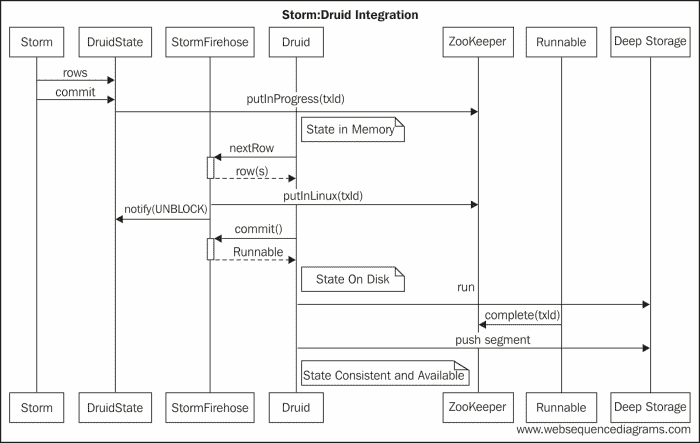
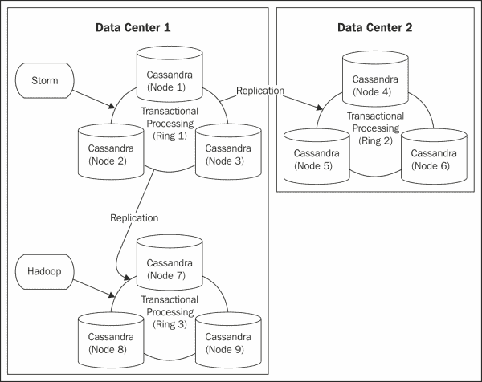
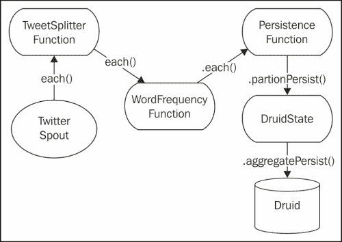

# 第 8 章：自然语言处理

一些人认为，随着实时分析和数据处理需求的增加，Storm 最终将取代 Hadoop。 在本章中，我们将看到 Storm 和 Hadoop 实际上是如何互补的。

虽然 Storm 模糊了传统的**联机事务处理**(**OLTP**)和**联机分析处理**(**OLAP**)之间的界限，但它可以在执行通常与数据仓库相关的聚合和维度分析的同时处理大量事务。 通常情况下，您仍然需要额外的基础设施来执行历史分析并支持跨整个数据集的即席查询。 此外，批处理通常用于纠正 OLTP 系统在发生故障时无法确保一致性的异常情况。 这正是我们在Storm-德鲁伊整合中遇到的。

出于这些原因，批处理基础设施通常与实时基础设施搭配使用。 Hadoop 为我们提供了这样一个批处理框架。 在本章中，我们将实现一个通过批处理支持历史分析和即席分析的体系结构。

本章涵盖以下主题：

*   CAP 定理
*   Lambda 架构
*   OLTP 和 OLAP 集成
*   Hadoop 简介

# 激励 Lambda 架构

首先，从逻辑的角度，让我们来看一下 Storm-Druid 的集成。 Storm(更具体地说是Trident)能够执行分布式分析，因为它隔离了状态转换。 为此，Storm 对状态的底层持久化机制做出了某些假设。 Storm 假设持久性机制既是*一致的*，又是*可用的*。 具体地说，Storm 假设一旦完成状态转换，新状态就会被共享，在所有节点上保持一致，并且立即可用。

从CAP 定理我们知道，任何分布式系统都很难同时提供以下三个保证：

*   **一致性**：所有节点的状态相同
*   **可用性**：系统可以成功或失败地响应查询
*   **分区容差**：即使通信中断或系统部分故障，系统仍能继续响应

越来越多的web 规模架构集成了持久化机制，这些机制对一致性采取了一种宽松的方法，以满足可用性和分区容错要求。 通常，这些系统之所以这样做，是因为在大型分布式系统中，跨整个系统提供事务一致性所需的协调变得难以为继。 性能和吞吐量更为重要。

德鲁伊做出了同样的取舍。 如果我们看一下 Druid 的持久性模型，我们会看到几个不同的阶段：



首先，Druid 通过`Firehose` 接口使用数据并将数据放入内存。 其次，将数据持久化到磁盘，并通过`Runnable`接口通知`Firehose` 实现。 最后，这些数据被推送到**Deep Storage**，这样系统的其他部分就可以使用这些数据了。

现在，如果我们考虑不一致数据对容错的影响，我们会看到数据在保存到 Deep Storage 之前是有风险的。 如果我们失去该节点，我们就会失去对该节点上到目前为止通过 Storm 使用的所有数据的分析，因为我们已经确认了元组。

此问题的一个明显解决方案是在确认 Storm 中的元组之前将数据段推送到深度存储。 这是可以接受的，但这将在Storm和德鲁伊之间建立一种微妙的关系。 具体地说，批量大小和超时需要与段大小和 Druid 向 Deep Storage 推送段的时间保持一致。 如果换一种方式描述，我们的事务处理系统的吞吐量将是有限的，并且与我们用于分析处理的系统密切相关。 归根结底，这很可能是我们不想要的依赖。

然而，我们仍然需要实时分析，并且愿意容忍这些分析在不太可能发生的系统部分故障的情况下丢失某些数据。 从这个角度来看，这种整合是令人满意的。 不过，理想情况下，我们会有一种机制来纠正任何错误并从中恢复过来。 为此，我们将引入离线批处理机制，以便在发生故障时恢复和更正数据。

为此，我们将首先持久化数据，然后再将数据发送到 Druid。 我们的批处理系统将从该持久性机制脱机读取数据。 批处理系统将能够纠正/更新系统在实时处理期间可能丢失的任何数据。 结合使用这些方法，我们可以获得实时处理过程中所需的吞吐量，这些分析在发生系统故障之前都是准确的，并且有一种在发生故障时纠正这些分析的机制。

分布式批处理的事实标准是 Hadoop。 因此，我们将结合使用 Hadoop 进行历史(即非实时)分析。 下图描述了我们将在此处使用的模式：


前面的模式显示了我们如何成功集成 OLTP 和 OLAP 系统，同时主要通过高吞吐量、可用性和分区提供一致和完整的实时分析。 它还同时提供了解决部分系统故障的机制。

此方法填补的另一个空白是将新的分析引入系统的能力。 由于 Storm-Druid 集成关注的是实时性问题，因此没有简单的方法将新的分析引入系统。 Hadoop 弥补了这一差距，因为它可以遍历历史数据来填充新维度或执行额外的聚合。

Storm 的原著作者 Nathan Marz 将这种方法称为**Lambda 架构**。

# 检查我们的用例

现在，让我们将这个模式应用到**自然语言处理**(**NLP**)领域。 在这个用例中，我们将在 Twitter 上搜索短语的相关 tweet(例如，“Apple Jobs”)。 然后，系统会处理这些推文，试图找到最相关的单词。 使用 Druid 聚合术语，我们将能够随着时间的推移对最相关的单词进行趋势分析。

让我们更多地定义一下这个问题。 给定搜索短语*p*，使用 Twitter API，我们将找到最相关的 Twets 集合*T*。 对于*T*中的每条推文*t*，我们将统计每个单词*w*出现的次数。 我们将比较推文中该单词的出现频率与英语文本样本*E*中该单词的出现频率。 然后，系统将对这些单词进行排名，并显示前 20 个结果。

从数学上讲，这等同于以下公式：


这里，单词*w*在语料库*C*中的频率如下：


因为我们只关心相对频率，并且*T*中的单词总数和*E*中的单词总数在所有单词中都是恒定的，所以我们可以在等式中忽略它们，从而将问题的复杂性降低到以下几点：


对于分母，我们将使用以下链接提供的免费词频列表：

[http：//invokeit.wordpress.com/frequency-word-lists/](http://invokeit.wordpress.com/frequency-word-lists/)

我们将使用 Storm 处理 Twitter 搜索的结果，并使用分母的计数信息丰富元组。 然后，Druid 将计算分子的出现次数，我们将使用聚合后函数来执行实际的相关性计算。

# 实现 Lambda 架构

对于这个用例，我们关注的是一种分布式计算模式，该模式集成了实时处理平台(即 Storm)和分析引擎(即 Druid)；然后我们将其与离线批处理机制(即 Hadoop)配对，以确保我们拥有准确的历史指标。

虽然这仍然是重点，但我们正在努力实现的另一个关键目标是持续可用性和容错。 更具体地说，系统应该容忍节点甚至数据中心的永久丢失。 要实现这种可用性和容错性，我们需要更多地关注持久性。

在实时系统中，我们将使用分布式存储机制实现持久性，理想情况下是支持跨数据中心复制的存储机制。 因此，即使在数据中心完全丢失的灾难性情况下，系统也可以在不丢失数据的情况下恢复。 当与持久存储交互时，客户端将要求在事务内跨多个数据中心复制数据的一致性级别。

对于本讨论，假设我们使用 Cassandra 作为持久化机制。 使用具有可调一致性的 Cassandra，写入将使用一致性级别`EACH_QUORUM`。 这可确保将数据副本一致地写入所有数据中心。 当然，这会在每次写入时引入数据中心间通信的开销。 对于不太重要的应用，`LOCAL_QUORUM`很可能是可以接受的，这样可以避免数据中心间通信的延迟。

使用分布式存储引擎(如 Cassandra)的另一个好处是可以为脱机/批处理设置单独的环/集群。 然后，Hadoop 可以使用该环作为输入，从而允许系统重新接收历史数据，而不会影响事务处理。 请考虑以下架构图：



在前面的图中，我们有两个物理数据中心，每个中心都有一个 Cassandra 集群，为 Storm 内的事务处理提供服务。 这确保了拓扑中的任何写入都将实时复制到数据中心，无论是在确认元组之前(如果我们使用`EACH_QUORUM`一致性)，还是延迟(如果我们使用`LOCAL_QUORUM`)。

此外，我们还有第三个*虚拟*数据中心，支持离线批处理。 **Ring 3**是一个 Cassandra 群集，它与**Ring 1**物理配置在一起，但被配置为 Cassandra 内的第二个数据中心。 当我们运行 Hadoop 作业来处理历史指标时，我们可以使用`LOCAL_QUORUM`。 由于本地 Quorum 寻求在本地数据中心内达成共识，因此来自 Hadoop 的读取流量不会进入我们的事务处理集群。

通常，如果您的组织有数据科学家/管理员对您的数据运行分析，则这是一个很好的部署模式。 通常，这些作业是数据密集型的。 将此工作负载与事务系统隔离非常重要。

此外，而且可以说与我们容忍系统中的错误的能力一样重要，此体系结构允许我们向系统中引入新的分析，而这些分析在数据获取时是不具备的。 Hadoop 可以使用新的分析配置运行所有相关的历史数据，以填充新维度或执行其他聚合。

# 为我们的用例设计拓扑

在本例中，我们将再次使用Trident，并在上一章构建的拓扑基础上构建。 Trident拓扑如下所示：



`TwitterSpout`定期针对 Twitter API 执行搜索，发出返回到Trident流中的 tweet。 然后，`TweetSplitterFunction`解析 tweet 并为 tweet 中的每个单词发出一个元组。 `WordFrequencyFunction`用英语语言的随机样本中该单词的计数来丰富每个元组。 最后，我们让 Druid 使用该信息来执行随时间推移的聚合。 Druid 将数据分区为时间片，并按照前面的描述持久化该数据。

在这种情况下，因为持久化机制是我们解决容错/系统故障的方法，所以持久化机制应该分布存储并提供一致性和高可用性。 此外，Hadoop 应该能够使用持久性机制作为 map/duce 作业的输入。

凭借其可调的一致性和对 Hadoop 的支持，Cassandra 为该模式提供了理想的持久性机制。 由于在其他地方介绍了 Cassandra 和多语言持久性，因此我们将保持此示例的简单性，并使用本地文件存储。

# 实施设计

让我们首先检查系统的实时部分，从喷嘴开始一直到 Druid 持久化。 该拓扑结构简单明了，模拟了我们在前几章中编写的拓扑结构。

以下是拓扑的关键线：

```scala
TwitterSpout spout = new TwitterSpout();
Stream inputStream = topology.newStream("nlp", spout);
try {
inputStream.each(new Fields("tweet"), new TweetSplitterFunction(), new Fields("word"))
          .each(new Fields("searchphrase", "tweet", "word"), new WordFrequencyFunction(), new Fields("baseline"))
          .each(new Fields("searchphrase", "tweet", "word", "baseline"), new PersistenceFunction(), new Fields())	
          .partitionPersist(new DruidStateFactory(), new Fields("searchphrase", "tweet", "word", "baseline"), new DruidStateUpdater());
} catch (IOException e) {
throw new RuntimeException(e);
}
return topology.build();
```

最后，在解析和丰富之后，元组有四个字段，如下表所示：

<colgroup><col style="text-align: left"> <col style="text-align: left"></colgroup> 
| 

字段名称

 | 

使用 / 运用能力 / 使用价值 / 用途

 |
| --- | --- |
| `searchphrase` | 此字段包含正在接收的搜索短语。 这是发送给 Twitter API 的短语。 实际上，该系统很可能同时监控多个搜索短语。 在此系统中，值是硬编码的。 |
| `tweet` | 此字段包含在 Twitter API 中搜索`searchphrase`时返回的推文。 `searchphrase`和`tweet`之间存在 1：N 关系。 |
| `word` | 解析后，此字段包含在 tweet 中找到的单词。 `tweet`和`word`之间存在 1：N 关系。 |
| `baseline` | 此字段包含与普通采样文本中的单词相关联的计数。 `word`和`baseline`之间存在 1：1 的关系。 |

## TwitterSpout/TweetEmitter

现在，让我们看看喷嘴/发射器。 在本例中，我们将使用 Twitter4J API，`Emitter`函数只不过是该 API 和 Storm API 之间的一层薄薄的胶合层。 如前所述，它只是使用 Twitter4J 调用 Twitter API，并在 Storm 中将所有结果作为单个批处理发出。

在更复杂的场景中，还可以进入`Twitter Firehose`并使用队列在将实时更新发送到 Storm 之前对其进行缓冲。 以下是喷嘴`Emitter`部分的关键线路：

```scala
   query = new Query(SEARCH_PHRASE);
   query.setLang("en");
   result = twitter.search(query);
   ...
   for (Status status : result.getTweets()) {
       List<Object> tweets = new ArrayList<Object>();
       tweets.add(SEARCH_PHRASE);
       tweets.add(status.getText());
       collector.emit(tweets);
   }
```

## 函数

本节介绍拓扑中使用的功能。 在本例中，所有函数都可能有副作用(例如，持久性)，或者它们向元组中添加字段和值。

### TweetSplitterFunction

Tweet 传递的第一个函数是`TweetSplitterFunction`。 此函数简单地解析 tweet，并在 tweet 中为每个单词发出一个元组。 此函数的代码如下所示：

```scala
@Override
public void execute(TridentTuple tuple, TridentCollector collector) {
String tweet = (String) tuple.getValue(0);
LOG.debug("SPLITTING TWEET [" + tweet + "]");
Pattern p = Pattern.compile("[a-zA-Z]+");
Matcher m = p.matcher(tweet);
List<String> result = new ArrayList<String>();
   while (m.find()) {
       String word = m.group();
       if (word.length() > 0) {
         List<Object> newTuple = new ArrayList<Object>();
         newTuple.add(word);
         collector.emit(newTuple);
       }
   }
}
```

在更复杂的 NLP 系统中，此函数将不仅仅是简单地用空格分割 tweet。 自然语言处理系统很可能会尝试解析推文，为单词分配词性，并将它们彼此关联起来。 虽然即时消息和 tweet 通常缺乏语法分析器所训练的传统语法结构，但系统仍可能使用基本的关联，例如单词之间的距离。 在这样的系统中，系统使用 n 元语法频率而不是词频，其中每个 n 元语法包括多个单词。

要了解n 元语法的用法，请访问[http://books.google.com/ngrams](http://books.google.com/ngrams)。

### WordFrequencyFunction

现在我们转到`WordFrequencyFunction`。 此函数使用`baseline`计数丰富元组。 这是在随机抽样文本中遇到该单词的次数。

此函数的按键代码如下所示：

```scala
public static final long DEFAULT_BASELINE = 10000;
private Map<String, Long> wordLikelihoods = 
new HashMap<String, Long>();

public WordFrequencyFunction() throws IOException {
File file = new File("src/main/resources/en.txt");
BufferedReader br = new BufferedReader(new FileReader(file));
String line;
while ((line = br.readLine()) != null) {
String[] pair = line.split(" ");
   long baseline = Long.parseLong(pair[1]);
   LOG.debug("[" + pair[0] + "]=>[" + baseline + "]");
   wordLikelihoods.put(pair[0].toLowerCase(), baseline);
   i++;
}
br.close();
}

@Override
public void execute(TridentTuple tuple,
TridentCollector collector) {
String word = (String) tuple.getValue(2);
Long baseline = this.getLikelihood(word);
List<Object> newTuple = new ArrayList<Object>();
newTuple.add(baseline);
collector.emit(newTuple);
}

public long getLikelihood(String word){
Long baseline = this.wordLikelihoods.get(word);
if (baseline == null)
return DEFAULT_BASELINE;
else
   return baseline;
}
```

代码中的构造函数将单词计数加载到内存中。 `en.txt`的文件格式如下：

```scala
you 4621939
the 3957465
i 3476773
to 2873389
...
of 1531878
that 1323823
in 1295198
is 1242191
me 1208959
what 1071825
```

每行包含字和该字的频率计数。 同样，由于我们只关心相对计数，所以我们不需要考虑语料库中的总计数。 但是，如果我们要计算真实的可能性，我们还需要考虑总字数。

该函数的`execute`方法简单明了，只需将基线计数加到元组中即可。 但是，如果我们检查从`HashMap`类检索计数的方法，会注意到它包含一个`DEFAULT_BASELINE`。 这是系统遇到不在原始语料库中的单词时使用的值。

由于 Twitter 提要包含许多通常在标准文本中找不到的缩写、首字母缩写和其他术语，因此`DEFAULT_BASELINE`成为一个重要的配置参数。 在某些情况下，唯一字词非常重要和独特，因为它们与`searchphrase`字段有关。 其他的则是异常的，因为样本语料库与目标语料库不同。

理想情况下，原始基线计数将来自与分析目标相同的来源。 在这种情况下，理想的做法是使用整个`Twitter Firehose`计算单词和 n 元语法计数。

### PersistenceFunction

在此，我们不会深入讨论完整的多数据中心 Cassandra 部署的细节。 取而代之的是，对于本例，我们将保持简单，并使用本地文件存储。 `PersistenceFunction`的代码如下：

```scala
@Override
public void execute(TridentTuple tuple, 
   TridentCollector collector) {
writeToLog(tuple);
collector.emit(tuple);
}

synchronized public void writeToLog(TridentTuple tuple) {
DateTime dt = new DateTime();
DateTimeFormatter fmt = ISODateTimeFormat.dateTime();
StringBuffer sb = new StringBuffer("{ ");
sb.append(String.format("\"utcdt\":\"%s\",", fmt.print(dt)));
sb.append(String.format("\"searchphrase\":\"%s\",", tuple.getValue(0)));
sb.append(String.format("\"word\":\"%s\",", tuple.getValue(2)));
sb.append(String.format("\"baseline\":%s", tuple.getValue(3)));
sb.append("}");
BufferedWriter bw;
try {
bw = new BufferedWriter(new FileWriter("nlp.json", true));
bw.write(sb.toString());
   bw.newLine();
   bw.close();
} catch (IOException e) {
   throw new RuntimeException(e);
}
}
```

在前面的代码中，该函数只是以 Druid 期望在 Hadoop 索引作业中使用的本机格式持久化元组。 这段代码效率很低，因为我们每次都要打开要写入的文件。 或者，我们可以实现持久化元组的附加`StateFactory`和`State`对象；但是，由于这只是一个示例，我们可以容忍低效的文件访问。

此外，请注意，我们在这里生成了一个时间戳，该时间戳不会与元组一起重新发出。 理想情况下，我们将生成一个时间戳并将其添加到元组中，然后由 Druid 在下游使用该时间戳来对齐时间分区。 对于本例，我们将接受差异。

### 提示

即使此函数根本不会丰富元组，它仍必须重新发出元组。 因为函数也可以充当过滤器，所以声明哪些元组向下游传递是函数的义务。

该函数将以下行写入`nlp.json`文件：

```scala
{ "utcdt":"2013-08-25T14:47:38.883-04:00","searchphrase":"apple jobs","word":"his","baseline":279134}
{ "utcdt":"2013-08-25T14:47:38.884-04:00","searchphrase":"apple jobs","word":"annual","baseline":839}
{ "utcdt":"2013-08-25T14:47:38.885-04:00","searchphrase":"apple jobs","word":"salary","baseline":1603}
{ "utcdt":"2013-08-25T14:47:38.886-04:00","searchphrase":"apple jobs","word":"from","baseline":285711}
{ "utcdt":"2013-08-25T14:47:38.886-04:00","searchphrase":"apple jobs","word":"Apple","baseline":10000}
```

# 检查分析

Druid 集成与上一章中使用的相同。 简而言之，此集成包括`StateFactory`、`StateUpdater`和`State`实现。 然后，`State`实现与 Druid 的`StormFirehoseFactory`实现和`StormFirehose`实现进行通信。 该实现的核心是`StormFirehose`实现，它将元组映射到 Druid 的输入行。 此方法的清单如下所示：

```scala
@Override
public InputRow nextRow() {
   final Map<String, Object> theMap =
Maps.newTreeMap(String.CASE_INSENSITIVE_ORDER);
try {
TridentTuple tuple = null;
   tuple = BLOCKING_QUEUE.poll();
   if (tuple != null) {
String phrase = (String) tuple.getValue(0);
      String word = (String) tuple.getValue(2);
      Long baseline = (Long) tuple.getValue(3);
      theMap.put("searchphrase", phrase);
      theMap.put("word", word);
      theMap.put("baseline", baseline);
}

   if (BLOCKING_QUEUE.isEmpty()) {
      STATUS.putInLimbo(TRANSACTION_ID);
      LIMBO_TRANSACTIONS.add(TRANSACTION_ID);
      LOG.info("Batch is fully consumed by Druid. Unlocking [FINISH]");
      synchronized (FINISHED) {
          FINISHED.notify();
      }
   }
} catch (Exception e) {
LOG.error("Error occurred in nextRow.", e);
}
final LinkedList<String> dimensions = new LinkedList<String>();
dimensions.add("searchphrase");
dimensions.add("word");
return new MapBasedInputRow(System.currentTimeMillis(), 
dimensions, theMap); 
}
```

看一下这个方法，有两个关键的数据结构：`theMap`和`dimensions`。 第一个包含该行的数据值。 第二个参数包含该行的维度，即 Druid 将用于执行聚合的维度，并确定可以对数据运行哪些查询。 在本例中，我们将使用`searchphrase`和`word`字段作为维度。 这将允许我们在查询中执行计数和分组，稍后我们将看到这一点。

首先，让我们看一下用于摄取数据的 Druid 配置。 我们将在很大程度上使用与上一章中使用的嵌入式实时服务器相同的配置。 分段推送到 Cassandra 进行深度存储，分段元数据使用 MySQL 写入。

以下是来自`runtime.properties`的关键配置参数：

```scala
druid.pusher.cassandra=true
druid.pusher.cassandra.host=localhost:9160 
druid.pusher.cassandra.keyspace=druid
druid.zk.service.host=localhost
druid.zk.paths.base=/druid
druid.host=127.0.0.1
druid.database.segmentTable=prod_segments
druid.database.user=druid
druid.database.password=druid
druid.database.connectURI=jdbc:mysql://localhost:3306/druid
druid.zk.paths.discoveryPath=/druid/discoveryPath
druid.realtime.specFile=./src/main/resources/realtime.spec
druid.port=7272
druid.request.logging.dir=/tmp/druid/realtime/log
```

此配置指向`realtime.spec`文件，该文件指定实时服务器执行的分析的详细信息。 以下是此使用情形的`realtime.spec`文件：

```scala
[{
    "schema": {
        "dataSource": "nlp",
        "aggregators": [
            { "type": "count", "name": "wordcount" },
            { "type": "max", "fieldName": "baseline", 
name" : "maxbaseline" }
        ],
        "indexGranularity": "minute",
        "shardSpec": {"type": "none"}
    },

    "config": {
        "maxRowsInMemory": 50000,
        "intermediatePersistPeriod": "PT30s"
    },

    "firehose": {
        "type": "storm",
        "sleepUsec": 100000,
        "maxGeneratedRows": 5000000,
        "seed": 0,
        "nTokens": 255,
        "nPerSleep": 3
    },

    "plumber": {
        "type": "realtime",
        "windowPeriod": "PT10s",
        "segmentGranularity": "minute",
        "basePersistDirectory": "/tmp/nlp/basePersist"
    }
}]
```

除了时间粒度之外，我们还在此文件中指定了聚合器。 这告诉 Druid 如何在行之间聚合指标。 没有聚合器，德鲁伊就无法折叠数据。 在此用例中，有两个聚合器：`wordcount`和`maxbaseline`。

`wordcount`字段计算沿着提供的维度具有相同值的行的实例。 回过头来看`StormFirehose`实现，这两个维度是`searchphrase`和`word`。 因此，Druid 可以折叠行，添加名为`wordcount`的字段，该字段将包含为该`searchphrase`和该时间片找到的该单词的实例数的总计数。

`maxbaseline`字段包含该单词的基线。 实际上，每行的值都是相同的。 我们只需使用`max`作为一个方便的函数来将值传播到聚合中，然后在查询系统时使用该聚合。

现在，让我们来看一下查询。 以下是我们用来检索最相关单词的查询：

```scala
{
     "queryType": "groupBy",
     "dataSource": "nlp",
     "granularity": "minute",
     "dimensions": ["searchphrase", "word"],
     "aggregations":[
        { "type": "longSum", "fieldName":"wordcount", 
"name": "totalcount"},
        { "type": "max", "fieldName":"maxbaseline", 
"name": "totalbaseline"}
     ],
     "postAggregations": [{
       "type": "arithmetic",
       "name": "relevance",
       "fn": "/",
       "fields": [
            { "type": "fieldAccess", "fieldName": "totalcount" },
            { "type": "fieldAccess", "fieldName": "totalbaseline" }
       ]
     }],
     "intervals":["2012-10-01T00:00/2020-01-01T00"]
 }
```

查询需要与`realtime.spec`文件对齐。 在查询的底部，我们指定感兴趣的时间间隔。 在文件的顶部，我们指定感兴趣的维度，然后是允许 Druid 折叠行以匹配请求的粒度的聚合。 在此用例中，聚合与我们在实时索引数据时执行的聚合完全匹配。

具体地说，我们引入了`totalcount`字段，它包含`wordcount`的和。 因此，这将包含为该`word`和`searchphrase`组合观察到的实例总数。 此外，我们使用`baseline`执行相同的技巧来传递该值。

最后，在这个查询中，我们包括一个帖子聚合，它将把聚合组合成一个相关的分数。 帖子聚合将推文中观察到的总计数除以基线频率。

下面是一个简单的 Ruby 文件，它处理查询结果并返回前 20 个单词：

```scala
...
url="http://localhost:7272/druid/v2/?pretty=true"
response = RestClient.post url, File.read("realtime_query"), :accept => :json, :content_type => 'appplication/json'
#puts(response)
result = JSON.parse(response.to_s)

word_relevance = {}
result.each do |slice|
  event = slice['event']
  word_relevance[event['word']]=event['relevance']
end

count = 0
word_relevance.sort_by {|k,v| v}.reverse.each do |word, relevance|
  puts("#{word}->#{relevance}")
  count=count+1
  if(count == 20) then
    break
  end
end
```

请注意，我们用于访问服务器的 URL 是嵌入式实时服务器的端口。 在生产中，查询通过代理节点。

执行此脚本将生成以下代码片段：

```scala
claiming->31.789579158316634
apple->27.325982081323225
purchase->20.985449735449734
Jobs->20.618
Steve->17.446
shares->14.802238805970148
random->13.480033984706882
creation->12.7524115755627
Apple->12.688
acts->8.82582081246522
prevent->8.702687877125618
farmer->8.640522875816993
developed->8.62642740619902
jobs->8.524986566362172
bottles->8.30523560209424
technology->7.535137701804368
current->7.21418826739427
empire->6.924050632911392
```

### 提示

如果更改要捕获的维或度量，请确保删除实时服务器用于缓存数据的本地目录。 否则，实时服务器可能会重新读取不具有完成查询所需的维度和/或指标的旧数据；此外，查询将失败，因为 Druid 无法找到所需的指标或维度。

# 批处理/历史分析

现在，让我们将注意力转向批处理机制。 为此，我们将使用 Hadoop。 尽管对 Hadoop 的完整描述远远超出了本节的范围，但我们将在介绍特定于 Druid 的设置的同时简要概述 Hadoop。

Hadoop 提供两个主要组件：分布式文件系统和分布式处理框架。 分布式文件系统被恰当地命名为**Hadoop 分布式文件系统**(**HDFS**)。 分布式处理框架称为 MapReduce。 由于我们选择在假设的系统架构中利用 Cassandra 作为存储机制，因此我们将不需要 HDFS。 但是，我们将使用 Hadoop 的 MapReduce 部分跨所有历史数据分布处理。

在我们的简单示例中，我们将运行一个本地 Hadoop 作业，该作业将读取在我们的`PersistenceFunction`中写入的本地文件。 Druid 附带了一个 Hadoop 作业，我们将在本例中使用该作业。

# Hadoop

在我们开始加载数据之前，有必要快速概述一下 MapReduce。 尽管 Druid 预打包了一个方便的 MapReduce 作业来容纳历史数据，但一般来说，大型分布式系统需要定制作业来对整个数据集执行分析。

## MapReduce 概述

MapReduce是一个框架，它将处理分为两个阶段：映射阶段和缩减阶段。 在映射阶段，一个函数应用于整个输入数据集，一次一个元素。 每次应用`map`函数都会产生一组元组，每个元组包含一个键和一个值。 然后通过`reduce`函数组合具有相似键的元组。 `reduce`函数通常通过组合与键相关联的值来发出另一组元组。

MapReduce 的典型“Hello World”示例是字数统计。 给出一组包含单词的文档，计算每个单词的出现次数。 (具有讽刺意味的是，这与我们的 NLP 示例非常相似。)

下面是表示单词统计示例的`map`和`reduce`函数的 Ruby 函数。 `map`函数类似于以下代码片段：

```scala
def map(doc)
   result = []
doc.split(' ').each do |word|
result << [word, 1]
   end
   return result
end
```

假定提供的输入如下所示，`map`函数将产生以下输出：

```scala
map("the quick fox jumped over the dog over and over again")
 => [["the", 1], ["quick", 1], ["fox", 1], ["jumped", 1], ["over", 1], ["the", 1], ["dog", 1], ["over", 1], ["and", 1], ["over", 1], ["again", 1]]
```

对应的`reduce`函数类似于以下代码片段：

```scala
def reduce(key, values)
   sum = values.inject { |sum, x| sum + x }
   return [key, sum]
end
```

然后，MapReduce 函数将对每个键的值进行分组，并将它们传递给前面的`reduce`函数，如下所示，结果是总字数：

```scala
reduce("over", [1,1,1])
 => ["over", 3]

```

## 德鲁伊设置

以 Hadoop 作为的背景，让我们来看看我们的 Druid 设置。 为了让 Druid 使用 Hadoop 作业中的数据，我们需要启动**Master**和**Compute**节点(也称为**历史**节点)。 为此，我们将创建一个目录结构，该目录结构将 Druid 自包含作业放在根目录下，子目录包含主服务器和计算服务器的配置文件。

此目录结构类似于以下代码片段：

```scala
druid/druid-indexing-hadoop-0.5.39-SNAPSHOT.jar
druid/druid-services-0.5.39-SNAPSHOT-selfcontained.jar
druid/config/compute/runtime.properties
druid/config/master/runtime.properties
druid/batchConfig.json
```

Master 和 Compute 节点的运行时属性与实时节点基本相同，但有一些显著差异。 它们都包括缓存段的设置，如以下代码片段所示：

```scala
# Path on local FS for storage of segments; 
# dir will be created if needed
druid.paths.indexCache=/tmp/druid/indexCache
# Path on local FS for storage of segment metadata; 
# dir will be created if needed
druid.paths.segmentInfoCache=/tmp/druid/segmentInfoCache
```

另外，请注意，如果在同一台计算机上运行主服务器和计算服务器，则需要更改端口，以便它们不会发生冲突，如下所示：

```scala
druid.port=8082
```

Druid将所有服务器组件及其依赖项打包到一个单独的自包含 JAR 文件中。 使用此 JAR 文件，您可以使用以下命令启动主服务器和计算服务器。

对于 Compute 节点，我们使用以下代码片段：

```scala
java -Xmx256m -Duser.timezone=UTC -Dfile.encoding=UTF-8 \
-classpath ./druid-services-0.5.39-SNAPSHOT-selfcontained.jar:config/compute \
com.metamx.druid.http.ComputeMain
```

对于主节点，我们使用以下代码片段：

```scala
java -Xmx256m -Duser.timezone=UTC -Dfile.encoding=UTF-8 \
-classpath ./druid-services-0.5.39-SNAPSHOT-selfcontained.jar:config/compute \
com.metamx.druid.http.ComputeMain
```

一旦两个节点都在运行，我们就可以使用 Hadoop 作业加载数据了。

### HadoopDruidIndexer

服务器启动并运行后，我们可以检查 Druid MapReduce 作业的内部结构。 `HadoopDruidIndexer`函数使用与`realtime.spec`文件非常相似的 JSON 配置文件。

该文件是在 Hadoop 作业启动时在命令行上指定的，如以下代码片段所示：

```scala
java -Xmx256m -Duser.timezone=UTC -Dfile.encoding=UTF-8 \
-Ddruid.realtime.specFile=realtime.spec -classpath druid-services-0.5.39-SNAPSHOT-selfcontained.jar:druid-indexing-hadoop-0.5.39-SNAPSHOT.jar \
com.metamx.druid.indexer.HadoopDruidIndexerMain batchConfig.json
```

以下是我们在本例中使用的`batchConfig.json`文件：

```scala
{
  "dataSource": "historical",
  "timestampColumn": "utcdt",
  "timestampFormat": "iso",
  "dataSpec": {
    "format": "json",
    "dimensions": ["searchphrase", "word"]
  },
  "granularitySpec": {
    "type":"uniform",
    "intervals":["2013-08-21T19/PT1H"],
    "gran":"hour"
  },
  "pathSpec": { "type": "static",
                "paths": "/tmp/nlp.json" },
  "rollupSpec": {
            "aggs": [ { "type": "count", "name": "wordcount" },
                         { "type": "max", "fieldName": "baseline", 
                                       "name" : "maxbaseline" } ],
      "rollupGranularity": "minute"},
      "workingPath": "/tmp/working_path",
  "segmentOutputPath": "/tmp/segments",
  "leaveIntermediate": "false",
  "partitionsSpec": {
    "targetPartitionSize": 5000000
  },
  "updaterJobSpec": {
    "type":"db",
    "connectURI":"jdbc:mysql://localhost:3306/druid",
    "user":"druid",
    "password":"druid",
    "segmentTable":"prod_segments"
  }
}
```

的大部分配置看起来都很熟悉。 特别感兴趣的两个字段是`pathSpec`和`rollupSpec`字段。 `pathSpec`字段包含由`PersistenceFunction`写入的文件的位置。 `rollupSpec`字段包含的聚合函数与我们在事务处理期间包含在`realtime.spec`文件中的聚合函数相同。

此外，请注意，指定了时间戳列和格式，这与我们在持久化文件中输出的字段一致：

```scala
{ "utcdt":"2013-08-25T14:47:38.883-04:00","searchphrase":"apple jobs","word":"his","baseline":279134}
{ "utcdt":"2013-08-25T14:47:38.884-04:00","searchphrase":"apple jobs","word":"annual","baseline":839}
{ "utcdt":"2013-08-25T14:47:38.885-04:00","searchphrase":"apple jobs","word":"salary","baseline":1603}
{ "utcdt":"2013-08-25T14:47:38.886-04:00","searchphrase":"apple jobs","word":"from","baseline":285711}
{ "utcdt":"2013-08-25T14:47:38.886-04:00","searchphrase":"apple jobs","word":"Apple","baseline":10000}
```

`HadoopDruidIndexer`函数加载前面的配置文件，并执行`map`/`reduce`函数来构造索引。 如果我们更仔细地查看该作业，我们可以看到它正在运行的特定功能。

Hadoop 作业是使用 Hadoop 作业类启动的。 Druid 运行几个作业来索引数据，但我们将重点放在`IndexGeneratorJob`上。 在`IndexGeneratorJob`中，Druid 使用以下行配置作业：

```scala
job.setInputFormatClass(TextInputFormat.class);
job.setMapperClass(IndexGeneratorMapper.class);
job.setMapOutputValueClass(Text.class);
...
job.setReducerClass(IndexGeneratorReducer.class);
job.setOutputKeyClass(BytesWritable.class);
job.setOutputValueClass(Text.class);
job.setOutputFormatClass(IndexGeneratorOutputFormat.class);
FileOutputFormat.setOutputPath(job,config.makeIntermediatePath());
config.addInputPaths(job);
config.intoConfiguration(job);
...
job.setJarByClass(IndexGeneratorJob.class);
job.submit();
```

几乎所有 Hadoop 作业都设置了上述属性。 它们为处理的每个阶段设置输入和输出类，以及实现`Mapper`和`Reducer`接口的类。

有关 Hadoop 作业配置的完整描述，请访问以下网址：[http://hadoop.apache.org/docs/r0.18.3/mapred_tutorial.html#Job+Configuration](http://hadoop.apache.org/docs/r0.18.3/mapred_tutorial.html#Job+Configuration)

作业配置还指定输入路径，输入路径指定要处理的文件或其他数据源。 在对`config.addInputPaths`的调用中，Druid 将文件从`pathSpec`字段添加到 Hadoop 配置中进行处理，如以下代码片段所示：

```scala
  @Override
  public Job addInputPaths(HadoopDruidIndexerConfig config, 
Job job) throws IOException {
    log.info("Adding paths[%s]", paths);
    FileInputFormat.addInputPaths(job, paths);
    return job;
  }
```

您可以看到开箱即用，Druid 只支持`FileInputFormat`的实例。 作为读者的练习，增强`DruidHadoopIndexer`函数以支持从 Cassandra 直接读取可能很有趣，正如假设的架构中所设想的那样。

回顾作业配置，Druid 使用的`Mapper`类是`IndexGeneratorMapper`类，`Reducer`类是`IndexGeneratorReducer`类。

让我们首先来看一下`IndexGeneratorMapper`类中的`map`函数。 `IndexGeneratorMapper`类实际上是`HadoopDruidIndexerMapper`的子类，后者包含`map`方法的实现，将其委托给`IndexGeneratorMapper`类以发出实际值，如我们在下面的代码中所见。

在`HadoopDruidIndexerMapper`中，我们可以看到`map`方法实现如下所示：

```scala
@Override
protected void map(LongWritable key, Text value, Context context
  ) throws IOException, InterruptedException
  {
    try {
      final InputRow inputRow;
      try {
        inputRow = parser.parse(value.toString());
      }
      catch (IllegalArgumentException e) {
        if (config.isIgnoreInvalidRows()) {
          context.getCounter(HadoopDruidIndexerConfig.IndexJobCounters.INVALID_ROW_COUNTER).increment(1);
          return; // we're ignoring this invalid row
        } else {
          throw e;
        }
      }
      if(config.getGranularitySpec().bucketInterval(new DateTime(inputRow.getTimestampFromEpoch())).isPresent()) {
        innerMap(inputRow, value, context);
      }
    }
    catch (RuntimeException e) {
      throw new RE(e, "Failure on row[%s]", value);
    }
  }
```

我们可以看到超类`map`方法处理不解析的行，将它们标记为无效，并检查该行是否包含执行映射所需的数据。 具体地说，超类确保该行包含时间戳。 映射需要时间戳，因为它将数据划分为时间片(即存储桶)，正如我们在对`innerMap`的`abstract`方法调用中看到的那样，如下所示：

```scala
@Override
protected void innerMap(InputRow inputRow,
        Text text,
        Context context
    ) throws IOException, InterruptedException{

 // Group by bucket, sort by timestamp
final Optional<Bucket> bucket = getConfig().getBucket(inputRow);

if (!bucket.isPresent()) {
throw new ISE("WTF?! No bucket found for row: %s", inputRow);
}

context.write(new SortableBytes(
              bucket.get().toGroupKey(),
              Longs.toByteArray(inputRow.getTimestampFromEpoch())
          ).toBytesWritable(),text);
}
```

此方法和任何基于 Hadoop 的`map`函数中的关键行是对`context.write`的调用，该调用从`map`函数发出元组。 在本例中，`map`函数发出类型为`SortableBytes`的键，它表示度量的存储桶和从输入源读取的实际文本作为值。

此时，映射阶段完成后，我们已经解析了文件，构造了存储桶，并按时间戳将数据分区到这些存储桶中。 然后通过调用`reduce`方法对每个存储桶进行处理，如下所示：

```scala
@Override
protected void reduce(BytesWritable key, Iterable<Text> values,
final Context context
    ) throws IOException, InterruptedException{
SortableBytes keyBytes = SortableBytes.fromBytesWritable(key);
Bucket bucket = Bucket.fromGroupKey(keyBytes.getGroupKey()).lhs;

final Interval interval =
config.getGranularitySpec().bucketInterval(bucket.time).get();
final DataRollupSpec rollupSpec = config.getRollupSpec();
final AggregatorFactory[] aggs = rollupSpec.getAggs().toArray(
          new AggregatorFactory[rollupSpec.getAggs().size()]);

IncrementalIndex index = makeIncrementalIndex(bucket, aggs);
...
for (final Text value : values) {
context.progress();
   final InputRow inputRow =
index.getSpatialDimensionRowFormatter()
.formatRow(parser.parse(value.toString()));
        allDimensionNames.addAll(inputRow.getDimensions());
      ...
IndexMerger.persist(index, interval, file, 
index = makeIncrementalIndex(bucket, aggs);
      ...
   }
   ...
);
...
serializeOutIndex(context, bucket, mergedBase,
 Lists.newArrayList(allDimensionNames));
...
}
```

如您所见，`reduce`方法包含分析的要点。 它基于汇总规范中的聚合和批配置文件中指定的维度来构建索引。 该方法的最后几行将数据段写入磁盘。

最后，当您运行`DruidHadoopIndexer`类时，您将看到类似于以下代码片段的内容：

```scala
2013-08-28 04:07:46,405 INFO [main] org.apache.hadoop.mapred.JobClient -   Map-Reduce Framework
2013-08-28 04:07:46,405 INFO [main] org.apache.hadoop.mapred.JobClient -     Reduce input groups=1
2013-08-28 04:07:46,405 INFO [main] org.apache.hadoop.mapred.JobClient -     Combine output records=0
2013-08-28 04:07:46,405 INFO [main] org.apache.hadoop.mapred.JobClient -     Map input records=201363
2013-08-28 04:07:46,405 INFO [main] org.apache.hadoop.mapred.JobClient -     Reduce shuffle bytes=0
2013-08-28 04:07:46,406 INFO [main] org.apache.hadoop.mapred.JobClient -     Reduce output records=0
2013-08-28 04:07:46,406 INFO [main] org.apache.hadoop.mapred.JobClient -     Spilled Records=402726
2013-08-28 04:07:46,406 INFO [main] org.apache.hadoop.mapred.JobClient -     Map output bytes=27064165
2013-08-28 04:07:46,406 INFO [main] org.apache.hadoop.mapred.JobClient -     Combine input records=0
2013-08-28 04:07:46,406 INFO [main] org.apache.hadoop.mapred.JobClient -     Map output records=201363
2013-08-28 04:07:46,406 INFO [main] org.apache.hadoop.mapred.JobClient -     Reduce input records=201363
2013-08-28 04:07:46,433 INFO [main] com.metamx.druid.indexer.IndexGeneratorJob - Adding segment historical_2013-08-28T04:00:00.000Z_2013-08-28T05:00:00.000Z_2013-08-28T04:07:32.243Z to the list of published segments
2013-08-28 04:07:46,708 INFO [main] com.metamx.druid.indexer.DbUpdaterJob - Published historical_2013-08-28T04:00:00.000Z_2013-08-28T05:00:00.000Z_2013-08-28T04:07:32.243Z
2013-08-28 04:07:46,754 INFO [main] com.metamx.druid.indexer.IndexGeneratorJob - Adding segment historical_2013-08-28T04:00:00.000Z_2013-08-28T05:00:00.000Z_2013-08-28T04:07:32.243Z to the list of published segments
2013-08-28 04:07:46,755 INFO [main] com.metamx.druid.indexer.HadoopDruidIndexerJob - Deleting path[/tmp/working_path/historical/2013-08-28T040732.243Z]
```

请注意，添加的线束段名为`historical`。 要查询由`historical`/批处理机制加载的数据，请更新查询以指定历史数据源并使用 Compute 节点的端口。 如果所有内容都加载正确，您将收到我们最初在实时服务器上看到的聚合；示例如下所示：

```scala
{
  "version" : "v1",
  "timestamp" : "2013-08-28T04:06:00.000Z",
  "event" : {
    "totalcount" : 171,
    "totalbaseline" : 28719.0,
    "searchphrase" : "apple jobs",
    "relevance" : 0.005954246317768724,
    "word" : "working"
  }
}
```

现在，如果我们安排 Hadoop 作业定期运行，历史索引将滞后于实时索引，但会持续更新索引，从而纠正错误并说明任何系统故障。

# 摘要

在本章中，我们看到，将批处理机制与 Storm 等实时处理引擎配合使用可以提供更完整、更健壮的整体解决方案。

我们研究了一种实现 Lambda 架构的方法。 这样的方法提供由回溯校正分析的批处理系统支持的实时分析。 此外，我们还了解了如何配置多数据中心系统体系结构，以将离线处理与事务系统隔离，同时还通过分布式存储提供连续可用性和容错能力。

本章还介绍了 Hadoop，并以 Druid 的实现为例。

在下一章中，我们将介绍一个利用 Pig 和 Hadoop 的现有批处理过程，并演示如何将其转换为实时系统。 同时，我们将演示如何使用 Storm-Year 将 Storm 部署到 Hadoop 基础设施上。