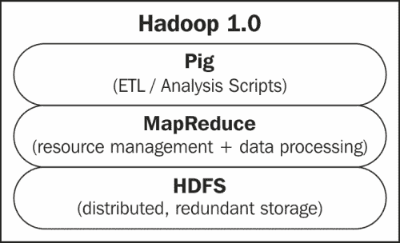
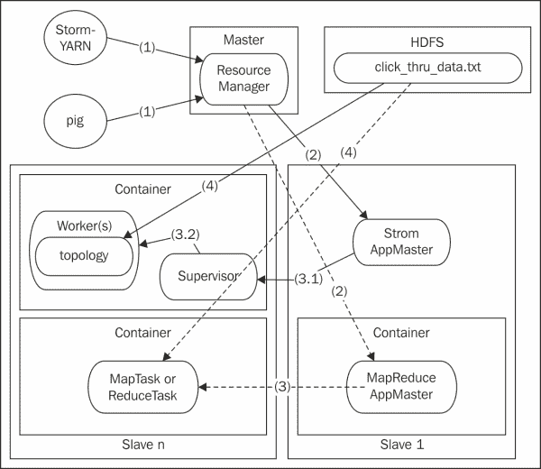
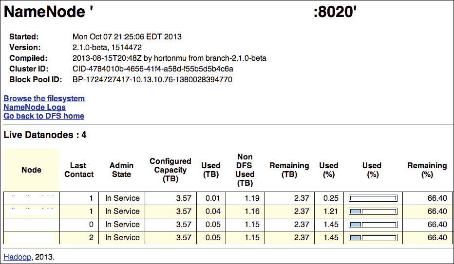
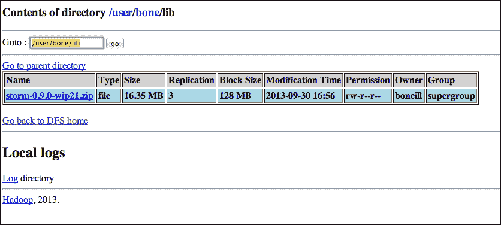
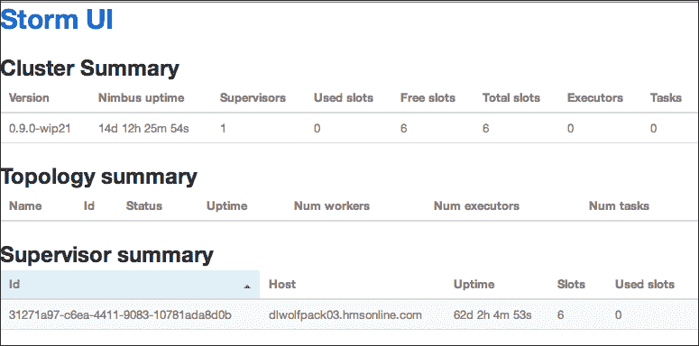
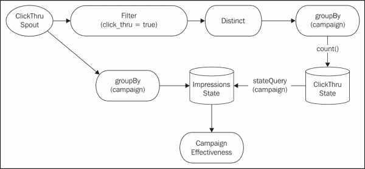

# 九、在 Hadoop 上为广告分析部署 Storm 

在前两章中，我们了解了如何将 Storm 与实时分析系统集成。 然后，我们对该实现进行了扩展，支持具有批处理功能的实时系统。 在本章中，我们将探讨相反的情况。

我们将研究一个计算广告活动有效性的批处理系统。 我们将使用构建在 Hadoop 上的系统，并将其转换为实时处理系统。

要做到这一点，我们将利用 Yahoo！中的 Storm-Screen 项目。 Storm-Yar 项目允许用户利用 YAR 来部署和运行 Storm 集群。 Storm 在 Hadoop 上的运行允许企业整合操作，并将相同的基础设施用于实时和批处理。

本章涵盖以下主题：

*   “猪”简介
*   纱线(使用 Hadoop v2 进行资源管理)
*   使用 Storm 纱线部署 Storm

# 检查用例

在我们的用例中，我们将处理广告活动的日志，以确定最有效的活动。 批处理机制将使用 Pig 脚本处理单个大型平面文件。 PIG 是一种高级语言，允许用户执行数据转换和分析。 PIG 类似于 SQL，可以向下编译成通常在 Hadoop 基础设施上部署和运行的 map/duce 作业。

在本章中，我们将把 Pig 脚本转换为拓扑，并使用 Storm-Yar 部署该拓扑。 这允许我们从批处理方法过渡到能够接收和响应实时事件(例如，点击横幅广告)的方法。

在广告中，印象是代表显示在用户面前的广告的广告事件，无论该广告是否被点击。 在我们的分析中，我们将跟踪每个印象，并使用一个字段来指示用户是否点击了广告。

平面文件中的每一行都包含四个字段，如下所述：

<colgroup><col style="text-align: left"> <col style="text-align: left"></colgroup> 
| 

菲尔德 （人名）

 | 

描述 / 描写 / 形容 / 类别

 |
| --- | --- |
| 曲奇饼 / 特别的家伙 / 饼干 / 小甜点 | 这是来自浏览器的唯一标识符。 我们将使用它来表示系统中的用户。 |
| 参加运动 / 作战 / 参加竞选 / 参加活动 | 这是代表一组特定广告内容的唯一标识符。 |
| 作品 / 产品 / 结果 | 这是正在做广告的产品的名称。 |
| 点击直达 | 这是表示用户是否单击广告的布尔值字段：如果用户单击了广告，则为 true；否则为 false。 |

通常，广告商会为产品开展宣传活动。 一个活动可能有一组特定的内容与其相关联。 我们想要计算每种产品最有效的活动。

在这种情况下，我们将通过计算不同的点击量占整体印象的百分比来计算活动的有效性。 我们将以以下格式提交一份报告：

<colgroup><col style="text-align: left"> <col style="text-align: left"> <col style="text-align: left"> <col style="text-align: left"></colgroup> 
| 

作品 / 产品 / 结果

 | 

参加运动 / 作战 / 参加竞选 / 参加活动

 | 

独特的点击率

 | 

印象

 |
| --- | --- | --- | --- |
| 英语字母表中第二十四个字母 / X 记号 / 成人电影 / 未知数 | 英语字母表中第二十五个字母 / Y 字形 / Y 项 | 一百零七 | 二百五十二 |

印象的数量简单地说就是产品和活动的印象总数。 我们没有区分印象，因为我们可能已经多次向同一用户显示相同的广告，以获得一次点击。 因为我们最有可能是按印象付费，所以我们想用印象总数作为计算利息所需成本的一种手段。 兴趣以点击方式表示。

# 建立架构

我们在上一章中谈到了 Hadoop，但我们主要关注 Hadoop 中的 map/duce 机制。 在本章中，我们将做相反的事情，重点介绍**Hadoop 文件系统**(**HDFS**)和**又一个资源谈判代表**(**纱线**)。 我们将利用 HDFS 来存放数据，并利用 YAR 来部署将托管拓扑的 Storm 框架。

Hadoop 中最近的组件化允许任何分布式系统使用它进行资源管理。 在 Hadoop 1.0 中，资源管理嵌入到 MapReduce 框架中，如下图所示：



Hadoop 2.0 将资源管理分离到 YAR 中，允许其他分布式处理框架在 Hadoop 保护伞下管理的资源上运行。 在我们的示例中，这允许我们在纱线上运行 Storm，如下图所示：


如上图所示，Storm 实现了与 MapReduce 相同的功能。 它为分布式计算提供了一个框架。 在这个特定的用例中，我们使用 Pig 脚本来阐明我们想要对数据执行的 ETL/分析。 我们将该脚本转换为执行相同功能的 Storm 拓扑，然后我们将检查执行该转换所涉及的一些错综复杂的问题。

为了更好地理解这一点，有必要检查 Hadoop 集群中的节点以及这些节点上运行的进程的用途。 假设我们有一个群集，如下图所示：


图中显示了两个个不同的组件/子系统。 第一个是纱线，这是 Hadoop2.0 中引入的新资源管理层。 第二种是 HDFS。 让我们首先深入研究 HDFS，因为这在 Hadoop1.0 之后没有太大变化。

## 检查 HDFS

HDFS 是分布式文件系统。 它将数据块分布在一组从节点上。 NameNode 是目录。 它维护目录结构和指示哪些节点具有什么信息的元数据。 NameNode 本身不存储任何数据，它只协调分布式文件系统中的**创建、读取、更新和删除**(**CRUD**)操作。 存储发生在运行 DataNode 进程的每个从节点上。 DataNode 进程是系统中的主力。 它们相互通信以重新平衡、复制、移动和复制数据。 他们对客户的 CRUD 操作做出反应和响应。

## 检查纱线

纱线是资源管理系统。 它监视每个节点上的负载，并协调将新作业分配给集群中的从属设备。 **ResourceManager**从**NodeManager**收集状态信息。 ResourceManager 还为客户提交的作业提供服务。

纱线中的另一个抽象是**ApplicationMaster**的概念。 ApplicationMaster 管理特定应用的资源和容器分配。 ApplicationMaster 与 ResourceManager 协商资源分配。 一旦分配了资源，ApplicationMaster 就与 NodeManagers 协调以实例化**容器**。 容器是实际执行工作的进程的逻辑容器。

ApplicationMaster 是特定于处理框架的库。 Storm-Screen 提供了用于在纱线上运行 Storm 进程的 ApplicationMaster。 HDFS 分发 ApplicationMaster 以及 Storm 框架本身。 目前，暴风纱公司期待一名外部动物园饲养员。 部署应用时，Nimbus 启动并连接到 ZooKeeper。

下图描述了通过 Storm-Year 运行 Storm 的 Hadoop 基础架构：


如上图所示，使用 YAR 部署 Storm 应用框架。 启动时，Storm Application Master 在纱线容器中启动。 这进而创建了 Storm Nimbus 和 Storm UI 的实例。

在那之后，暴风纱线在不同的纱线容器中启动了监管员。 这些主管进程中的每一个都可以在其容器中派生工作进程。

Application Master 和 Storm 框架都是通过 HDFS 分发的。 Storm-Yar 提供命令行实用程序来启动 Storm 集群、启动管理程序和配置 Storm 以进行拓扑部署。 我们将在本章后面部分介绍这些功能。

要完成体系结构图，我们需要分层批处理和实时处理机制：分别是 PIG 和 Storm 拓扑。 我们还需要描述实际数据。

通常使用诸如 Kafka 之类的排队机制来为 Storm 集群排队工作。 为简化起见，我们将使用存储在 HDFS 中的数据。 下面描述了我们在用例中使用的 Pig、Storm、Snow 和 HDFS，为清晰起见省略了基础架构的元素。 为了充分实现从 Pig 转换为 Storm 的价值，我们将拓扑转换为来自 Kafka 的消费，而不是 HDFS，如下图所示：



如上图所示，我们的数据将存储在 HDFS 中。 虚线表示用于分析的批处理过程，实线表示实时系统。 在每个系统中，都会执行以下步骤：

<colgroup><col style="text-align: left"> <col style="text-align: left"> <col style="text-align: left"> <col style="text-align: left"></colgroup> 
| 

跨步 / 梯级 / 措施

 | 

意图 / 意志 / 决断 / 决心

 | 

生猪当量

 | 

Storm 纱当量

 |
| --- | --- | --- | --- |
| 1. | 处理框架已部署完毕 | 已部署并启动 MapReduce 应用主机 | 暴风纱线推出 Application Master 并分发 Storm 框架 |
| 2 个 | 将启动特定分析 | Pig 脚本将编译为 MapReduce 作业并作为作业提交 | 拓扑将部署到群集 |
| 3. | 资源已预留 | MAP 和 Reduce 任务是在纱线容器中创建的 | 主管与员工一起实例化 |
| 4. | 分析从存储中读取数据并执行分析 | PIG 从 HDFS 读取数据 | Storm 读取工作，通常是从 Kafka 读取；但在本例中，拓扑从平面文件读取 |

在猪和 Trident 之间可以有另一个的类比。 PIG 脚本向下编译为 MapReduce 作业，而 Trident 拓扑向下编译为 Storm 拓扑。

有关 Storm-Year 项目的更多信息，请访问以下 URL：

[https：//github.com/yahoo/storm-yarn](https://github.com/yahoo/storm-yarn)

# 配置基础设施

首先，我们需要配置基础设施。 由于 Storm 将在纱线基础设施上运行，因此我们将首先配置纱线，然后展示如何配置 Storm-Yar 以便在该集群上部署。

## Hadoop 基础架构

要配置一组台计算机，您需要驻留在这些计算机上的 Hadoop 副本或每个计算机都可以访问的副本。 首先，下载最新版本的 Hadoop 并解压缩归档文件。 在本例中，我们将使用版本 2.1.0-beta。

假设您已经将存档解压到`/home/user/hadoop`中，在集群中的每个节点上添加以下环境变量：

```scala
export HADOOP_PREFIX=/home/user/hadoop
export HADOOP_YARN_HOME=/home/user/hadoop
export HADOOP_CONF_DIR=/home/user/hadoop/etc/Hadoop
```

将纱线添加到执行路径，如下所示：

```scala
export PATH=$PATH:$HADOOP_YARN_HOME/bin
```

所有 Hadoop 配置文件都位于`$HADOOP_CONF_DIR`中。 本例的三个关键配置文件是：`core-site.xml`、`yarn-site.xml`和`hdfs-site.xml`。

在本例中，我们假设有一个名为`master`的主节点和四个名为`slave01-04`的从节点。

通过执行以下命令行测试纱线配置：

```scala
$ yarn version
You should see output similar to the following:
Hadoop 2.1.0-beta
Subversion https://svn.apache.org/repos/asf/hadoop/common -r 1514472
Compiled by hortonmu on 2013-08-15T20:48Z
Compiled with protoc 2.5.0
From source with checksum 8d753df8229fd48437b976c5c77e80a
This command was run using /Users/bone/tools/hadoop-2.1.0-beta/share/hadoop/common/hadoop-common-2.1.0-beta.jar

```

## 配置 HDFS

根据体系结构图，要配置 HDFS，您需要启动 NameNode，然后连接一个或多个 DataNode。

### 配置 NameNode

要启动 NameNode，您需要指定主机和端口。 使用以下元素在`core-site.xml`文件中配置主机和端口：

```scala
<configuration>
    <property>
        <name>fs.default.name</name>
        <value>hdfs://master:8020</value>
    </property>
</configuration>
```

此外，配置 NameNode 存储其元数据的位置。 此配置存储在`hdfs-site.xml`文件中的`dfs.name.dir`变量中。

为简单起见，我们还将禁用分布式文件系统上的安全性。 为此，我们将`dfs.permissions`设置为`False`。 在这些编辑之后，HDFS 配置文件类似于以下代码片段：

```scala
<configuration>
   <property>
       <name>dfs.name.dir</name>
       <value>/home/user/hadoop/name/data</value>
   </property>
   <property>
       <name>dfs.permissions</name>
       <value>false</value>
   </property>
</configuration>
```

在启动 NameNode 之前的最后一步是对分布式文件系统的格式化。 使用以下命令执行此操作：

```scala
hdfs namenode -format <cluster_name>

```

最后，我们准备启动 NameNode。 请使用以下命令执行此操作：

```scala
$HADOOP_PREFIX/sbin/hadoop-daemon.sh --config $HADOOP_CONF_DIR --script hdfs start namenode

```

启动的最后一行将指示日志的位置：

```scala
starting namenode, logging to /home/user/hadoop/logs/hadoop-master.hmsonline.com.out

```

### 提示

尽管有这条消息，日志实际上将位于另一个同名的文件中，但后缀是`log`而不是`out`。

此外，请确保您在配置中声明的名称目录存在；否则，您将在日志文件中收到以下错误：

```scala
org.apache.hadoop.hdfs.server.common.InconsistentFSStateException: Directory /home/user/hadoop-2.1.0-beta/name/data is in an inconsistent state: storage directory does not exist or is not accessible.
```

使用以下代码片段验证 NameNode 是否已启动：

```scala
boneill@master:~-> jps
30080 NameNode
```

此外，您应该能够在 Web 浏览器中导航到 UI。 默认情况下，服务器在端口 50070 上启动。 在浏览器中导航到`http://master:50070`。 您应该会看到以下屏幕截图：


单击**Live Nodes**链接将显示可用的节点和每个节点的空间分配，如以下屏幕截图所示：



最后，在主页中，您还可以通过单击**浏览文件系统**来浏览文件系统。

### 配置 DataNode

通常，在集群中的节点之间共享核心配置文件是最容易的。 数据节点将使用`core-site.xml`文件中定义的主机和端口来定位 NameNode 并连接到它。

此外，每个 DataNode 都需要配置本地存储的位置。 这在`hdfs-site.xml`文件中的以下元素中定义：

```scala
<configuration>
   <property>
       <name>dfs.datanode.data.dir</name>
       <value>/vol/local/storage/</value>
   </property>
</configuration>
```

如果此位置在从属计算机上一致，则此配置文件也可以共享。 使用此设置，您可以使用以下命令启动 DataNode：

```scala
$HADOOP_PREFIX/sbin/hadoop-daemon.sh --config $HADOOP_CONF_DIR --script hdfs start datanode

```

再次使用`jps`验证 DataNode 是否正在运行，并监视日志中是否有错误。 稍后，DataNode 应该会出现在 NameNode 的**Live Nodes**屏幕中，如前面所示。

### 配置纱线

随着 HDFS 的启动和运行，现在是将我们的注意力转向纱线的时候了。 与我们对 HDFS 执行的操作类似，我们将首先运行 ResourceManager，然后通过运行 NodeManager 来连接从节点。

#### 配置 ResourceManager

ResourceManager 有各个子组件，每个子组件都充当服务器，需要主机和端口才能在其上运行。 所有服务器都在`yarn-site.xml`文件中配置。

在本例中，我们将使用以下纱线配置：

```scala
<configuration>
   <property>
       <name>yarn.resourcemanager.address</name>
       <value>master:8022</value>
   </property>
   <property>
       <name>yarn.resourcemanager.admin.address</name>
       <value>master:8033</value>
   </property>
   <property>
       <name>yarn.resourcemanager.resource-tracker.address</name>
        <value>master:8025</value>
   </property>
   <property>
       <name>yarn.resourcemanager.scheduler.address</name>
       <value>master:8030</value>
   </property>
   <property>
       <name>yarn.acl.enable</name>
       <value>false</value>
   </property>
   <property>
       <name>yarn.nodemanager.local-dirs</name>
       <value>/home/user/hadoop_work/mapred/nodemanager</value>
       <final>true</final>
   </property>
   <property>
     <name>yarn.nodemanager.aux-services</name>
     <value>mapreduce.shuffle</value>
   </property>
</configuration>
```

前面配置文件中的前四个变量为子组件分配主机和端口。 将`yarn.acl.enable`变量设置为`False`会禁用纱线簇上的安全性。 变量`yarn.nodemanager.local-dirs`指定纱线将在本地文件系统上放置数据的位置。

最后，`yarn.nodemanager.aux-services`变量在 NodeManager 的运行时中启动一个辅助服务来支持 MapReduce 作业。 由于我们的 Pig 脚本向下编译为 MapReduce 作业，因此它们依赖于此变量。

与 NameNode 类似，使用以下命令行启动 ResourceManager：

```scala
$HADOOP_YARN_HOME/sbin/yarn-daemon.sh --config $HADOOP_CONF_DIR start resourcemanager

```

同样，使用`jps`检查进程的存在，监视日志中的异常，然后您应该能够导航到默认情况下在端口 8088 上运行的 UI。

用户界面如以下屏幕截图所示：


### 配置 NodeManager

NodeManager 使用相同的配置文件(`yarn-site.xml`)来定位各自的服务器。 因此，在群集中的节点之间复制或共享该文件是安全的。

使用以下命令启动 NodeManager：

```scala
$HADOOP_YARN_HOME/sbin/yarn-daemon.sh --config $HADOOP_CONF_DIR start nodemanager

```

在所有 NodeManager 注册到 ResourceManager 后，您可以在单击**节点**后在 ResourceManager UI 中看到它们，如以下屏幕截图所示：


# 部署分析

有了 Hadoop，我们现在可以专注于我们将用于分析的分布式处理框架。

## 使用 Pig 基础设施执行批量分析

我们将研究的第一个分布式处理框架是 Pig。 PIG 是一个数据分析框架。 它允许用户用简单的高级语言清楚地表达分析。 然后，这些脚本向下编译为 MapReduce 作业。

尽管 Pig 可以从几个不同的系统(例如，S3)读取数据，但在本例中，我们将使用 HDFS 作为数据存储机制。 因此，我们分析的第一步是将数据复制到 HDFS 中。

为此，我们发出以下 Hadoop 命令：

```scala
hadoop fs -mkdir /user/bone/temp
hadoop fs -copyFromLocal click_thru_data.txt /user/bone/temp/

```

前面的命令为数据文件创建了一个目录，并将点击直达数据文件复制到该目录中。

要对该数据执行 Pig 脚本，我们需要安装 Pig。 为此，我们只需下载 Pig 并在配置了 Hadoop 的机器上展开存档即可。 在本例中，我们将使用版本 0.11.1。

就像我们对 Hadoop 执行的操作一样，我们将向我们的环境添加以下环境变量：

```scala
export PIG_CLASSPATH=/home/user/hadoop/etc/hadoop
export PIG_HOME=/home/user/pig
export PATH=PATH:$HOME/bin:$PIG_HOME/bin:$HADOOP_YARN_HOME/bin
```

变量`PIG_CLASSPATH`告诉 Pig 在哪里可以找到 Hadoop。

在您的环境中有了这些变量之后，您应该能够使用以下命令测试您的 Pig 安装：

```scala
boneill@master:~-> pig
2013-10-07 23:35:41,179 [main] INFO  org.apache.pig.Main - Apache Pig version 0.11.1 (r1459641) compiled Mar 22 2013, 02:13:53
...
2013-10-07 23:35:42,639 [main] INFO  org.apache.pig.backend.hadoop.executionengine.HExecutionEngine - Connecting to hadoop file system at: hdfs://master:8020
grunt>

```

默认情况下，Pig 将读取 Hadoop 配置并连接到分布式文件系统。 您可以在前面的输出中看到这一点。 它连接到我们位于`hdfs://master:8020`的分布式文件系统。

通过 Pig，您可以像使用常规文件系统一样与 HDFS 进行交互。 例如，`ls`和`cat`的工作方式如以下代码片段所示：

```scala
grunt> ls /user/bone/temp/
hdfs://master:8020/user/bone/temp/click_thru_data.txt<r 3>	157

grunt> cat /user/bone/temp/click_thru_data.txt
boneill campaign7 productX true
lisalis campaign10 productX false
boneill campaign6 productX true
owen campaign6 productX false
collin campaign7 productY true
maya campaign8 productY true
boneill campaign7 productX true
owen campaign6 productX true
olive campaign6 productX false
maryanne campaign7 productY true
dennis campaign7 productY true
patrick campaign7 productX false
charity campaign10 productY false
drago campaign7 productY false
```

## 使用 Storm-Year 基础设施执行实时分析

既然我们已经有了个基础设施来处理批处理，那么让我们利用完全相同的基础设施来进行实时处理。 Storm-Snow 使得在 Storm 中重用 Hadoop 基础设施变得很容易。

由于 Storm-Year 是一个新项目，因此最好从源代码构建并使用位于以下 URL 的`README`文件中的说明创建发行版：

[https：//github.com/yahoo/storm-yarn](https://github.com/yahoo/storm-yarn)

构建发行版后，您需要将 Storm 框架复制到 HDFS 中。 这允许 Storm-Yar 将框架部署到集群中的每个节点。 默认情况下，Storm-Year 将在 HDFS 上的启动用户目录中以 ZIP 文件的形式查找 Storm 库。 Storm-Year 在其发行版的`lib`目录中提供了兼容 Storm 的副本。

假设您位于 Storm-Year 目录中，则可以使用以下命令将 ZIP 文件复制到正确的 HDFS 目录中：

```scala
hadoop fs -mkdir /user/bone/lib/
hadoop fs -copyFromLocal ./lib/storm-0.9.0-wip21.zip /user/bone/lib/

```

然后，您可以通过 Hadoop 管理界面浏览文件系统来验证 Storm 框架是否为 HDFS。 您应该会看到以下屏幕截图：



在 HDFS 上暂存 Storm 框架后，下一步是为 Storm-YAR 配置本地 YAML 文件。 与 Storm-YAML 一起使用的 YAML 文件是 Storm-YAML 和 Storm 的配置。 YAML 文件中特定于 Storm 的参数将传递给 Storm。

下面的代码片段显示了 YAML 文件的示例：

```scala
master.host: "master"
master.thrift.port: 9000
master.initial-num-supervisors: 2
master.container.priority: 0
master.container.size-mb: 5120
master.heartbeat.interval.millis: 1000
master.timeout.secs: 1000
yarn.report.wait.millis: 10000
nimbusui.startup.ms: 10000

ui.port: 7070

storm.messaging.transport: "backtype.storm.messaging.netty.Context"
storm.messaging.netty.buffer_size: 1048576
storm.messaging.netty.max_retries: 100
storm.messaging.netty.min_wait_ms: 1000
storm.messaging.netty.max_wait_ms: 5000

storm.zookeeper.servers:
     - "zkhost"
```

许多参数都是自描述的。 但是，请特别注意最后一个变量。 这是动物园管理员主机的位置。 虽然情况可能并不总是如此，但目前 Storm-Year 假定您有一个预先存在的动物园管理员。

### 提示

要监视 Storm-Year 是否将继续需要预先存在的 ZooKeeper 实例，请查看以下链接中提供的信息：

[https：//github.com/yahoo/storm-yarn/issues/22](https://github.com/yahoo/storm-yarn/issues/22)

在 HDFS 中配置了 Storm 框架并配置了 YAML 文件后，在 YAR 上启动 Storm 的命令行如下所示：

```scala
storm-yarn launch ../your.yaml --queue default -appname storm-yarn-2.1.0-deta-demo --stormZip lib/storm-0.9.0-wip21.zip

```

您可以指定 YAML 文件的位置、纱线队列、应用的名称和 ZIP 文件的位置，除非指定了完整路径，否则 ZIP 文件的位置是相对于用户目录的。

### 提示

纱线中的队列不在本文讨论范围之内，但是默认情况下，使用前面命令行中使用的默认队列配置纱线。 如果您在预先存在的集群上运行 Storm，请检查纱线配置中的`capacity-scheduler.xml`以找到潜在的队列名称。

执行完前面的命令行后，您应该会看到应用部署在纱线管理屏幕中，如下面的屏幕截图所示：


单击应用上的会显示部署应用主机的位置。 检查应用主程序的节点值。 您可以在这里找到 Storm UI，如以下屏幕截图所示：


再深入一层，您将能够看到 Storm 的日志文件，如以下屏幕截图所示：


如果幸运的话，日志将显示 Nimbus 和 UI 的成功启动。 检查标准输出流时，您将看到 Storm-Year 启动了 Supervisor：

```scala
13/10/09 21:40:10 INFO yarn.StormAMRMClient: Use NMClient to launch supervisors in container.  
13/10/09 21:40:10 INFO impl.ContainerManagementProtocolProxy: Opening proxy : slave05:35847 
13/10/09 21:40:12 INFO yarn.StormAMRMClient: Supervisor log: http://slave05:8042/node/containerlogs/container_1381197763696_0004_01_000002/boneill/supervisor.log 
13/10/09 21:40:14 INFO yarn.MasterServer: HB: Received allocated containers (1) 13/10/09 21:40:14 INFO yarn.MasterServer: HB: Supervisors are to run, so queueing (1) containers... 
13/10/09 21:40:14 INFO yarn.MasterServer: LAUNCHER: Taking container with id (container_1381197763696_0004_01_000004) from the queue. 
13/10/09 21:40:14 INFO yarn.MasterServer: LAUNCHER: Supervisors are to run, so launching container id (container_1381197763696_0004_01_000004) 
13/10/09 21:40:16 INFO yarn.StormAMRMClient: Use NMClient to launch supervisors in container.  13/10/09 21:40:16 INFO impl.ContainerManagementProtocolProxy: Opening proxy : dlwolfpack02.hmsonline.com:35125 
13/10/09 21:40:16 INFO yarn.StormAMRMClient: Supervisor log: http://slave02:8042/node/containerlogs/container_1381197763696_0004_01_000004/boneill/supervisor.log

```

前面输出中的关键行将突出显示。 如果您导航到这些 URL，您将看到各个实例的主管日志。 回过头来看看我们用来启动 Storm-Year 的 YAML 文件，注意我们指定了以下内容：

```scala
 master.initial-num-supervisors: 2

```

使用承载 ApplicationMaster 的节点导航到 UI，然后导航到用于启动的 YAML 文件中指定的 UI 端口(`ui.port: 7070`)。

在浏览器中，打开`http://node:7070/`，其中节点是应用主机的主机。 您应该会看到熟悉的 Storm UI，如以下屏幕截图所示：



现在，基础设施就可以使用了。 要终止纱线上的 Storm 部署，可以使用以下命令：

```scala
./storm-yarn shutdown -appId application_1381197763696_0002

```

在前面的语句中，`appId`参数对应于分配给 Storm-Year 的`appId`参数，它在 Hadoop 管理屏幕中可见。

### 提示

Storm-Yar 将使用本地 Hadoop 配置来定位主 Hadoop 节点。 如果从不属于 Hadoop 集群的计算机启动，则需要使用 Hadoop 环境变量和配置文件配置该计算机。 具体地说，它通过 ResourceManager 启动。 因此，您需要在`yarn-site.xml`中配置以下变量：

`yarn.resourcemanager.address`

# 执行分析

有了批处理和实时基础设施，我们就可以专注于分析了。 首先，我们将查看 Pig 中的处理过程，然后将 Pig 脚本转换为 Storm 拓扑。

## 执行批量分析

对于批次分析，我们使用 Pig。 Pig 脚本通过计算点击的不同客户数量与总印象数之间的比率来计算活动的有效性。

Pig 脚本如以下代码片段所示：

```scala
click_thru_data = LOAD '../click_thru_data.txt' using PigStorage(' ')
  AS (cookie_id:chararray,
      campaign_id:chararray,
      product_id:chararray,
      click:chararray);

click_thrus = FILTER click_thru_data BY click == 'true';
distinct_click_thrus = DISTINCT click_thrus;
distinct_click_thrus_by_campaign = GROUP distinct_click_thrus BY campaign_id;
count_of_click_thrus_by_campaign = FOREACH distinct_click_thrus_by_campaign GENERATE group, COUNT($1);
-- dump count_of_click_thrus_by_campaign;

impressions_by_campaign = GROUP click_thru_data BY campaign_id;
count_of_impressions_by_campaign = FOREACH impressions_by_campaign GENERATE group, COUNT($1);
-- dump count_of_impressions_by_campaign;

joined_data = JOIN count_of_impressions_by_campaign BY $0 LEFT OUTER, count_of_click_thrus_by_campaign BY $0 USING 'replicated';
-- dump joined_data;

result = FOREACH joined_data GENERATE $0 as campaign, ($3 is null ? 0 : $3) as clicks, $1 as impressions, (double)$3/(double)$1 as effectiveness:double;
dump result;
```

让我们仔细看看前面的代码。

第一个`LOAD`语句指定数据的位置和用于加载数据的模式。 通常，猪加载非规格化数据。 数据的位置是 URL。 如前所述，在本地模式下运行时，这是一个相对路径。 在 MapReduce 模式下运行时，URL 很可能是 HDFS 中的一个位置。 针对**Amazon Web Services**(**AWS**)运行 Pig 脚本时，这很可能是 S3 URL。

在`Load`语句之后的后续行中，脚本计算所有不同的点击直达。 在第一行中，它只筛选列中包含`True`的行的数据集，这表明印象导致了点击。 过滤后，将只过滤不同条目的行。 然后，按活动对行进行分组，并按活动对每个不同的点进量进行计数。 此分析的结果存储在别名`count_of_click_thrus_by_campaign`中。

然后在后续行中计算问题的第二个维度。 没有过滤器是必要的，因为我们只是想要按活动统计印象。 此操作的结果存储在别名`count_of_impressions_by_campaign`中。

执行 Pig 脚本会产生以下输出：

```scala
(campaign6,2,4,0.5)
(campaign7,4,7,0.5714285714285714)
(campaign8,1,1,1.0)
(campaign10,0,2,)
```

输出中的第一个元素是活动标识符。 所有不同的点击次数和总印象数紧随其后。 最后一个要素是有效性，即所有不同点击量与总印象数之比。

## 执行实时分析

现在，让我们将批处理分析转换为实时分析。 严格解释 Pig 脚本可能会导致以下拓扑：

```scala
Stream inputStream = topology.newStream("clickthru", spout);
Stream click_thru_stream = inputStream.each(
new Fields("cookie", "campaign", "product", "click"), 
new Filter("click", "true"))
.each(new Fields("cookie", "campaign", "product", "click"), 
new Distinct())
                .groupBy(new Fields("campaign"))              
                .persistentAggregate(
new MemoryMapState.Factory(), new Count(), 
new Fields("click_thru_count"))
                .newValuesStream();

Stream impressions_stream = inputStream.groupBy(
new Fields("campaign"))
                .persistentAggregate(
new MemoryMapState.Factory(), new Count(), 
new Fields("impression_count"))
                .newValuesStream();

topology.join(click_thru_stream, new Fields("campaign"),
impressions_stream, new Fields("campaign"), 
  new Fields("campaign", "click_thru_count", "impression_count"))
                .each(new Fields("campaign", 
"click_thru_count", "impression_count"), 
new CampaignEffectiveness(), new Fields(""));
```

在前面的拓扑中，我们将流分成两个单独的流：`click_thru_stream`和`impressions_stream`。 `click_thru_stream`包含不同印象的计数。 `impressions_stream`包含印象总数。 然后使用`topology.join`方法连接这两个流。

前面拓扑的问题是联接。 在 Pig 中，由于布景是静态的，因此可以很容易地连接在一起。 Storm 内的连接是按批进行的。 这不一定是问题。 但是，联接也是内部联接，这意味着只有在流之间存在对应的元组时才会发出记录。 在本例中，我们从`click_thru_stream`过滤记录，因为我们只需要不同的记录。 因此，该流的基数小于`impressions_stream`的基数，这意味着元组在联接过程中丢失。

### 提示

像 Join 这样的操作为离散集定义得很好，但是不清楚如何将它们的定义转换成无限事件流的实时世界。 有关这方面的更多信息，请访问以下 URL：

*   [https：//cwiki.apache.org/confluence/display/PIG/Pig+on+Storm+Proposal](https://cwiki.apache.org/confluence/display/PIG/Pig+on+Storm+Proposal)
*   [https：//issues.apache.org/jira/browse/PIG-3453](https://issues.apache.org/jira/browse/PIG-3453)

相反，我们将使用 Trident 的状态结构在流之间共享计数。

这如下图中更正的拓扑所示：



此拓扑的代码如下：

```scala
StateFactory clickThruMemory = new MemoryMapState.Factory();
ClickThruSpout spout = new ClickThruSpout();
Stream inputStream = topology.newStream("clithru", spout);
TridentState clickThruState = inputStream.each(
new Fields("cookie", "campaign", "product", "click"),
new Filter("click", "true"))
   .each(new Fields("cookie", "campaign", "product", "click"),
new Distinct())
   .groupBy(new Fields("campaign"))
   .persistentAggregate(clickThruMemory, new Count(),
new Fields("click_thru_count"));

inputStream.groupBy(new Fields("campaign"))
.persistentAggregate(new MemoryMapState.Factory(),
new Count(), new Fields("impression_count"))
.newValuesStream()
.stateQuery(clickThruState, new Fields("campaign"),
new MapGet(), new Fields("click_thru_count"))
.each(new Fields("campaign", "impression_count",
      "click_thru_count"),
new CampaignEffectiveness(), new Fields(""));
```

让我们先来看看喷嘴。 它只需读取文件、分析行并发出元组，如以下代码片段所示：

```scala
public class ClickThruEmitter
implements Emitter<Long>, Serializable {
...
@Override
public void emitBatch(TransactionAttempt tx,
Long coordinatorMeta, TridentCollector collector) {
     File file = new File("click_thru_data.txt");
     try {
         BufferedReader br = 
new BufferedReader(new FileReader(file));
         String line = null;
         while ((line = br.readLine()) != null) {
          String[] data = line.split(" ");
          List<Object> tuple = new ArrayList<Object>();
          tuple.add(data[0]); // cookie
          tuple.add(data[1]); // campaign
          tuple.add(data[2]); // product
          tuple.add(data[3]); // click
          collector.emit(tuple);
         }
         br.close();
     } catch (Exception e) {
         throw new RuntimeException(e);
     }
}
     ...
}
```

在实际系统中，前面的喷嘴很可能是从 Kafka 队列中读取的。 或者，如果我们试图重新创建批处理机制正在做的事情，那么 spout 可以直接从 HDFS 读取。

### 提示

可以从 HDFS 读取的喷嘴有一些前期工作；有关更多信息，请查看以下 URL：

[https：//github.com/jerrylam/storm-hdfs](https://github.com/jerrylam/storm-hdfs)

为了计算所有点击率的个不同计数，拓扑首先只过滤那些导致点击率的印象。

此过滤器的代码如下所示：

```scala
public class Filter extends BaseFilter {
    private static final long serialVersionUID = 1L;
    private String fieldName = null;
    private String value = null;

    public Filter(String fieldName, String value){
        this.fieldName = fieldName;
        this.value = value;        
    }

    @Override
    public boolean isKeep(TridentTuple tuple) {
        String tupleValue = tuple.getStringByField(fieldName); 
        if (tupleValue.equals(this.value)) {
          return true;
        }
        return false;
    }
}
```

然后，流只过滤不同的点击直达。 在本例中，它使用内存中的缓存来筛选不同的元组。 实际上，这应该使用分布式状态和/或分组操作将类似的元组定向到同一主机。 如果没有持久存储，示例最终将耗尽 JVM 中的内存。

### 提示

目前正在积极研究针对数据流近似不同集合的算法。 有关**流商过滤器**(**SQF**)的更多信息，请查看以下 URL：

[http：//www.vldb.org/pvldb/vol6/p589-dutta.pdf](http://www.vldb.org/pvldb/vol6/p589-dutta.pdf)

对于我们的示例，`Distinct`函数如以下代码片段所示：

```scala
public class Distinct extends BaseFilter {
    private static final long serialVersionUID = 1L;
    private Set<String> distincter = Collections.synchronizedSet(new HashSet<String>());

    @Override
    public boolean isKeep(TridentTuple tuple) {        
        String id = this.getId(tuple);
   return distincter.add(id);
    }

    public String getId(TridentTuple t){
        StringBuilder sb = new StringBuilder();
        for (int i = 0; i < t.size(); i++){
           sb.append(t.getString(i));
        }
        return sb.toString();
    }
}
```

一旦完成了所有不同的点进操作，Storm 就会通过调用`persistAggregate`将该信息持久化到 Trident 状态。 这将使用`Count`运算符折叠流。 在本例中，我们使用了内存映射。 然而，在实际系统中，我们很可能会应用分布式存储机制，如 memcache 或 Cassandra。

处理初始流的结果是一个`TridentState`对象，其中包含按活动标识符分组的所有不同点击直达的计数。 *连接*两个流的临界线如下所示：

```scala
.stateQuery(clickThruState, new Fields("campaign"),
new MapGet(), new Fields("click_thru_count"))
```

该将在初始流中开发的状态合并到由第二流开发的分析中。 实际上，第二个流向状态机制查询该活动的所有点击次数的不同计数，并将其作为字段添加到在该流中处理的元组中。 然后可以在效率计算中利用该字段，效率计算封装在以下类中：

```scala
public class CampaignEffectiveness extends BaseFunction {
    private static final long serialVersionUID = 1L;

    @Override
    public void execute(TridentTuple tuple, TridentCollector collector) {
   String campaign = (String) tuple.getValue(0);
        Long impressions_count = (Long) tuple.getValue(1);
        Long click_thru_count = (Long) tuple.getValue(2);
        if (click_thru_count == null) 
            click_thru_count = new Long(0);
        double effectiveness = (double) click_thru_count / (double) impressions_count;
   Log.error("[" + campaign + "," + String.valueOf(click_thru_count) + "," + impressions_count + ", " + effectiveness + "]");
   List<Object> values = new ArrayList<Object>();
   values.add(campaign);
   collector.emit(values);
    }
}
```

如前面的代码所示，该类通过计算包含总计数的字段与状态查询引入的字段之间的比率来计算有效性。

# 部署拓扑

要部署前面的拓扑，我们必须首先使用以下命令检索 Storm-YAML 配置：

```scala
storm-yarn getStormConfig ../your.yaml --appId application_1381197763696_0004 --output output.yaml

```

前面的命令与 Storm-Yanson 应用的指定实例交互，以检索可用于使用标准机制部署拓扑的`storm.yaml`文件。 只需将`output.yaml`文件复制到适当的位置(通常为`~/.storm/storm.yaml`)，然后使用标准的`storm jar`命令进行部署，如下所示：

```scala
storm jar <appJar>
```

# 执行拓扑

执行前面的拓扑会产生以下输出：

```scala
00:00 ERROR: [campaign10,0,2, 0.0]
00:00 ERROR: [campaign6,2,4, 0.5]
00:00 ERROR: [campaign7,4,7, 0.5714285714285714]
00:00 ERROR: [campaign8,1,1, 1.0]
```

请注意，这些值与 Pig 发射的值相同。 如果让拓扑运行，我们最终会看到效率分数降低，如以下输出所示：

```scala
00:03 ERROR: [campaign10,0,112, 0.0]
00:03 ERROR: [campaign6,2,224, 0.008928571428571428]
00:03 ERROR: [campaign7,4,392, 0.01020408163265306]
00:03 ERROR: [campaign8,1,56, 0.017857142857142856]
```

这是合情合理的，因为我们现在有了一个实时系统，它不断地消费相同的印象事件。 由于我们只统计了所有不同的点击率，而整个点击率已经在计算中考虑在内，所以效率将继续下降。

# 摘要

在本章中，我们看到了一些不同的东西。 首先，我们看到了将利用 Pig 的批处理机制转换为 Storm 中实现的实时系统的蓝图。 我们看到，由于实时系统中连接的限制，脚本的直接转换将无法工作，因为传统的连接操作需要有限的数据集。 为了克服这个问题，我们对分叉的流使用了共享状态模式。

其次，也许也是最重要的，我们研究了 Storm-Year；它允许用户重用 Hadoop 基础设施来部署 Storm。 这不仅为现有 Hadoop 用户提供了一种快速过渡到 Storm 的方式，还允许用户利用 Hadoop 的云机制，比如 Amazon 的**Elastic Map Reduce**(**EMR**)。 使用 EMR，Storm 可以快速部署到云基础设施并进行扩展以满足需求。

最后，作为未来的工作，社区正在探索直接在 Storm 上运行 Pig 脚本的方法。 这将允许用户将他们现有的分析直接移植到 Storm。

要监控此工作，请访问[https://cwiki.apache.org/confluence/display/PIG/Pig+on+Storm+Proposal.。](https://cwiki.apache.org/confluence/display/PIG/Pig+on+Storm+Proposal.)

在下一章中，我们将探索使用 Apache Whirr 将 Storm 自动部署到云中。 尽管没有具体说明，但下一章中的技术可以在云部署中使用。